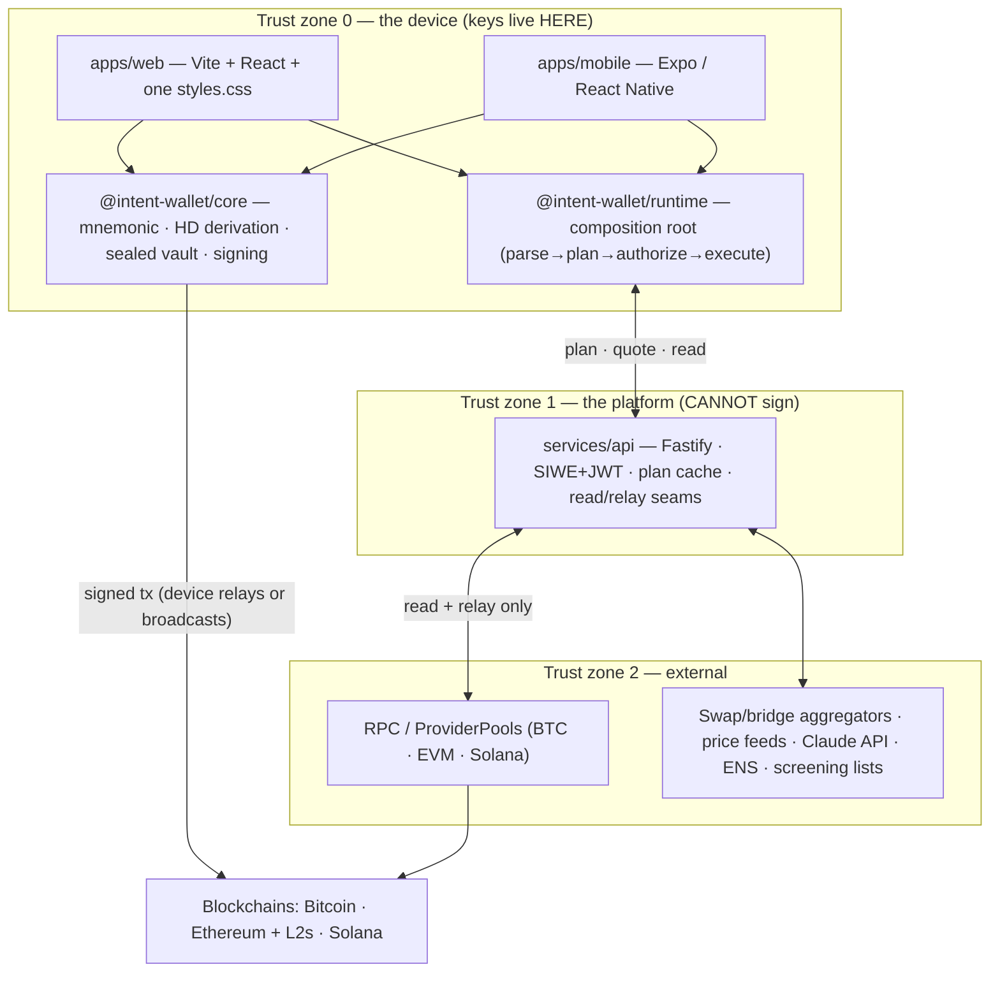
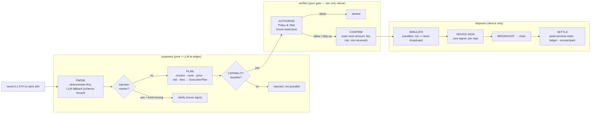

# ARCHITECTURE.md — Intent Wallet V3

> **Purpose.** This is the canonical, authoritative description of how Intent Wallet V3 is *shaped*: the
> monorepo's layers and package map, the non-custodial boundary that no byte of key material may cross,
> the intent data-flow spine (**parse → plan → gate → authorize → device-sign → broadcast → settle**), the
> technology choices and *why* each was made, the seams you extend, and the ADR discipline that keeps all
> of it honest. It is the constitution's ([`CLAUDE.md`](CLAUDE.md)) architecture chapter — dense,
> opinionated, and **true to what is actually built**, not aspirational marketing.
>
> **Read this before you:** create a package, add a chain/provider/intent kind, move anything across the
> client↔server line, touch the plan→sign path, or write an ADR. When code and this document disagree,
> that is a defect in one of them — [reconcile it on purpose](CLAUDE.md#L8), never drift. Deep dives live
> in [`docs/architecture/`](docs/architecture/) and every locked decision in [`docs/adr/`](docs/adr/); this
> file is the map, those are the territory.

---

## 1 · The architecture in one sentence

**The client holds the keys and signs; the platform parses, plans, quotes, relays, and watches — it can
never move funds.** Everything below is the disciplined elaboration of that sentence. If a proposed design
lets the server learn a secret or dispose of funds, the design is wrong — [redesign the feature](CLAUDE.md#L44),
do not weaken the boundary.

The five architectural invariants (the [Doctrine](CLAUDE.md#L40) rendered as structure):

| # | Invariant | How the architecture enforces it |
|---|---|---|
| 1 | **Keys never leave the device** | Key material lives only in [`@intent-wallet/core`](packages/core), which does **zero network I/O**; the sealed vault (scrypt + AES-256-GCM) and the in-memory keyring exist only client-side. |
| 2 | **AI proposes, code verifies, the device disposes** | The LLM emits a schema-validated `Intent` and nothing else. A **pure gate** ([capabilities](packages/capabilities) + [risk](packages/risk) + [policy](packages/policy)) sits between plan and wire and can only **refuse**. The disposer of funds is the on-device signature. |
| 3 | **Never fake data** | Money is `bigint` base units end-to-end; a failed read is `null`, never `$0`; testnet is labelled testnet; a capped mainnet path is labelled capped. Honest empty/loading/error/partial states are architectural, not cosmetic. |
| 4 | **Fail closed** | Anything a guard cannot *positively* verify (unknown chain, unpriced asset, missing destination network, malformed address) is blocked before signing. |
| 5 | **Deterministic cores, LLM at the edges** | Business logic is pure, typed, exhaustively tested `packages/*`; LLMs live behind schema-forced boundaries and are always re-checked by deterministic code. |

---

## 2 · System shape at a glance

Four concentric trust zones. The arrow that matters — signed transactions — originates **inside the
device** and only *transits* the platform.



The platform is a *convenience and an oracle*, never a custodian. In today's build the web app can also
broadcast a device-signed transaction **directly** to a public RPC (`eth_sendRawTransaction` and the
Solana/BTC equivalents) — the signature is minted in the browser; the server need not be in the loop at all
for the last mile.

---

## 3 · The monorepo — layering & package map

A pnpm workspace ([ADR-0001](docs/adr/0001-monorepo-and-package-manager.md)) of **27 pure TypeScript
packages** plus the deployables. `apps/mobile` is deliberately **excluded** from the pnpm workspace (see
[`pnpm-workspace.yaml`](pnpm-workspace.yaml)) because Expo/Metro do not tolerate pnpm's symlinked store — it
ships independently via EAS while consuming the same audited cores.

```
INTENT LAYER/
├── packages/        # 27 pure, single-purpose TS packages — logic lives here, no deploys
├── apps/
│   ├── web/         # Vite + React + ONE styles.css (no Tailwind, no router lib, no component kit)
│   └── mobile/      # Expo / React Native (own npm-managed store; shares packages/core)
├── services/
│   └── api/         # Fastify + SIWE/JWT — the modular monolith (ADR-0027)
├── docs/            # architecture/ · adr/ · design/ · handbook/ · security/  (the deep references)
└── infra/           # terraform / k8s / docker  (target topology; see §9 reality-vs-roadmap)
```

### 3.1 · The dependency rule

Direction of dependency is the load-bearing constraint. It is a **DAG**, and violating it fails review:

- **Apps and services compose; packages never import an app or a service.** All business logic is in
  `packages/*`; the app is a thin, honest presentation + a composition root.
- **A package depends only on packages *below or beside* it** (see the tier table). No cycles. The one
  place everything is wired together is [`packages/runtime`](packages/runtime) — the composition root.
- **No package imports another package's internals** — only its published `index.ts` public surface.
- **`packages/core` sits at the bottom and imports nothing from us.** It is the trust anchor; its only
  dependencies are audited primitives (`@noble/*`, `@scure/*`).

### 3.2 · Layer tiers

| Tier | Role | Packages |
|---|---|---|
| **L0 — Foundation** | Cross-cutting, no domain logic | `config` (Zod env), `observability` (logger/errors), `events` (Zod topic/key schemas) |
| **L1 — Device core** | Keys & identity (zone 0 only) | `core` (crypto/vault/signing), `identity` (universal identity, contacts) → `core` |
| **L2 — Chain & market access** | Talk to chains and markets | `chains` (BlockchainAdapter + AdapterRegistry), `providers` (aggregator framework), `gas` (gas abstraction) |
| **L3 — Domain engines (pure)** | The deterministic brains | `intents` (parse→plan), `portfolio`, `risk`, `policy`→`risk`, `router`→`providers`, `execution`→`intents`, `settlement`→`intents`, `capabilities`, `intelligence`→`portfolio`, `automation`→`policy`, `copilot`→(`intelligence`,`policy`,`risk`), `solver`, `compliance`, `plugins`, `reliability`, `scale` |
| **L4 — Composition & clients** | Wire engines; publish contracts | `runtime` (the composition root), `sdk` (typed API client), `ui` (design-system tokens/components) |
| **L5 — Deployables** | Compose everything | `apps/web`, `apps/mobile`, `services/api` |

### 3.3 · Package map (what each one *is*)

Every package is a pure, exhaustively-tested core with an explicit public interface and its own ADR + arch
doc. Money is `bigint`; no `Date.now()`/`Math.random()` in a deterministic core.

| Package | One-line purpose | Deep dive |
|---|---|---|
| `core` | Mnemonic, HD derivation (BIP-32/44/84, SLIP-0010), Universal Identity addresses, sealed vault, EVM/BTC/SOL signing. **Zero network I/O.** | [ADR-0029](docs/adr/0029-wallet-core-manager-and-signer-architecture.md) |
| `identity` | Universal identity model, address management, contact book, recipient resolution. | [arch 11](docs/architecture/11-universal-identity.md) · [ADR-0030](docs/adr/0030-universal-identity-and-portfolio-layering.md) |
| `chains` | `BlockchainAdapter` interface + `AdapterRegistry` — the *only* gateway to a chain; EVM/Solana/Bitcoin adapters over `ProviderPool`. | [arch 12](docs/architecture/12-blockchain-adapters.md) · [ADR-0031](docs/adr/0031-blockchain-adapter-layer.md) |
| `intents` | The Universal Intent Engine: deterministic-first parser + LLM fallback → validated `Intent` → `ExecutionPlan`. | [arch 13](docs/architecture/13-intent-engine.md) · [ADR-0032](docs/adr/0032-intent-engine-planner-and-plan-outcome.md) |
| `portfolio` | Unified cross-chain aggregation + valuation over injected sources. | [arch 18](docs/architecture/18-portfolio-intelligence.md) · [ADR-0030](docs/adr/0030-universal-identity-and-portfolio-layering.md) |
| `execution` | Persisted step machine over an injected `StepDriver` (simulate → sign → broadcast → confirm; recover/park). | [arch 14](docs/architecture/14-execution-engine.md) · [ADR-0033](docs/adr/0033-execution-engine-step-machine.md) |
| `providers` | Provider/aggregator framework: health scoring, circuit breakers, failover, quote aggregation. | [arch 15](docs/architecture/15-provider-framework.md) · [ADR-0034](docs/adr/0034-provider-aggregator-framework.md) |
| `router` | Global Route Optimizer: deterministic weighted scoring (simulate→score→rank). | [arch 16](docs/architecture/16-route-optimizer.md) · [ADR-0035](docs/adr/0035-global-route-optimizer.md) |
| `risk` | Security & Risk Engine: threat intel + detectors + probabilistic scoring + configurable policy. | [arch 17](docs/architecture/17-security-risk-engine.md) · [ADR-0036](docs/adr/0036-security-risk-engine.md) |
| `policy` | Universal Policy Engine: deterministic authorization, composed **most-restrictive** with Risk. | [arch 19](docs/architecture/19-policy-engine.md) · [ADR-0038](docs/adr/0038-universal-policy-engine.md) |
| `capabilities` | Capability Registry: versioned CAIP-2 capability data; **fail-closed feasibility gate** before execution. | [arch 34](docs/architecture/34-capability-registry.md) · [ADR-0051](docs/adr/0051-capability-registry.md) |
| `gas` | Gas abstraction: bounded *decide-not-act* engine (sponsorship budget, fee-token, capped params). | [arch 33](docs/architecture/33-gas-abstraction.md) · [ADR-0050](docs/adr/0050-gas-abstraction.md) |
| `settlement` | Idempotent front door to execution: preflight, recovery, ledger, coordinator. | [arch 22](docs/architecture/22-settlement-engine.md) · [ADR-0041](docs/adr/0041-universal-settlement-engine.md) |
| `intelligence` | Portfolio intelligence: deterministic analytics + a **verified** AI-narration boundary. | [arch 18](docs/architecture/18-portfolio-intelligence.md) · [ADR-0037](docs/adr/0037-portfolio-intelligence-engine.md) |
| `copilot` | Constrained AI decision layer — the LLM picks tools + prose; deterministic code decides. | [arch 20](docs/architecture/20-ai-copilot.md) · [ADR-0039](docs/adr/0039-ai-financial-copilot.md) |
| `automation` | Automation & Workflow Engine: autonomous but gated by Policy + Risk, non-custodial. | [arch 21](docs/architecture/21-automation-engine.md) · [ADR-0040](docs/adr/0040-automation-workflow-engine.md) |
| `solver` | Decentralized solver network: competitive execution, **verified-not-trusted** proposals. | [arch 23](docs/architecture/23-solver-network.md) · [ADR-0042](docs/adr/0042-decentralized-solver-network.md) |
| `compliance` | Jurisdiction-configurable policy layer (rules as **versioned data**), consent, DSAR, RBAC, audit. | [arch 26](docs/architecture/26-compliance-governance.md) · [ADR-0045](docs/adr/0045-compliance-and-governance.md) |
| `plugins` | Capability-sandboxed, trust-tiered extension platform (forbidden-by-construction). | [arch 27](docs/architecture/27-plugin-marketplace.md) · [ADR-0046](docs/adr/0046-plugin-marketplace.md) |
| `reliability` | Bounded *decide-not-act* SRE engine (SLO/error-budget, self-healing decisions) + injected actuator. | [arch 24](docs/architecture/24-observability-sre.md) · [ADR-0043](docs/adr/0043-reliability-and-self-healing.md) |
| `scale` | Bounded *decide-not-act* scale engine (autoscale, region routing, cache invalidation). | [arch 25](docs/architecture/25-global-scalability.md) · [ADR-0044](docs/adr/0044-global-scalability.md) |
| `runtime` | **The composition root** — instantiates and wires the engines into one `EngineContext`. | [arch 36](docs/architecture/36-production-execution-seams.md) · [ADR-0053](docs/adr/0053-production-execution-seams.md) |
| `sdk` | Zero-dependency, transport-injected typed API client with typed `ApiError`. | [arch 35](docs/architecture/35-typescript-sdk.md) · [ADR-0052](docs/adr/0052-typescript-sdk.md) |
| `ui` | Design-system tokens + shared components (web + RN). | [design](docs/design/) |
| `config` | Typed, Zod-validated env/flag loading. | [handbook 02](docs/handbook/02-shared-libraries.md) |
| `observability` | Structured logger + error taxonomy. | [ADR-0018](docs/adr/0018-observability.md) |
| `events` | Versioned Zod event + topic/redis-key registry. | [arch 03](docs/architecture/03-data.md) |

> **The "decide-not-act" pattern** recurs across `reliability`, `scale`, and `gas`: a pure engine returns a
> *decision*; a thin injected actuator performs the side effect. Same shape as the money path — the brain is
> pure and testable; the hands are a seam. It is why these engines can be exercised to exhaustion offline.

---

## 4 · The non-custodial boundary — the line nothing crosses

This is the most important section in the document. The boundary is not a policy; it is a *structural*
property enforced by which package owns what.

### 4.1 · What lives where

| | Device (zone 0) | Platform (zone 1) |
|---|---|---|
| **Owns** | Mnemonic, HD keys, sealed vault, private keys in memory, signing | Plans, quotes, prices, risk verdicts, session tokens, audit log |
| **Package** | `core`, `identity`, and the client half of `runtime` | `services/api` composing the read/plan/relay seams |
| **Can it move funds?** | **Yes** — only by the user's explicit signature | **No** — it has no key and no signing code path |
| **Persistence** | Encrypted vault in `localStorage` (web) / secure store (mobile) | Postgres (plan cache, audit), Redis (nonce, rate-limit, sessions) |

### 4.2 · What may NEVER cross the line — to the server

- The mnemonic or seed. Ever.
- A private key, in any form, encoded or not.
- The vault password / KDF passphrase.
- An unsealed keyring or any derived signing key.

The two *sensitive* members that expose secrets — `mnemonic` and `exportPrivateKey` — exist **only** for
user-initiated on-device backup/export flows and are gated by re-authentication (see the recovery-phrase
reveal). They never touch a network call. `packages/core` is documented and reviewed to have **zero network
I/O**; that invariant is the whole ballgame.

### 4.3 · What the server *is* allowed to see

Plans (fully materialized `ExecutionPlan`s — public-safe: addresses, amounts, quotes, risk), the authenticated
principal (via SIWE-proved address → JWT), and read-through chain/market data. The server **relays** signed
bytes and **watches** confirmations. That is the entire custodial surface: zero.

### 4.4 · Authentication ≠ custody

Auth is [SIWE + JWT + rotating refresh](docs/adr/0015-authentication.md): the user proves control of an
address by signing a challenge *on device*; the server issues a session bound to that address (the
`principalId`). Plan ownership is bound to the auth subject, so one user can never authorize against
another's plan. Signing that proves identity and signing that disposes of funds use the same on-device key
custody — but the platform only ever receives the *former's* signature, never a fund-moving one it didn't
relay on the user's explicit action.

---

## 5 · The intent data-flow — the spine

One utterance becomes one on-chain settlement through a fixed pipeline. Each arrow is a place where
**deterministic code can refuse**, and only the final device signature can dispose. The orchestration entry
points are real: [`IntentEngine.handle`](packages/intents/src/engine.ts),
[`WalletRuntime.plan/authorize/execute`](packages/runtime/src/runtime.ts), and the
[`StepDriver`](packages/execution/src/driver.ts) seam.



Stage by stage, grounded in the code:

1. **Parse.** [`CompositeParser`](packages/intents/src/parse/parser.ts) tries the deterministic parser
   first; only genuinely ambiguous phrasings fall through to the LLM, which is **schema-forced** — its
   output is validated against `IntentSchema` (tool-use), so the model can only ever emit a shape we
   understand ([ADR-0014](docs/adr/0014-intent-parser-architecture.md)).
2. **Injection veto.** [`IntentEngine.handle`](packages/intents/src/engine.ts) re-checks the *raw* input for
   prompt-injection markers over *whichever* parser produced the intent. A fund-moving intent born from
   adversarial text is forced to `clarify` — the doctrine applied to the LLM itself.
3. **Plan.** [`planIntent`](packages/intents/src/plan/planner.ts) resolves the recipient (contact/ENS/raw
   address — never guessed), the amount to `bigint` base units, a route (real DEX aggregator first, else the
   deterministic stub), a fee estimate (live estimator with a labelled static fallback — never an invented
   figure), and a risk report, producing a typed `ExecutionPlan`. Graduated risk survives: only `block` is
   rejected outright; medium/high set `requiresStepUp`.
4. **Capability gate.** [`WalletRuntime.plan`](packages/runtime/src/runtime.ts) runs the plan's steps through
   the Capability Registry **fail-closed**: a stake on a non-staking chain or a bridge with no derivable
   destination becomes a *rejection before anything is signable* — no self-loop fallback masks a malformed
   plan.
5. **Authorize (the gate).** [`authorizePlan`](packages/runtime/src/policy.ts) evaluates the plan through the
   Policy Engine **composed most-restrictively with the same Risk Engine** used at plan time. The amount is
   re-derived from the plan's own quote (never a spoofable request field). Output is one
   `ExecutionPermission`; the caller may sign **only if** `permission.mayProceedToSign`. A cumulative-drain
   ledger is updated here so a split across several sends can't sneak a whole-wallet drain past the guard.
6. **Confirm.** The user sees the materialized truth — amount, network fee, risk reasons, slippage /
   min-received — and confirms. Irreversible and elevated-risk actions require explicit, informed step-up.
7. **Simulate → device-sign → broadcast.** The [`StepDriver`](packages/execution/src/driver.ts) simulates in
   a sandbox first (`!ok ⇒ the step is **never** broadcast`), then builds → **device-signs** (the private key
   stays inside `core`'s signer; the runtime never holds a key) → broadcasts and returns a txid.
8. **Settle.** The [execution step machine](packages/execution/src/engine.ts) awaits terminal on-chain state,
   records it, and on failure recovers, re-quotes, or **parks** — never stranding funds. The Settlement
   engine is the idempotent front door that makes retries safe.

**The gate property.** A pure function between plan and wire can *only refuse* — it has no signing authority,
no key, and no side effect. That is why the AI's fallibility is survivable: the worst a compromised or
confused model can do is propose a plan the gate rejects or the user declines.

**Money on the wire.** Every amount is a **string** — decimal strings for user-facing values, base-unit
**integer** strings inside plans (`PlanAmount.base`, `valueMicros`). Floats never appear; formatting for
humans happens only at the edge.

---

## 6 · Technology choices & rationale

Choices are locked in [`docs/adr/`](docs/adr/) with a mandatory three-lens Consequences section
(Maintenance / Scaling / Security). The rationale, tersely:

| Choice | Decision | Why (not the alternative) |
|---|---|---|
| **Monorepo, pnpm** | One repo of small pure packages ([ADR-0001](docs/adr/0001-monorepo-and-package-manager.md)) | Atomic cross-cutting changes, one dependency graph, shared audited cores between web/mobile/api. pnpm's content-addressed store is fast and strict about phantom deps. |
| **TypeScript end-to-end** | TS everywhere; a *budget* for Rust only if profiling demands ([ADR-0002](docs/adr/0002-primary-language-typescript.md)) | One language across device, engines, and server means the *same* audited core signs on web and mobile. Types are the contract. |
| **Pure packages, apps compose** | Logic in `packages/*`; apps are thin | Business logic is unit-testable to exhaustion with no I/O; the app can't hide a bug the core doesn't have. Determinism is a property you can *test*, not hope for. |
| **Web: Vite + React + one `styles.css`** | No Tailwind, no router library, no component kit ([CLAUDE.md §5](CLAUDE.md#L77)) | Premium craft comes from a *disciplined* CSS layer, not a framework's defaults. State-based navigation keeps the bundle small and the mental model singular. No utility-class soup, no router indirection, no third-party design language leaking through. Fewer deps = smaller attack surface + faster cold start. |
| **Mobile: Expo / React Native** | Shares the audited core ([ADR-0006](docs/adr/0006-mobile-framework.md)) | Same signing core on device; ships via EAS. Excluded from the pnpm workspace because Metro fights the symlinked store. |
| **Backend: Node + Fastify** | One service today ([ADR-0007](docs/adr/0007-backend-runtime-and-api-framework.md)) | Same language as the cores; Fastify's schema-first routing pairs with Zod. |
| **Modular monolith → services** | `services/api` now; split later ([ADR-0027](docs/adr/0027-deployment-topology.md)) | Module boundaries, event contracts, and data ownership are drawn *now* as if separate; the split is a deploy change, not a rewrite. Don't pay distributed-systems tax before you have the users. |
| **Auth: SIWE + JWT + rotating refresh** | Prove address on device ([ADR-0015](docs/adr/0015-authentication.md)) | No passwords on the server; identity *is* a key the user already controls. Revocable, sign-out-everywhere. |
| **Crypto: `@noble` / `@scure`** | Audited, dependency-light primitives ([ADR-0003](docs/adr/0003-wallet-crypto-libraries.md)) | Minimal, audited, no native addons. SLIP-0010 ed25519 is [vendored in-repo](docs/adr/0004-slip10-in-repo.md) and covered by known-answer tests. |
| **Vault: scrypt + AES-256-GCM** | Encrypt seed at rest ([ADR-0005](docs/adr/0005-vault-kdf-and-cipher.md)) | Memory-hard KDF + authenticated encryption; Passkey + MPC are the roadmap, not a regression from this. |
| **Schemas: Zod** | Intents, plans, events, env, API | One validation library from the LLM boundary to the wire. The intent schema *is* the LLM's tool contract. |
| **Conformance tests** | BIP-32/44/84, SLIP-0010 known-answer | Where a standard exists, correctness is *demonstrated* against its vectors, not asserted. |

---

## 7 · Extension points — how to add a thing

The seams are deliberate. Adding capability means implementing an interface and registering it — never
editing a switch statement in the core.

### 7.1 · A new pure package

1. `packages/<name>/` with `package.json` (name `@intent-wallet/<name>`), `tsconfig` extending
   [`tsconfig.base.json`](tsconfig.base.json), `src/index.ts` (the *only* public surface), and `test/`.
2. Depend **only** on lower/sibling-tier packages (§3.2). No cycles. No app/service imports.
3. Pure core: money is `bigint`; no `Date.now()`/`Math.random()` where determinism is required — inject them.
4. Wire it into [`packages/runtime`](packages/runtime/src/runtime.ts) if it participates in the intent flow;
   the composition root is the *only* place engines meet.
5. Ship it with tests, an `docs/architecture/NN-*.md` card, and an ADR (§8).

### 7.2 · A new chain

The [`AdapterRegistry`](packages/chains/src/adapter-registry.ts) is the single gateway to chains
([ADR-0031](docs/adr/0031-blockchain-adapter-layer.md)).

1. Implement [`BlockchainAdapter`](packages/chains/src/adapter.ts) (balance reads, fee estimation, broadcast,
   confirmation) over a `ProviderPool` (JSON-RPC) or REST transport.
2. Register it in the `AdapterRegistry` keyed by its CAIP-2 chain id.
3. Add signing support in [`packages/core`](packages/core) if the ecosystem's scheme is new (EVM/BTC/SOL
   exist).
4. Declare the chain's **capabilities** as versioned data in [`packages/capabilities`](packages/capabilities)
   so the fail-closed feasibility gate knows what it can and cannot do.
5. Add known-answer conformance vectors for its derivation path.

### 7.3 · A new provider / aggregator

The [provider framework](packages/providers) ([ADR-0034](docs/adr/0034-provider-aggregator-framework.md)) is
health-scored plugins behind a registry.

1. Implement the provider interface (quote/execute for a swap/bridge/price vendor).
2. Register it; the registry handles health scoring, circuit-breaking, failover, and quote aggregation.
3. For a real DEX quote in the plan flow, pass it as `extraRoutes` to
   [`createWalletRuntime`](packages/runtime/src/runtime.ts): it answers the pairs it knows and returns `null`
   otherwise, falling through to the deterministic base — real quotes where available, full coverage
   everywhere.

### 7.4 · A new intent kind

1. Add the variant to [`IntentSchema`](packages/intents/src/schema.ts) (the discriminated union *is* the LLM
   tool contract).
2. Teach the deterministic parser to recognize it (keep the LLM as fallback only).
3. Extend [`planIntent`](packages/intents/src/plan/planner.ts) to produce a plan; add it to
   `ACTIONABLE_KINDS` and `FUND_MOVING` if it moves funds (so the injection veto covers it).
4. Add policy/risk handling if it changes the authorization surface.

### 7.5 · A new policy rule or risk detector

Add a rule in [`packages/policy`](packages/policy) or a detector in [`packages/risk`](packages/risk). Because
Policy composes **most-restrictively** with Risk, a new rule can only *tighten* the gate — it can never widen
what is permitted. That is the safe direction by construction.

---

## 8 · ADR discipline

Every real architectural decision is an **immutable, numbered ADR** in [`docs/adr/`](docs/adr/) — the
canonical record that supersedes memory notes and the scored comparisons in
[`docs/architecture/09-decisions.md`](docs/architecture/09-decisions.md).

The rules ([ADR README](docs/adr/README.md)):

- An ADR is **immutable once Accepted.** To change a decision, write a **new** ADR
  (`Supersedes ADR-XXXX`); the old one becomes `Superseded by ADR-YYYY`. **Never edit the old one** — the
  point is to preserve *why we once thought differently*.
- **Structure is mandatory:** Context · Decision · Alternatives (≥3, pros/cons) · Consequences. The
  three-lens Consequences (**Maintenance / Scaling / Security**) is required — a choice that looks good today
  but rots in maintenance, caps at scale, or widens the attack surface is not a good choice.
- **No implementation deviates from a locked ADR** without a superseding ADR. The Principal Security Engineer
  holds a hard veto on anything touching keys/funds/user data; only the CEO overrules, and only in writing —
  which *is* an ADR.

Before you build, read the right doc first ([CLAUDE.md §7](CLAUDE.md#L102)):

| If the task touches… | Read first |
|---|---|
| Architecture / a new package | **this file**, [`docs/architecture/`](docs/architecture/), the relevant [`docs/adr/`](docs/adr/) |
| Keys, signing, funds, auth | [`docs/security/`](docs/security/) — **and pull in the Principal Security Engineer** |
| The intent pipeline / agents | [`docs/architecture/13`](docs/architecture/13-intent-engine.md)–[`14`](docs/architecture/14-execution-engine.md), [ADR-0032](docs/adr/0032-intent-engine-planner-and-plan-outcome.md)/[0033](docs/adr/0033-execution-engine-step-machine.md) |
| Data / storage / events | [`docs/architecture/03-data.md`](docs/architecture/03-data.md) |
| Any code at all | tests are not optional — every pure core and API path has them |

---

## 9 · Reality vs. roadmap (the honest boundary)

Doctrine #3 forbids faking, and that includes this document. Here is the line between **what is built** and
**what is designed-but-not-yet-built**, so no reader mistakes the target topology for today's binary.

| Concern | Built today | Designed / roadmap |
|---|---|---|
| Clients | `apps/web` (real testnet broadcast on Sepolia/devnet/BTC-testnet + guarded, capped mainnet ETH), `apps/mobile` (Expo, on-device signing + testnet broadcast) | Browser extension |
| Backend | `services/api` — one Fastify modular monolith (SIWE/JWT, plan cache, metrics, insights, read/relay seams) | Split into gateway + intent/portfolio/risk/execution services ([arch 01](docs/architecture/01-system-overview.md), [ADR-0027](docs/adr/0027-deployment-topology.md)) |
| Persistence | Postgres plan store (over `IW_DB_URL`), Redis nonce + rate-limit + session stores | Regional read replicas, ClickHouse analytics |
| Eventing | In-process; outbox/topic **schemas** defined in `packages/events` | Redis Streams → Kafka (MSK) event backbone ([ADR-0010](docs/adr/0010-message-broker.md)) |
| Chains | EVM (6 chains) · Solana · Bitcoin adapters, live balance/broadcast | Per-chain checkpointed indexers, simulation fleet |
| Key security | scrypt + AES-256-GCM sealed vault, on-device | Passkey + MPC ([ADR-0005](docs/adr/0005-vault-kdf-and-cipher.md) roadmap) |
| Infra | `infra/` terraform/k8s scaffolding | EKS + ArgoCD + multi-region ([arch 05](docs/architecture/05-infrastructure.md)) |

The container/topology diagrams in [`docs/architecture/01`](docs/architecture/01-system-overview.md) describe
the **Stage C target**; the modular-monolith-now / services-later evolution is a *packaging* decision, not an
architecture one — the module boundaries, event contracts, and data ownership are drawn today as they will be
when split.

---

## 10 · The invariants, as a checklist

A change that breaks one of these is wrong even if it works, and is reverted:

- [ ] No key material, seed, or vault password crosses the client→server line — in any encoding.
- [ ] `packages/core` performs zero network I/O.
- [ ] The dependency graph stays a DAG; no package imports an app/service or another package's internals.
- [ ] Money is `bigint` base units end-to-end; no floats; a failed read is `null`, never `$0`.
- [ ] Every path from plan to wire passes the pure gate (capabilities → risk/policy authorize) and can only
      be *refused* there; the sole disposer is the device signature.
- [ ] The LLM's output is schema-validated; the injection veto covers every fund-moving intent kind.
- [ ] Every real decision has an ADR; no implementation deviates from a locked one without superseding it.
- [ ] Every pure core and API path has tests; correctness against a standard is shown with known-answer
      vectors.

> **Ship world-class or don't ship.** The architecture exists to make the honest, safe, non-custodial path
> the *only* path — and to make the ugly, lying, or key-leaking path impossible to build by accident.
