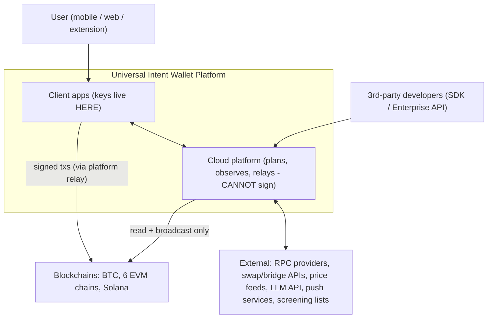
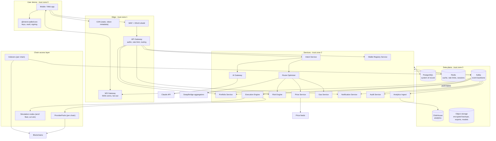
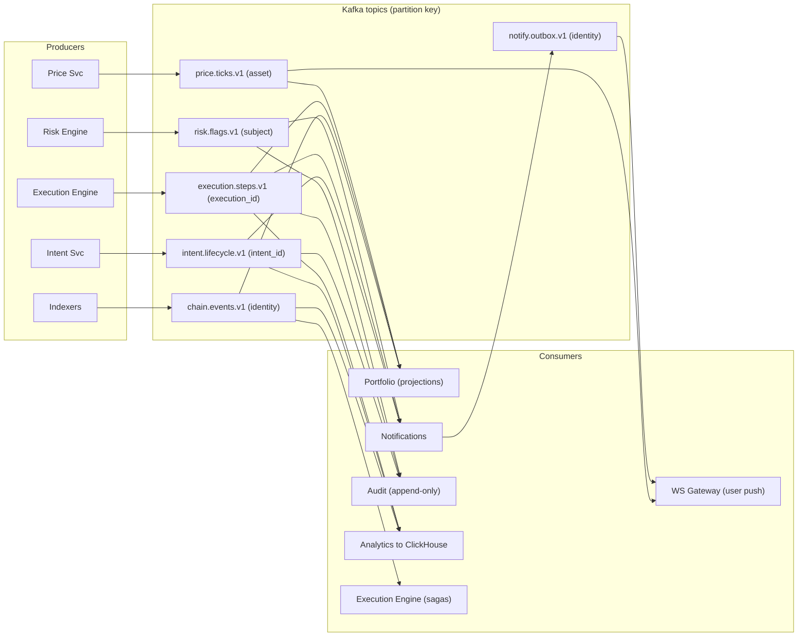

# 01 — System Overview

## 1. Context diagram (who talks to the system)

The one sentence that defines the trust model: **the client holds keys and signs; the platform parses, plans, quotes, relays, and watches — it can never move funds.**

## 2. Container diagram (Stage C target)

## 3. Service communication rules

| Path                            | Mechanism                                                            | Why                                                         |
| ------------------------------- | -------------------------------------------------------------------- | ----------------------------------------------------------- |
| Client → platform               | HTTPS/JSON + WSS                                                     | ubiquity, debuggability                                     |
| Gateway → services              | HTTP/JSON (internal), gRPC only where profiled hot (Portfolio→Price) | one mental model; gRPC is an optimization, not a default    |
| Service → service (commands)    | direct HTTP with circuit breakers, timeouts, retries w/ jitter       | synchronous only when the caller truly needs the answer now |
| Service → service (facts)       | Kafka events via outbox                                              | facts are broadcast, never point-to-point                   |
| Anything → money-movement state | ONLY via Execution Engine consuming `plan.approved` events           | single writer for execution state                           |

Communication invariants:

- Every request carries `x-request-id` (trace id) end-to-end; every event carries `correlation_id` = originating intent id.
- Sync calls have a per-hop timeout budget that sums to less than the edge timeout (edge 10 s → gateway 9 s → service 7 s → dependency 5 s).
- No service reads another service's tables. Ever. Data crosses boundaries as APIs or events.

## 4. Event flow overview

Bus discipline (full topic catalog in [03-data.md](03-data.md)):

- **Outbox pattern** — producers write event + state in one Postgres tx; a relay publishes to Kafka. No dual-write bugs.
- **Consumer idempotency** — every consumer keeps a processed-set keyed by event id (Redis + periodic compaction to PG).
- **DLQ per consumer group** with replay tooling; alerts on DLQ depth > 0 for money-path topics.
- **Schema registry** — Zod schemas versioned in `packages/events`; producers may only add optional fields within a major version.

## 5. What runs where per evolution stage

| Component                       | Stage A (monolith)      | Stage B           | Stage C                                             |
| ------------------------------- | ----------------------- | ----------------- | --------------------------------------------------- |
| Gateway/auth/rate-limit         | module in `api`         | dedicated gateway | dedicated + regional                                |
| Intent, Wallet Registry, Risk   | modules in `api`        | modules in `api`  | services                                            |
| Portfolio                       | module in `api`         | service           | service, regional read replicas                     |
| Execution Engine                | `worker` process        | service           | service, single-writer region                       |
| Indexers                        | pods (already separate) | pods              | pods + Rust rewrite for Solana if profiling demands |
| Price, Gas                      | modules in `worker`     | service (shared)  | services                                            |
| Bus                             | Redis Streams           | Kafka (MSK)       | Kafka multi-region (MirrorMaker)                    |
| Notifications, Analytics, Audit | modules in `worker`     | worker split      | services                                            |

The monolith is a _packaging_ choice, not an architecture choice: module boundaries, event contracts, and data ownership are identical across stages, so splitting is a deploy change plus a bus migration — not a rewrite.
