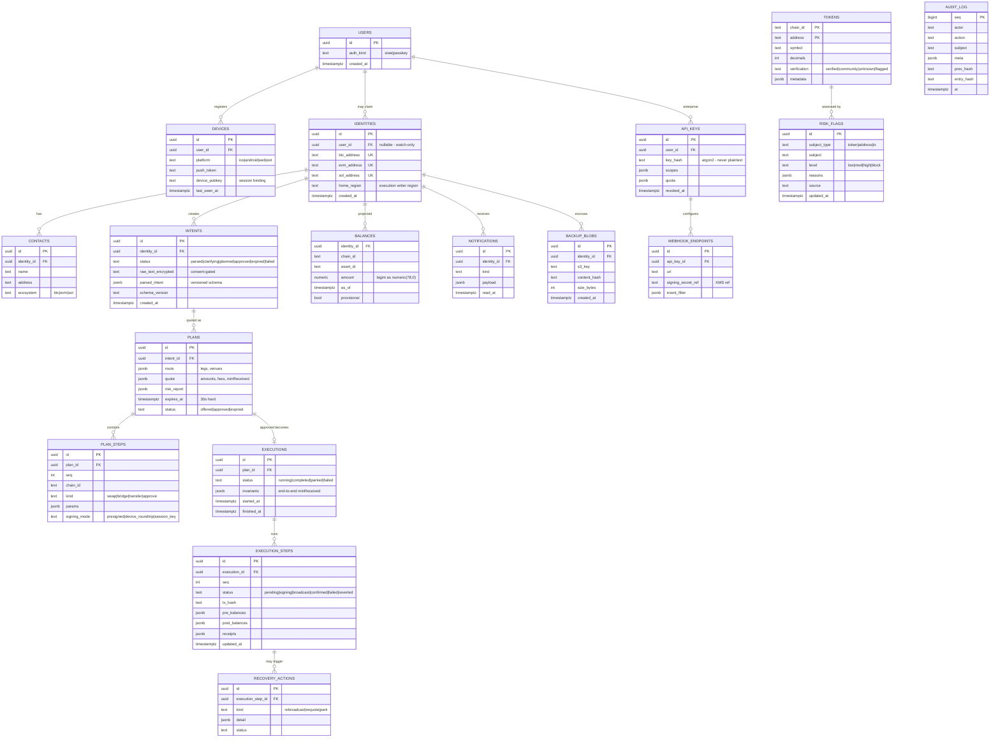

# 03 — Data Architecture

## 1. PostgreSQL — system of record

### 1.1 ER diagram (core entities)

### 1.2 Postgres policies

| Concern       | Policy                                                                                                                                                                                                                                                                                                                                    |
| ------------- | ----------------------------------------------------------------------------------------------------------------------------------------------------------------------------------------------------------------------------------------------------------------------------------------------------------------------------------------- |
| Amounts       | `numeric(78,0)` base units only (fits uint256); **floats are banned by lint + CI grep**; display conversion is client-side                                                                                                                                                                                                                |
| Partitioning  | `intents`, `plans`, `executions`, `execution_steps`, `notifications`, `audit_log` → range-partitioned by month; `balances` → hash-partitioned by `identity_id` (16 → 64 partitions)                                                                                                                                                       |
| Multi-tenancy | Row-level security on `identity_id` for user-facing roles; services use scoped roles; **no superuser in app paths**                                                                                                                                                                                                                       |
| PII           | Raw intent text stored ONLY with explicit consent flag, app-layer encrypted (KMS envelope), 90-day TTL; addresses are pseudonymous but treated as PII for GDPR/DPDP deletion flows                                                                                                                                                        |
| Migrations    | Drizzle, forward-only, expand→migrate→contract for zero-downtime; every migration PR includes a rollback note                                                                                                                                                                                                                             |
| Scale path    | Stage A: single primary + 2 replicas → Stage B: +regional read replicas, PgBouncer → Stage C: Aurora Global (1 writer region), `balances`/`notifications` candidates for extraction to per-region stores. CockroachDB is the recorded escape hatch if multi-region WRITES ever become mandatory ([09-decisions.md](09-decisions.md) D-DB) |

## 2. Redis strategy

One logical role per instance group — never one giant shared Redis:

| Cluster                        | Data                                                                                                      | Pattern                   | TTL                | Eviction    |
| ------------------------------ | --------------------------------------------------------------------------------------------------------- | ------------------------- | ------------------ | ----------- |
| `redis-cache`                  | portfolio snapshots `pf:{identity}` (hash), token metadata `tok:{chain}:{addr}`, route quotes `rt:{hash}` | cache-aside               | 60 s / 24 h / 30 s | allkeys-lru |
| `redis-rt`                     | rate-limit counters `rl:{scope}:{key}` (sliding window), session revocations `rev:{jti}`                  | counters                  | window / token TTL | noeviction  |
| `redis-prices`                 | latest tick `px:{asset}`, pub/sub fan-out to WS gateway                                                   | pub/sub + hot keys        | 60 s               | allkeys-lru |
| `redis-dedupe`                 | consumer idempotency `seen:{group}:{eventId}`                                                             | set-with-TTL              | 7 d                | noeviction  |
| `redis-streams` (Stage A only) | the event bus before Kafka                                                                                | streams + consumer groups | trim by size       | n/a         |

Rules: no key without TTL except `rl`/`seen` (bounded by design); every key namespaced + documented in `packages/events/redis-keys.md`; cache stampede control via singleflight locks (`lock:{key}`, 2 s).

## 3. Kafka topic catalog (Stage B+)

| Topic                    | Key          | Retention | Producers → Consumers                                  | Notes                                                   |
| ------------------------ | ------------ | --------- | ------------------------------------------------------ | ------------------------------------------------------- |
| `chain.events.v1`        | identity_id  | 7 d       | Indexers → Portfolio, Execution, Analytics, Risk       | includes `provisional` + `reverted` compensation events |
| `intent.lifecycle.v1`    | intent_id    | 30 d      | Intent → Audit, Analytics, Notifications               |                                                         |
| `execution.steps.v1`     | execution_id | 90 d      | Execution → Portfolio, Notifications, Audit, Analytics | money path — DLQ alerts page                            |
| `risk.flags.v1`          | subject      | 30 d      | Risk → Notifications, Audit                            |                                                         |
| `price.ticks.v1`         | asset_id     | 1 d       | Price → Portfolio, WS Gateway                          | throttled 5 s/asset                                     |
| `gas.conditions.v1`      | chain_id     | 1 d       | Gas → Route Optimizer, WS Gateway                      |                                                         |
| `notify.outbox.v1`       | identity_id  | 3 d       | Notifications → WS Gateway, push workers               |                                                         |
| `identity.registered.v1` | identity_id  | compacted | Wallet Registry → Indexers                             | compaction = current watch-list                         |
| `analytics.raw.v1`       | event_id     | 3 d       | all → ClickHouse sink                                  | schema-checked at produce time                          |

Partitions start at 12 (money topics) / 24 (`chain.events`), scale by consumer lag. Ordering guarantee needed only within key — all keys chosen so per-entity order is total.

## 4. ClickHouse (analytics)

- Tables: `events_raw` (MergeTree, 13-month TTL), `intent_funnel_mv`, `route_quality_mv` (venue fill vs quote), `retention_mv`, `llm_quality_mv` (parse-accuracy proxies: clarification rate, edit-before-approve rate).
- Ingest: Kafka engine table ← `analytics.raw.v1`; exactly-once not required (idempotent event_id dedup at query time).
- Access: BI read-only role; no PII columns by schema review.

## 5. Object storage (S3)

| Bucket             | Content                                   | Controls                                                             |
| ------------------ | ----------------------------------------- | -------------------------------------------------------------------- |
| `iw-backups`       | client-encrypted backup blobs             | SSE-KMS on top, versioned, object-lock 30 d, per-identity prefix IAM |
| `iw-chain-archive` | raw indexer event archive (replay source) | lifecycle → Glacier after 90 d                                       |
| `iw-audit-anchors` | daily audit-log anchor hashes             | object-lock COMPLIANCE mode (WORM)                                   |
| `iw-artifacts`     | container SBOMs, signed release artifacts | cosign attestations                                                  |
| `iw-exports`       | user data exports (GDPR)                  | 7-day TTL, pre-signed URLs                                           |

## 6. Retention & deletion map (GDPR/DPDP)

| Data                  | Retention                       | Deletion path                                                                               |
| --------------------- | ------------------------------- | ------------------------------------------------------------------------------------------- |
| Sessions/devices      | until revoked + 90 d            | user deletion cascade                                                                       |
| Intents (parsed JSON) | 24 mo                           | cascade; raw text 90 d, consent-gated                                                       |
| Executions/steps      | 7 y (financial records posture) | pseudonymized on user deletion (identity unlink), not erased — documented in privacy policy |
| Balances projection   | rebuildable                     | dropped on identity unwatch                                                                 |
| Analytics             | 13 mo, pseudonymous             | salt rotation makes re-identification infeasible                                            |
| Audit log             | 7 y, append-only                | actor pseudonymization on deletion; entries never removed                                   |
