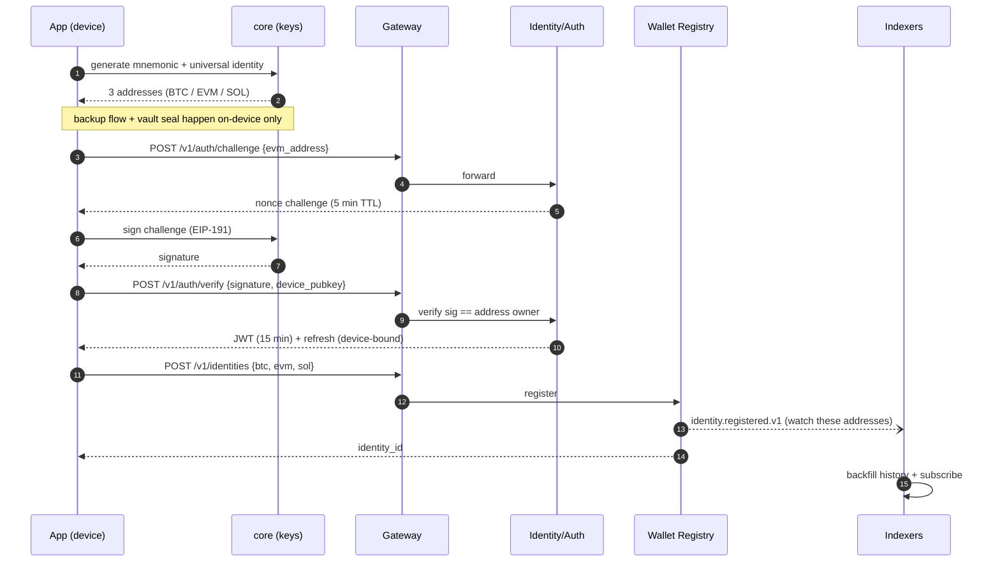
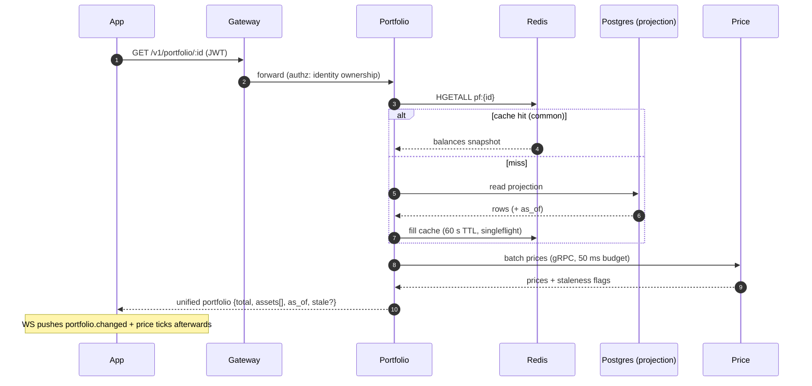
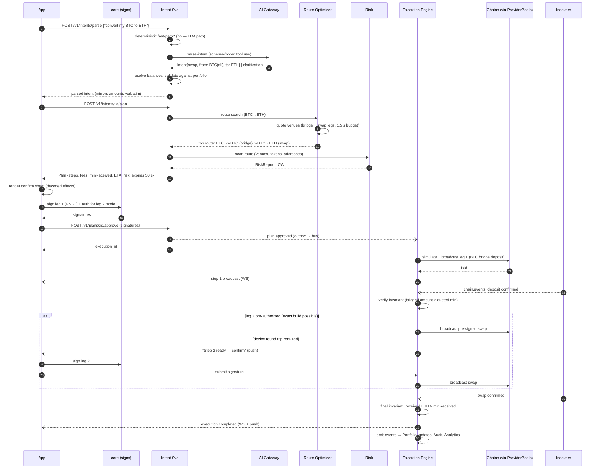
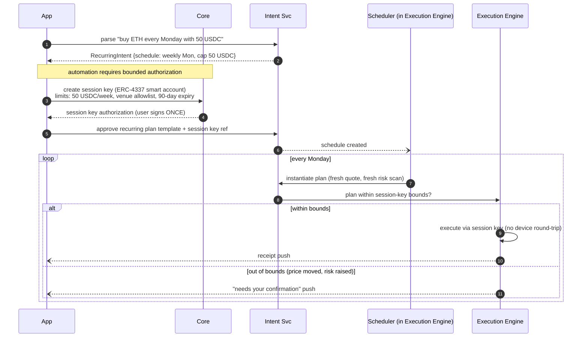
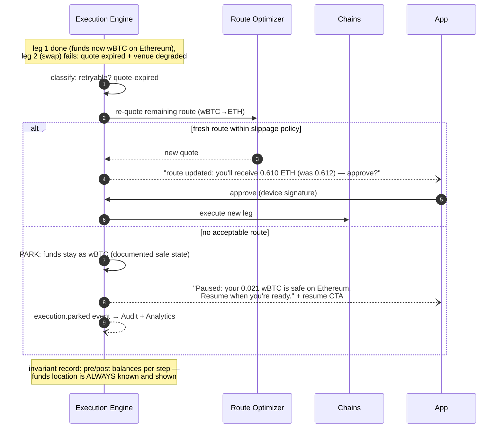

# 04 — Key Flows (Sequence Diagrams)

## 1. Onboarding & wallet-native auth (SIWE-style)

Failure notes: challenge replay is blocked by single-use nonce; verify failures rate-limit by address+IP; registration is idempotent on the address triple.

## 2. Portfolio load (hot read path)

## 3. Intent execution — "Convert my BTC to ETH" (the flagship flow)

## 4. Recurring intent — "Buy ETH every Monday" (honest automation)

The rule stated to users plainly: **no session key → every execution asks the device.** Automation depth always equals authorization depth; BTC/SOL legs (no session keys) always round-trip.

## 5. Mid-route failure & recovery (park, never strand)

Design commitments encoded above: re-quotes that worsen the user's outcome always re-confirm; parking is a first-class terminal state with a resume path, not an error; every state transition is an event (auditable, replayable).
