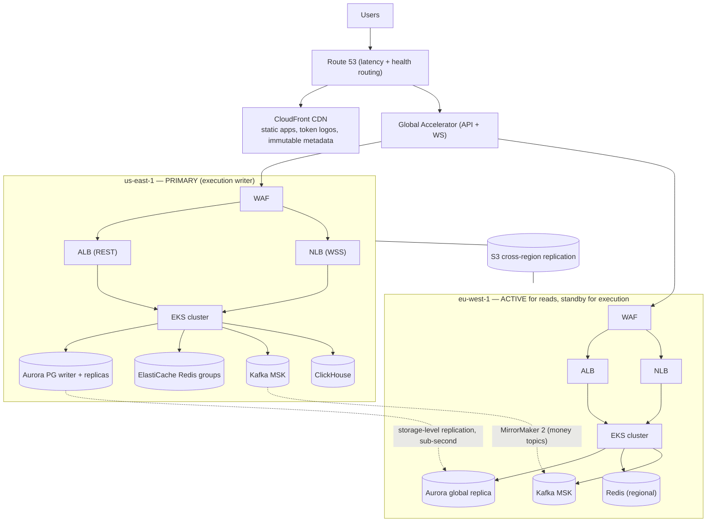

# 05 — Infrastructure & Operations

## 1. Multi-region deployment (Stage C target)

**Topology rules:** read path (portfolio, prices, parse) is active-active; **execution is single-writer-region per identity** (`identities.home_region`) — sagas never split across regions. Region evacuation = flip `home_region` cohort after Aurora failover (RPO ≤ 5 s storage replication, drill-verified).

## 2. Kubernetes architecture

| Aspect       | Decision                                                                                                                                                                                                                                       |
| ------------ | ---------------------------------------------------------------------------------------------------------------------------------------------------------------------------------------------------------------------------------------------- |
| Distribution | EKS, 3 AZs per region, cluster-per-env (dev / staging / prod-use1 / prod-euw1); admin plane in its OWN small cluster                                                                                                                           |
| Namespaces   | `edge` (gateway, ws), `intents`, `portfolio`, `execution`, `chain` (indexers, pools), `data-ops` (migrations, replays), `observability` — network policies default-deny between namespaces; explicit allows only                               |
| Node pools   | `general` (m7g, most services) · `mem-opt` (r7g — indexers, Redis-adjacent) · `spot` (batch: analytics sink, replays, backfills — never money path)                                                                                            |
| Autoscaling  | HPA on p95 latency + CPU for services; **KEDA on Kafka consumer lag** for Execution/Portfolio/Notifications workers; Karpenter for nodes                                                                                                       |
| Resilience   | PodDisruptionBudgets on everything; topology-spread across AZs; priorityClass `money-path` preempts batch                                                                                                                                      |
| Identity     | IRSA (pod-level IAM); zero static AWS creds in-cluster                                                                                                                                                                                         |
| Traffic      | ALB ingress (REST), NLB (WSS long-lived); no service mesh initially — OTel + network policies cover 90% of the need at 10% of the complexity; revisit if mTLS-everywhere becomes a compliance requirement ([09-decisions.md](09-decisions.md)) |
| Config       | GitOps via ArgoCD; `infra/k8s` is the only source of truth; kubectl-apply by humans is alert-worthy                                                                                                                                            |

## 3. Docker standards

- Multi-stage builds; runtime = `node:22-slim` distroless-style, non-root UID, read-only rootfs, no shell in prod images.
- One image per service, tagged by git SHA; `latest` is banned.
- Every image: SBOM (syft) + vulnerability scan (grype — fail on critical) + cosign signature; admission controller verifies signatures in prod.
- Shared base layer for the pnpm workspace → build cache keyed on lockfile.

## 4. Load balancing & rate limiting (defense in depth)

| Layer      | Mechanism                                                                        | Limits (initial)                                                          |
| ---------- | -------------------------------------------------------------------------------- | ------------------------------------------------------------------------- |
| Edge       | WAF managed rules + bot control + IP reputation                                  | volumetric/DDoS                                                           |
| Gateway    | token bucket in `redis-rt`, keyed by (user, route-class) and (IP, route-class)   | reads 600/min · parse 20/min · plan 30/min · approve 60/min · auth 10/min |
| Enterprise | per-API-key quotas (plan-based), 429 + `retry-after`                             | contract-defined                                                          |
| Service    | per-dependency budgets (LLM tokens/user/day, RPC calls/chain) with kill switches | config, hot-reload                                                        |
| Client     | exponential backoff + jitter honoring `retry-after`; WS reconnect budget         | SDK-enforced                                                              |

## 5. Secrets management

- AWS KMS (region-scoped CMKs) + Secrets Manager; External Secrets Operator syncs to K8s; rotation: DB creds 30 d (automatic), vendor API keys 90 d, webhook signing secrets per-tenant on demand.
- CI has NO long-lived cloud creds — GitHub OIDC → short-lived roles.
- `gitleaks` in CI + pre-commit; a leaked-secret runbook with sub-1-hour rotation drill.
- The only "hot" platform keys are relayer/paymaster gas wallets (Phase 9): funded to a capped float, HSM-backed (KMS asymmetric), auto-refilled from cold treasury with 4-eyes.

## 6. Disaster recovery & availability

| Scenario                         | Mechanism                                                                        | Target                                      |
| -------------------------------- | -------------------------------------------------------------------------------- | ------------------------------------------- |
| AZ loss                          | multi-AZ everything                                                              | zero user impact                            |
| Region loss (reads)              | active-active                                                                    | seconds (LB health)                         |
| Region loss (execution)          | Aurora Global failover + `home_region` flip + MirrorMaker'd topics               | RTO ≤ 30 min, RPO ≤ 5 s (DB) / ≤ 60 s (bus) |
| Postgres corruption              | PITR (5-min granularity) + monthly restore DRILL (automated, verified checksums) | RPO ≤ 5 min                                 |
| Kafka loss                       | money topics mirrored; projections rebuildable from PG + chain archive           | rebuild playbook ≤ 4 h                      |
| Chain-data loss                  | S3 `iw-chain-archive` replay                                                     | re-index ≤ 24 h/chain                       |
| Vendor loss (RPC/LLM/aggregator) | ProviderPool failover / forms fallback / venue redundancy                        | degradation, not outage                     |

Availability math: 99.9% Y1 (43 min/mo error budget) — burn-rate alerts at 2%/1h and 5%/6h; quarterly game days exercise: region evacuation, Kafka rebuild, RPC-vendor brownout, LLM outage.

## 7. CDN strategy

CloudFront for: web app + extension updates (immutable, hashed assets), token logos/metadata (24 h TTL + soft purge), docs. **API responses are NOT CDN-cached** except `GET /v1/prices` (5 s TTL, public tier) and token registry reads (60 s) — correctness beats cache hit-rate on a wallet.

## 8. Environments & promotion

`dev` (ephemeral PR namespaces, mocked vendors) → `staging` (testnets, real vendor sandboxes, continuous e2e) → `prod` (progressive: canary 5% → 50% → 100% gated on SLO metrics via Argo Rollouts; auto-rollback on burn). Chain forks (anvil fleet) run in CI and staging for execution-path tests. Feature flags (config service) gate every user-visible capability; kill switches for: LLM path, each venue, each chain, session-key execution.
