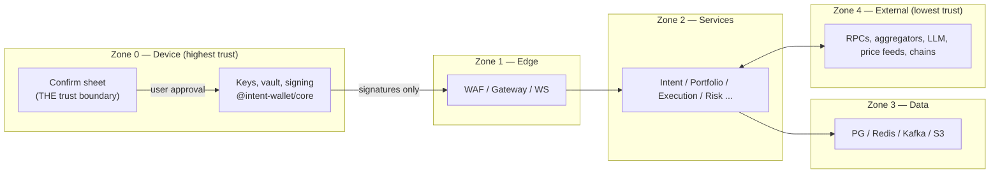

# 06 — Security Model & Threat Model

## 1. Trust boundaries

**Signing authority lives only in Zone 0.** Zones 1–3 compromise = privacy/availability incident, never fund loss. Zone 4 is assumed hostile: every external input (RPC responses, quotes, token metadata, LLM output) is validated, bounded, and treated as attacker-controlled data.

## 2. Security model

### 2.1 Keys & sessions

- Device: mnemonic in scrypt+AES-256-GCM vault ([packages/core](../../packages/core)); vault key additionally wrapped by Secure Enclave/StrongBox with biometric gate; auto-lock; optional wipe-on-10-failures.
- Auth: SIWE challenge signed by the identity key → 15-min JWT (ES256, JWKS-rotated) + refresh bound to a per-device keypair (proof-of-possession on refresh — stolen refresh tokens are useless without the device key).
- Authorization: identity-scoped resources enforced at gateway (JWT claims) AND at data layer (RLS). Enterprise API keys: hashed (argon2id), scoped, quota'd, revocable.
- Session hygiene: revocation list in Redis (jti); refresh rotation with reuse detection (reuse → family revoke + alert).

### 2.2 Transaction integrity chain

1. Plan is assembled server-side with quote + `minReceived` + risk verdict.
2. Client re-derives the human-readable effects from the raw payloads locally (client-side decoding — server cannot lie about what's being signed).
3. Simulation diffs shown; signature covers the exact bytes simulated.
4. Execution Engine verifies post-conditions per leg (received ≥ min); violations → halt + park + page.

### 2.3 AI security (prompt injection is a when, not an if)

- User text and on-chain metadata enter prompts as delimited data blocks; system instructions are static, versioned templates.
- The model can only emit intent-schema JSON — there is no tool that moves funds, changes settings, or reads other users' data.
- Server-side allowlist of intent types + Zod validation; unparseable/injected output → clarification, never guess.
- Token names/symbols sanitized (length caps, unicode-confusable folding) before prompt or UI.
- Red-team corpus in CI (injection attempts must produce `clarification` or correct parse, never an unintended intent); AI Gateway logs template version per call for forensics.

### 2.4 Supply chain

- Minimal audited crypto deps (@noble/@scure); lockfile-only installs; Renovate with 3-day cooldown + provenance checks (Socket/osv-scanner in CI); no postinstall scripts (pnpm config).
- Signed containers (cosign) verified at admission; SBOM per image; base-image digest pinning.
- Web/extension builds: reproducible, subresource integrity, extension review diffs published.

### 2.5 Insider & operational

- Admin plane: separate cluster + IdP, hardware-key SSO, 4-eyes on money-adjacent config (venue allowlist, token registry, risk overrides), all actions hash-chained in Audit.
- Production data access: JIT, time-boxed, ticketed, session-recorded; no standing read access to PII tables.
- Break-glass: documented, alarmed, dual-control.

## 3. Threat model (STRIDE × trust boundary)

| #   | Threat                             | Vector                                  | Mitigations                                                                                                         | Residual risk                                                          |
| --- | ---------------------------------- | --------------------------------------- | ------------------------------------------------------------------------------------------------------------------- | ---------------------------------------------------------------------- |
| T1  | Seed theft (S, E)                  | device malware, phishing backup flow    | vault + enclave wrap, biometrics, backup-phrase UX that never asks digitally, anti-screenshot on reveal             | user device fully owned → unrecoverable; stated honestly               |
| T2  | Blind signing (T)                  | malicious dApp/token payload            | client-side decode + simulation diff, risk verdict pre-sign, deny unknown calldata by default                       | novel contract semantics                                               |
| T3  | Prompt injection (T, E)            | crafted intent text / token names       | §2.3 controls, red-team CI                                                                                          | new injection classes → bounded by no-tools design                     |
| T4  | Malicious/compromised venue (T, I) | bad quote, rug route                    | venue allowlist (4-eyes), multi-venue quote sanity band, post-leg invariant checks, fill-quality scoring            | venue exit-scam mid-flight → park + bounded loss to one leg's slippage |
| T5  | RPC lies (T)                       | poisoned balance/receipt                | multi-provider quorum for money-path reads (2-of-3 on confirmations), finality tags                                 | coordinated multi-vendor compromise                                    |
| T6  | Server compromise (S, T, I, E)     | any service popped                      | **cannot sign**; zones + RLS + least-priv IAM; egress allowlists; secrets in KMS; anomaly detection on Audit stream | privacy breach of watch-list data → disclosure plan                    |
| T7  | MITM / TLS (I)                     | network attacker                        | TLS 1.3 + HSTS + cert pinning in apps; WSS only                                                                     | —                                                                      |
| T8  | Replay/duplication (T)             | resubmitted approvals                   | idempotency keys, single-use plan approval (plan_id consumed), nonce discipline per chain                           | —                                                                      |
| T9  | DoS (D)                            | volumetric, cache-bust, LLM-cost attack | WAF, layered rate limits, LLM budgets + fast-path, singleflight caches                                              | targeted state-level DoS degrades latency                              |
| T10 | Supply chain (T, E)                | malicious dep/image                     | §2.4                                                                                                                | 0-day in audited dep                                                   |
| T11 | Insider (all)                      | rogue operator                          | §2.5, hash-chained audit, alerting on anomalous admin actions                                                       | collusion ≥ 2                                                          |
| T12 | Cross-user data leak (I)           | authz bug                               | RLS as backstop below app authz, per-identity S3 prefixes, contract tests on every endpoint for IDOR                | —                                                                      |
| T13 | Session-key abuse (E)              | over-broad automation grant             | hard caps (amount/week, venue allowlist, expiry ≤ 90 d), revocation UI, anomaly pause                               | user grants wide bounds despite warnings                               |
| T14 | Compliance (R)                     | sanctioned counterparty via our routing | screening at plan time (counterparty addresses), geofencing framework, legal review per market                      | list lag                                                               |

## 4. Audit system (tamper-evident)

- Append-only `audit_log` with `entry_hash = SHA-256(prev_hash ‖ canonical(entry))`; DB role can INSERT only.
- Daily anchor: latest hash → S3 object-lock (WORM) + optional public timestamping later.
- Verification job re-walks the chain nightly; any mismatch pages security on-call.

## 5. Security program & audit plan

- CI on every PR: Semgrep (SAST), osv-scanner, gitleaks, dependency review; fuzz targets (intent parser, tx decoders, vault envelope parser) run nightly.
- Invariant/property tests on core crypto (already shipping — [packages/core/test](../../packages/core/test)).
- External audits: `core` package before public beta; execution path + smart-account modules before GA; annual re-audit.
- Bug bounty (Immunefi-class) at GA: crits up to $250k, safe-harbor policy.
- Incident response: severity matrix, 24/7 on-call, kill switches (per venue/chain/LLM/session-keys), user-comms templates, post-mortems public for fund-adjacent incidents.
