# 08 — Repository Structure & CI/CD

## 1. Monorepo layout (target; grows phase by phase)

```
INTENT LAYER/
├── requirements.md · memory.md · README.md
├── package.json · pnpm-workspace.yaml · tsconfig.base.json · turbo.json
├── packages/                          # shared libraries (pure, no deploy)
│   ├── core/            ✅            # keys, vault, signing, universal identity (device-only)
│   ├── chains/          🔄            # registry, ProviderPool, balance/fee adapters
│   ├── events/                        # Zod event + topic schemas, redis key registry
│   ├── api-contracts/                 # Zod request/response schemas → OpenAPI + clients
│   ├── intents/                       # intent schema, deterministic pre-parser, resolver
│   ├── portfolio/                     # aggregation + pricing domain logic
│   ├── execution/                     # step machine, route scoring, adapter interfaces
│   ├── adapters/                      # swap/bridge/price vendor adapters (one dir each)
│   ├── risk/                          # verification pipelines, heuristics, policies
│   ├── ui/                            # design system (React + RN via tamagui-style tokens)
│   ├── sdk/                           # public developer SDK
│   └── config/                        # typed env/flag loading (zod-validated)
├── services/                          # deployables (Stage A: api + worker + indexers)
│   ├── api/                           # gateway+auth+intent+portfolio+risk modules (Stage A monolith)
│   ├── worker/                        # execution engine, notifications, price/gas pollers
│   ├── indexer-evm/ · indexer-btc/ · indexer-sol/
│   └── ws-gateway/
├── apps/
│   ├── mobile/                        # React Native (Expo dev-client)
│   ├── web/                           # React + Vite (PWA)
│   └── extension/                     # browser extension (shares web components)
├── infra/
│   ├── terraform/                     # VPC, EKS, RDS, MSK, Redis, S3, IAM, WAF (envs/ modules/)
│   ├── k8s/                           # kustomize bases + overlays per env (ArgoCD watches)
│   └── docker/                        # shared Dockerfiles, compose for local dev
├── docs/
│   ├── architecture/                  # ← this doc set
│   ├── adr/                           # numbered decision records
│   ├── runbooks/                      # per-service incident guides
│   └── api/                           # generated OpenAPI + guides
└── e2e/                               # cross-service tests (fork-based execution, testnet suites)
```

Ownership: CODEOWNERS maps each directory to a team; `packages/core` and `packages/execution` require security-team review on every PR.

## 2. Service template (every service looks the same)

```
services/<name>/
├── src/{main.ts, routes/, consumers/, domain/, infra/}   # hexagonal-lite: domain pure, infra at edges
├── test/{unit/, integration/}
├── Dockerfile · helm-values.yaml (or kustomize patch)
├── runbook.md                        # alerts → what to do
└── slo.yaml                          # SLIs/SLOs consumed by dashboard generator
```

## 3. CI/CD pipeline

```mermaid
flowchart LR
    PR["PR opened"] --> L["lint + typecheck<br/>(turbo, affected only)"]
    L --> UT["unit + property tests"]
    UT --> SEC["semgrep · osv-scanner · gitleaks<br/>dependency review"]
    SEC --> IT["integration tests<br/>(testcontainers: PG, Redis, Kafka; anvil forks)"]
    IT --> BLD["build affected images<br/>SBOM + grype + cosign sign"]
    BLD --> PREV["ephemeral preview env<br/>(PR namespace, mocked vendors)"]
    PREV --> MERGE["merge to main"]
    MERGE --> STG["ArgoCD sync → staging<br/>(testnets) + e2e suite + golden intent set"]
    STG --> GATE["manual promote<br/>(release captain)"]
    GATE --> CAN["prod canary 5%<br/>Argo Rollouts, SLO-gated"]
    CAN --> FULL["50% → 100%<br/>auto-rollback on burn"]
```



Rules:

- `main` is always deployable; no release branches. Feature flags decouple deploy from launch.
- DB migrations ship in their own PRs, expand→migrate→contract; a migration job gates rollout.
- The **golden intent set** (≥200 utterances incl. Hinglish) runs on staging against the real prompt templates on every promote — parse-accuracy regression > 1% blocks the gate.
- Nightly: fuzzers, chaos suite on staging (RPC brownout, Kafka partition kill, region-evac drill monthly).
- Release artifacts: mobile via EAS + store phased rollout; extension via reviewed store channels; all client builds reproducible.
