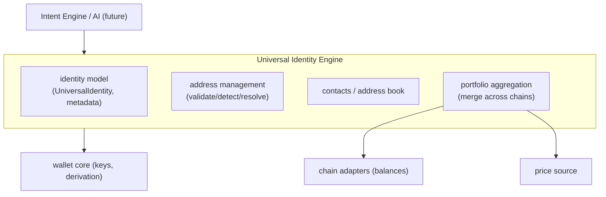
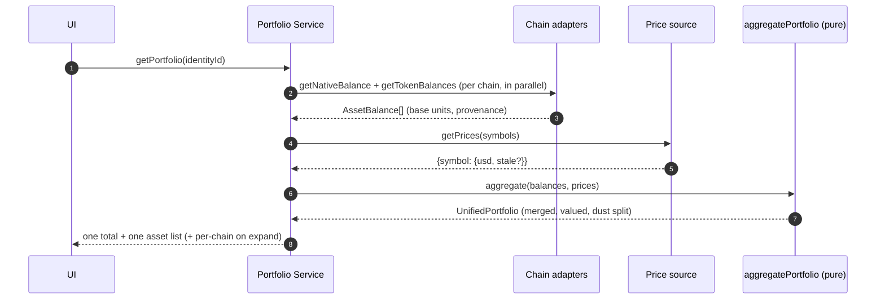

# 11 — Universal Identity Engine

> **Status:** implemented (`packages/identity` 22 tests, `packages/portfolio` 15, `packages/chains` EVM adapter +10) — 47 new tests this slice. The layer that makes chains invisible and the foundation the Intent Engine builds on.

## 1. What it is

The Universal Identity Engine turns one HD wallet account into ONE identity the user thinks about — three receive addresses (Bitcoin, Solana, universal EVM) and one merged portfolio — while many blockchain accounts exist underneath. It sits above the wallet core (keys) and above the chain adapters (data), and below the Intent/AI layers.



## 2. Identity ↔ account mapping

| Concept               | Reality                                                                                                                                                                              |
| --------------------- | ------------------------------------------------------------------------------------------------------------------------------------------------------------------------------------ |
| Master identity       | one BIP-39 mnemonic (wallet core)                                                                                                                                                    |
| A "UniversalIdentity" | one HD **account index** → the BTC/EVM/SOL address triple + metadata                                                                                                                 |
| Universal EVM address | one secp256k1 key at `m/44'/60'/0'/0/i` — the SAME address on Ethereum, Base, Arbitrum, Optimism, Polygon, BNB                                                                       |
| Multiple accounts     | additional identities = additional indexes (`Account 2`, `Account 3`, …)                                                                                                             |
| Multi-device          | derivation is deterministic → the SAME identity appears on every device that imports the mnemonic; **no server sync of the identity is needed** (only optional preferences/contacts) |
| Identity id           | a deterministic hash of the address triple — stable and device-independent, no PII                                                                                                   |

Lifecycle: `create/import` (wallet core) → `deriveUniversalIdentity(account)` → label/metadata → derive more accounts as needed → recovery = re-import the mnemonic (identity re-derives identically).

## 3. Folder structure

```
packages/identity/src/
├── address.ts      classify/validate/normalize/compare across BTC·EVM·SOL
├── identity.ts     UniversalIdentity model, deriveUniversalIdentity, receive addresses
├── contacts.ts     Contact, ContactStore, ContactBook, resolveRecipient
└── errors.ts       IdentityError

packages/portfolio/src/
├── money.ts        float-free fiat math (µUSD), formatUsd
├── types.ts        PortfolioBalance, UnifiedAsset, UnifiedPortfolio
├── aggregate.ts    aggregatePortfolio (merge across chains)
└── source.ts       BalanceSource / PriceSource interfaces

packages/chains/src/
├── adapter.ts      BlockchainAdapter interface + AssetBalance
└── evm/{abi.ts, adapter.ts}   EvmAdapter: native + ERC-20 reads via ProviderPool
```

## 4. Interface definitions (the contracts other layers use)

```ts
// identity
deriveUniversalIdentity(account: UniversalAccount, meta?) => UniversalIdentity
classifyAddress(address) => { ecosystem, normalized, network } | null
ContactBook.resolveRecipient(query) =>
  | { kind:'address', ecosystem, address, contact? }
  | { kind:'contact', contact }
  | { kind:'ambiguous', candidates }
  | { kind:'not_found', query }

// chain adapter (per ecosystem)
interface BlockchainAdapter {
  getNativeBalance(address): Promise<bigint>
  getTokenBalances(address, tokens): Promise<AssetBalance[]>
  getBlockHeight(): Promise<bigint>
}

// portfolio
aggregatePortfolio(balances: PortfolioBalance[], { prices, dustThresholdMicros }) => UnifiedPortfolio
interface BalanceSource { getBalances(identityId): Promise<PortfolioBalance[]> }
interface PriceSource   { getPrices(keys): Promise<Record<string, PriceInfo>> }
```

## 5. Portfolio load (sequence)



## 6. Blockchain discovery (how new activity/assets surface)

Discovery is event-driven via the indexers ([architecture 02 §2.7](02-services.md)): registered addresses are watched; incoming/outgoing transfers (native, ERC-20, SPL), NFT transfers, and new assets emit `chain.events.v1`, which the Portfolio projection consumes to update balances and reveal newly-received tokens. The pure aggregation here is what those projections feed; the identity engine defines WHAT is watched (the three addresses) and validates any new asset's address before display.

## 7. Security

| Concern              | Handling                                                                                                                                                                                                                    |
| -------------------- | --------------------------------------------------------------------------------------------------------------------------------------------------------------------------------------------------------------------------- |
| Identity spoofing    | identity id is a deterministic hash of the real derived addresses — it cannot be forged to point at someone else's funds; addresses come only from the wallet core's derivation                                             |
| Address verification | strict validation before any address is used: EVM mixed-case must pass EIP-55 (silent-corruption guard), bech32/base58check checksums verified, Solana 32-byte checked; contacts store only validated, normalized addresses |
| Replay protection    | the identity layer holds no signing authority; replay is prevented at the signing layer (chainId-bound EIP-1559, nonces) — the identity engine never re-uses or caches signatures                                           |
| Metadata integrity   | identity metadata (label) is non-authoritative display data; the load-bearing fields (addresses) are re-derivable and never trusted from storage without validation                                                         |
| Privacy              | identity id is a hash, not PII; contacts are local by default; the engine does no network I/O itself; watch-list registration is the only thing shared, and it is addresses the user chose to expose                        |

## 8. Performance & caching

- **Read-dominated:** portfolio is the highest-QPS surface. Aggregation is pure and cheap; the cost is the balance/price fetches, which the Portfolio Service caches (Redis `pf:{identity}` 60 s, prices 5–15 s) and refreshes on `chain.events` push — [architecture 03 §2](03-data.md).
- **Efficient balance updates:** event-driven deltas rather than full re-scans; cold identities do one live sweep then serve from projection.
- **Minimal network / battery (mobile):** clients render last-known values instantly and refresh via WS push, not polling; batched multicall for token balances is a planned adapter optimization.
- **Staleness, never lies:** any stale price/balance is flagged through to `UnifiedPortfolio.stale` and shown as "as of …" rather than silently wrong.

## 9. Testing

- **Unit (done):** address classification across all ecosystems incl. real derived addresses; contact dedupe/resolution incl. ambiguity; identity determinism; float-free fiat math; aggregation (cross-chain merge, dust split, staleness, decimals normalization, defensive negatives).
- **Integration (done for EVM):** balance reader driven by scripted JSON-RPC transports asserting exact ABI encoding; skip-on-token-error; bytes32 vs dynamic-string symbol decoding.
- **Next:** multi-chain sync tests against forks (anvil) and a canonical asset registry to replace symbol-based grouping; SOL/BTC adapters implementing the same `BlockchainAdapter`.

## 10. Known follow-ups (honestly tracked)

- Symbol-based asset grouping is the MVP; a canonical (chain, address) → asset-id registry replaces it via the `assetKey` hook — no API change ([ADR-0030](../adr/0030-universal-identity-and-portfolio-layering.md)).
- SOL and BTC balance adapters (same interface) — next chain-layer slice.
- ENS/SNS name resolution plugs into `resolveRecipient` as an additional resolver.
