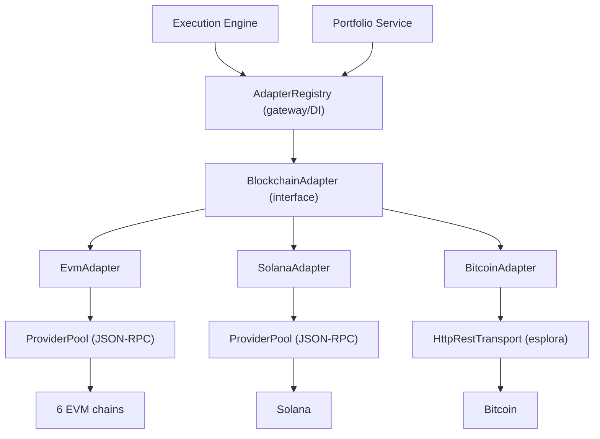
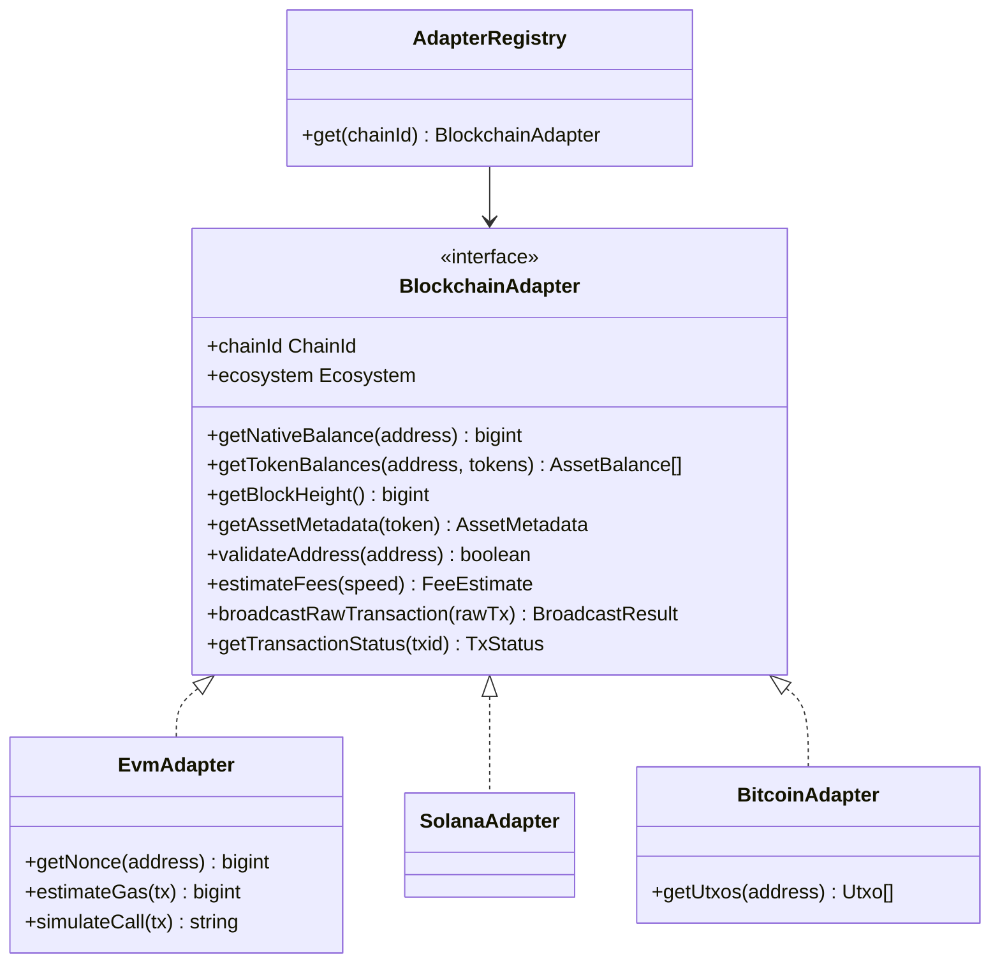

# 12 — Blockchain Adapter Layer

> **Status:** implemented (`packages/chains`) — 69 tests. The ONLY gateway between the platform and any blockchain. Nothing else talks to a chain directly.

## 1. Principle

Like an OS talking to printers through drivers, the platform talks to blockchains through adapters. The Intent and Execution engines know only `ChainId` and the `BlockchainAdapter` interface — never that Bitcoin is UTXO-based or that Solana uses lamports. Adding chain #9 is a new adapter, not a change to business logic.



## 2. Class / interface diagram



The adapter's write role is **broadcast + track only** — it never builds fee/UTXO logic into business code and never signs. Building lives in the execution engine; signing in the wallet core.

## 3. Folder structure

```
packages/chains/src/
├── registry.ts          chain registry (12 chains: ids, RPCs, decimals, finality)
├── provider.ts          ProviderPool + HttpJsonRpcTransport (RPC management)
├── adapter.ts           BlockchainAdapter interface + shared types
├── adapter-registry.ts  AdapterRegistry — the gateway (ChainId → adapter, DI)
├── evm/{abi.ts, adapter.ts}     EvmAdapter (+ EVM-only gas/nonce/simulate)
├── solana/adapter.ts    SolanaAdapter (lamports, SPL, priority fees)
└── bitcoin/{rest.ts, adapter.ts}  HttpRestTransport + BitcoinAdapter (UTXO)
```

## 4. Per-ecosystem notes

**EVM** (Ethereum, Base, Arbitrum, Optimism, Polygon, BNB) — one `EvmAdapter`, one instance per chain. Native via `eth_getBalance`; ERC-20 via `eth_call balanceOf` + minimal in-repo ABI (fixed selectors, no keccak dep; `decodeString` handles dynamic + legacy bytes32 symbols). EIP-1559 fees from `eth_feeHistory` (percentile per speed, tip floored at 1 gwei, `maxFee = 2·base + tip`). Extras for the execution engine: `getNonce` (pending), `estimateGas`, `simulateCall` (read-only, reverts surface as JsonRpcError). ERC-721/1155 NFT reads are a documented follow-up on the same adapter.

**Solana** — account model in lamports; SPL balances via `getTokenAccountsByOwner` (one call, filtered to requested mints); block height = slot; fees = 5000 lamports/signature base + median recent priority fee (compute-unit price); broadcast a base64 signed tx via `sendTransaction`; status via `getSignatureStatuses`. SPL symbols need a token registry (enriched upstream), decimals come on-chain.

**Bitcoin** — UTXO model over esplora REST (`HttpRestTransport`, a sibling of the JSON-RPC transport with the same error taxonomy). Balance = `funded − spent`; `getUtxos` feeds PSBT building; fees = sat/vByte from `/fee-estimates` per target-block speed; broadcast raw hex via `POST /tx`; confirmations from tip − inclusion height. No tokens (token methods return empty / throw).

## 5. RPC management (already shipped — ADR-0011)

The `ProviderPool` gives every JSON-RPC adapter: multi-provider priority failover, per-endpoint cooldown with linear backoff, per-attempt timeouts, API-key redaction, and the rule that JSON-RPC error RESPONSES (reverts) propagate without wasteful failover. The `AdapterRegistry` builds pools from injected keyed URLs first, public defaults last. REST (Bitcoin) uses `HttpRestTransport` with the same error taxonomy; multi-provider REST failover is a follow-up.

## 6. Error handling taxonomy

| Condition                         | Surfaced as                                            | Adapter behavior                                                   |
| --------------------------------- | ------------------------------------------------------ | ------------------------------------------------------------------ |
| RPC endpoint down / timeout / 429 | `ChainError` TRANSPORT_FAILED / TIMEOUT / RATE_LIMITED | ProviderPool fails over to the next endpoint                       |
| Execution revert / bad params     | `JsonRpcError`                                         | propagated (deterministic — no failover)                           |
| Malformed body                    | `ChainError` INVALID_RESPONSE                          | fail (caller decides)                                              |
| All endpoints failed              | `ChainError` ALL_PROVIDERS_FAILED                      | throw, listing attempted endpoints                                 |
| One token errors in a batch       | —                                                      | skipped; other balances still returned                             |
| Dropped tx / pending              | `TxStatus{state:'pending'}`                            | caller polls; execution engine's recovery policy owns re-broadcast |
| Reorg                             | provisional status until finality                      | indexers emit compensating events (architecture 02 §2.7)           |
| Low fee / invalid nonce           | JsonRpcError on broadcast                              | execution engine re-quotes/re-nonces                               |

## 7. Indexing

Real-time discovery (block/event listeners, token/NFT transfer detection, tx indexing) is the **indexers'** job ([architecture 02 §2.7](02-services.md), [ADR-0012](../adr/0012-blockchain-indexing.md)) — per-chain, checkpointed, reorg-aware, emitting `chain.events.v1`. The adapters here are the request/response gateway (pull); the indexers are the streaming gateway (push). Both are the only two ways chain data enters the platform.

## 8. Testing

All adapters are tested hermetically with scripted fake transports (no network), asserting the exact RPC/REST calls a real node expects and decoding real response shapes:

- EVM: ABI encode/decode, fee derivation, nonce/gas, broadcast, confirmations, revert→failed.
- Solana: lamports, SPL parsing, priority-fee median, signature-status mapping.
- Bitcoin: UTXO balance, fee tiers, broadcast validation, confirmation math, address validation per network.
- Registry: correct adapter per ecosystem, memoization, keyed-URL priority, end-to-end EVM + BTC wiring.

Next: integration tests against local forks (anvil / regtest / solana-test-validator) and a benchmark/failover stress suite (RPC brownout) — [requirements.md §9](../../requirements.md).
