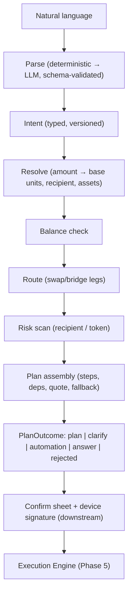
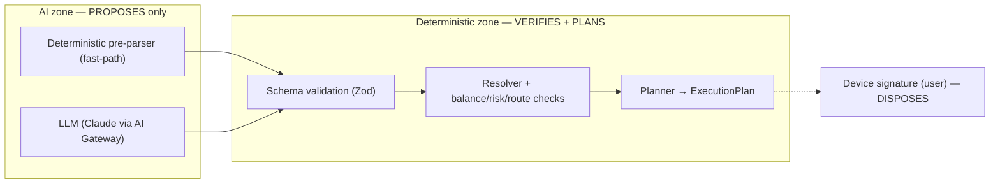

# 13 — Universal Intent Engine (the moat)

> **Status:** implemented (`packages/intents`) — 40 tests. The decision engine that turns natural language into a safe, executable plan. The permanent orchestration layer every wallet capability routes through.

## 1. What it is

Users describe an outcome ("Convert my BTC to ETH", "Send $100 to Rahul", "Buy $50 of SOL every Monday"); the Intent Engine turns that into a validated `Intent`, then a checked `ExecutionPlan` — **without** the user ever choosing a chain, bridge, gas token, or slippage. It does NOT execute: it PROPOSES a plan; the Execution Engine + a device signature dispose.

## 2. Pipeline



Each stage can short-circuit to **clarify** (missing/ambiguous info — never guess) or **rejected** (unsafe/insufficient), so nothing unsound reaches the confirm sheet.

## 3. AI vs deterministic — the security boundary



**Why this separation is critical:** the LLM can be wrong, manipulated, or prompt-injected. So it is confined to producing a _typed proposal_ validated against `IntentSchema` — it cannot invent an action shape we don't understand, and **no fund-moving tool is ever exposed to it**. Every safety decision (balance, recipient network match, risk level, route existence) is made by deterministic code the model cannot influence, and execution requires a human signature over the exact effects. The model proposes; deterministic systems verify; the signature disposes. A compromised or hallucinating model can, at worst, produce a clarify or a plan the user must still explicitly approve.

**Where AI is used:** only the parse step, only for utterances the deterministic pre-parser (≈40 common shapes) doesn't cover. **Where it is NOT:** resolution, safety checks, planning, execution — all deterministic.

## 4. Folder structure

```
packages/intents/src/
├── schema.ts            Intent + Amount + ExecutionPlan (Zod, versioned)
├── amount.ts            amount parsing + exact decimal↔base conversion
├── parse/
│   ├── deterministic.ts rule-based fast-path (transfer/swap/buy/stake/rebalance/recurring/exit/query)
│   └── parser.ts        IntentParser + LlmClient (AI Gateway boundary) + CompositeParser
├── plan/
│   ├── context.ts       injected interfaces: holdings, prices, routes, risk, recipient, fees
│   ├── resolve.ts       Amount → base units (float-free; USD fiat, all/fraction/percent)
│   ├── planner.ts       planIntent → PlanOutcome (safety + confirmation)
│   └── format.ts        display helpers
└── engine.ts            IntentEngine facade (parse + plan)
```

## 5. Intent & ExecutionPlan schema

**Intent** (discriminated union): `transfer · swap · buy · stake · rebalance · recurring · emergency_exit · query · clarify · unsupported`. Amounts are a union: `fiat · asset · all · fraction · percent`. New intent types are additive to the union (extensibility).

**ExecutionPlan** (the structured output — every field the prompt requires):

```
planId · intentId · intentKind
assets[] · sourceChains[] · destChains[]
steps[]:   { seq, kind(transfer|swap|bridge|approve|stake), chainId, description, dependsOn[], params }
quote:     { youSend, youReceiveMin, totalFeeMicros, feePct, slippageBps, etaSeconds }
risk:      { level(low|medium|high|block), reasons[] }
fallback   (never-strand-funds strategy) · rollback (or null)
confirmation (human-readable summary for the confirm sheet)
```

Money is base-unit / micro-USD integers on the wire — no floats.

## 6. Safety checks (before any plan is offered)

Balance sufficiency · recipient resolution + **network match** (can't send an EVM asset to a BTC address) · route availability (else "no route") · risk scan (BLOCK is not overridable; HIGH needs typed confirm downstream) · non-USD fiat → clarify rather than guess an FX rate. Any failure → `clarify` or `rejected`, never a silent bad plan. Transaction simulation is applied at execution time (the confirm sheet is simulation-gated, [design 06](../design/06-screens-intent.md)); the engine attaches the plan the simulator verifies.

## 7. The planner is pure over injected sources

Following [ADR-0030](../adr/0030-universal-identity-and-portfolio-layering.md), the planner depends only on interfaces — `HoldingsProvider`, `PriceProvider`, `RouteProvider`, `RiskProvider`, `resolveRecipient`, `estimateFeeMicros`, `ids` — so it is a pure, fully-testable function of its inputs. The real implementations (Portfolio engine, Price service, Route Optimizer, Risk engine, Identity) plug in without touching the engine. This is why 40 fixture tests can exercise every branch with no network.

## 8. Threat model (engine-specific)

| Threat                                          | Mitigation                                                                                                                                    |
| ----------------------------------------------- | --------------------------------------------------------------------------------------------------------------------------------------------- |
| Prompt injection (malicious text / token names) | text is data; LLM output validated against `IntentSchema`; no fund-moving tools exposed; token metadata sanitized before prompts (AI Gateway) |
| LLM hallucination / wrong parse                 | schema validation + one retry, then clarify; deterministic safety checks are authoritative; amounts/recipients restated for confirmation      |
| Wrong-network send                              | recipient ecosystem must match the asset's; mismatch is rejected                                                                              |
| Overspend                                       | balance check against resolved base units before any plan                                                                                     |
| Scam token / sanctioned recipient               | risk scan; BLOCK not overridable                                                                                                              |
| Silent worse outcome                            | quotes carry `youReceiveMin` + slippage; re-quotes that worsen require re-confirmation (execution engine)                                     |
| Engine as an execution path                     | it CANNOT execute — output is a proposal gated by a device signature                                                                          |

## 9. Performance

Targets ([requirements.md §14](../../requirements.md)): deterministic parse < 5 ms (no network); LLM parse p95 < 2.5 s (fast-path avoids it for ~40–60% of traffic); plan assembly is bounded by the injected route/risk calls (parallelizable) — target < 2 s. The engine itself is CPU-cheap and stateless → scales horizontally; cost control is the AI Gateway's budget + caching ([ADR-0013](../adr/0013-ai-orchestration.md)).

## 10. Implementation order (done) & next

1. ✅ Intent + ExecutionPlan schema (Zod, versioned)
2. ✅ Deterministic fast-path parser + amount/entity extraction
3. ✅ Composite parser (deterministic → schema-validated LLM) with the AI-Gateway boundary
4. ✅ Resolver (float-free amount → base units) + planner (transfer/swap/buy/stake/rebalance) + safety + confirmation
5. ✅ IntentEngine facade + PlanOutcome contract
6. ⏭ Wire real sources: Route Optimizer + Risk Engine + live Portfolio/Price (Phases 3/5/6)
7. ⏭ Recurring/emergency automation → Scheduler + session keys (Phase 9)
8. ⏭ Golden-set evals (≥200 utterances incl. Hinglish) + injection red-team corpus in CI ([ADR-0014](../adr/0014-intent-parser-architecture.md))

The engine is the permanent orchestration layer: new capabilities become new intent types + planner branches, behind the same parse→plan→confirm→execute contract.
