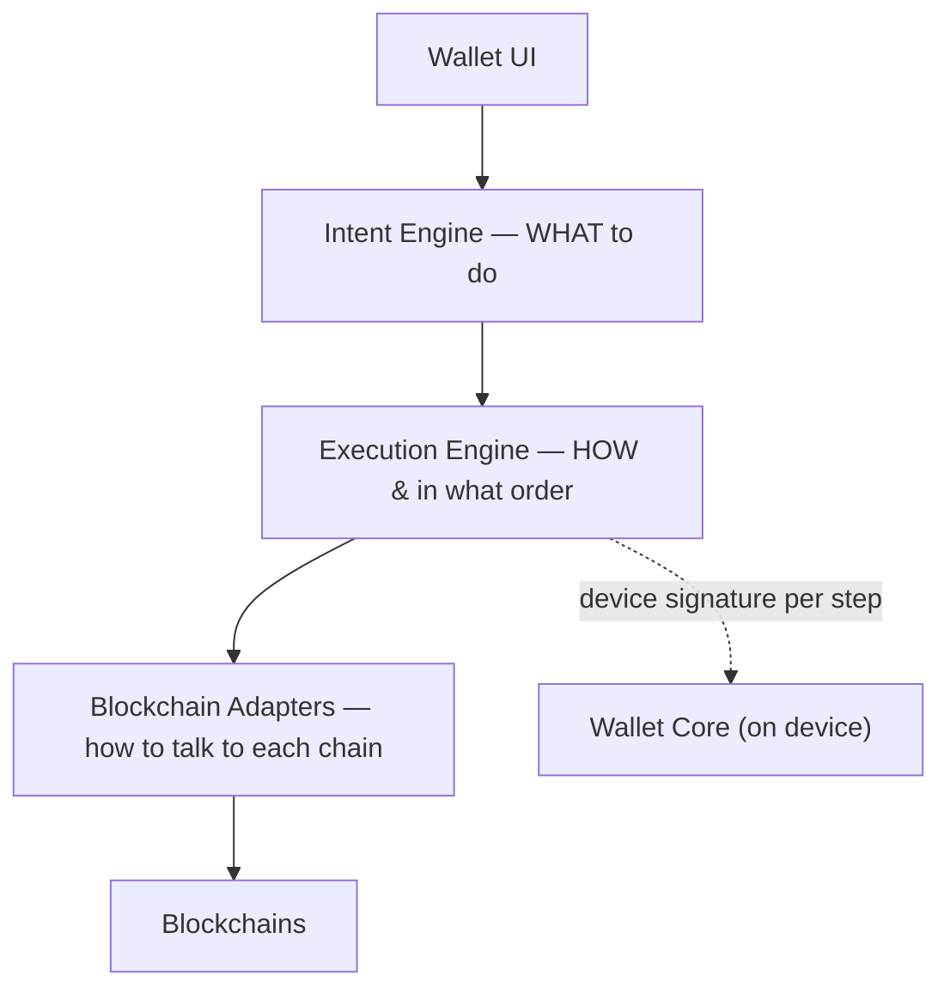
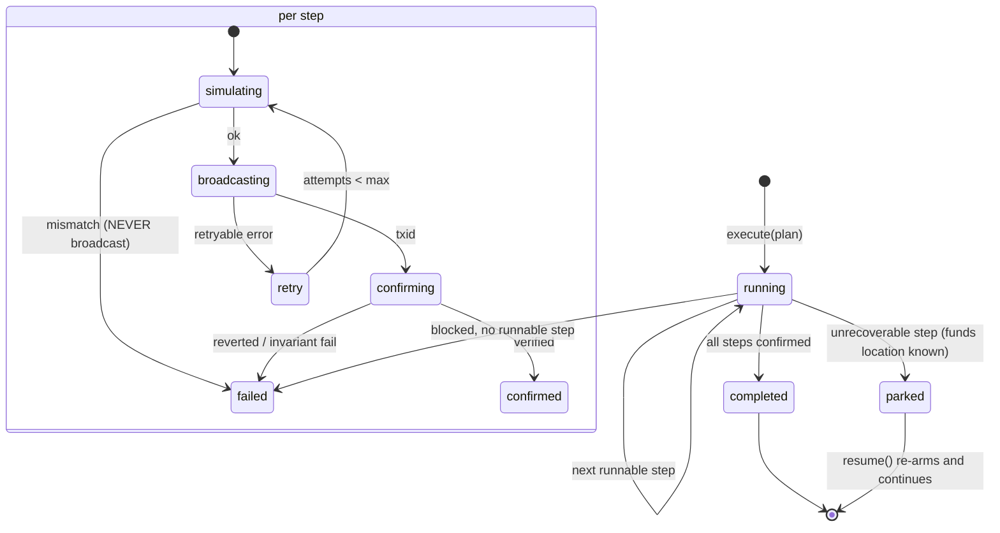
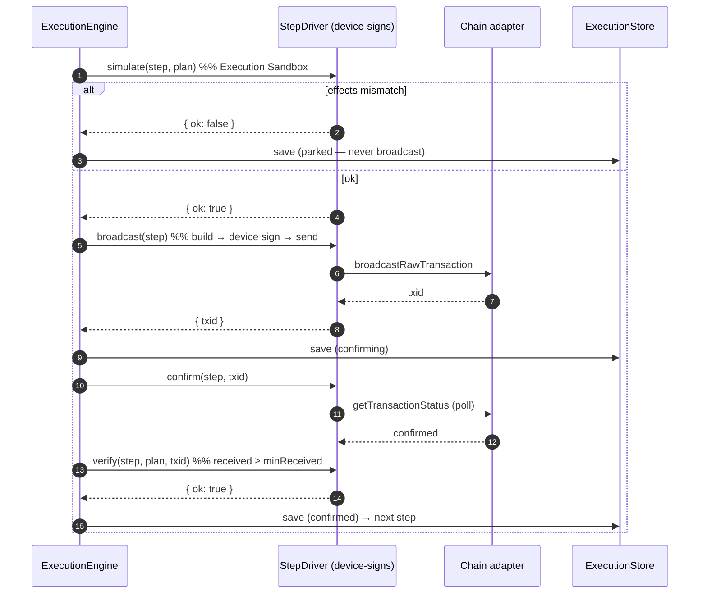

# 14 — Execution Engine

> **Status:** implemented (`packages/execution`) — 12 tests. Runs an approved `ExecutionPlan` as a persisted, resumable, simulate-gated step machine. It answers **"how and in what order"**; the intent engine answered "what", the chain adapters answer "how to talk to each chain".

## 1. Role in the layering



The engine consumes the `ExecutionPlan` the Intent Engine produced (already user-approved) and drives it to completion — or to a safe, resumable park. It **never holds keys**: signing happens inside the injected driver, on the device.

## 2. State machine



## 3. Per-step sequence



## 4. Guarantees

| Guarantee                     | How                                                                                                                                                                                 |
| ----------------------------- | ----------------------------------------------------------------------------------------------------------------------------------------------------------------------------------- |
| **Simulate before broadcast** | every step is simulated (the Execution Sandbox); if the effects don't match the plan, it is NEVER broadcast — the execution parks                                                   |
| **Idempotent retries**        | transient (`retryable`) driver failures retry the SAME step up to `maxAttempts`; re-broadcast of the same tx is idempotent                                                          |
| **Never strand funds**        | any unrecoverable failure PARKS: status `parked`, `fundsLocation` recorded (chain + human note), execution stops — funds are always locatable                                       |
| **Resumable**                 | state saved after EVERY transition; `resume(id)` continues from the first unconfirmed step (proven by crash-resume tests) — confirmed steps never re-run                            |
| **Non-custodial**             | signing is inside the driver, on-device; the engine never sees a key                                                                                                                |
| **Observable**                | every transition emits an `ExecutionEvent` (started, step.simulating/broadcast/confirmed/failed, completed/parked/failed) for Portfolio, Notifications, Audit, and the live tracker |

## 5. Folder structure

```
packages/execution/src/
├── state.ts     Execution + StepState, status transitions, runnable/ordering helpers
├── driver.ts    StepDriver interface (simulate/broadcast/confirm/verify) + DriverError (retryable, recovery)
├── store.ts     ExecutionStore interface + in-memory impl (resumability)
├── events.ts    ExecutionEvent union + EventSink
├── engine.ts    ExecutionEngine — the step machine (execute / resume)
└── errors.ts    ExecutionError
```

## 6. Recovery policy

On a step failure the engine classifies via `DriverError.recovery`:

- **retry** (transient: RPC timeout, congestion) → re-run the same step, idempotently, up to `maxAttempts`.
- **requote** (quote expired, price moved) → the driver re-provisions the leg (fresh quote); a worse outcome is re-confirmed with the user upstream. _(Interface in place; the requote hook is wired with the Route Optimizer, Phase 5+.)_
- **park** (unrecoverable, simulation mismatch, invariant violation, reverted tx) → stop, record funds location, emit `execution.parked`. The user resumes when ready.

The design commitment: **the funds' location is ALWAYS known and shown** — parking is a calm, first-class terminal state with a resume path, never an error that leaves money in limbo ([design 06 S-22](../design/06-screens-intent.md), [J-4](../design/09-journeys.md)).

## 7. Threat model (engine-specific)

| Threat                    | Mitigation                                                                                  |
| ------------------------- | ------------------------------------------------------------------------------------------- |
| Server moves funds        | engine never holds keys; signing is on-device inside the driver                             |
| Blind/malicious broadcast | simulate-gate: effects must match the plan or it never broadcasts                           |
| Worse-than-promised fill  | post-confirmation invariant (`received ≥ minReceived`); violation → park, not "done"        |
| Duplicate execution       | single-writer per execution; idempotent re-broadcast; plan approval consumed once (backend) |
| Crash mid-flight          | persisted after every transition; resume from the first unconfirmed step                    |
| Stranded funds            | park with a recorded, user-visible location; resume path                                    |
| Reorg / dropped tx        | confirmation polling + indexer finality; retry/park classification                          |

## 8. Concurrency & scale

Each execution is an independent saga keyed by `executionId` — executions never share state, so the engine scales horizontally trivially (KEDA on queue depth, [architecture 05](05-infrastructure.md)). At Stage C, execution has a single-writer home region per identity to avoid cross-region saga split-brain ([ADR-0027](../adr/0027-deployment-topology.md)); reads are global.

## 9. What's next (wiring the real driver)

The `StepDriver` is the seam to production: its real implementation builds the tx (per step kind), obtains a device signature via `@intent-wallet/core`'s `WalletSigner`, simulates (anvil fork / `eth_call` / `simulateTransaction`), broadcasts via `@intent-wallet/chains` `AdapterRegistry`, and polls `getTransactionStatus`. The Route Optimizer (Phase 5) and Risk Engine (Phase 6) fill the requote/verify hooks. None of that changes the engine — that is the point of the interface.
