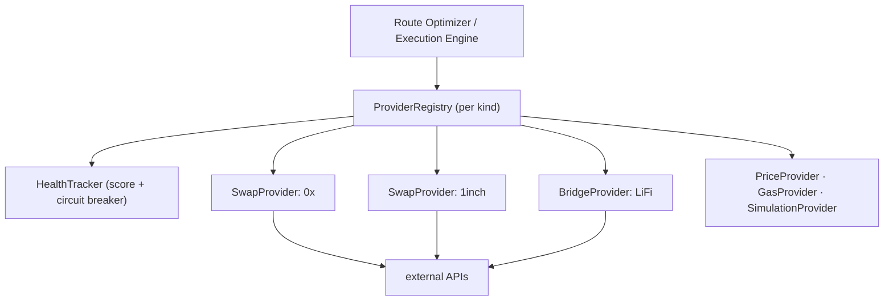
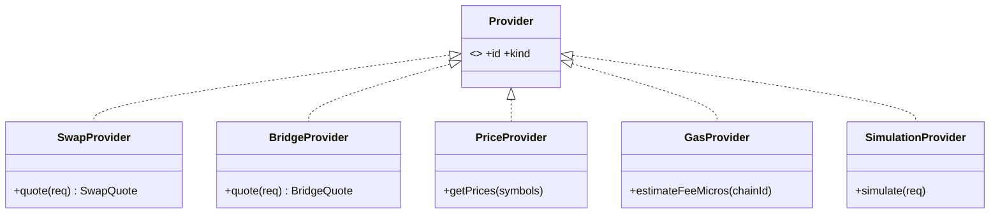
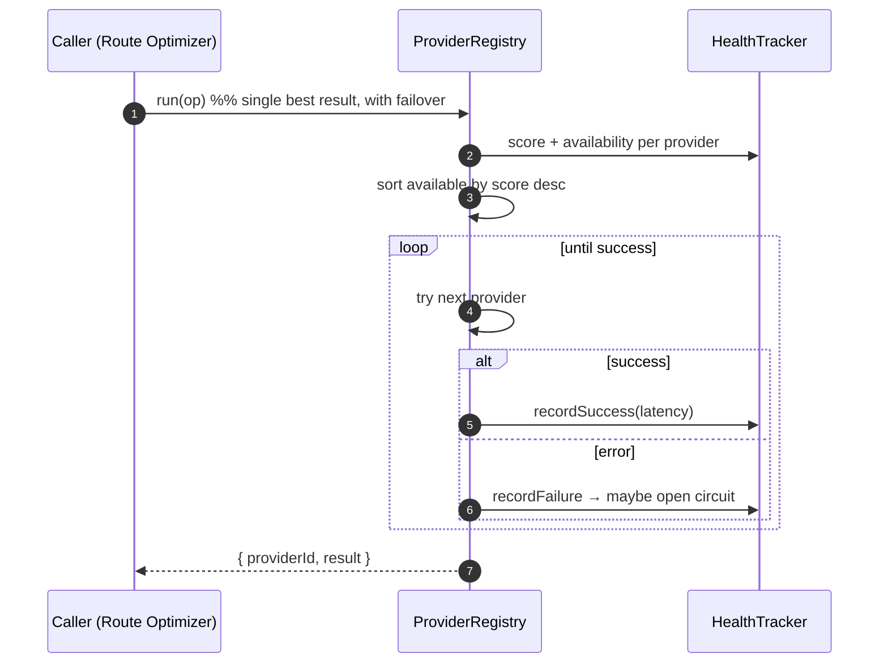

# 15 — Provider / Aggregator Framework

> **Status:** implemented (`packages/providers`) — 16 tests. The pluggable integration layer between the platform and every third-party service. Completes the "Aggregator Framework" of the Execution Engine ([Prompt #11](14-execution-engine.md)): no swap/bridge/price/gas/simulation provider is ever hardcoded.

## 1. Principle

The Execution Engine and Route Optimizer must never depend on a specific DEX, bridge, price feed, or simulator. Each is a **plugin** implementing a small interface and registered in a health-scored registry. Adding or replacing a provider is writing one plugin — the core engine never changes ([ADR-0034](../adr/0034-provider-aggregator-framework.md)).



## 2. Provider interfaces (the plugin contracts)



Every provider exposes `id` + `kind`; the registry adds the operational concerns (health, selection, failover) so the plugin itself stays a thin adapter over the vendor API.

## 3. Health scoring & circuit breaking

The `HealthTracker` records every call outcome per provider:

- **success rate** (successes / total), **latency EWMA**, **consecutive failures**.
- **Composite score** = `0.7·successRate + 0.3·latencyScore`, `0` when the circuit is open.
- **Circuit breaker:** `closed → open` after N consecutive failures → `half_open` after a cooldown (one probe) → `closed` on success, or back to `open` if the probe fails.

Selection always prefers the highest score among _available_ (circuit-not-open) providers, so traffic drains away from a degrading vendor automatically and returns after it recovers — no manual failover, no config change.

## 4. Registry: selection, failover, aggregation



- **`run(op)`** — the healthiest available provider, failing over on error; throws `ALL_PROVIDERS_FAILED` only if every one fails, `NO_PROVIDERS` if none are available.
- **`collect(op)`** — fans out to ALL available providers concurrently, returns the successes (the basis for quote aggregation).

## 5. Quote aggregation + response validation

Provider responses are **never trusted blindly**:

- `isValidSwapQuote` rejects non-positive output, negative fees, out-of-band slippage, and **stale quotes** (older than the 30 s expiry).
- `bestSwapQuote` collects every healthy provider's quote, drops the invalid/stale ones, and ranks by output (more destination asset wins), tie-breaking on lower fee.

This is where "use the best of N aggregators" actually happens — and where a lying or lagging provider is filtered out rather than executed against.

## 6. Route Optimizer

`RouteOptimizer` composes providers into an executable `Route`:

- **Same-chain** conversion → aggregate swap providers → best-quote route (one swap leg).
- **Cross-chain** → a bridge leg from the bridge registry (bridge + destination swap is the extension).

It produces a provider-native `Route`; the backend maps it onto the Intent Engine's injected `RouteProvider` interface, so the planner's routes are backed by real, aggregated, validated quotes — closing the loop between planning and execution.

## 7. How it fills the injected interfaces

| Injected interface (defined in)       | Filled by                                  |
| ------------------------------------- | ------------------------------------------ |
| `RouteProvider` (intents planner)     | `RouteOptimizer` (swap/bridge registries)  |
| requote hook (execution `StepDriver`) | `bestSwapQuote` re-run on quote expiry     |
| `PriceProvider` (intents/portfolio)   | a `PriceProvider` plugin behind a registry |
| `estimateFeeMicros` / gas             | a `GasProvider` plugin                     |
| simulate (execution sandbox)          | a `SimulationProvider` plugin              |

The Intent and Execution engines were built pure over these interfaces ([ADR-0030/0032/0033](../adr/0030-universal-identity-and-portfolio-layering.md)); this framework is their production backing.

## 8. Folder structure & testing

```
packages/providers/src/
├── provider.ts   Provider + Swap/Bridge/Price/Gas/Simulation interfaces + quote types
├── health.ts     HealthTracker (score + circuit breaker, injectable clock)
├── registry.ts   ProviderRegistry (run/collect, selection, failover)
├── aggregate.ts  quote validation + bestSwapQuote
├── route.ts      RouteOptimizer
└── errors.ts
```

16 tests, all offline with fake providers: health scoring, circuit open/half-open/close/re-open, registry selection + failover + circuit-shedding, `NO_PROVIDERS`/`ALL_PROVIDERS_FAILED`, quote aggregation best-pick + tie-break, stale/invalid rejection, route building. **Next:** real vendor plugins (0x/1inch/Jupiter swaps, LiFi bridge, price/gas feeds) — each a new file implementing one interface, per the plugin contract.
