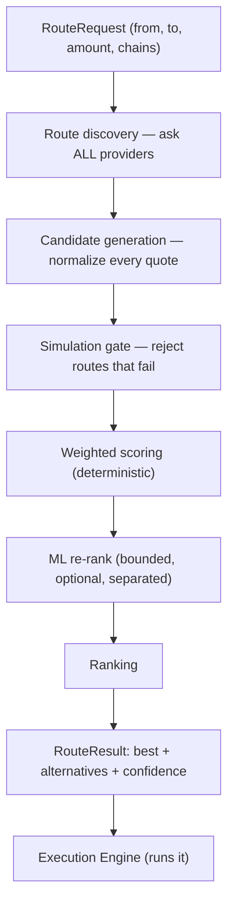
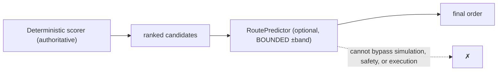

# 16 — Global Route Optimizer

> **Status:** implemented (`packages/router`) — 17 tests. The routing intelligence layer — the "Google Maps of crypto". Standalone by design ([ADR-0035](../adr/0035-global-route-optimizer.md)): it depends only on the provider framework, so it can power third-party wallets through a public API. It PROPOSES the optimal strategy; the Execution Engine runs it.

## 1. Pipeline



Route generation target: **< 300 ms** (all provider calls parallelized via `collect`; scoring is O(n·factors)). Stateless per request → scales to millions of requests/day horizontally.

## 2. Candidate model (normalize everything into one comparable shape)

All quotes — from any DEX or bridge aggregator — become a `RouteCandidate`:

```
{ id, legs[], providerIds[], outputBase, outputDecimals, feeMicros,
  slippageBps, etaSeconds, healthScore (0..1), riskLevel, quoteAgeMs, priceImpactBps? }
```

Because every candidate for the same conversion shares the destination asset, `outputBase` is directly comparable across providers — a fair "best of N".

## 3. Scoring engine (the crown-jewel IP)

Seven factors, each **min-max normalized against the candidate set** to `[0,1]` where 1 = best, then combined with weights:

| Factor        | Direction      | Meaning                                            |
| ------------- | -------------- | -------------------------------------------------- |
| `output`      | higher better  | more of the destination asset received             |
| `cost`        | lower better   | total fees (micro-USD)                             |
| `slippage`    | lower better   | quoted slippage (bps)                              |
| `time`        | lower better   | estimated completion (s)                           |
| `reliability` | higher better  | provider health score (from the framework)         |
| `risk`        | lower better   | destination-asset risk (low/med/high → 1/0.6/0.25) |
| `freshness`   | fresher better | quote age vs the 30 s expiry                       |

`score = Σ wᵢ · factorᵢ`, weights normalized to sum to 1. **Dynamic weighting by user preference** via presets:

| Preset     | Emphasis                                    |
| ---------- | ------------------------------------------- |
| `balanced` | output-led, everything considered (default) |
| `cheapest` | fees + slippage dominate                    |
| `fastest`  | time dominates, reliability matters         |
| `safest`   | risk + reliability dominate                 |

The scorer is a **pure function** of `(candidates, weights)` — fully deterministic and testable; changing the preset provably changes the winner (tested).

## 4. Simulation gate

Every candidate is simulated (via an injected `SimulationProvider`) BEFORE scoring; any route that fails to simulate is **rejected** and can never be selected. If none survive → `ALL_ROUTES_FAILED_SIMULATION`. This is the same Execution-Sandbox principle applied at planning time — we never rank a route we couldn't simulate.

## 5. ML — augments, never replaces (the security boundary)



ML (historical reliability, latency/failure/gas/liquidity prediction) enters ONLY as a **bounded re-ranker**: `boundedPredictor` clamps every adjustment to `±band` around the deterministic score. So ML can break near-ties but **cannot crown a clearly-worse route** (tested both ways). If the model is wrong, the worst case is a suboptimal — still valid, still simulated — route. ML never signs, never executes, never overrides a safety check.

## 6. Output: confidence, alternatives, fallbacks

`RouteResult` = `{ best, alternatives[], confidence, weightsUsed }`.

- **confidence** ∈ [0,1] = `0.5·health + 0.3·margin-over-runner-up + 0.2·simulated` — high when the winner is clearly ahead, healthy, and simulated.
- **alternatives** are the ranked runners-up — shown to the user and used by the Execution Engine as **fallback routes**: if the best provider fails mid-execution, the engine's requote hook re-runs the optimizer (adaptive routing) or drops to the next-best already-ranked route (hot failover).

## 7. Multi-chain routing

Same-chain conversions generate swap candidates; cross-chain generate bridge candidates (bridge + destination swap is the composition extension). The candidate set feeds the same scorer, so single-chain, multi-chain, and cross-chain routes are ranked on one comparable scale. Sequential vs parallel leg execution is the Execution Engine's concern ([14](14-execution-engine.md)); the optimizer describes the route, the engine runs it.

## 8. Caching & performance

- Route/quote cache: 30 s hard expiry (matches quote freshness) keyed by `(from,to,amount-bucket,chain,preset)` — [architecture 03 §2](03-data.md).
- Provider health is already tracked continuously (the framework), so scoring reads warm state.
- All provider quotes fetched in parallel; scoring is linear. Target p95 < 300 ms.

## 9. Standalone / public API (the infra product)

The optimizer depends ONLY on `@intent-wallet/providers` — no wallet, no keys, no chain I/O of its own. That makes it a **standalone routing engine** that can be exposed as a public API (`POST /v1/route`) and an SDK, so third-party wallets, exchanges, and DeFi apps route through it. This is the second business line: routing infrastructure, not just a wallet.

## 10. Folder structure & next

```
packages/router/src/
├── types.ts       RouteCandidate, ScoringWeights, ScoredCandidate, RouteResult
├── request.ts     RouteRequest
├── scoring.ts     the weighted scoring engine + weight presets (pure IP)
├── candidates.ts  CandidateGenerator (over provider registries) + simulateCandidates
├── predictor.ts   RoutePredictor (ML boundary) + boundedPredictor + identityPredictor
├── optimizer.ts   GlobalRouteOptimizer (discover→simulate→score→rank→result)
└── errors.ts
```

17 tests, all offline with fake providers: scoring normalization, each preset changing the winner, freshness penalty, simulation rejection, confidence, ML re-rank of a tie, ML clamped from overriding a clear winner. **Next:** real vendor plugins (0x/1inch/Jupiter swaps, LiFi bridge) implementing the provider interfaces; multi-hop candidate composition; ML predictors trained on the observability metrics (route success rate, realized savings, provider performance).
