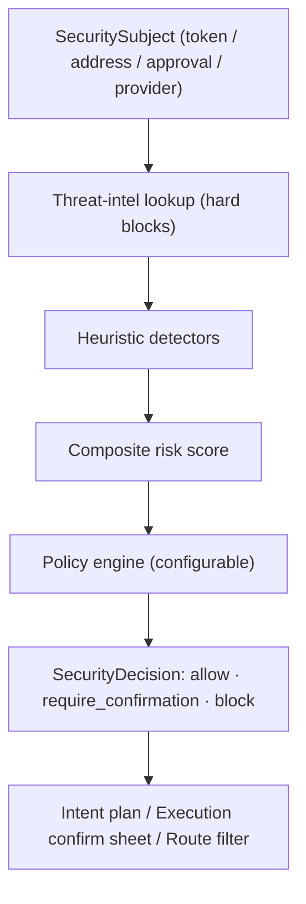
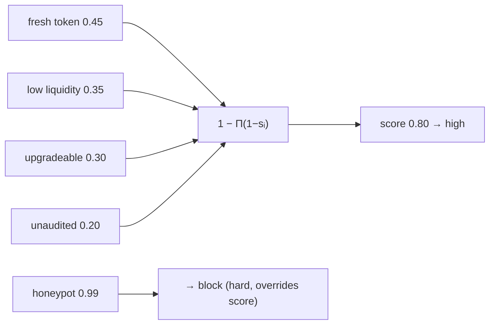

# 17 — Universal Security & Risk Engine (the immune system)

> **Status:** implemented (`packages/risk`) — 20 tests. The platform's immune system: every action passes through it BEFORE execution. Threat intel + heuristic detectors + composite scoring + a configurable policy engine → an authorize/confirm/block decision. It EVALUATES and AUTHORIZES; it never signs, never holds funds. Standalone (no wallet/chain deps) — security-as-a-service capable.

## 1. Risk pipeline



Target: **< 250 ms** per evaluation (pure CPU + a cached intel lookup); millions/day, stateless → horizontal scale.

## 2. What it evaluates

| Subject                    | Signals                                                                                                                                                                   |
| -------------------------- | ------------------------------------------------------------------------------------------------------------------------------------------------------------------------- |
| **token**                  | known-scam/malicious (intel, hard block); honeypot (sell tax → hard block); fresh token (age); low liquidity; ownership concentration; admin key / upgradeable; unaudited |
| **address** (recipient)    | sanctioned / blacklisted (intel, hard block); **address poisoning** (lookalike of a saved contact)                                                                        |
| **approval** (ERC-20)      | malicious spender (intel, hard block); **unlimited allowance**                                                                                                            |
| **provider** (swap/bridge) | health below the policy threshold                                                                                                                                         |

## 3. Composite scoring (the model)

Signals are independent probabilities of harm; the composite is the **probabilistic-OR**:

```
score = 1 − Π(1 − severityᵢ)   ∈ [0,1]
```

So many small risks compound (a fresh + illiquid + upgradeable + unaudited token scores higher than any one alone) while staying bounded. **Any single hard signal** (severity ≥ 0.99 — sanctioned, blacklisted, known-scam, honeypot) forces `level = block` regardless of score. Otherwise: `score < 0.3 → low`, `< 0.6 → medium`, else `high`.



## 4. Policy engine (configurable posture)

Policies turn a report into a verdict. A `block` report is **never overridable** — policies can only make things stricter, never looser:

| Rule                               | Config                          |
| ---------------------------------- | ------------------------------- |
| Block above a risk score           | `maxRiskScore`                  |
| Require confirmation above a score | `requireConfirmationAboveScore` |
| Never unaudited contracts          | `blockUnaudited`                |
| Never unlimited approvals          | `blockUnlimitedApproval`        |
| Never low-health bridges/DEXs      | `minProviderHealth`             |

Presets: **strict** (blocks unaudited + unlimited approvals, low thresholds), **balanced** (default), **permissive**. Enterprises/users supply custom configs. Verdict order: hard block → policy block → confirmation zone → allow.

## 5. Threat intelligence & secure distribution

`ThreatIntel` (sanctions, blacklists, scam-token registry, malicious contracts, phishing domains) is an injected interface — the engine consults it first. **Distribution:** feeds are aggregated from multiple sources server-side and pushed to evaluators as **cryptographically-signed snapshots**; each evaluator verifies the signature before loading, so a poisoned or MITM'd feed cannot silently unblock a scam or block a safe asset. Snapshots are versioned and diffed; a bad snapshot is rolled back like any release. The in-memory impl is the shape a Redis/DB-backed impl fills.

## 6. How it plugs into the platform

It is the real `RiskProvider` the other layers already depend on:

- **Intent Engine** — the planner's risk scan; BLOCK rejects a plan, HIGH becomes a confirmation.
- **Execution Engine** — pre-broadcast recipient/token/approval checks.
- **Route Optimizer** — provider-health and token-risk feed candidate scoring (`riskFor`).
- **Confirm sheet** — `require_confirmation` drives the hold-to-confirm / typed-word friction ([design 06 S-21](../design/06-screens-intent.md)).

`SecurityDecision.report` maps trivially to the `{ level, reasons }` shape those interfaces expect (`reasons = signals.map(reason)`).

## 7. Incident response & observability

- **Detection/classification:** anomalous verdict rates, a spike in a signal code, or a provider going unhealthy raise incidents; classified by category (scam wave, bridge incident, provider outage).
- **Mitigation:** kill switches per provider/venue/chain (config, hot-reload); a new intel snapshot can block an address/token platform-wide in one push.
- **Observability:** risk-score distribution, blocked-transaction rate, provider-incident count, simulation-accuracy, threat trends → the security dashboard; alerts page on money-path signal spikes.
- **Audit:** every decision is an append-only audit entry ([architecture 06 §4](06-security.md)).

## 8. Folder structure & testing

```
packages/risk/src/
├── types.ts      RiskSignal/RiskReport/SecuritySubject/SecurityDecision
├── scoring.ts    combineSignals (probabilistic-OR composite + level)
├── detectors.ts  pure heuristics (honeypot, unlimited-approval, fresh, illiquid, concentration, admin, unaudited, poisoning)
├── intel.ts      ThreatIntel interface + in-memory impl (signed-snapshot shape)
├── policy.ts     PolicyEngine + presets (strict/balanced/permissive)
└── engine.ts     RiskEngine (pipeline: intel → detectors → score → policy)
```

20 tests, all pure/offline: each detector, composite-score compounding + hard-block, intel hard blocks (scam token, sanctioned recipient — unoverridable by a permissive policy), policy interaction (strict blocks where balanced confirms), honeypot blocked under every policy, unlimited-approval and low-provider-health gating. **Next:** wire real intel feeds (Chainalysis-class sanctions, scam-token lists), a live Transaction Simulator (anvil-fork diff analysis) feeding `simulation` signals, and ML anomaly detection as a bounded signal source — all behind the same interfaces.
