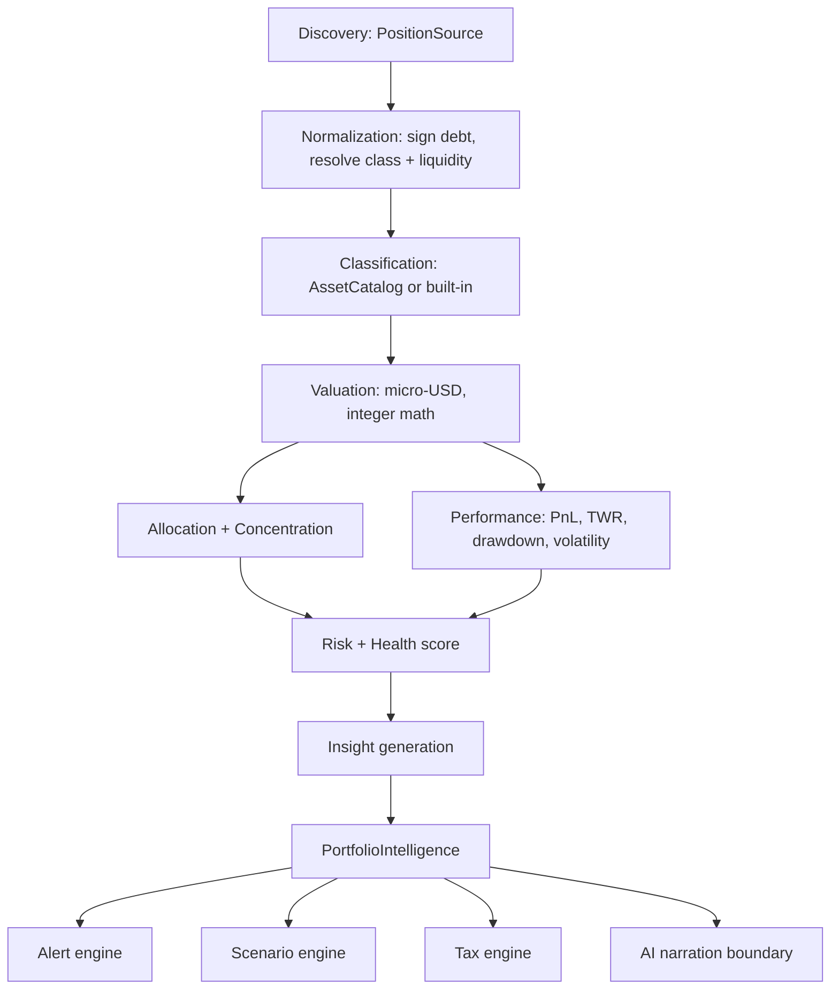
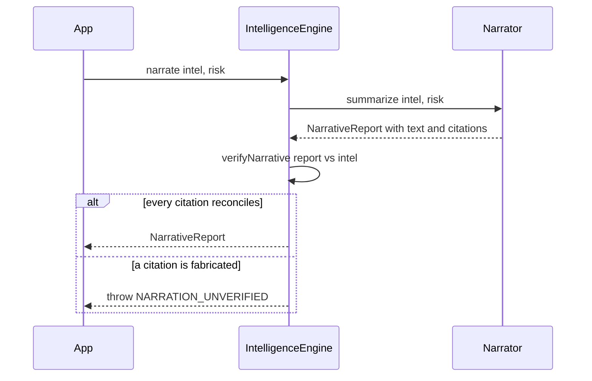

# 18 — Portfolio Intelligence Engine (the financial brain)

> Package: [`packages/intelligence`](../../packages/intelligence) · ADR: [0037](../adr/0037-portfolio-intelligence-engine.md) · Status: **implemented** (38 tests)

MetaMask _shows_ you a portfolio. This engine makes a _decision_ about it. It continuously turns raw positions into financial intelligence — allocation, performance, risk, health, recommendations, alerts, what-if scenarios and tax — so a user never has to compute any of it by hand.

Two rules define the whole module:

1. **It analyzes and recommends; it never signs and never executes.** Every output is data (facts + non-executable suggestions). Acting is the user's job, mediated by the Intent + Execution + device-signature path. The brain cannot move money.
2. **The AI never fabricates financial data.** Every number is computed by a deterministic function. AI only _narrates_ numbers that already exist, and its narration is machine-verified against the computed facts before it is shown (see [§7](#7-ai-narration-boundary)).

## 1. Money vs ratio — the discipline that keeps it correct

- Any **amount of money** is an integer `bigint` in **micro-USD** (µUSD; 1 USD = 1,000,000 µUSD). Never a float. The base math is reused from [`packages/portfolio`](../../packages/portfolio).
- Any quantity **derived** from money that is dimensionless — a return, a weight, a volatility, a correlation, a score — is a `number`. That is correct: a ratio is not money, and float rounding on a ratio is a presentation concern, not a value-integrity one.

This single rule is why the net-worth number and the tax report reconcile to the penny, while volatility and diversification are free to be ordinary floating-point statistics.

## 2. The data pipeline



`analyze()` runs Discovery→Insight as one pure function of a `PortfolioSnapshot` (plus an injected classifier/policy) — no clock, no network. Alerts, scenarios, tax and narration are on-demand engines over the same verified data.

## 3. Data model

A portfolio is a set of **positions**, each an atomic unit of value:

| `kind`      | Meaning                    | Net-worth sign |
| ----------- | -------------------------- | -------------- |
| `token`     | wallet-held spot           | +              |
| `nft`       | non-fungible               | +              |
| `lp`        | liquidity-pool share       | +              |
| `staking`   | staked asset               | +              |
| `lending`   | supplied to a money market | +              |
| `borrowing` | debt drawn from a market   | **−**          |
| `yield`     | vault / farm               | +              |
| `reward`    | pending, claimable         | +              |

`Position` carries `valueMicros` (a positive magnitude), optional `costBasisMicros`, `assetClass`, `liquidity`, LP `legs` (for scenario re-pricing), and a `bridge` tag (for outage analysis). **Net worth = gross assets − debt.** Getting the sign of `borrowing` right is the entire reason a "net worth" number can be trusted.

A `PortfolioSnapshot` bundles positions with optional `history` (net-worth series), `flows` (deposits/withdrawals) and `assetReturns` (per-asset return series) — each optional so the engine degrades honestly rather than fabricating what it wasn't given.

## 4. Analytics

**Allocation & concentration** — value split by asset, sector (`AssetClass`), chain, protocol and liquidity; every weight a share of gross assets. Concentration is the Herfindahl-Hirschman Index over **asset** weights (ETH on three chains is one asset), giving `hhi`, effective-position count `1/hhi`, top-asset and top-3 weights.

**Performance** — two independent truths:

- **Unrealized PnL** from cost basis on current positions (needs no history), computed only over positions whose cost basis is known so PnL and its denominator refer to the same set.
- **Time-weighted return / volatility / drawdown** from the net-worth history. TWR removes deposit timing: per period `rₜ = (Vₜ − flowₜ) / Vₜ₋₁ − 1`, chained as `Π(1+rₜ) − 1`. Volatility is the annualized stdev of period returns; drawdown uses the running-peak method. No history ⇒ these are `null` and `hasHistory: false`, never invented.

**Risk & the Portfolio Health Score** — diversification is measured best-available:

- **Correlation basis** (preferred): the diversification ratio `DR = (Σ wᵢσᵢ) / σ_portfolio`, where `σ_portfolio = √(wᵀ Σ w)` uses the real correlation matrix. Two assets that move together are _not_ diversified even at different weights — only correlation captures that. Requires per-asset return series covering the book.
- **Weights basis** (fallback): effective number of positions from the HHI.

The **health score** [0,100] is a transparent weighted blend of independent factors — diversification, leverage safety, liquidity, stablecoin buffer, stability (volatility), drawdown resilience. Missing-history factors drop out and the rest re-normalize, so a thin history never silently deflates the score. **Every factor is returned with its own sub-score, weight and a one-line reason** — a health number is always explainable, never a black box.

## 5. Insight engine

Deterministic rules over the analytics. Each rule is a threshold crossing on a verified metric and attaches **evidence**: the exact metric ids and values that triggered it. Nothing is invented, and `suggestedAction` is advice, never an executable step. Thresholds live in a configurable `InsightPolicy` (presets `conservative` / `balanced` / `aggressive`), mirroring the risk engine's policy model.

Covered: single-asset / chain / protocol concentration, bridge exposure, leverage, low diversification, thin-or-idle stablecoin buffer, deep drawdown, rising risk vs the last reading, unusually high gas, and yield opportunities on idle holdings.

## 6. Alert, scenario and tax engines

**Alerts** are event-and-threshold driven and **stateful**: every candidate carries a dedup `key` and the engine suppresses re-fires inside a cooldown window. It is a pure function of `(previous state, context, now) → (alerts, next state)` — `now` is passed in, never read from the clock. Sources: analytics (large move, extreme volatility, health breach, gas spike, price targets, inactivity) and an injected `MarketEventFeed` (bridge exploit, protocol hack, delisting, yield) filtered to entities the user actually owns.

**Scenarios** re-price the book deterministically, then re-derive net worth through the same normalizer so debt signs stay correct:

- Spot holdings of the shocked asset move linearly.
- **LP / vault positions re-price with impermanent loss**: value scales by `Πlegs (legMultiplier)^(legWeight)`. For a 50/50 pool where one leg moves ×r and the other is stable, this reduces to the classic `√r` — captured, not naively marked linear.
- With `propagate`, correlated assets move by `β·shock` (β from the supplied return series), so "BTC −20%" ripples through the book.
- Gas and bridge-outage scenarios don't change holdings; they surface the added cost-to-act and the value newly trapped, which is the real user impact.

**Tax** computes realized gains by lot matching — `FIFO` / `LIFO` / `HIFO` / `AVERAGE` — with short/long-term classification. **Jurisdiction is abstracted to three parameters** (matching method, long-term threshold, name), so US-FIFO, US-HIFO and a UK-style pooled average are the same engine with different config; rates and forms are a localization layer on top. Events process chronologically (a disposal can only match earlier lots; anything unmatched is surfaced, never guessed) and cost/proceeds split across lots with exact bigint arithmetic, the remainder assigned to the last line so per-disposal totals reconcile.

## 7. AI narration boundary



A `Narrator` turns verified facts into prose. The contract — **enforced, not hoped for** — is that a narrative may cite only figures that resolve against the computed `PortfolioIntelligence`. `verifyNarrative` checks exactly that, so an LLM narrator plugged in behind this interface cannot fabricate a number: a non-reconciling citation fails the guard and the narrative is rejected. `TemplateNarrator` is the production-safe default (fully deterministic, no LLM) and the reference the LLM narrator is held to.

## 8. API contract (sketch, lands with the Backend Platform)

```
POST /v1/intelligence/analyze      { identityId, snapshot? }        -> PortfolioIntelligence
POST /v1/intelligence/scenario     { positions, scenario, options } -> ScenarioResult
POST /v1/intelligence/alerts       { state, context, now }          -> { alerts, state }
POST /v1/intelligence/tax          { events, config }               -> TaxReport
POST /v1/intelligence/narrate      { intel, kind }                  -> NarrativeReport (verified)
```

Read-only and idempotent; no signing scope. The same package powers the in-wallet brain and a **Portfolio-Intelligence-as-a-service** API (a hybrid-model revenue stream), because it is standalone over injected sources.

## 9. Folder structure

```
packages/intelligence/src/
  types.ts        shared vocabulary (money-vs-ratio rule)
  money.ts        µUSD reuse + ratio helpers
  stats.ts        pure quant primitives (mean/stdev/returns/pearson/beta/hhi/drawdown)
  positions.ts    normalization: net worth = assets − debt, classification, weights
  allocation.ts   allocation axes + HHI concentration
  performance.ts  PnL, TWR, growth, volatility, drawdown
  risk.ts         diversification, leverage, bridge exposure, health score
  insights.ts     deterministic recommendation rules + policy presets
  alerts.ts       stateful dedup/cooldown alert engine + market-event feed
  scenario.ts     what-if shocks with AMM impermanent-loss + beta propagation
  tax.ts          lot matching (FIFO/LIFO/HIFO/AVERAGE), jurisdiction-abstracted
  sources.ts      injected interfaces (positions/prices/history/events/catalog)
  narrator.ts     AI narration boundary + verification guard
  engine.ts       PortfolioIntelligenceEngine facade
  errors.ts / index.ts
```

## 10. Performance

The analytics are pure CPU over an in-memory snapshot — well within the **< 2 s refresh** target; the heavy cost is upstream discovery (parallelized in the chain layer) and pricing (cached). The engine supports **incremental** use: `analyze()` is cheap enough to re-run on a new snapshot, and the alert engine is designed to diff against prior state so a mobile client can poll lightly and only surface what changed.

## 11. Roadmap

1. **Now (done):** deterministic analytics + insight/alert/scenario/tax engines + narration guard, offline-tested.
2. **Wiring:** real `PositionSource` (chain adapters incl. LP/staking/lending discovery), `PriceHistorySource`, `SnapshotStore`, `MarketEventFeed`, `AssetCatalog`.
3. **AI Copilot (#16):** LLM `Narrator` behind the verified boundary; the same anti-fabrication guard applies unchanged.
4. **Backend Platform (#7):** expose the API above; persist snapshots for history/TWR.
5. **Tax localization:** jurisdiction rate/report packs on top of the abstracted engine.

## Related

- Base aggregation: [`packages/portfolio`](../../packages/portfolio) · Risk-of-actions (pre-execution): [17 — Security & Risk Engine](17-security-risk-engine.md)
- The brain proposes; the [Intent Engine](13-intent-engine.md) + [Execution Engine](14-execution-engine.md) + device signature dispose. AI never executes.
