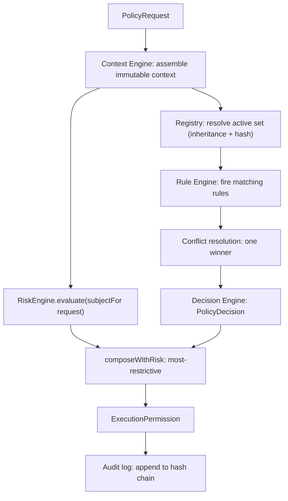

# 19 — Universal Policy Engine (the zero-trust authorization layer)

> Package: [`packages/policy`](../../packages/policy) · ADR: [0038](../adr/0038-universal-policy-engine.md) · Status: **implemented** (55 tests)

Nothing reaches execution without passing policy validation. The Policy Engine is the mandatory authorization layer between the AI, the user, and the Execution Engine. It asks a different question than the [Risk Engine](17-security-risk-engine.md):

- **Risk** — _is this dangerous?_ (scam token, sanctioned address, honeypot, unlimited approval)
- **Policy** — _is the user AUTHORIZED / has the user APPROVED this?_ (over a limit, a new recipient, automation not pre-approved, biometric required, device untrusted)

The two are orthogonal and **both must pass**. Policy composes with Risk taking the **most-restrictive** of the two verdicts — so Policy can only ever _tighten_, never loosen, a Risk decision, and a `block` on either side is terminal. The engine **authorizes and records**; it holds no keys and never signs.

## 1. Pipeline



`evaluate()` returns ONE `ExecutionPermission`. Callers never read the Policy or Risk verdict in isolation (that invites composition drift) — they read `permission.gate` and the single boolean `permission.mayProceedToSign`.

## 2. Determinism as an injected boundary

The evaluator has NO reachable `Date.now`, `Math.random`, `crypto`, `fetch`, or `process.env`. Everything non-deterministic — the clock, id generation, and the audit hash — is injected through `PolicyEnv` (`now()`, `ids`, `hash()`). This makes "the engine is deterministic" a property a test asserts (source-grep + env-swap invariance), not a convention. Identical inputs yield an identical `decisionHash` across any number of runs; swapping the clock changes only timestamps, never the decision.

## 3. Context — anti-spoofing

The `ContextEngine` assembles a deeply-frozen `PolicyContext` from injected sources. Two guarantees live here:

- The **authoritative amount is re-derived from the plan quote** (the persisted `ExecutionPlan.quote`) via the injected `planQuote` source — never trusted from the caller's request. A request that claims $100 while its plan sends $10k is gated on $10k.
- **Recipient trust and risk** come from the sources / the Risk engine, never from caller-supplied fields.

## 4. Policy language — a typed rule model, not a string DSL

Rules are pure data (`PolicyRule` with a typed `ConditionExpr` AST), so they typecheck at authoring time, serialize to JSON(B), diff for simulation, and hash for tamper-evidence. A rule carries a `priority`, a `when` condition, an `effect` (outcome + optional step-up requirement), `overridable`, `extends` (inheritance), and a `version`. The condition AST covers amount thresholds, recipient trust/newness, the Risk verdict/score, device trust, biometric availability, intent kind, automation pre-approval, unlimited approvals, time windows, network health, and emergency/recovery flags. Sets support **inheritance** (a child overrides a parent by rule id) and a **non-overridable floor** (a child may only be equal-or-more-restrictive than an `overridable: false` parent — enforced at both write time and resolve time).

## 5. Decision model & conflict resolution

Every request resolves to exactly one outcome, ordered least → most restrictive: `approved` · `approved_with_confirmation` · `deferred` · `escalated` · `expired` · `blocked`.

Conflicts among fired rules resolve by a **total, shuffle-invariant order** (the same fired set in any permutation yields the same winner and `decidedBy`):

1. **hard block** — any fired `blocked` wins and is terminal.
2. **non-overridable floor** — a non-overridable rule's outcome is a floor nothing below may win.
3. **priority** — the highest-priority rule decides.
4. **most-restrictive** — a priority tie breaks to the higher outcome rank.
5. **rule-id order** — a final tie breaks by id for a stable `decidedBy`.

Composition with Risk maps both to a combined-gate rank (`allow < require_confirmation < defer < escalate < block`) and takes the max. `mayProceedToSign = gate === 'allow' && requirements.length === 0`. The permission binds to one exact `planId`/`intentId` (replay defense).

## 6. Audit, simulation, administration, observability

- **Audit** — an append-only, hash-chained log (`prevHash` links each record). Any tampering breaks the chain and `verifyChain` pinpoints exactly where; there is no update/delete surface, and the DB role revokes UPDATE/DELETE.
- **Simulation** — `PolicySimulator` dry-runs a candidate set against a request battery and diffs it against the live set, holding only read collaborators, so it is structurally incapable of persisting.
- **Administration** — `PolicyAdmin` CRUD + version history + rollback; every mutation bumps the version and appends to the immutable version store; a rollback restores an old version as a _new_ version.
- **Observability** — `computeMetrics` is a pure reducer over the audit log: latency percentiles, approval/confirmation rates, blocked/escalated counts, automation overrides, violations by code.

## 7. DB schema (sketch — lands with the Backend Platform)

```
policy_sets(id PK, principal_id, name, basis, parent_set_id FK, version, content_hash, rules JSONB, created_at, created_by)
policy_set_versions(set_id, version, content_hash, rules JSONB, created_at, created_by, PK(set_id,version))   -- append-only
policy_decisions(request_id PK, principal_id, outcome, combined_gate, active_set_hash, decision_hash, fired_rules JSONB, conflicts JSONB, risk_snapshot JSONB, latency_ms, evaluated_at)
policy_audit_log(seq BIGSERIAL PK, request_id, principal_id, prev_hash, hash, record JSONB, recorded_at)       -- REVOKE UPDATE, DELETE
```

## 8. API (services/api, Fastify)

```
POST /v1/policy/evaluate     { request }                       -> { permission }
POST /v1/policy/simulate     { candidateSet, requests[], liveSet? } -> { result }
GET/POST/PUT /v1/policy/sets[/:id]
GET  /v1/policy/sets/:id/versions
POST /v1/policy/sets/:id/rollback  { toVersion }
GET  /v1/policy/decisions/:requestId
GET  /v1/policy/audit/verify?setId -> { intact, brokenAt? }
GET  /v1/policy/metrics?principalId&window
```

## 9. Folder structure

```
packages/policy/src/
  types.ts       12 policy types, 6 outcomes+RANK, rule/set/request/decision/permission, condition AST
  env.ts         PolicyEnv (injected now/ids/hash) — the determinism boundary
  conditions.ts  pure total evaluateCondition over the typed AST
  context.ts     ContextEngine.assemble (amount re-derivation, subjectFor→Risk, deep-freeze) + sources
  registry.ts    stores + PolicyRegistry.activeSet (inheritance, non-overridable floor, content-hash)
  presets.ts     builtin rule library + strict/balanced/permissive sets (monotonic)
  rules.ts       RuleEngine.run + detectConflicts + resolveConflicts (shuffle-invariant)
  decision.ts    DecisionEngine.decide + composeWithRisk (most-restrictive, binding)
  audit.ts       hash-chained AuditLog + verifyChain
  simulate.ts / admin.ts / metrics.ts    dry-run / CRUD+rollback / observability
  engine.ts      PolicyEngine facade + createPolicyEngine wiring
  errors.ts / index.ts
```

## 10. Security invariants (all tested)

| Invariant                                     | Mechanism                                                                                       |
| --------------------------------------------- | ----------------------------------------------------------------------------------------------- |
| `blocked` is terminal & never overridable     | hard-block short-circuit in `resolveConflicts` + block floor in `composeWithRisk`               |
| Policy can only tighten Risk, never loosen it | `composeWithRisk` takes argmax of the combined-gate rank; block/require on either side wins     |
| No amount spoofing                            | `ContextEngine` re-derives the amount from the injected plan-quote source                       |
| No inheritance loosening                      | child ≤ non-overridable parent, enforced at write (`PolicyAdmin`) AND resolve (`Registry`)      |
| Determinism                                   | `PolicyEnv` injection + source-grep guard + env-swap invariance test                            |
| Tamper-evident audit                          | hash chain over `env.hash`; `verifyChain` pinpoints `brokenAt`; no update/delete surface        |
| No key access / never signs                   | zero dependency on `core`/`execution`; emits only an `ExecutionPermission`, never calls execute |

## Roadmap

1. **Now (done):** deterministic engine + rules/conflict/decision/compose + registry/versioning/simulation/admin + audit + metrics, offline-tested.
2. **Wiring:** real `ContextSources` (authoritative plan-quote from the execution/plan store of record, recipient trust from the identity/contacts layer, device trust, daily limits).
3. **Copilot + Execution integration:** the [AI Copilot](20-ai-copilot.md) calls `evaluate()` at its Policy-Validation step; Execution invokes `execute()` only when `mayProceedToSign` and the device signature are present.
4. **Backend Platform:** the API + DB schema above; periodic `verifyChain` as a tamper check.

## Related

- Composes with [17 — Security & Risk Engine](17-security-risk-engine.md) · gated by the [Execution Engine](14-execution-engine.md) · called by the [AI Copilot](20-ai-copilot.md).
