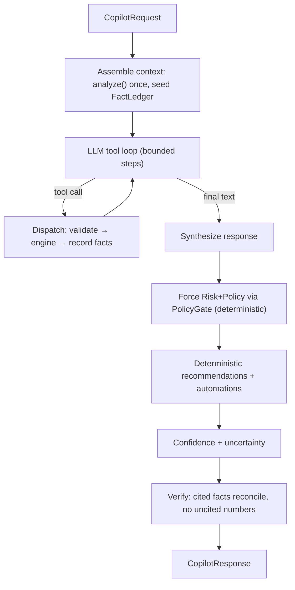

# 20 — AI Financial Copilot (the decision layer)

> Package: [`packages/copilot`](../../packages/copilot) · ADR: [0039](../adr/0039-ai-financial-copilot.md) · Status: **implemented** (27 tests)

Not a chatbot, not an LLM wrapper. The Copilot is a **decision-support system** that helps the user understand, plan, and safely act on their portfolio. It sits _above_ every engine but is _constrained by_ them: the LLM's only jobs are to **pick tools** and **draft prose**; everything that decides anything — recommendations, plan gating, risk/policy surfacing, confidence, fact-verification — is deterministic code. It **proposes**; it never signs and never executes.

## 1. Four structural guardrails (architecture, not prompts)

| Guardrail                    | How it is enforced                                                                                                                                                                                                                                                                                                                                   |
| ---------------------------- | ---------------------------------------------------------------------------------------------------------------------------------------------------------------------------------------------------------------------------------------------------------------------------------------------------------------------------------------------------- |
| **Never execute / sign**     | The tool registry scope union is `read \| analyze \| propose` — there is **no execute tool**, `ProposedPlan.signed` is the literal `false`, and the package has zero dependency on `@intent-wallet/execution`. `assertNoExecuteTools` fails the build if any tool name matches `execute\|sign\|broadcast\|approve\|send\|transfer\|withdraw\|write`. |
| **Never fabricate**          | Every figure is a `CitedFact` recorded in the turn's `FactLedger`; `verifyResponse` (the generalization of Intelligence's `verifyNarrative`) rejects any cited fact that doesn't reconcile, and `hasUncitedNumerics` scans prose for numbers that match no fact.                                                                                     |
| **Never ignore Risk/Policy** | The orchestrator deterministically routes any plan candidate through the `PolicyGate` (which composes Risk _and_ Policy) — this is not an LLM-optional step. A `block` on either side is terminal (`explained_gate`, plan nulled).                                                                                                                   |
| **Never hide uncertainty**   | `confidence` is required and multiplied down by staleness, missing data, low route confidence, and gate status; below the floor (0.55) it forces an `uncertaintyNote`.                                                                                                                                                                               |

## 2. Orchestration loop



Because `analyze()` seeds the ledger, simple questions ("how is my portfolio performing?") are answered with **zero tool round-trips** — the sub-2s path. The whole loop is deterministic with the `ScriptedLlmClient` + injected ids.

## 3. Tool-calling architecture

The LLM is handed a system prompt, the tool schemas, and messages, and returns tool calls or final prose. The **utterance is always a `user` message**, never concatenated into the system prompt (prompt-injection defense); tool outputs are fenced, bigint-safe, and redacted. Tools bind to injected capabilities (the concrete engines are wrapped at `services/api`), so the Copilot is a pure orchestrator that cannot reach anything it wasn't handed:

| Tool                  | Scope   | Backs                             |
| --------------------- | ------- | --------------------------------- |
| `analyze_portfolio`   | analyze | Intelligence `analyze`            |
| `explain_performance` | analyze | Intelligence `analyze` (perf)     |
| `assess_risk`         | analyze | Risk `evaluate(subject)`          |
| `find_route`          | propose | Route Optimizer `optimize`        |
| `plan_intent`         | propose | Intent Engine → **unsigned** plan |

`plan_intent` returns at most an unsigned `PlanProposal`; there is no tool that returns a `ProposedPlan` — only the `PolicyGate` constructs one.

## 4. The Policy gate (integration seam)

The orchestrator constructs a `ProposedPlan` ONLY via `PolicyGate.evaluate`, which calls `PolicyEngine.evaluate(request)` — the single `ExecutionPermission` whose `gate` already composes Risk (no composition drift). Status mapping: `allow && mayProceedToSign → ready`; `block → explained_gate` (plan nulled); anything else → `needs_confirmation`. It **fails closed**: with no policy engine wired, a plan is never `ready`. `permission.planId` binds the permission to one exact plan (replay defense). Downstream, `services/api` invokes `ExecutionEngine.execute` only when `mayProceedToSign` and the device signature are present — never the Copilot.

## 5. Memory (privacy-preserving)

`UserPreferences` is a closed, enumerated shape — enums, symbol-shaped strings, ratios, booleans — so it is **structurally incapable** of holding a private key, mnemonic, or address. `sanitizePreferences` drops anything that doesn't fit; `PreferenceLearner` writes only enumerated values. Nothing here stores a secret, and `redact` scrubs key-shaped hex from context and answers as defense in depth.

## 6. Explanation engine

Every recommendation carries **why + which verified data was used + risks + alternatives + confidence**. A recommendation is a projection of an Intelligence `Insight` and reuses the insight's own `evidence` metrics as its `dataUsed`, so it never authors a new number. Automation suggestions are unsigned intent proposals — proposed, never installed.

## 7. Folder structure

```
packages/copilot/src/
  types.ts        response contract (CopilotRequest/Response, CitedFact, ProposedPlan signed:false)
  capabilities.ts injected engine capabilities (no execute capability exists)
  boundary.ts     CopilotLlmClient + ScriptedLlmClient (utterance-as-user-message)
  ledger.ts       FactLedger — the turn's ground truth
  tools.ts        registry (read/analyze/propose) + dispatcher + no-execute assertion
  gate.ts         PolicyGate — single path to a ready plan, fail-closed
  verify.ts       verifyResponse + hasUncitedNumerics (anti-fabrication)
  confidence.ts   deterministic confidence + uncertainty floor
  context.ts      ContextAssembler (analyze once, seed) + redact
  recommend.ts    RecommendationBuilder + AutomationSuggester
  memory.ts       UserPreferences (secret-incapable) + store + learner
  copilot.ts      orchestrator + facade
  errors.ts / index.ts
```

## 8. Roadmap

1. **Now (done):** orchestrator, tool registry, ledger + verification, PolicyGate, confidence, recommendations, memory — offline-tested with a scripted LLM.
2. **Real LLM:** a Claude adapter behind `CopilotLlmClient` at `services/api`; the same anti-fabrication + no-execute guardrails apply unchanged.
3. **Capability wiring:** wrap the concrete Intelligence / Risk / Router / Intent / Policy engines behind `CopilotCapabilities`.
4. **Multi-modal:** voice, charts, portfolio visualizations, document/screenshot analysis — the response contract already carries structured facts + provenance for a rich client to render; these are additive seams.

## Related

- Constrained by [17 — Security & Risk Engine](17-security-risk-engine.md) + [19 — Policy Engine](19-policy-engine.md); reads [18 — Portfolio Intelligence](18-portfolio-intelligence.md); proposes plans from the [13 — Intent Engine](13-intent-engine.md) that only the [14 — Execution Engine](14-execution-engine.md) + a device signature can run.
