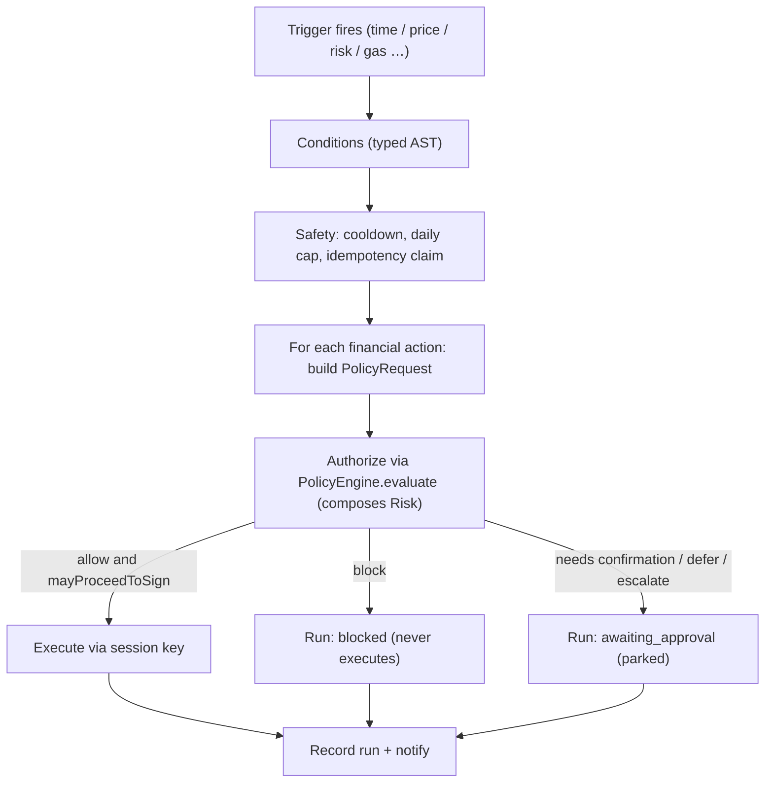

# 21 — Automation & Workflow Engine (the autonomous operating layer)

> Package: [`packages/automation`](../../packages/automation) · ADR: [0040](../adr/0040-automation-workflow-engine.md) · Status: **implemented** (24 tests)

This is what turns the wallet from a reactive app into an autonomous financial operating system — and the single design rule is: **automation is never unrestricted.** Every automated action runs through the exact same gate a manual action does:

```
User Rule → Trigger → Conditions → Policy (composes Risk) → Execution → Notification
```

An automated action can therefore never do anything a manual one couldn't. The engine is a **pure, deterministic orchestrator**: it holds no keys, authorizes nothing itself, and executes only via a pre-authorized, policy-bounded **session key** — so it stays non-custodial.

## 1. Run pipeline



The gate is **delegated, never re-implemented**: the engine calls `PolicyEngine.evaluate` and obeys the one `ExecutionPermission` it returns. `block` is terminal; anything short of a clean `mayProceedToSign` parks the action for the user. This is the guarantee, enforced in code and tested.

## 2. Workflow model — a typed language

A `Workflow` is data (discriminated unions, not a string DSL): a **Trigger**, a **Condition** AST, an ordered list of **Actions**, a **Safety** config, a status, and a version.

- **Triggers:** `schedule` (day/week/month over the injected clock), `price`, `price_move`, `portfolio` (health / drawdown / risk score / net worth), `risk_event`, `volatility`, `chain_event`, `bridge_incident`, `gas`, `ai_recommendation`, `webhook` (future).
- **Conditions:** `and` / `or` / `not`, nested, plus leaves for prices, portfolio metrics, gas, day-of-week and custom variables.
- **Actions:** swap, bridge, transfer, stake, unstake, claim rewards, approve, notify, report, pause/disable workflow, execute intent. Financial actions go through the gate; control actions (notify/report/pause/disable) do not move funds and run directly.

## 3. Compiler — natural language → workflow

`compileTemplate` structures the common rules deterministically (zero LLM cost) — DCA, buy-the-dip / stop-loss, scheduled reward claim, exploit-triggered exit — and an injected `WorkflowLlmClient` is the fallback for everything else. Examples that compile directly: _"Buy ₹5,000 BTC every Monday"_, _"If BTC falls 10%, buy ₹50,000"_, _"Claim staking rewards every Friday"_, _"If a protocol is exploited, move my funds to USDC"_.

## 4. Scheduler & reliability

- **Deterministic time.** `nextFireTime` and `isScheduleDue` are pure over the injected clock (`AutomationEnv`), so the whole engine is time-travel testable — advance the clock, replay.
- **Missed executions.** A scheduled firing is keyed to its scheduled instant and fires **once** for the most recent missed window (a burst of missed windows never replays).
- **Idempotency (no double-execution).** Each firing claims an idempotency key = `hash(workflowId : trigger-instance)`; a duplicate claim is refused, so the same instance executes at most once even under retries or concurrent ticks.
- **Retry / dead-letter.** An executor failure marks the action `failed` (recorded, surfaced) rather than stranding funds; the run history is the source of truth for recovery.

## 5. Safety

Scheduling-level safety lives here — **cooldown** (min gap between runs), **max daily runs**, **execution timeout**, an **emergency kill switch**, and **pause/resume** (workflow status). Authorization safety — amount limits, trusted recipients, biometric thresholds, automation pre-approval — is **not duplicated**; it is the Policy Engine's job and is enforced at the gate. This separation means a user tightens automation limits in one place (their policy) and it applies to manual and automated actions alike.

## 6. Non-custodial execution

Automated execution uses a **pre-authorized, policy-bounded session key** ([ADR-0028](../adr/0028-automation-session-keys.md)): the user grants a scoped, limited key (e.g. "swaps up to $500/day on Ethereum") whose bounds the Policy Engine enforces on every run. The automation engine never holds the master key and never signs — it hands the authorized action + session key to the injected `Executor`.

## 7. DB schema (sketch — lands with the Backend Platform)

```
workflows(id PK, owner_id, title, trigger JSONB, condition JSONB, actions JSONB, safety JSONB, status, version, session_key_id, last_run_at, created_at)
workflow_runs(id PK, workflow_id FK, owner_id, fired_at, status, idempotency_key UNIQUE, actions JSONB, notes JSONB)   -- UNIQUE(idempotency_key) enforces no-double-execution at the DB
workflow_versions(workflow_id, version, snapshot JSONB, created_at, PK(workflow_id,version))
```

## 8. API (services/api, Fastify)

```
POST   /v1/automation/compile      { utterance }                 -> { workflow }        (NL → draft, unsigned)
POST   /v1/automation/workflows    { workflow }                  -> { workflow }        (create)
GET    /v1/automation/workflows                                  -> { workflows[] }
PUT    /v1/automation/workflows/:id/{pause|resume|disable}
POST   /v1/automation/workflows/:id/simulate                     -> { run }             (dry-run through the gate)
GET    /v1/automation/workflows/:id/runs                         -> { runs[] }
GET    /v1/automation/upcoming                                   -> { upcoming[] }
POST   /v1/automation/kill-switch  { on }                        -> { ok }
```

## 9. Folder structure

```
packages/automation/src/
  types.ts       Workflow language: Trigger union, Condition AST, Action union, Safety, WorkflowRun
  env.ts         AutomationEnv (injected now/ids/hash) — the determinism boundary
  conditions.ts  pure evaluateCondition
  triggers.ts    schedule due-check + nextFireTime + event-trigger matching (all UTC, no clock read)
  compiler.ts    NL → Workflow (deterministic templates + injected LlmClient fallback)
  scheduler.ts   upcomingRuns projection for the dashboard
  safety.ts      cooldown + daily-cap checks
  sources.ts     injected PolicyAuthorizer / Executor / Notifier / ContextProvider / stores + fakes
  engine.ts      AutomationEngine: the run pipeline through the gate, kill switch, simulate
  errors.ts / index.ts
```

## 10. Roadmap

1. **Now (done):** typed workflow model + compiler + deterministic scheduler + run pipeline through the gate + safety/kill-switch + simulation, offline/time-travel tested.
2. **Wiring:** real `ContextProvider` (price/portfolio/event feeds), a real `Executor` (session-key signer via Execution), a durable `WorkflowStore`/`RunStore` (Postgres, unique idempotency key), a real `WorkflowLlmClient`.
3. **Backend Platform:** the API + DB above; a durable scheduler (leader-elected tick) for millions of workflows.
4. **Developer Platform (#19):** expose automation via the public SDK/API alongside the other engines.

## Related

- Gated by [19 — Policy Engine](19-policy-engine.md) (which composes [17 — Risk](17-security-risk-engine.md)); executes through the [14 — Execution Engine](14-execution-engine.md) with [ADR-0028 session keys](../adr/0028-automation-session-keys.md); proposed/monitored by the [20 — AI Copilot](20-ai-copilot.md) and [18 — Portfolio Intelligence](18-portfolio-intelligence.md).
