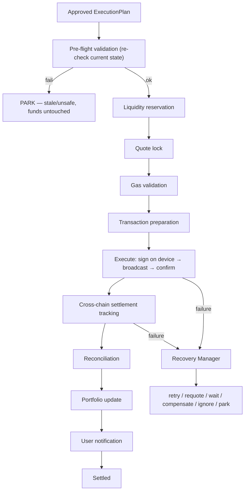

# 22 — Universal Settlement Engine (the Stripe of Web3)

> Package: [`packages/settlement`](../../packages/settlement) · ADR: [0041](../adr/0041-universal-settlement-engine.md) · Status: **implemented** (7 tests)

Wallets send transactions. This platform **orchestrates settlement**. The Settlement Engine hides blockchain complexity entirely — chains, bridges, swaps, gas, confirmations — so a user only thinks in assets. It **guarantees that an approved execution plan eventually reaches its desired financial outcome, or safely reports why it could not.** It coordinates every blockchain interaction; it never owns funds and never holds keys.

It is also the **mandatory front door to execution**: pre-flight re-validation, quote lock and gas validation are non-skippable pipeline stages, which is what closes the "stale-plan authorization" gap the architecture review flagged — an approved-but-stale plan can never reach broadcast.

## 1. The settlement pipeline



Every stage runs once, in order, and is recorded. A failed pre-flight parks the settlement **before any transaction is prepared or broadcast**.

## 2. Guarantees (all tested)

| Guarantee                | Mechanism                                                                                                                                                                                    |
| ------------------------ | -------------------------------------------------------------------------------------------------------------------------------------------------------------------------------------------- |
| **Mandatory pre-flight** | the first stage re-validates the plan against current state (balance, quote TTL, risk, gas, policy); a failure PARKS before execution — proven: the executor is never called on a stale plan |
| **Deterministic**        | time, ids, and the settlement-id hash are injected (`SettlementEnv`) — no clock/RNG reached                                                                                                  |
| **Idempotent**           | the settlement id is derived from the plan id; a claimed id is never re-executed — re-settling the same plan runs the executor exactly once                                                  |
| **Resumable**            | state is saved after every stage; `resume` continues from the remaining stages and never re-runs a completed one                                                                             |
| **Recoverable**          | a stage failure is classified → retry / requote / wait / compensate / ignore / park — never stranding funds                                                                                  |
| **Observable**           | every transition is appended to a replayable ledger (correlation + settlement + execution + intent + tx ids)                                                                                 |
| **Non-custodial**        | signing/broadcast happen inside the injected executor (the Execution engine), on device — settlement holds no keys                                                                           |

## 3. Settlement types supported

Single-chain, cross-chain (bridge legs tracked to the destination), multi-step, sequential and parallel legs, partial-settlement recovery (compensation), and atomic settlement where the underlying venue supports it (otherwise sequential with compensation).

## 4. Recovery classification

The Recovery Manager is a deterministic mapping from a failure class to an action:

| Class                                            | Action         | Rationale                                             |
| ------------------------------------------------ | -------------- | ----------------------------------------------------- |
| `rpc_failure`, `provider_outage`                 | **retry**      | transient; the same step is idempotent-safe to re-run |
| `bridge_delay`                                   | **wait**       | the bridge is still settling; park and resume later   |
| `bridge_failure`, `partial_execution`            | **compensate** | reverse the completed legs                            |
| `quote_expiry`, `gas_spike`                      | **requote**    | the amounts are stale; park and re-plan upstream      |
| `chain_halt`, `unknown`                          | **park**       | stop safely, funds untouched                          |
| `duplicate_execution`, `unexpected_confirmation` | **ignore**     | idempotency — already handled on-chain                |

## 5. Correlation & the ledger

Every settlement carries a `settlementId`, `correlationId`, `intentId`, and (after execute) an `executionId`, plus the on-chain `txids`, `bridgeIds`, and `providerIds`. The ledger is append-only and `replay(ledger)` reconstructs the full life in order — the substrate for the dashboards (settlement success, completion time, latency, recovery rate, compensation rate, bridge health, execution accuracy).

## 6. DB schema (sketch — lands with the Backend Platform)

```
settlements(id PK, correlation_id, plan_id, intent_id, execution_id, status, stage, txids JSONB, bridge_ids JSONB, provider_ids JSONB, reason, created_at, updated_at)
settlement_ledger(seq BIGSERIAL, settlement_id FK, correlation_id, stage, event, detail, at, PK(settlement_id, seq))   -- append-only
```

## 7. API (services/api, Fastify)

```
POST /v1/settlements            { plan }        -> { settlement }    (settle an approved plan; idempotent on plan id)
POST /v1/settlements/:id/resume { plan }        -> { settlement }
GET  /v1/settlements/:id                        -> { settlement }
GET  /v1/settlements/:id/history                -> { ledger[] }
```

## 8. Folder structure

```
packages/settlement/src/
  types.ts       pipeline stages, Settlement, LedgerEntry, RecoveryClass/Action, StageResult
  env.ts         SettlementEnv (injected now/ids/hash) + deterministic settlement-id derivation
  stages.ts      pipeline order helpers (remainingStages for resume)
  recovery.ts    classifyRecovery — deterministic failure-class → action
  ledger.ts      append-only ledger entry builder + replay
  sources.ts     injected capabilities (preflight/executor/…/store) + in-memory fakes
  coordinator.ts the state machine: pre-flight → … → settled, with idempotency/recovery/resume
  engine.ts      SettlementEngine facade + createSettlementEngine
  errors.ts / index.ts
```

## 9. Roadmap

1. **Now (done):** the deterministic, idempotent, resumable coordinator + mandatory pre-flight + recovery classification + ledger, offline-tested.
2. **Wiring:** real capabilities — `preflight` (re-scan risk + re-check balance/allowance + quote-TTL + re-run policy), `executor` (the Execution engine + session-key signer), `quoteLock`/`gas`/`liquidity` (the Router + Provider framework), `crossChain` (bridge trackers), `reconcile` (chain adapters), `portfolio` (the Portfolio engine).
3. **Backend Platform:** the API + DB above; a durable settlement worker.
4. **Universal Address Alias** (proposed): `@waquar` / `waquar.wallet` → resolve alias → destination chain → asset compatibility → auto swap+bridge → settle. The alias resolver extends identity's recipient resolution; the cross-asset path is exactly what this engine settles.

## Related

- The mandatory front door to the [14 — Execution Engine](14-execution-engine.md); consumes an [13 — Intent Engine](13-intent-engine.md) `ExecutionPlan`; its pre-flight re-runs [17 — Risk](17-security-risk-engine.md) + [19 — Policy](19-policy-engine.md); routes via [16 — Route Optimizer](16-route-optimizer.md) + [15 — Provider framework](15-provider-framework.md); the [18 — Portfolio Intelligence](18-portfolio-intelligence.md) reflects the outcome.
