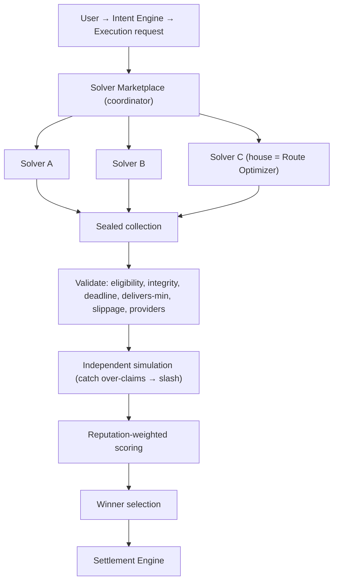

# 23 — Decentralized Solver Network (the internet of execution)

> Package: [`packages/solver`](../../packages/solver) · ADR: [0042](../adr/0042-decentralized-solver-network.md) · Status: **implemented** (9 tests)

Instead of the platform choosing one route internally, **independent solvers compete** to satisfy an execution request — the intents-based execution model (UniswapX / Across intents / Anoma), generalized. The platform is the **coordinator**: it collects proposals, **independently verifies** each (never trusts a solver's claims), reputation-weights, and selects the best valid one. The winner's plan goes to the [Settlement Engine](22-settlement-engine.md).

This is the same platform doctrine applied to execution: **solvers PROPOSE; the platform VERIFIES; the device signature DISPOSES.** A solver can't lie its way to selection because its claims are checked, not believed — and it never holds keys, never signs, and never bypasses Policy or Security. The Route Optimizer becomes one solver among many (the "house solver": a baseline that always competes).

## 1. Architecture



Solvers compete on **execution cost, completion time, reliability, liquidity quality, and historical success rate.**

## 2. Proposal schema

A `SolverProposal` carries a guaranteed `outMinBase` (the solver's binding commitment), `feeMicros`, `slippageBps`, `etaSeconds`, the `providers` used, a `confidence`, a `fallback` plan, the route `legs`, and a content `hash`. Amounts cross the network as bigint-safe decimal strings.

## 3. Verification — claims are checked, not trusted (the security core)

Every proposal passes a gauntlet before it can win:

| Check                                                         | Defends against                                                                                                    |
| ------------------------------------------------------------- | ------------------------------------------------------------------------------------------------------------------ |
| registered + not banned + **staked ≥ min**                    | Sybil, spam (an attacker needs real capital per identity)                                                          |
| **content hash matches** (recomputed by the platform)         | proposal tampering in transit                                                                                      |
| submitted before the **deadline** (sealed window)             | front-running (no solver sees another's proposal before evaluation)                                                |
| **delivers ≥ required minimum output**                        | fake proposals that don't actually satisfy the request                                                             |
| slippage ≤ cap · providers ∈ allow-list, ∉ deny-list          | malicious routing                                                                                                  |
| **independent simulation**: claimed output ≤ simulated output | over-claims — a solver promising more than reality delivers is rejected AND **slashed for a malicious over-claim** |

The independent simulation is the key: the platform re-computes what the proposed route would actually deliver and compares it to the claim. Lying is not just unrewarded — it is penalized.

## 4. Selection

Among the valid survivors, each is scored on a min-max-normalized weighted blend — **cost 0.35, time 0.20, slippage 0.15, confidence 0.10, reputation 0.20** — and the highest wins (ties → lower fee, then id). Deterministic: the same proposal set in any order yields the same winner. The winner still clears Risk + Policy + a device signature via settlement.

## 5. Reputation

A solver's standing is earned from history: success rate is the base; a **security incident dominates** (heavy multiplicative penalty); invalid proposals and latency shave it down; a new solver gets a neutral 0.5 prior. Reputation feeds selection as a weighted factor, so proven solvers win close calls.

## 6. Incentives — staking & slashing

- **Reward:** a winning solver earns a share (default 10%) of the cost SAVINGS it delivered vs a baseline — aligning solver profit with user benefit.
- **Slash:** misbehavior burns a fraction of stake, scaled to severity — a post-win timeout 5%, an invalid proposal 10%, a malicious over-claim caught by simulation 50%. Stake at zero → auto-ban.

## 7. Database schema (sketch — lands with the Backend Platform)

```
solvers(id PK, stake_micros, banned, registered_at)
solver_reputation(solver_id PK, wins, losses, timeouts, invalid_proposals, security_incidents, total_latency_ms, samples, cost_savings_micros)
solve_requests(id PK, principal_id, from_asset, to_asset, amount_in_base, min_out_base, deadline, created_at)
proposals(request_id, solver_id, out_min_base, fee_micros, slippage_bps, eta_seconds, providers JSONB, confidence, hash, submitted_at, valid, score, PK(request_id, solver_id))
slashes(id, solver_id, amount_micros, reason, at)
```

## 8. API (services/api, Fastify)

```
POST /v1/solvers                 { info }                 -> { solver }      (register, staked)
POST /v1/solve                   { request }              -> { outcome }     (run a competitive solve)
POST /v1/solve/:requestId/settled { solverId, outcome }   -> { ok }          (post-settlement reputation feedback)
GET  /v1/solvers/:id/reputation                           -> { score }
```

## 9. Folder structure

```
packages/solver/src/
  types.ts       SolveRequest, SolverProposal, SolverInfo, ReputationRecord, evaluation + incentive types
  env.ts         SolverEnv (injected now/ids/hash) — deterministic + proposal integrity hash
  proposal.ts    signProposal + validateProposal (the anti-fake gauntlet)
  scoring.ts     reputation-weighted min-max scoring + deterministic winner selection
  reputation.ts  ReputationEngine (earned standing; security incidents dominate)
  incentives.ts  computeReward (share of savings) + computeSlash (severity-scaled)
  registry.ts    SolverRegistry (stake / ban / slash)
  sources.ts     Solver interface + injected Simulator (independent verification) + ScriptedSolver
  marketplace.ts SolverMarketplace: sealed collect → verify → score → select
  engine.ts      SolverNetwork facade + createSolverNetwork
  errors.ts / index.ts
```

## 10. Roadmap

1. **Now (done):** the coordinator, proposal verification (structural + simulation), reputation-weighted selection, staking/slashing, offline-tested.
2. **The house solver:** wrap the [Route Optimizer](16-route-optimizer.md) as a baseline `Solver`, so there is always a valid proposal.
3. **Wiring:** a real `Simulator` (re-simulate the proposed route via the chain adapters / Provider framework), a durable registry + reputation store, a real submission-window transport (sealed / commit-reveal).
4. **Protocol:** on-chain staking + slashing contracts; solver SDK; the network as a standalone product line (the "Network" business line).

## Related

- Feeds the [22 — Settlement Engine](22-settlement-engine.md); generalizes the [16 — Route Optimizer](16-route-optimizer.md) (now the house solver); its winner still clears [17 — Risk](17-security-risk-engine.md) + [19 — Policy](19-policy-engine.md) + a device signature.
