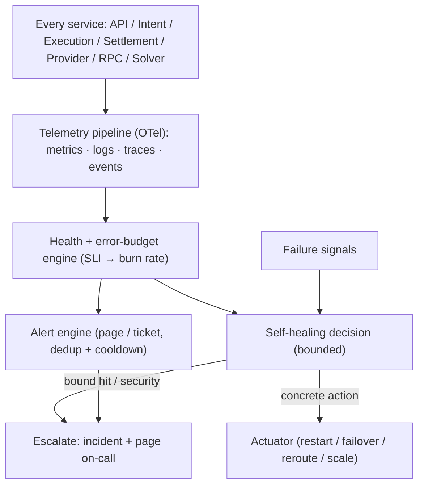

# 24 — Global Observability, SRE & Self-Healing Platform

> Package: [`packages/reliability`](../../packages/reliability) · ADR: [0043](../adr/0043-reliability-and-self-healing.md) · Status: **core implemented** (10 tests) · telemetry pipeline: [ADR-0018](../adr/0018-observability.md)

Users never see this, but at 100M+ users it is one of the most critical systems: every request, intent, execution, settlement, provider, RPC and solver must be observable; failures must be detected automatically; and recovery must happen automatically wherever it is safe to do so. This module is split into two parts: the **telemetry pipeline** (instrumentation + infra, locked in ADR-0018) and the **SRE brain** — the deterministic engine (`packages/reliability`) that turns telemetry into error budgets, alerts, and **bounded self-healing decisions**.

## 1. Architecture



The SRE brain **decides**; an injected **actuator acts**. The engine has no power to restart, scale, or drain anything itself — a bug can propose a bad action but cannot perform one, and it can never loop.

## 2. Telemetry (instrumentation + infra — ADR-0018)

Distributed tracing (OpenTelemetry → Tempo), metrics (Prometheus), structured logging with correlation ids (Loki), and events. Every hop carries a trace + correlation id (the [Settlement Engine](22-settlement-engine.md) ledger and [Solver Network](23-solver-network.md) already emit correlation ids). Metric families: business, execution, blockchain, provider, solver, and security. This is instrumentation woven through the services + collectors in infra — not a domain engine, so it is configured and deployed, not coded as a package.

## 3. Error budgets & burn rate (`slo.ts`)

For an SLO objective (e.g. 99.99%), the allowed failure rate is `1 − objective`. The **burn rate** is `failureRate / allowedRate` — how fast the budget is being spent (14.4× ≈ a 30-day budget gone in ~2 days). Burn rate is the signal alerting and self-healing key off; `budgetRemaining` is what's left.

## 4. Health (`health.ts`)

`computeHealth` folds burn rate + p99 latency + saturation into a state that only ever **worsens** across signals — `healthy` · `degraded` · `critical`, and `unknown` on no traffic (we never claim healthy on no data).

## 5. Alerting (`alerts.ts`) + catalog

A pure `(prevState, healths, now) → (alerts, state)` with dedup + cooldown. The catalog:

| Code               | Severity | Trigger           |
| ------------------ | -------- | ----------------- |
| `FAST_BUDGET_BURN` | page     | burn rate ≥ 14.4× |
| `SLOW_BUDGET_BURN` | ticket   | burn rate ≥ 3×    |
| `SERVICE_CRITICAL` | page     | health = critical |
| `HIGH_SATURATION`  | ticket   | saturation ≥ 0.85 |

(High latency, execution/settlement failures, RPC outage, bridge degradation, provider failure, queue congestion, DB overload, memory/CPU, and security incidents all map to these codes + `FailureSignal`s.)

## 6. Self-healing (`healing.ts`) — bounded by safety

`decideRecovery(signal, state, now, config)` maps a failure to a remediation, but **only within bounds that stop it from doing more harm than the failure**:

| Situation                                  | Decision                                                                           |
| ------------------------------------------ | ---------------------------------------------------------------------------------- |
| change **freeze** active                   | `none` — no automatic recovery                                                     |
| **security incident**                      | `circuit_break` **AND escalate** — contained, never silently auto-healed           |
| ≥ `maxAutoRecoveries` consecutive failures | `escalate` — stop trying, get a human                                              |
| recovery **rate limit** hit                | `escalate` — never restart-loop / flap                                             |
| **cooldown** active                        | `none` — wait                                                                      |
| otherwise                                  | the mapped action (failover, reroute, restart, retry, scale, circuit-break, drain) |

The `SelfHealingController.tick` runs SLIs → health → alerts → decisions → dispatch, tracking healing state across ticks (rate limit, cooldown, consecutive failures) so it converges on escalation instead of looping.

## 7. SRE artifacts

- **SLIs/SLOs/Error budgets** — the types + math above; per-service objectives.
- **Runbooks as data** (`runbooks.ts`) — each alert code → ordered diagnostics + remediation + the auto-action, queryable and renderable next to the alert.
- **Incident response** — an escalated decision opens an `Incident` (correlation-linked) and pages on-call; postmortems reference the incident + the settlement/solver ledgers.
- **Capacity & DR** — capacity assumptions in [10-cost-and-scale.md](10-cost-and-scale.md); multi-region + active-active in [05-infrastructure.md](05-infrastructure.md).

## 8. Performance targets

99.99% availability · sub-second monitoring latency · millions of events/min · global multi-region. The SRE brain is pure CPU over injected telemetry (stateless per tick), so it scales horizontally; the load lives in the collectors (Prometheus/Tempo/Loki), which are horizontally sharded infra.

## 9. Folder structure

```
packages/reliability/src/
  types.ts    Sli/Slo/ErrorBudget/ServiceHealth, Alert, FailureKind, RecoveryAction/Decision, Incident, Runbook
  env.ts      ReliabilityEnv (injected now/ids) — deterministic
  slo.ts      error-budget + burn-rate math
  health.ts   RED + saturation → HealthState (worsen-only)
  alerts.ts   burn-rate + threshold alerts, dedup + cooldown
  healing.ts  decideRecovery — the bounded self-healing brain
  runbooks.ts alert-code → runbook data
  sources.ts  injected Actuator / Pager / IncidentSink
  engine.ts   SelfHealingController.tick
  errors.ts / index.ts
```

## 10. Roadmap

1. **Now (done):** error-budget/burn-rate, health, alerts, bounded self-healing decisions + the controller, offline-tested.
2. **Telemetry wiring:** OTel instrumentation across services + collectors (ADR-0018); feed real SLIs + failure signals into the controller.
3. **Actuator:** wire real actions (k8s restart/scale via KEDA/Karpenter, provider failover via the Provider framework, reroute via the router / solver network).
4. **Multi-window burn-rate alerts** (short + long window) to remove flapping; capacity forecasting; DR drills.

## Related

- Consumes telemetry from every engine; its actuator drives the [15 — Provider framework](15-provider-framework.md) failover + the [16 — Route Optimizer](16-route-optimizer.md)/[23 — Solver Network](23-solver-network.md) reroute; escalations reference the [22 — Settlement](22-settlement-engine.md) ledger. Infra: [05-infrastructure.md](05-infrastructure.md), [ADR-0018](../adr/0018-observability.md), [ADR-0021](../adr/0021-kubernetes-strategy.md).
