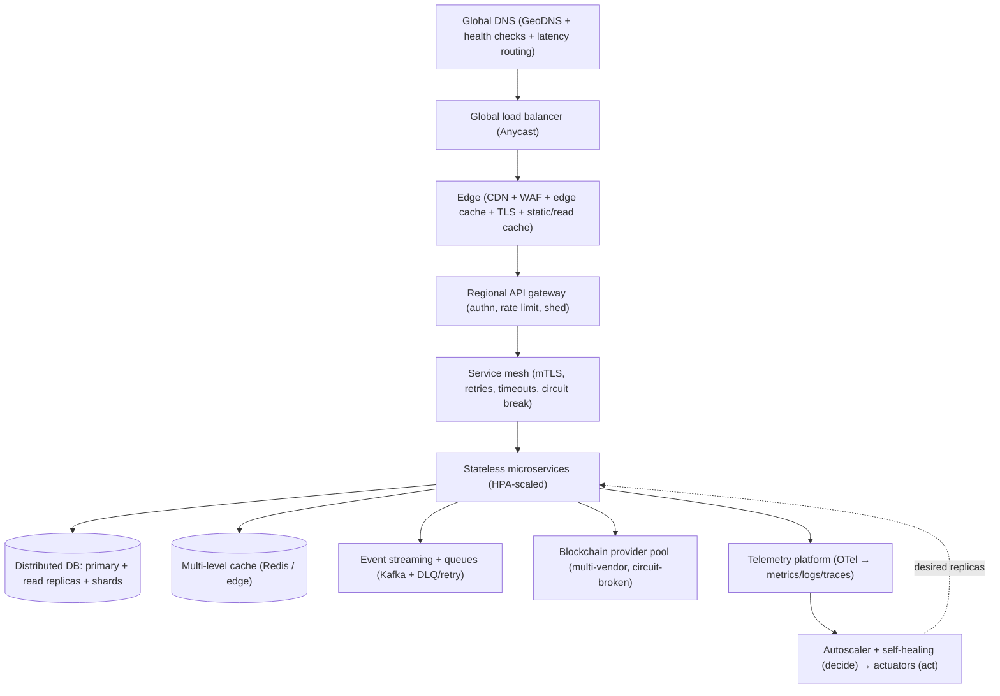
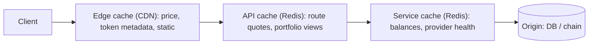
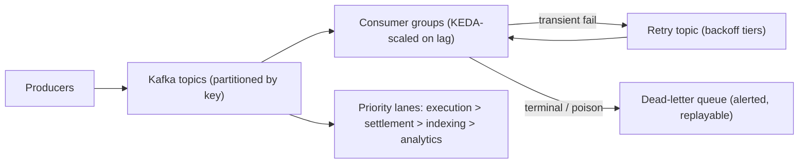

# 25 — Global Scalability Platform (100M+ users)

> Package: [`packages/scale`](../../packages/scale) · ADR: [0044](../adr/0044-global-scalability.md) · Status: **decision core implemented** (27 tests) · infra: [05-infrastructure.md](05-infrastructure.md), [10-cost-and-scale.md](10-cost-and-scale.md)

The features are built. This module makes them survive success — carrying the platform from 1k to 100M+ users, billions of API calls/month and millions of chain txns, **without an architectural rewrite**. Like the [Observability platform](24-observability-sre.md), it splits in two:

- **Infrastructure** (this doc §§2–13, deployed not coded): global DNS, load balancers, regional Kubernetes, service mesh, distributed data, queues, edge — configured in IaC, locked in [ADR-0044](../adr/0044-global-scalability.md).
- **The decision core** (`packages/scale`, §§4,6,7,8): the deterministic engines that turn scale from a hope into a controlled, bounded behaviour — an **autoscaler**, a **resilience toolkit**, **regional routing**, and **cache invalidation**.

The through-line is the platform's doctrine applied to infrastructure: **it decides; an injected actuator acts.** The autoscaler proposes a replica count; it never scales. Every decision is _bounded_, so a bug can propose a bad action but cannot cause a scale-storm or a brown-out.

## 1. Global request path

Every tier is horizontal, regional-isolated, and has a stated degradation mode. There is no shared component whose loss stops the world (no single-writer, no sticky sessions, no in-memory global state).

## 2. Multi-region

| Concern          | Design                                                                                                                                      |
| ---------------- | ------------------------------------------------------------------------------------------------------------------------------------------- |
| Topology         | 3+ regions (e.g. us-east, eu-west, ap-south), each a full, independent stack.                                                               |
| Read path        | **Active-active** — GeoDNS routes users to the nearest healthy region; reads served locally (< 100 ms).                                     |
| Write/execution  | **Regionally owned** — a user's writes are pinned to their home region (data residency + strong consistency), other regions read a replica. |
| Failover         | Region down → GeoDNS + `route()` (§7) shift traffic to the next healthy region; home-region write ownership fails over with the data.       |
| Data replication | Async cross-region replication for reads; execution state is event-sourced and replayable (see [04-flows.md](04-flows.md)).                 |
| Isolation        | A region is a blast-radius boundary — one region's overload, bad deploy, or provider outage never crosses.                                  |
| DR               | See §11.                                                                                                                                    |

Target: **< 100 ms** regional API latency, regional isolation, **zero single point of failure**.

## 3. What must be strongly vs eventually consistent

The most important scaling decision is choosing consistency per-domain, because strong consistency is what doesn't scale for free.

| Domain                                               | Consistency  | Why                                                                                          |
| ---------------------------------------------------- | ------------ | -------------------------------------------------------------------------------------------- |
| Execution/settlement state, idempotency keys, nonces | **Strong**   | Money movement — a stale read can double-spend. Single-writer per key, in the owning region. |
| User → account/address mapping, policy rules         | **Strong**   | Authorization inputs must not be stale.                                                      |
| Portfolio views, balances, prices, analytics         | **Eventual** | Read-heavy, tolerant of seconds of staleness; served from cache/replicas.                    |
| Reputation, metrics, audit projections               | **Eventual** | Append-mostly, reconstructed from the event log.                                             |

Rule of thumb: **money and authorization are strong and small; everything a user looks at is eventual and huge.** The write path stays serialized and auditable; the read path (≈100:1) scales out on caches and replicas.

## 4. Autoscaling (`autoscaler.ts` — code)

`decideScale(input, policy, state, now) → ScalingDecision` turns a window of demand signals into a **desired replica count**, bounded three ways:

1. **Multi-signal, max-wins** — a desired count per signal (`ceil(current × value/target)`, Kubernetes-HPA style) across CPU, memory, queue depth, p95 latency, RPS, in-flight, and chain congestion; the engine takes the **max** (scale to the most-stressed dimension — relieving CPU doesn't help a starving queue).
2. **Clamp + rate-limited step** — clamp to `[minReplicas, maxReplicas]` (floor keeps the service up, ceiling caps cost/blast-radius), then limit the step (up fast, down slow: default ≤ +100% / ≤ −25% per tick). Never 2→200 in one tick.
3. **Anti-flap** — never scale **down** within the stabilization window after a scale-**up**; a cooldown blocks two actions in quick succession. A malformed signal (target ≤ 0, NaN) has _no opinion_ and can't drive scaling.

The `ScalingController` (`engine.ts`) reconciles this against reality and dispatches to an injected `ScaleActuator` (the HPA / cluster API) — and only records the action (starting the cooldown) when the actuator **confirms**, so a stuck actuator is retried next tick rather than silently locking scaling out.

Signals → HPA/KEDA in production:

| Signal           | Source                     | Scales                          |
| ---------------- | -------------------------- | ------------------------------- |
| CPU / memory     | pod metrics                | any stateless service           |
| queue depth      | Kafka lag / KEDA           | consumers (execution, indexers) |
| p95 latency, RPS | service mesh / RED metrics | API, intent, router             |
| chain congestion | mempool / gas oracle       | execution + settlement workers  |

## 5. Resilience (`ratelimit.ts`, `bulkhead.ts`, `breaker.ts`, `retry.ts`, `shed.ts` — code)

The primitives every service embeds so load and partial failure degrade instead of cascade:

| Primitive           | Guarantee                                                                                                                                                                                                                  |
| ------------------- | -------------------------------------------------------------------------------------------------------------------------------------------------------------------------------------------------------------------------- |
| **Rate limit**      | Token bucket: burst ≤ capacity, exact refill, deterministic; a backwards clock never mints tokens.                                                                                                                         |
| **Bulkhead**        | Concurrency cap + bounded queue; a full bulkhead **rejects** — the backpressure signal, not an unbounded wait.                                                                                                             |
| **Circuit breaker** | Generic closed/open/half-open (one probe); fails fast for a cooldown instead of hammering a sick dependency.                                                                                                               |
| **Retry**           | Capped exponential backoff + jitter; **never** retries a terminal error (rejected signature, invalid request) and **never** past the request deadline.                                                                     |
| **Load shed**       | Priority admission — under load, shed **bottom-up** (bulk → low → normal → high); `critical` (in-flight settlement, security) is protected until the system is effectively down. Monotone even under a mis-ordered policy. |

Timeouts + backpressure are the deadline arithmetic (`deadlineFrom`/`remainingBudgetMs`) plus the bulkhead reject path. (The provider pool keeps its own tuned breaker fused with latency scoring — see [15-provider-framework.md](15-provider-framework.md); `breaker.ts` is the generic reusable one for everything else.)

## 6. Multi-level caching (`cache.ts` — code + edge/Redis infra)

| Cache            | Contents                | TTL        | Invalidation                           |
| ---------------- | ----------------------- | ---------- | -------------------------------------- |
| Edge             | price, token metadata   | 15 s / 1 d | TTL + push on price tick / list update |
| API / portfolio  | portfolio views, routes | 10–20 s    | **cascade** on balance/price write     |
| Price            | quotes                  | 5–15 s     | TTL + oracle push                      |
| Metadata         | token/contract info     | hours–days | version bump                           |
| Route / provider | route quotes, health    | 5–10 s     | TTL + circuit events                   |

The correctness core is `planInvalidation(event, namespaces)`: namespaces declare what they `dependsOn`, and a write **cascades** to every namespace that transitively depends on it (a `balance` write invalidates the `portfolio` view and anything reading it). It's cycle-safe (a mis-declared dependency loop yields a finite plan) and returns a plan an injected invalidator applies. `staleWhileRevalidate` serves a stale value while refreshing — degrade, never brick.

## 7. Regional routing (`region.ts` — code)

`route(regions, mode, requestedRegion?)` is the deterministic decision behind §2:

- **active_active** → normalized traffic split by capacity weight, discounted by saturation (a hot region gets less), across **healthy regions only**, with a deterministic failover order.
- **active_passive** → highest-priority healthy region; if the requested/primary region is down, fail over to the next healthy standby and flag it.
- **every region unhealthy** → `primary: null` (never route to a region we know is dead — the caller fails safe).

Shuffle-invariant: input order never changes the outcome.

## 8. Queues & streaming (Kafka + `bulkhead`/`shed` — infra + code)

- **Event streaming** — Kafka is the source of truth for money movement (event-sourced; see [03-data.md](03-data.md)); partitioned by user/account key for ordering + parallelism.
- **Retry queues** — transient failures go to backoff-tiered retry topics (the retry policy of §5); **terminal** failures go straight to the DLQ (never retried).
- **DLQ** — poison messages are parked, alerted (§ reliability), and replayable — never silently dropped.
- **Priority** — execution/settlement lanes drain before analytics; under pressure the shedder drops bulk lanes first.
- **Backpressure** — consumer lag drives KEDA scale-out; if lag still grows, the shedder rejects new low-priority producers.

Supports **millions of events/minute** by partition count × consumer concurrency; both scale horizontally.

## 9. Edge vs region vs global control plane

| Runs at    | What                                                                                                                                                     |
| ---------- | -------------------------------------------------------------------------------------------------------------------------------------------------------- |
| **Edge**   | TLS, WAF, GeoDNS, static + read-through cache (price/metadata), coarse rate limit.                                                                       |
| **Region** | All stateful + compute: gateways, services, DBs, caches, queues, per-region autoscaling + healing.                                                       |
| **Global** | Control plane only: config/feature flags, schema/policy distribution, threat-intel feeds, cross-region SLO rollups, DNS health. **No hot-path traffic.** |

Keep the global plane thin — it's the one thing that isn't regionally isolated, so it carries no request-path load.

## 10. Auto-scaling rules (summary)

| Trigger               | Policy                                                              |
| --------------------- | ------------------------------------------------------------------- |
| CPU / memory > target | HPA scales pods; `maxScaleUpRatio` caps the step.                   |
| Queue depth / lag     | KEDA scales consumers on Kafka lag.                                 |
| API p95 > budget      | scale API/intent tier; also feeds the alert engine.                 |
| Txn volume spike      | scale execution + settlement workers ahead of the queue.            |
| Chain congestion      | scale settlement workers (more retries in flight) — bounded by max. |
| Cluster capacity      | cluster-autoscaler adds nodes (spot + on-demand mix, §12).          |

All bounded by `[min, max]`, stabilization, and cooldown — no storm, no flap.

## 11. Disaster recovery

| Level            | Strategy                                                                                           |
| ---------------- | -------------------------------------------------------------------------------------------------- |
| Pod / node       | K8s reschedules; HPA + cluster-autoscaler backfill.                                                |
| AZ               | Multi-AZ per region; quorum survives one AZ loss.                                                  |
| Region           | Active-active read failover (GeoDNS + `route()`); write ownership fails over with data.            |
| Data             | Continuous backups + **point-in-time recovery**; event log is the replayable source of truth.      |
| Backup integrity | Client-encrypted, opaque ciphertext (non-custodial — we never hold keys); periodic restore drills. |
| RTO / RPO        | Read path RTO minutes / RPO ~0 (replicated); execution RPO 0 (event-sourced, idempotent replay).   |

Because keys never leave the device, the worst-case server loss is a **liveness** event, never a loss-of-funds event — the strongest DR property the platform has.

## 12. Cost optimization

- **Intelligent scaling** — scale on real demand signals (§4), scale **down** slowly to avoid churn, scale to zero only for non-critical batch workers.
- **Spot instances** — stateless + interruptible workers (indexers, analytics, batch) on spot; API/execution on on-demand/reserved. Bulkheads + retries absorb spot reclaims.
- **Storage lifecycle** — hot (Redis/SSD) → warm (Postgres) → cold (object storage) → archive, by age; TTL'd caches.
- **Efficient RPC** — the [provider framework](15-provider-framework.md) batches, caches, and routes to the cheapest healthy vendor; circuit breakers stop paying for failing calls.
- **Read-path caching** — the biggest lever: a 95% cache hit rate on the 100:1 read path removes ~95% of origin cost.

## 13. Capacity, performance & load testing

**Capacity (order of magnitude):** 100M registered → ~10M DAU → ~1M concurrent at peak. Read path ≈ 100 × write path. Size gateways/services for peak-concurrent × per-user RPS with 40% headroom; partition Kafka and shard the DB by account key so both grow linearly. Full math in [10-cost-and-scale.md](10-cost-and-scale.md).

**Performance targets (p95):**

| Path               | Target   |
| ------------------ | -------- |
| API                | < 200 ms |
| Intent planning    | < 500 ms |
| Route optimization | < 300 ms |
| Portfolio load     | < 2 s    |
| Availability       | 99.99%   |

**Load-testing plan:** ramp profiles for 1M concurrent, 10M DAU, 100M registered, plus **peak events** (market crash → execution + portfolio spike; airdrop → claim storm). Each run asserts the p95 targets, that autoscaling reaches steady state without flapping, that the shedder protects `critical`, and that DLQ depth stays bounded. Chaos drills: kill an AZ, blackhole a region, fail a top RPC vendor — assert graceful degradation, not outage.

## 14. Implementation roadmap

1. **Stage A (now):** modular monolith, single region, the `scale` decision core wired into the gateway (rate limit + shed) and a basic HPA. Bounds + resilience from day one.
2. **Stage B:** extract high-load services, KEDA on Kafka lag, multi-AZ, read replicas + the cache cascade.
3. **Stage C:** second region (active-active reads), GeoDNS + `route()`, cross-region replication, DR drills.
4. **Stage D:** N regions, spot fleets, storage lifecycle, full load/chaos program, cost tuning.

Each stage is additive — the boundaries (regional isolation, event-sourcing, bounded autoscaling, injected actuators) are drawn now so no stage requires a rewrite. That is the whole point of this module.
