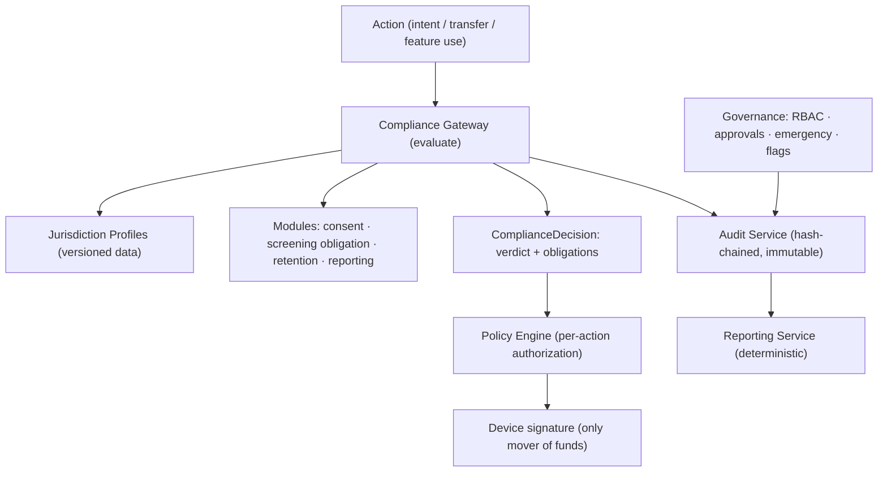

# 26 — Compliance & Governance Platform

> Package: [`packages/compliance`](../../packages/compliance) · ADR: [0045](../adr/0045-compliance-and-governance.md) · Status: **core implemented** (37 tests) · related: [Policy Engine (19)](19-policy-engine.md), [Security & Risk (17)](17-security-risk-engine.md)

A global wallet meets many regulators, and every jurisdiction's rules differ and change. Hardcoding them into the wallet would make the core un-shippable and un-maintainable. So compliance is a **modular, policy-driven layer kept OUTSIDE core wallet logic**: jurisdiction rules are **versioned data**, the engine is generic over them, and a new regulatory environment is a new _profile_, not a code change. The wallet **stays non-custodial** throughout — this layer can say "no" before signing, but it never holds keys or moves funds.

## 1. Where it sits (and what it is NOT)



Boundaries — three engines, three distinct jobs, no duplication:

| Engine                                  | Question it answers                                                                                       |
| --------------------------------------- | --------------------------------------------------------------------------------------------------------- |
| [Risk (17)](17-security-risk-engine.md) | Is this token/address/approval dangerous? (threat intel, screening)                                       |
| [Policy (19)](19-policy-engine.md)      | Is THIS action permitted for THIS user right now? (spend limits, allowlists)                              |
| **Compliance (this)**                   | What does the **jurisdiction** require — feature availability, consent, reporting, retention, disclosure? |

Compliance **provides** the jurisdictional config (risk threshold, high-value threshold, screening obligation) that Risk and Policy **enforce**, and screening is performed by Risk and passed _in_ — compliance decides the obligation, not the hit.

## 2. Design invariants (binding)

1. **No hardcoded country rules.** Every jurisdiction-specific value lives in a `JurisdictionProfile` loaded as data. `id`s are opaque (`eu`, `sg`, `us-ny`, `default`, `enterprise-acme`).
2. **Fail closed.** No active profile for a jurisdiction ⇒ `block`. Never let an action through under an unknown posture.
3. **Most-restrictive wins.** When several gates fire, the strongest verdict is returned (`block` > `require_consent` > `require_disclosure` > `allow`), and every obligation is still recorded.
4. **Deterministic + reproducible.** Time, ids and the audit hash are injected; the same inputs always yield the same verdict and the same audit hash — what an auditor needs.
5. **Non-custodial preserved.** The platform gates and records; it cannot sign.
6. **Every governance action is authenticated, authorized, auditable, versioned.**

## 3. Modules (`packages/compliance`)

| Module     | File            | Responsibility                                                                                     |
| ---------- | --------------- | -------------------------------------------------------------------------------------------------- |
| Profiles   | `profiles.ts`   | Versioned `JurisdictionProfile` registry: monotonic versions, one active per id, validated.        |
| Gateway    | `gateway.ts`    | The compliance decision (fail-closed, most-restrictive) → verdict + obligations.                   |
| Consent    | `consent.ts`    | Required-vs-granted-vs-expired evaluation; a lapsed consent counts as missing.                     |
| Privacy    | `privacy.ts`    | Retention schedules + DSAR export/erasure (erasure reconciled against legal holds) + minimization. |
| Governance | `governance.ts` | RBAC + maker-checker approval workflows + emergency freeze + feature flags.                        |
| Audit      | `audit.ts`      | Append-only, hash-chained, tamper-evident log + secure export.                                     |
| Reporting  | `reporting.ts`  | Deterministic report generation over the audit chain.                                              |
| Facade     | `engine.ts`     | `CompliancePlatform`: authorize + audit every governance action.                                   |

## 4. Jurisdiction profiles (versioned data)

A profile defines, per jurisdiction: `disabledFeatures`, `riskThreshold`, `highValueThresholdMicroUsd`, required `consents` (with optional expiry), `retention` rules (with `legalHold`), `reporting` requirements (trigger + deadline), `screeningRequired`, `blockOnSanctions`, `dataResidency`. Registry rules:

- **Monotonic** — versions only increase; a posture is published, never mutated in place, so any past decision replays against the exact version that produced it.
- **One active per id** — publishing a new active version retires the previous one, so "which rules apply now" is unambiguous.
- **Validated on register** — a malformed profile can't go live.

The shipped `templateProfile(id, tier)` gives **generic** `conservative` / `standard` / `minimal` starting points — deliberately not country rules — that a deployment customizes and publishes as config.

## 5. Audit (immutable + exportable)

Every login, policy change, security event, automation event, API use, admin action, execution-lifecycle event, governance action and compliance decision is recorded in an **append-only hash chain**: each record carries the prior record's hash, so tampering breaks the chain and `verifyChain` pinpoints where. `verifyChain` also enforces **seq contiguity** (catching a deleted/reordered middle record) and, against an externally-stored **tip anchor** (`tip()`), detects **truncation** (a dropped suffix leaves a valid shorter chain). Because a hash chain is tamper-_evident_, not tamper-_proof_, production injects a **keyed** hash (HMAC / signed tip) so a store-writer can't forge it, on append-only/WORM storage. Records carry only non-sensitive detail; **PII is referenced by id, never inlined**, so an audit trail exports to a regulator without leaking the data it describes. Secure export proves integrity over the **full** chain (anchored), returning the filtered records as a view. Long-term archival is WORM object storage (infra).

## 6. Privacy (retention vs erasure)

The hard problem, resolved deterministically: a user's **right to erasure** vs a regulator's demand for **retention**. `planErasure` erases everything EXCEPT data under an active legal hold or still inside its retention window, and reports exactly what is retained and why. Unparseable/uncertain timestamps **fail safe (retain)**. Encryption at rest/in transit and KMS integration are infra; data minimization (`minimizeFields`) and DSAR export (`planExport`) are here.

## 7. Governance

- **RBAC** — roles → permissions; deny-by-default; `admin` holds `*`. Default roles: viewer, operator, compliance_officer, auditor, admin.
- **Approval workflows** — **maker-checker**: the proposer can never be counted among the approvers, so no single principal both requests and applies a change to the posture. N-of-M distinct approvals; state machine `pending → approved → applied` (or `rejected`).
- **Emergency controls** — a feature freeze (kill switch) that overrides every other flag; activating it is itself a permissioned, audited action.
- **Feature flags** — global + per-jurisdiction overrides, with the profile's `disabledFeatures` as the authoritative availability gate.

## 8. Reporting

Deterministic aggregation over the audit chain: `operational_metrics`, `security_events`, `audit_export`, `compliance_summary`. Same records + same spec → identical report (reproducible and defensible). Delivery pipelines (schedules, SFTP/S3, regulator portals) are infra.

## 9. Data model (persistence — infra)

| Table / store           | Key columns                                                               | Notes                                 |
| ----------------------- | ------------------------------------------------------------------------- | ------------------------------------- |
| `jurisdiction_profiles` | (id, version) PK, status, effective_from, json rules                      | append-only; one active per id        |
| `audit_log`             | seq PK, id, category, actor_id, subject_id, jurisdiction, prev_hash, hash | DB role revokes UPDATE/DELETE; → WORM |
| `consents`              | (subject_id, key) PK, granted_at, version                                 | history retained                      |
| `role_assignments`      | (subject_id, role_id)                                                     |                                       |
| `approval_requests`     | id PK, change, proposed_by, approvals[], state                            | maker-checker enforced in code        |
| `data_inventory`        | (subject_id, ref) PK, data_class, created_at                              | drives retention + DSAR               |
| `feature_flags`         | scope, feature, enabled                                                   | global + per-jurisdiction + emergency |

## 10. Security · performance

Every governance action is **authenticated → authorized (RBAC) → audited (including denials) → versioned**. Compliance evaluation is pure field comparison over one profile — **well under 200 ms**, no measurable impact on execution latency (it runs before signing, off the fund-moving path).

## 11. Folder structure

```
packages/compliance/src/
  env.ts        types.ts       errors.ts
  profiles.ts   gateway.ts     consent.ts
  privacy.ts    governance.ts  audit.ts
  reporting.ts  engine.ts      index.ts
```

## 12. Implementation roadmap

1. **Stage A (now):** the engine (this package) wired into the request path as a gateway before Policy; `default` profile + a couple of templates; audit to Postgres.
2. **Stage B:** per-jurisdiction profiles as config; consent capture UI; DSAR export/erasure workflows; WORM archival.
3. **Stage C:** governance dashboard + approval UI; reporting delivery pipelines; per-customer (white-label) profiles.
4. **Stage D:** enterprise deployments with customer-specific postures, data residency, and dedicated reporting.

Each stage is additive; because the rules are data and the engine is generic, onboarding a new jurisdiction or enterprise customer is configuration, not a release.
