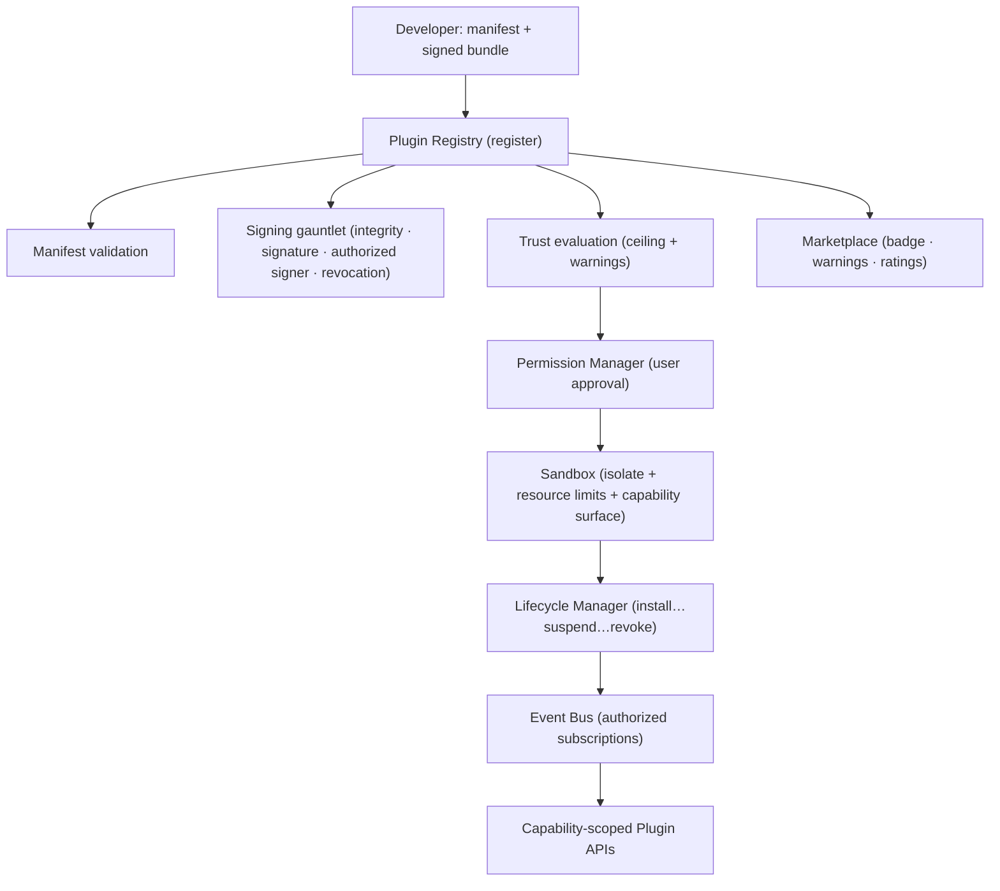

# 27 — Plugin Marketplace & Extension Platform

> Package: [`packages/plugins`](../../packages/plugins) · ADR: [0046](../adr/0046-plugin-marketplace.md) · Status: **security core implemented** (28 tests) · related: [Compliance (26)](26-compliance-governance.md), [Providers (15)](15-provider-framework.md)

This turns the platform from a closed product into an **ecosystem** — third parties extend it the way App Store, VS Code Extensions and Shopify Apps let outsiders build on a platform — **without modifying core and without ever compromising security, performance, privacy or stability.** The doctrine extends unchanged: **a plugin proposes; deterministic code verifies; the device signature disposes.** A plugin can propose an intent, surface analytics, add a provider — but it can never sign, touch keys, or reach internal state.

The package is the deterministic **security + policy core** (the Extension SDK's enforcement). The isolate runtime, malware/static/dynamic scanners, the store frontend, CLI, emulator and doc generator are infra that this core governs.

## 1. Architecture



## 2. The security model (binding invariants)

1. **Forbidden by construction.** Keys, seed phrases, the signing engine, internal databases and security-engine internals are **not in the permission vocabulary**. A plugin cannot request what the host will never expose; the capability gate denies those method names unconditionally, even for a plugin holding every grantable permission.
2. **Deny-by-default.** An unknown/ungated host method or event is denied. Adding a host method without gating it fails closed, not open.
3. **A plugin proposes, never executes.** `intent.create` lets a plugin _propose_ an intent for the user to approve and device-sign — it can never move funds.
4. **Trust caps capability.** Trust level is a hard ceiling on which permissions a plugin may hold _at all_, independent of (and above) user approval.
5. **Verified, not trusted.** A plugin runs only if its bundle hash matches what was signed, the signature verifies, the signer is authorized for the claimed trust level, and it isn't revoked. Fail closed on any doubt.
6. **Bounded + revocable.** Every plugin runs in a resource-limited isolate; misbehaviour auto-suspends it; a revocation instantly stops a running plugin.

## 3. Plugin types & the SDK contract

Fifteen types (blockchain, provider, dex, bridge, portfolio, analytics, automation, ai, tax, notification, enterprise, identity, risk, compliance, payment). Every plugin implements one stable interface:

```ts
interface PluginModule {
  activate(ctx: PluginContext): Promise<void> | void;
  deactivate?(): Promise<void> | void;
  onEvent?(event: EventName, payload: unknown): Promise<void> | void;
}
```

The injected `PluginContext` carries **only** what was granted — permission list, quota-limited `storage`, `log`, and an optional `proposeIntent`. There is no `signer`, `keystore`, or `db` field to reach for.

## 4. Permission model

Ten granular, explicitly-approved permissions: `portfolio.read/write`, `intent.read/create`, `notifications.send`, `analytics.read`, `blockchain.read`, `provider.access`, `automation.access`, `background.execute`. Each host method maps to exactly one permission (`METHOD_PERMISSION`); `authorizeHostCall(method, granted)` allows only a known, gated method whose permission is held. The **forbidden** set (`signTransaction`, `exportPrivateKey`, `getSigner`, `queryDatabase`, `getSecurityInternals`, `setPermission`, …) maps to no permission and is always denied.

## 5. Trust levels (the visible, enforced signal)

| Level                 | Permission ceiling (cumulative)          | Approval | Warning | Resources |
| --------------------- | ---------------------------------------- | -------- | ------- | --------- |
| **official** (L1)     | + `background.execute` (all 10)          | auto     | none    | generous  |
| **verified** (L2)     | + `portfolio.write`, `automation.access` | user     | none    | high      |
| **community** (L3)    | + `intent.create`, `provider.access`     | user     | shown   | medium    |
| **experimental** (L4) | read-only + notifications                | user     | loud    | tiny      |

The ceiling is a wall the UI can't override; user approval is a **second, independent** gate. An experimental plugin cannot hold `background.execute` no matter what the user taps.

## 6. Signing & supply chain

`verifyPlugin` runs a five-check gauntlet, all-or-nothing: **integrity** (delivered bundle hash == manifest `codeHash`), **trust claim** (signed level == claimed level), **authority** (a known, non-revoked signer whose key matches and whose `maxTrust` permits the level — a community signer can't mint an official plugin), **signature** (verifies over the canonical manifest — permissions/events/codeHash/trustLevel are all covered, so nothing can be swapped post-signing), **revocation** (not on the list). Crypto is injected; the default env fails closed (unsigned → rejected). **Automatic revocation** adds an entry and instantly suspends every running match.

## 7. Sandbox

The runtime is a hard-capped isolate (V8 isolate / WASM / worker) — infra. The deterministic policy this module computes: **resource limits** (`resolveLimits` clamps a plugin's request to its trust ceiling: memory, CPU-ms, storage, timeout) and the **capability surface** (`methodsFor` — the plugin is handed an API object containing only its granted methods, never a forbidden one). `checkUsage` turns measured usage into limit violations the health monitor acts on.

## 8. Lifecycle

State machine: `registered → installed → enabled ⇄ disabled ⇄ suspended → removed`, plus `update`/`rollback`. Transitions are total (an illegal one throws). **Health monitoring** is decide-not-act: `decideHealthAction` suspends a plugin on a crash loop, a permission violation (a single one — it's a security signal), or sustained over-limit memory; it never auto-resumes, so a bad plugin converges on suspended.

## 9. Events

Nine events. Subscribing requires the same read permission that would let the plugin fetch that data directly (`portfolio.updated` needs `portfolio.read`), so events can't be a permission-bypass side channel. Meta-events (`plugin.installed/updated`) are public.

## 10. Versioning

Full semver (`parse`/`compare`/`satisfies` with caret/tilde/comparators/prerelease) + dependency resolution (`resolveDependencies` picks the highest satisfying version, reports the unresolved) + host-API compatibility (`isCompatible` = caret-compatible major). Automatic migration hooks are declared per version in the manifest (runtime).

## 11. Observability

Per-plugin: crashes, memory/CPU, API latency, permission-usage, security violations, performance impact — fed to the [Reliability engine (24)](24-observability-sre.md) and the health monitor here.

## 12. Data model (persistence — infra)

| Table                | Key columns                                                            | Notes                |
| -------------------- | ---------------------------------------------------------------------- | -------------------- |
| `plugins`            | (id, version) PK, type, publisher, trust_level, code_hash, api_version | registry             |
| `plugin_signatures`  | plugin_id, signer, public_key, signature, signed_trust                 | verification         |
| `authorized_signers` | signer PK, public_key, max_trust, revoked                              | supply chain         |
| `revocations`        | plugin_id, version_range, reason                                       | automatic revocation |
| `installations`      | (user_id, plugin_id) PK, granted_permissions[], state, limits          | per-user             |
| `reviews`            | (user_id, plugin_id) PK, rating, body                                  | marketplace          |

## 13. Developer experience (infra + this contract)

The SDK ships the `PluginModule`/`PluginContext` types (this package) + a CLI (scaffold, validate manifest, sign, publish), templates per plugin type, a **local emulator** (the host API + capability gate running locally against fakes — the same deterministic policy this package provides), a testing framework (certification/security/compatibility/sandbox-escape suites), and a doc generator. The publishing pipeline runs the scanners (malware/static/dynamic/dependency) before a signature is issued.

## 14. Folder structure

```
packages/plugins/src/
  env.ts        types.ts       errors.ts
  manifest.ts   semver.ts      permissions.ts
  trust.ts      signing.ts     sandbox.ts
  lifecycle.ts  events.ts      marketplace.ts
  registry.ts   index.ts
```

## 15. Implementation roadmap

1. **Stage A (now):** the security core (this package) + the SDK contract; official first-party plugins only; manual review.
2. **Stage B:** the isolate runtime + resource enforcement; the CLI + local emulator; verified-partner onboarding.
3. **Stage C:** the store (listings, ratings, developer profiles); the scanner pipeline; community trust level + review flow.
4. **Stage D:** revenue sharing, subscriptions, enterprise plugins; experimental tier with loud warnings; full sandbox-escape certification.

Each stage is additive; the trust ceilings, forbidden-method wall and signing gauntlet are drawn now, so opening the ecosystem wider never weakens the core.
