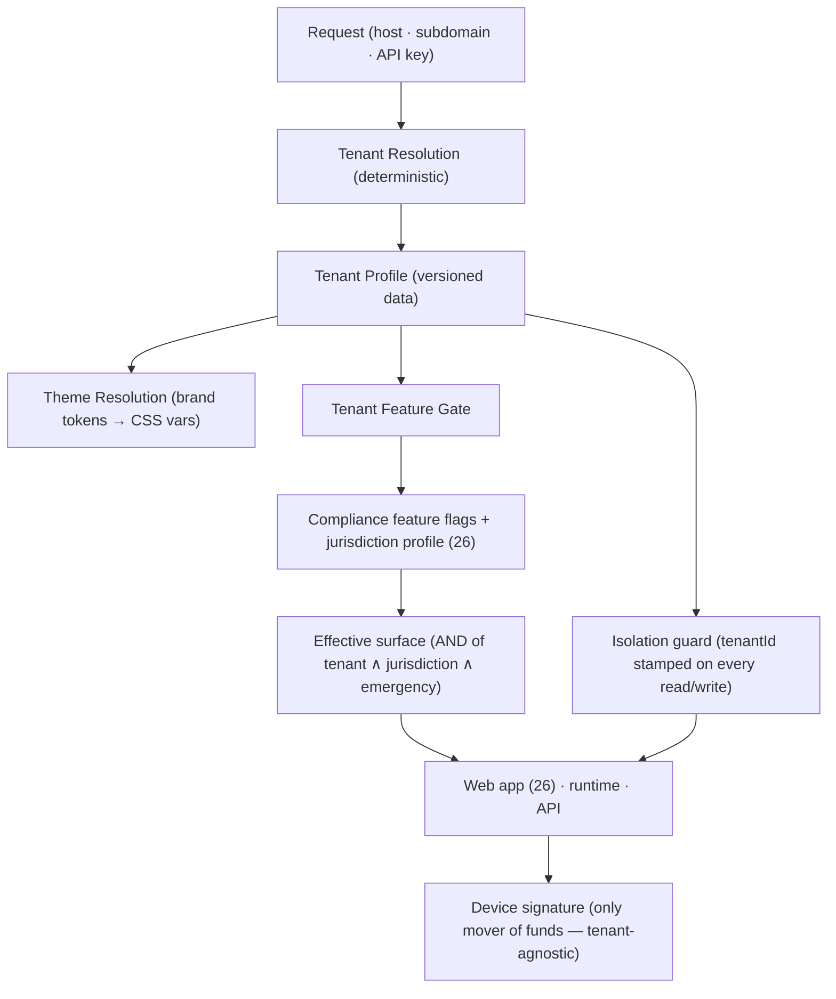

# 28 — White-label Wallet Platform

> Package: [`packages/tenancy`](../../packages/tenancy) · ADR: [0047](../adr/0047-white-label-wallet-platform.md) · Status: **design** · related: [Compliance & Governance (26)](26-compliance-governance.md), [Plugin Marketplace (27)](27-plugin-marketplace.md), [Web App](../../apps/web), [Policy Engine (19)](19-policy-engine.md)

One codebase, many brands: a partner ships "AcmePay" over our engines with its own colors, logo, feature set and regulatory posture — and never touches core. This is **pure config over machinery that already exists**: the [compliance](26-compliance-governance.md) feature-flag + jurisdiction-profile engine decides what a jurisdiction allows, and the [plugins](27-plugin-marketplace.md) trust/permission model decides what an extension may do — this layer decides **which tenant** an incoming request belongs to and **what that tenant's brand + surface is**, then composes _on top of_ those gates, never around them. The CODE is a deterministic `TenantEngine` (versioned tenant profiles, host→tenant resolution, theme-token resolution, per-tenant feature gating, isolation checks). Per-brand DNS, TLS certs, CDN edges and asset hosting are INFRA, documented here, not coded. **Non-custodial is invariant**: a tenant is branding + surface + posture references; it holds no keys, and no tenant config can make a server sign.

## 1. Where it sits



## 2. Design invariants (binding)

1. **Config, not code.** A new brand is a new `TenantProfile` published as data; onboarding a partner is configuration, never a release. `id`s are opaque (`acme`, `bank-xyz`, `default`).
2. **Tenant composes with, never overrides, compliance.** A feature is available iff the **tenant enables it AND compliance permits it** (jurisdiction `disabledFeatures` + `FeatureFlagSet`). A tenant can only ever _subtract_ from what the jurisdiction and the global posture already allow — it can never re-enable what compliance disabled or the emergency freeze killed. Most-restrictive wins.
3. **Fail closed.** Unresolved host / no active profile ⇒ resolve to `default` in a locked, read-only posture (never another tenant's config, never an open one). An unknown feature defaults off under a tenant.
4. **Total isolation.** Every persisted row and every cache key is stamped with `tenantId`; a query without a tenant scope is a programming error the guard rejects. No code path returns tenant A's data, config, audit or assets to tenant B.
5. **Deterministic + reproducible.** Resolution, theme resolution and gating are pure functions over injected inputs (the request descriptor, the profile registry, the compliance flag set); same inputs ⇒ same brand, same surface, same audit hash.
6. **Non-custodial preserved.** A tenant profile references a compliance/policy posture and a brand; it holds no keys and cannot sign. Signing is tenant-agnostic — the device signs, whatever the wrapper.

## 3. The tenant profile (versioned data)

Same discipline as [jurisdiction profiles (26 §4)](26-compliance-governance.md): monotonic versions, one active per id, validated on register, so any past render/decision replays against the exact version that produced it.

| Field                       | Type                                           | Purpose                                                                                                                     |
| --------------------------- | ---------------------------------------------- | --------------------------------------------------------------------------------------------------------------------------- |
| `id` / `version` / `status` | `string` / `number` / `draft\|active\|retired` | opaque tenant id; monotonic; one active per id                                                                              |
| `brand`                     | `BrandTokens`                                  | `displayName`, `logoRef`, `colors` (semantic token map), `radius`, `typographyRef` — the theme source (see §5)              |
| `enabledFeatures`           | `readonly Feature[]`                           | the tenant's requested surface (a **subset request**, gated in §6)                                                          |
| `complianceProfileRef`      | `string`                                       | which [jurisdiction profile (26)](26-compliance-governance.md) posture this tenant runs under                               |
| `policyProfileRef`          | `string`                                       | which [policy (19)](19-policy-engine.md) rule set applies                                                                   |
| `supportedChains`           | `readonly ChainId[]`                           | subset of platform chains (BTC · universal-EVM · SOL) this brand exposes                                                    |
| `limits`                    | `TenantLimits`                                 | `perTxCapMicroUsd`, `dailyCapMicroUsd` (**bigint** micro-USD), rate limits, quotas — floors under policy, not a replacement |
| `allowedPlugins`            | `readonly PluginRef[]`                         | tenant-scoped [plugin (27)](27-plugin-marketplace.md) allowlist + max trust ceiling                                         |
| `domains`                   | `readonly string[]`                            | hosts/subdomains that resolve here (the resolution map, §4)                                                                 |

Money everywhere is **integer micro-USD (bigint)**. `limits` are an additional ceiling that clamps _into_ the policy engine — most-restrictive of tenant vs policy wins; a tenant can tighten, never loosen.

## 4. Tenant resolution (host → tenant)

`resolveTenant(req, registry)` is a pure, ordered, deterministic lookup — first match wins, then fail closed:

| Order | Signal                               | Example                | Notes                                          |
| ----- | ------------------------------------ | ---------------------- | ---------------------------------------------- |
| 1     | Explicit API key / client credential | `x-tenant-key: …`      | strongest; server-to-server + native apps      |
| 2     | Full host                            | `wallet.acme.com`      | exact match in `domains`                       |
| 3     | Subdomain of platform apex           | `acme.intentlayer.app` | label is the tenant id candidate               |
| 4     | Fallback                             | —                      | `default` tenant, **locked/read-only** posture |

Rules: exactly one active profile may claim a host (validated on register — collisions rejected). An unresolved or retired mapping never falls through to a _different_ live tenant; it falls to `default`. Resolution is stateless and cached by host; a cache entry is itself tenant-stamped (§8). The API-key path and the host path must resolve to the **same** tenant or the request is rejected — no cross-tenant key replay.

## 5. Theme token resolution

Brand tokens resolve **on top of** the base design system in [`apps/web`](../../apps/web) (`styles.css` custom properties; see [design tokens](../design/01-tokens.md)) — the tenant supplies overrides, not a fork:

- `resolveTheme(brand, base)` merges tenant `BrandTokens` over the base token map and returns a flat, validated CSS-variable set (`--color-*`, `--radius-*`, `--font-*`) plus `logoRef`/`displayName`. Pure function; same brand ⇒ byte-identical output.
- **Only whitelisted, semantic tokens are themeable** (brand/accent/surface colors, radius, logo, name, typography ref). Structural/layout tokens and any script are **not** in the vocabulary — a brand cannot inject CSS that breaks layout or smuggle executable content. Values are validated (color format, bounded radius); a malformed token fails the profile at register.
- The resolved token set ships to the client as a small, cacheable, tenant-stamped payload; the app applies it at boot. Actual asset bytes (logo image, font files) live on a per-brand CDN path — **infra** — referenced by `logoRef`/`typographyRef`, never inlined into config.

This reuses the plugins insight (§27): a hard, small permission vocabulary means the surface can widen safely because the wall is drawn in code, not in the UI.

## 6. Per-tenant feature gating (composes with compliance)

The heart of the doc. A feature's availability is the **AND** of independent gates, evaluated most-restrictive-first — the tenant gate is a new, _additional_ subtraction layered onto the existing compliance engine, which is called unchanged:

```
available(feature, tenant, jurisdiction) =
     tenant.enabledFeatures ∋ feature          // tenant opted in
  ∧  compliance.isFeatureEnabled(feature, jurisdiction, flags)   // 26 §7 — global ∧ per-jurisdiction ∧ NOT emergencyFrozen
  ∧  feature ∉ jurisdictionProfile.disabledFeatures             // 26 §4 authoritative hard gate
```

`resolveSurface(tenant, complianceCtx)` returns the effective feature set by intersecting the tenant's request with what compliance already returns from `isFeatureEnabled` + `disabledFeatures`. Consequences that fall out for free:

- A tenant **cannot re-enable** a feature its jurisdiction disabled or the emergency freeze killed — the AND can only remove.
- The **global emergency kill-switch (26 §7)** still overrides every tenant instantly; white-label does not create an escape hatch.
- Unknown/ungated feature under a tenant ⇒ off (deny-by-default, matching §27).
- Chains and plugins gate the same way: `supportedChains` intersects the platform set; `allowedPlugins` intersects the [plugin (27)](27-plugin-marketplace.md) trust-ceiling — a tenant can only narrow, and a plugin still passes the full signing gauntlet.

## 7. Tenant isolation (A can never see B)

| Surface     | Isolation mechanism                                                                                                                                                                                                                                  |
| ----------- | ---------------------------------------------------------------------------------------------------------------------------------------------------------------------------------------------------------------------------------------------------- |
| Persistence | every table carries `tenant_id`; the data-access guard **requires** a tenant scope — an unscoped query throws, not returns-all. Postgres RLS as defense-in-depth (infra).                                                                            |
| Cache       | keys are prefixed `t:{tenantId}:…`; a lookup validates the entry's stamp against the request's tenant before returning.                                                                                                                              |
| Audit       | [compliance audit (26 §5)](26-compliance-governance.md) records are written with the tenant as `subject`/scope; export is filtered to one tenant, and the hash chain is per-tenant-anchored so one partner's regulator export never leaks another's. |
| Config      | `resolveTenant` returns exactly one profile; there is no API that lists or cross-references tenants except an admin-only, RBAC-gated ([26 §7](26-compliance-governance.md)) governance path.                                                         |
| Assets      | per-brand CDN origin/path; a signed asset URL is scoped to its tenant (infra).                                                                                                                                                                       |

Isolation is checked, not assumed: `assertTenantScope(row, tenantId)` is a pure guard applied at every boundary, and a cross-tenant mismatch is a hard error surfaced to [reliability (24)](24-observability-sre.md).

## 8. Data model (persistence — infra)

| Table / store       | Key columns                                            | Notes                                    |
| ------------------- | ------------------------------------------------------ | ---------------------------------------- |
| `tenant_profiles`   | (id, version) PK, status, effective_from, json profile | append-only; one active per id           |
| `tenant_domains`    | host PK, tenant_id, kind (host\|subdomain)             | resolution map; one live tenant per host |
| `tenant_keys`       | key_hash PK, tenant_id, revoked                        | API-key resolution; hashed at rest       |
| `tenant_assets`     | (tenant_id, ref) PK, cdn_url, kind (logo\|font)        | metadata only; bytes on CDN              |
| (all domain tables) | + `tenant_id` on every row                             | RLS + guard-enforced isolation           |

## 9. Security · performance

Resolution + theme + gating are pure comparisons over one profile and one flag set — **well under a few ms**, off the fund-moving path (they run before the request touches the engines, like [compliance (26 §10)](26-compliance-governance.md)). Every tenant-config change is authenticated → RBAC-authorized → audited → versioned, reusing [compliance governance (26 §7)](26-compliance-governance.md) — publishing a brand or flipping a tenant flag is a maker-checker action, not a deploy. Resolution failures and isolation-guard rejections are security signals fed to [reliability (24)](24-observability-sre.md).

## 10. Folder structure

```
packages/tenancy/src/
  env.ts        types.ts       errors.ts
  profiles.ts   resolve.ts     theme.ts
  gating.ts     isolation.ts   engine.ts
  index.ts
```

`profiles.ts` mirrors compliance's versioned registry; `gating.ts` imports and composes `isFeatureEnabled` from [`packages/compliance`](../../packages/compliance) rather than re-implementing it; `engine.ts` is the `TenantEngine` facade (resolve → theme → surface → guarded access).

## 11. Implementation roadmap

1. **Stage A (now):** the `TenantEngine` (this package) + a `default` tenant and one demo brand; resolution wired ahead of the request path; theme tokens applied in [`apps/web`](../../apps/web); gating composed over compliance flags. First-party only.
2. **Stage B:** tenant profiles + domain maps as config; per-brand CDN asset pipeline (infra); tenant-scoped plugin allowlists; RLS turned on across domain tables.
3. **Stage C:** self-serve partner console (brand editor, feature toggles) on the [governance approval UI (26 §12)](26-compliance-governance.md); custom-domain onboarding (DNS/TLS — infra); per-tenant reporting export.
4. **Stage D:** enterprise white-label — dedicated compliance/policy postures per tenant, data residency ([26 §6](26-compliance-governance.md)), per-tenant SLOs ([24](24-observability-sre.md)), tenant-specific plugin ecosystems ([27](27-plugin-marketplace.md)).

Each stage is additive; because a tenant is data and the gate is an AND that can only subtract from compliance, widening the partner base never weakens a jurisdiction's posture, another tenant's isolation, or the non-custodial guarantee.
