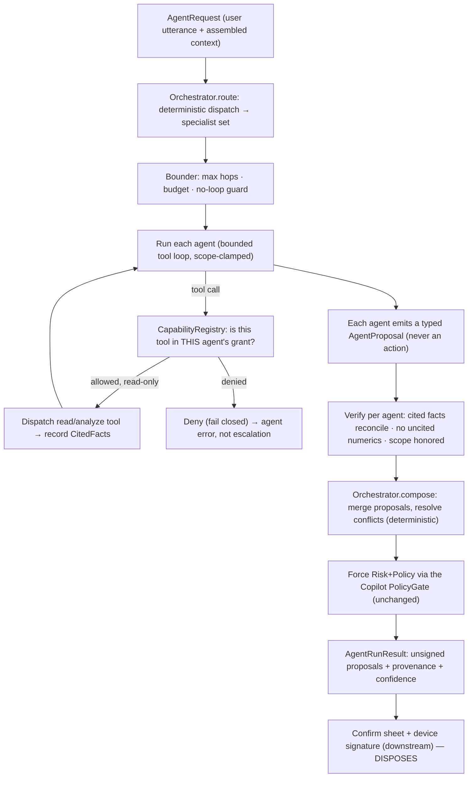

# 29 — AI Agent Framework (specialist agents, one orchestrator)

> Package: [`packages/agents`](../../packages/agents) · ADR: [0048](../adr/0048-ai-agent-framework.md) · Status: **planned** (design locked) · related: [AI Copilot (20)](20-ai-copilot.md), [Policy Engine (19)](19-policy-engine.md), [Plugin Marketplace (27)](27-plugin-marketplace.md), [Intent Engine (13)](13-intent-engine.md), [Risk Engine (17)](17-security-risk-engine.md)

One constrained AI (the [Copilot](20-ai-copilot.md)) already **proposes**, deterministic code **verifies**, and the device signature **disposes**. This doc scales that to _many_ AIs without weakening it. An agent framework is strictly **more** dangerous than a single Copilot — more model calls, more surface for prompt-injection, the temptation of agent-to-agent loops, and the seduction of "let the agents just do it." So the doctrine gets **harder**, not looser: every agent is a bounded specialist that can only emit typed **proposals**; a deterministic **orchestrator** routes requests, caps hops, and composes outputs; and every agent output is fact-verified the same way the Copilot's is. The **CODE** here is the deterministic `Orchestrator`, the `Agent` contract, the `CapabilityRegistry` (tool routing), the hop/budget bounder, and per-agent output verification — a pure engine over injected read-only tools + LLM clients + `now/ids/hash`. The **INFRA** is the LLM gateway, the per-agent prompt/model config, and the isolate that runs each agent's model call — documented, governed, never trusted.

The framework holds **no keys**, has **zero dependency on `@intent-wallet/execution` or `core`**, and shares the Copilot's `assertNoExecuteTools` build gate: an agent can never execute, sign, or broadcast. It is the Copilot's tool-loop generalized from one worker to a routed pool of specialists.

## 1. Pipeline



The orchestrator is deterministic end to end: routing, bounding, composition, and gating are code; only the per-agent tool-loop bodies call a model, and each is confined exactly as the Copilot's loop is. With the `ScriptedLlmClient` + injected `now/ids/hash`, a whole multi-agent run is replayable and hash-stable.

## 2. Why an agent framework is more dangerous (and the answer)

| New hazard vs. single Copilot                | Deterministic answer                                                                                                                        |
| -------------------------------------------- | ------------------------------------------------------------------------------------------------------------------------------------------- |
| N model calls → N injection surfaces         | Every agent output re-verified (`verifyResponse` per agent); a poisoned agent can at worst emit a proposal the user must still sign         |
| Agent-to-agent loops / recursion             | Orchestrator is a **DAG, not a chat** — agents never call each other; only the orchestrator invokes agents, under a hop cap                 |
| "One agent said it's fine" laundering a gate | No agent can widen scope. Risk/Policy run **once, deterministically, on the composed plan** — never per-agent, never LLM-optional           |
| Scope creep (an agent grabs a stronger tool) | `CapabilityRegistry` grants are per-agent and static; an ungranted tool is denied by construction, mirroring plugins' forbidden-method wall |
| Unbounded cost / runaway fan-out             | Per-run **budget** (tool-calls + tokens + wall-clock) and a fixed specialist roster; exceeding it fails the run, never silently continues   |
| Conflicting advice presented as consensus    | `compose` is a deterministic reducer with explicit conflict resolution + provenance; disagreement is surfaced, not averaged away            |

## 3. The `Agent` contract

An agent is **data + a bounded loop body**, not a free-roaming actor. It mirrors the Copilot's constraints, drawn per specialist.

```ts
interface Agent {
  name: AgentName; // 'portfolio_analyst' | 'tax' | 'security' | 'route' | 'intent_drafter'
  scope: AgentScope; // enumerated question-domain this agent may answer
  allowedTools: readonly ToolName[]; // subset of the read/analyze/propose registry — NEVER execute
  maxToolCalls: number; // per-agent leg of the run budget
  propose(ctx: AgentContext): Promise<AgentProposal>; // emits typed proposal; cannot sign/execute
}
```

- **Bounded scope.** `scope` is enumerated; a proposal tagged outside it is dropped at verification. The tax agent cannot smuggle a transfer; the security agent cannot author a price.
- **Least tools.** `allowedTools ⊆` the shared `read | analyze | propose` registry. There is no `execute` scope to grant (§6). A grant is static config, reviewed like a plugin manifest.
- **Injected context only.** `AgentContext` carries the seeded `FactLedger`, the agent's clamped tool surface (`methodsFor(agent)`), `log`, and `now/ids` — **no** signer, keystore, db, or sibling agent. Structurally, an agent cannot reach what it wasn't handed (the Copilot `capabilities.ts` pattern).

### Specialist roster (Stage A)

| Agent               | Scope                                                  | Allowed tools                                   | Emits                                             |
| ------------------- | ------------------------------------------------------ | ----------------------------------------------- | ------------------------------------------------- |
| `portfolio_analyst` | performance, allocation, drift, health                 | `analyze_portfolio`, `explain_performance`      | findings + `RecommendationProposal`               |
| `tax`               | realized/unrealized gains, lot advice, wash-sale flags | `analyze_portfolio` (tax view), `read_holdings` | `TaxNoteProposal` (advisory, jurisdiction-tagged) |
| `security`          | recipient/token/approval risk on a candidate           | `assess_risk`, `read_holdings`                  | `RiskFindingProposal` (can only **tighten**)      |
| `route`             | best route/venue for a candidate move                  | `find_route`                                    | `RouteProposal` (unsigned)                        |
| `intent_drafter`    | turn intent into an **unsigned** plan                  | `plan_intent`                                   | `PlanProposal` (`signed:false`)                   |

New specialists are additive: a new `Agent` + its capability grant + a compose rule. The roster is fixed per release — agents are not user-installable here (that's the [Plugin](27-plugin-marketplace.md) ecosystem, §7).

## 4. The deterministic Orchestrator

The orchestrator is the whole reason this is safe. It is pure code with four jobs, none delegated to a model:

1. **Route** — `route(request) → AgentName[]`. A deterministic classifier (keyword/intent-kind/context signals; the Copilot's `analyze()` seed available) selects the specialist set. Routing never asks an LLM "which agents should run"; that would be a control-flow injection vector. Unmatched → the `portfolio_analyst` default or a `clarify`.
2. **Bound** — every run carries a `Budget { maxHops, maxToolCalls, maxTokens, deadlineMs }`. `maxHops` caps how many agents run; there is **no** re-entry, so a loop is impossible by construction (agents form a set, executed once each). Exhaustion is a terminal `budget_exceeded`, never a silent trim.
3. **Compose** — `compose(proposals) → composed`. A deterministic reducer: security findings **tighten** any route/plan (most-restrictive, per Policy's `composeWithRisk` spirit); conflicting recommendations are surfaced with provenance, not merged into a fake consensus; each output keeps its `authoredBy` + `CitedFact` provenance.
4. **Gate** — the composed candidate plan goes through the **existing Copilot `PolicyGate`** (which composes [Risk (17)](17-security-risk-engine.md) + [Policy (19)](19-policy-engine.md)) exactly once. `allow && mayProceedToSign → ready`; `block → explained_gate` (plan nulled); else `needs_confirmation`. **Fail-closed:** no gate wired ⇒ never `ready`.

## 5. Tool routing via the Capability Registry

Tool routing is an **authorization** decision, not a model decision — the plugins model applied to agents. Each host tool maps to exactly one capability; each agent holds a static grant set.

| Mechanism                         | Rule                                                                                                                                                                                                                       |
| --------------------------------- | -------------------------------------------------------------------------------------------------------------------------------------------------------------------------------------------------------------------------- |
| `TOOL_CAPABILITY`                 | Every tool name maps to one capability (`analyze_portfolio → portfolio.read`, `assess_risk → risk.read`, `find_route → route.read`, `plan_intent → intent.propose`).                                                       |
| `authorizeAgentTool(agent, tool)` | Allows only a **known**, gated tool whose capability is in the agent's grant. Unknown/ungated ⇒ **denied** (deny-by-default).                                                                                              |
| Forbidden set                     | `sign`, `execute`, `broadcast`, `approve`, `send`, `transfer`, `withdraw`, `write*` map to **no** capability and are denied unconditionally — the `assertNoExecuteTools` build gate fails CI if any registry tool matches. |
| `methodsFor(agent)`               | The agent is handed an API object containing **only** its granted, read-only tools — never a forbidden one, never a sibling's.                                                                                             |
| Scope ≥ tool                      | An agent may hold a tool only if it lies within its `scope`; the registry rejects a grant that exceeds scope at construction, so drift can't be configured in.                                                             |

This is deliberately the same shape as the [Plugin permission model (27)](27-plugin-marketplace.md): a capability wall the orchestrator can't override, static grants reviewed ahead of time, and forbidden capabilities that don't exist in the vocabulary.

## 6. Binding invariants

1. **An agent NEVER executes or signs.** No `execute` scope exists; the registry union is `read | analyze | propose`; zero dependency on `execution`/`core`; `assertNoExecuteTools` is a build gate. The strongest thing any agent emits is an unsigned `PlanProposal` (`signed:false`).
2. **Agents propose; deterministic code composes; the device disposes.** Every `AgentProposal` is typed and inert until the orchestrator composes it, the `PolicyGate` clears it, and a human device signature is applied downstream.
3. **No agent-to-agent calls.** Only the orchestrator invokes agents, once each, as a DAG. Recursion, chat-loops, and mutual invocation are structurally absent — no agent holds a handle to another.
4. **Every agent output is verified.** Per agent: `verifyResponse` (cited facts reconcile against the run `FactLedger`), `hasUncitedNumerics` (no fabricated numbers), and a **scope check** (proposal kind ∈ agent scope). A failed agent is dropped/erred, never allowed to taint the composition.
5. **Risk + Policy run once, on the composed plan.** Never per-agent, never optional, never LLM-gated. Security agent findings can only **tighten**; they can't manufacture an approval.
6. **Bounded by construction.** `maxHops`, per-agent `maxToolCalls`, `maxTokens`, and `deadlineMs` are enforced; exhaustion is terminal. No unbounded fan-out, no runaway cost.
7. **Deterministic core.** No reachable `Date.now`/`Math.random`/`crypto`/`fetch`/`process.env` in routing, bounding, composition, or verification; `AgentEnv` injects `now/ids/hash`. Identical inputs ⇒ identical `runHash` (source-grep + env-swap invariance, as in [Policy §2](19-policy-engine.md)).

## 7. Relationship to the Copilot and Plugins

- **Rides on the Copilot, doesn't replace it.** The framework reuses the Copilot's `tools.ts` registry, `FactLedger`, `verify.ts`, and `PolicyGate` verbatim. Think of the Copilot as the **single-agent degenerate case**; this doc adds routing + composition around N of them. Simple questions still take the Copilot's zero-tool sub-2s path — the orchestrator routes a lone `portfolio_analyst` and skips composition.
- **Uses the Plugin capability grammar for tool routing.** Grants, deny-by-default, forbidden-method wall, and least-privilege come straight from [Plugins (27)](27-plugin-marketplace.md). First-party agents are the trusted, in-repo tier; **third-party agents would enter only through the Plugin trust levels + signing gaunttet + sandbox** — never as raw code with tool grants.
- **Constrained by Policy + Risk.** The composed plan is authorized by the same [Policy Engine (19)](19-policy-engine.md) seam every other proposer uses; no bypass, no per-agent gate.

## 8. Data model

| Type              | Key fields                                                                 | Notes                                                      |
| ----------------- | -------------------------------------------------------------------------- | ---------------------------------------------------------- |
| `Agent`           | `name`, `scope`, `allowedTools[]`, `maxToolCalls`                          | static config; reviewed like a plugin manifest             |
| `AgentRequest`    | `utterance`, `context`, `budget`                                           | utterance is always a **user** message (injection defense) |
| `AgentProposal`   | `authoredBy`, `kind`, `payload`, `citedFacts[]`, `confidence`              | typed, inert, scope-tagged; `signed:false` where a plan    |
| `CapabilityGrant` | `agent`, `capabilities[]`                                                  | drives `authorizeAgentTool`; deny-by-default               |
| `Budget`          | `maxHops`, `maxToolCalls`, `maxTokens`, `deadlineMs`                       | per-run; exhaustion terminal                               |
| `AgentRunResult`  | `proposals[]`, `composed`, `gate`, `confidence`, `runHash`, `provenance[]` | orchestrator output to downstream confirm sheet            |
| `AgentRunRecord`  | `runId`, `routedAgents[]`, `toolCalls[]`, `verdicts[]`, `runHash`          | append-only trace (audit/observability — infra)            |

## 9. Folder structure

```
packages/agents/src/
  types.ts        Agent, AgentScope, AgentProposal, Budget, AgentRunResult
  env.ts          AgentEnv (injected now/ids/hash) — determinism boundary
  registry.ts     CapabilityRegistry: TOOL_CAPABILITY + authorizeAgentTool + methodsFor + no-execute assertion
  roster.ts       the specialist Agents (portfolio_analyst, tax, security, route, intent_drafter)
  bound.ts        Budget enforcement: hops, tool-calls, tokens, deadline (no-loop by construction)
  run.ts          bounded per-agent tool loop (reuses Copilot boundary + FactLedger)
  verify.ts       per-agent verifyResponse + hasUncitedNumerics + scope check
  compose.ts      deterministic proposal reducer + conflict resolution + provenance
  orchestrator.ts route → bound → run → verify → compose → PolicyGate → AgentRunResult
  index.ts / errors.ts
```

## 10. Implementation roadmap (additive)

1. **Stage A — the deterministic core (this package):** `Agent` contract, `CapabilityRegistry`, `Orchestrator` (route/bound/compose/gate), per-agent verification, and the five first-party specialists — offline-tested with a `ScriptedLlmClient` and injected `now/ids/hash`. Reuses the Copilot's registry, ledger, verify, and `PolicyGate` unchanged.
2. **Stage B — real LLM + wiring:** Claude adapters behind each agent's loop at `services/api`; wrap the concrete Intelligence/Risk/Router/Intent/Policy engines behind the shared capabilities. The no-execute + anti-fabrication + capability gates apply unchanged.
3. **Stage C — richer roster + composition:** add specialists (e.g. `yield`, `bridge_safety`, `compliance_advisor`) as pure additions — new `Agent` + grant + compose rule; conflict-resolution presets; confidence tuned by staleness/route-confidence/gate status (Copilot `confidence.ts`).
4. **Stage D — third-party agents:** admit external agents **only** through the [Plugin (27)](27-plugin-marketplace.md) trust levels, signing gauntlet, and sandbox — with capability grants bounded by trust ceiling. Opening the roster wider never weakens the core, because the no-execute wall, capability grants, single Policy gate, and hop/budget bounds were all drawn in Stage A.

## Related

- Generalizes the [AI Copilot (20)](20-ai-copilot.md) tool-loop to a routed specialist pool; authorized by the [Policy Engine (19)](19-policy-engine.md) + [Risk Engine (17)](17-security-risk-engine.md); borrows its capability grammar from the [Plugin Marketplace (27)](27-plugin-marketplace.md); drafts unsigned plans via the [Intent Engine (13)](13-intent-engine.md) that only the [Execution Engine (14)](14-execution-engine.md) + a device signature can run.
