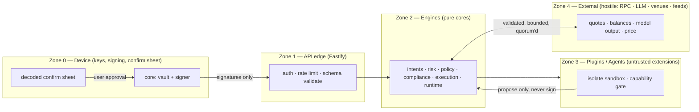

# 30 — Production Security Audit & Hardening

> Package: none new — this is a **synthesis + program** doc over the existing engines (`core`, `risk`, `policy`, `compliance`, `plugins`, `execution`, `runtime`) · ADR: [0049](../adr/0049-security-audit-and-hardening.md) · Status: **program defined; internal adversarial reviews run on 4 of 5 target engines** · related: [Wallet-Core Threat Model](../security/wallet-core-threat-model.md), [06 — Security](06-security.md), [17 — Risk](17-security-risk-engine.md), [19 — Policy](19-policy-engine.md), [26 — Compliance](26-compliance-governance.md), [27 — Plugins](27-plugin-marketplace.md), [Architecture Review 2026-07](architecture-review-2026-07.md)

The doctrine — **"X proposes, deterministic code verifies, the device signature disposes"** — is a security posture before it is a product one. This doc does not add an engine; it consolidates what already enforces that posture into one **audit-readiness program**: the platform's binding security invariants, a STRIDE threat model spanning every trust boundary, the status of the internal adversarial reviews already run, an external-pentest scope, a dependency/supply-chain and secrets baseline, and a per-package hardening checklist an external auditor can walk top-to-bottom. Everything here is **CODE that already exists** (the invariants are tested in `core`/`risk`/`policy`/`compliance`/`plugins`) or **INFRA that is documented** (pentest harness, SAST/SCA in CI, KMS, WORM audit storage, isolate runtime). The one open item is honest and flagged: the `plugins` package's multi-agent adversarial review never completed (it hit an API session limit mid-run) and must be re-run before the ecosystem opens.

## 1. The five platform security invariants (what an auditor is really checking)

Every finding below either upholds one of these or is a bug. They are the audit's acceptance criteria.

| #      | Invariant                                                                                                                                                                                   | Where enforced (CODE)                                                                                                                                                           | Falsifiable test                                                                        |
| ------ | ------------------------------------------------------------------------------------------------------------------------------------------------------------------------------------------- | ------------------------------------------------------------------------------------------------------------------------------------------------------------------------------- | --------------------------------------------------------------------------------------- |
| **I1** | **Keys never leave the device.** Only signatures and opaque vault ciphertext cross the trust boundary.                                                                                      | `core` (vault scrypt+AES-256-GCM, per-op zeroize, no network I/O; import-lint forbids `core` outside apps)                                                                      | WC1/WC2/WC11 in the [wallet-core threat model](../security/wallet-core-threat-model.md) |
| **I2** | **AI, plugins, and agents can never sign.** No component but the device holds a signing capability; the AI/plugin/agent surfaces have no `execute`/`signer`/`keystore` in their vocabulary. | `copilot` (no-execute tool registry, `ProposedPlan.signed = literal false`), `plugins` (`FORBIDDEN_METHODS` deny even with all perms), `automation` (session keys, still gated) | copilot/plugins/automation gate-proof tests                                             |
| **I3** | **Fail-closed everywhere.** Unknown posture, ungated method, unsigned bundle, missing profile, uncited number → deny/block, never allow/guess.                                              | `compliance` (no profile ⇒ block), `plugins` (deny-by-default), `policy` (`mayProceedToSign` defaults false), `risk` (hard blocks unoverridable), `api` (fail-closed auth)      | per-engine deny tests                                                                   |
| **I4** | **Capability + trust are hard ceilings.** Authorization can only _tighten_: Policy tightens Risk, trust caps plugin permissions, session keys are bounded. Nothing composes _looser_.       | `policy` (`composeWithRisk` argmax), `plugins` (trust ceiling above user approval), `automation` (policy-bounded session keys)                                                  | composition/ceiling invariance tests                                                    |
| **I5** | **Tamper-evident audit.** Every authorization, governance, and execution-lifecycle event is an append-only hash-chained record; production keys the hash and anchors the tip.               | `policy`/`compliance` (`verifyChain` + seq-contiguity + tip anchor), `06 §4` (daily WORM anchor)                                                                                | `verifyChain` pinpoints `brokenAt`; truncation/reorder detected                         |

**Non-custodial is the invariant that makes a server compromise survivable:** a fully-popped backend is a privacy/availability incident, never fund loss (I1+I2). An auditor should try to break exactly this and fail.

## 2. Trust boundaries & STRIDE threat model (platform-wide)

| Boundary             | S/T/R/I/D/E focus | Top threats                                                    | Mitigation (engine)                                                                                                                                                                      | Residual                                                                              |
| -------------------- | ----------------- | -------------------------------------------------------------- | ---------------------------------------------------------------------------------------------------------------------------------------------------------------------------------------- | ------------------------------------------------------------------------------------- |
| **Device**           | S, T              | seed-at-rest theft, in-memory theft, blind signing             | I1: vault + zeroize + auto-lock; confirm sheet decodes locally so the server can't lie about signed bytes                                                                                | device fully owned while unlocked (stated honestly; native secure memory / MPC = v2)  |
| **API edge**         | S, I, E           | auth bypass, IDOR, session-token theft                         | SIWE→ES256 JWT + PoP-bound refresh; gateway authz **and** RLS backstop; per-identity data scoping                                                                                        | privacy breach of watch-list data → disclosure plan                                   |
| **Engines**          | T, E              | stale-plan authorization, amount spoofing, risk-verdict drop   | `policy` re-derives amount from the plan quote; **pre-broadcast re-validation gate** (re-scan risk/balance/quote-TTL/policy); planner maps high/require_confirmation → mandatory confirm | novel contract semantics                                                              |
| **Plugins / Agents** | E, T, I           | capability escalation, sandbox escape, side-channel via events | I2/I3: `FORBIDDEN_METHODS` wall, deny-by-default, trust ceiling, signing gauntlet, event-sub requires the read permission                                                                | 0-day isolate escape (bounded + revocable)                                            |
| **Chain / External** | T, I              | RPC lies, malicious venue/route, prompt injection              | multi-provider quorum on money-path reads; venue allowlist + quote sanity band + post-leg invariant; LLM emits only schema JSON, no fund-moving tool                                     | coordinated multi-vendor compromise; new injection class (bounded by no-tools design) |

This extends [06 §3](06-security.md) (T1–T14) rather than replacing it; T1–T14 remain the canonical numbered register, and the engine-level detail lives in each package doc's threat table.

## 3. Internal adversarial-review program (status)

Before external audit we run our own attacker. The method: a multi-agent adversarial pass — each agent takes one attack surface, reads real source, cites `file:line`, then a judge verifies every finding against source (the same discipline as the [Architecture Review 2026-07](architecture-review-2026-07.md), which found and drove closure of the two CRITICAL money-path gaps).

| Engine            | Review run                                                                                                                                   | Outcome                                                                                                                                     | Gate before GA                                      |
| ----------------- | -------------------------------------------------------------------------------------------------------------------------------------------- | ------------------------------------------------------------------------------------------------------------------------------------------- | --------------------------------------------------- |
| `risk` (17)       | ✅ inline + verified                                                                                                                         | hard-block-unoverridable and probabilistic-OR compounding confirmed; intel-snapshot signature path documented                               | ✅                                                  |
| `policy` (19)     | ✅ 5-surface adversarial                                                                                                                     | amount-spoofing, inheritance-loosening, composition-drift, replay, audit-tamper each attacked → all held                                    | ✅                                                  |
| `compliance` (26) | ✅ adversarial                                                                                                                               | fail-closed-on-missing-profile, maker-checker (proposer ≠ approver), truncation/reorder detection confirmed                                 | ✅                                                  |
| `scale` (25)      | ✅ adversarial                                                                                                                               | bounded autoscaler + resilience decisions verified decide-not-act                                                                           | ✅ (not money-path)                                 |
| `plugins` (27)    | ⚠️ **INCOMPLETE** — inline self-review + 2 hardening fixes only; the multi-agent 5-lens run **hit an API session limit and never completed** | capability wall + signing gauntlet held on the surfaces checked; the full sandbox-escape / escalation / side-channel lens is **unverified** | ❌ **RE-RUN REQUIRED before the marketplace opens** |
| `core` (wallet)   | ✅ threat model + official vectors + independent cross-checks                                                                                | WC1–WC11 documented with residuals                                                                                                          | ✅ (external audit still mandatory, §4)             |

**Binding:** `plugins` does not ship to third-party developers until its 5-lens adversarial review completes and every finding is closed or accepted in writing. This is the single known gap in the internal program.

## 4. External audit & penetration-test scope

What an external auditor is engaged to independently confirm, in priority order (money-path first):

| Wave                                     | Scope                                                                                               | Auditor confirms                                                                                                       | Method                                                               |
| ---------------------------------------- | --------------------------------------------------------------------------------------------------- | ---------------------------------------------------------------------------------------------------------------------- | -------------------------------------------------------------------- |
| **A — Wallet Core** (before public beta) | `core`: KDF/cipher params, derivation vectors, zeroization, no key egress                           | I1 holds; no side channel leaks key material; vault AEAD binds all envelope fields                                     | crypto review + fuzz (vault envelope, tx decoders) + memory analysis |
| **B — Money path** (before GA)           | `intents`→`policy`+`risk`→`execution` seam; the pre-broadcast re-validation gate; idempotency/nonce | stale-plan / double-broadcast / amount-spoof / risk-drop are all closed; a signature covers exactly what was simulated | grey-box + property tests + adversarial replay                       |
| **C — Perimeter pentest**                | `services/api`, auth, session, RLS, rate limits, IDOR, SSRF to RPC egress                           | Zone-1/2 compromise never yields signing or cross-user fund access                                                     | black/grey-box network + API pentest                                 |
| **D — Extension surface**                | `plugins` sandbox + capability gate + signing gauntlet (**after §3 re-run**)                        | no escalation past trust ceiling; no sandbox escape; no side-channel via events                                        | sandbox-escape certification suite                                   |
| **E — AI/agent surface**                 | `copilot` + agent framework: prompt injection, fact-grounding, no-execute                           | injection produces `clarification`/`explained_gate`, never an unintended signed intent                                 | red-team injection corpus in CI                                      |

Deliverable an auditor expects at kickoff: this doc, the per-engine threat tables, the ADR set, the deterministic test suites (reproducible verdicts + audit hashes), and a **reproducible build** (lockfile-only, pinned digests) so they audit the artifact users run.

## 5. Supply-chain, dependency & secrets baseline (INFRA, documented)

| Control                | Implementation                                                                                                                                                        | Enforced                                                       |
| ---------------------- | --------------------------------------------------------------------------------------------------------------------------------------------------------------------- | -------------------------------------------------------------- |
| Minimal crypto surface | only `@noble`/`@scure` in `core` (ADR-0003); no runtime framework in the key path                                                                                     | import-lint + review sign-off                                  |
| Dependency scanning    | osv-scanner + Socket provenance in CI; Renovate with 3-day cooldown; **no `postinstall` scripts** (pnpm config)                                                       | CI blocks on advisory                                          |
| SAST                   | Semgrep on every PR; gitleaks for secrets; nightly fuzz (parser, decoders, vault envelope)                                                                            | PR gate                                                        |
| SBOM + signing         | SBOM per image; cosign-signed containers verified at admission; base-image digest pinning                                                                             | admission controller                                           |
| Reproducible builds    | lockfile-only installs; deterministic engine outputs (identical `decisionHash`/audit hash for identical inputs)                                                       | build + env-swap tests                                         |
| Secrets management     | KMS-held app secrets; **the platform holds no signing key by construction** (I1); API keys argon2id-hashed, scoped, quota'd, revocable; JWT signing keys JWKS-rotated | KMS + no standing PII access (JIT, ticketed, session-recorded) |
| Threat-intel integrity | `risk` loads only **cryptographically-signed** intel snapshots; a poisoned/MITM'd feed can't silently unblock a scam or block a safe asset                            | signature verify before load                                   |

## 6. Per-package hardening checklist

The auditor's walk-list. Each row is a control that already exists (tested) or a documented infra control; ✅ = enforced in code, 📄 = documented infra, ⚠️ = open.

| Package        | Hardening control                                                                                                                 | State             |
| -------------- | --------------------------------------------------------------------------------------------------------------------------------- | ----------------- |
| `core`         | vault AEAD binds all envelope fields; per-op key zeroize; auto-lock; KDF-param DoS bounds; no network I/O                         | ✅                |
| `core`         | native secure memory (iOS Keychain/Android Keystore); hardware-wallet/MPC signer behind `WalletSigner`                            | 📄 (Phase 8 / v2) |
| `risk`         | hard blocks unoverridable by any policy; signed intel snapshots; kill switches per provider/venue/chain                           | ✅ / 📄           |
| `policy`       | amount re-derived from plan quote; `composeWithRisk` can only tighten; hash-chained audit; determinism via injected `PolicyEnv`   | ✅                |
| `compliance`   | fail-closed on missing profile; maker-checker; keyed hash-chain + tip anchor + WORM; PII referenced by id, never inlined          | ✅ / 📄           |
| `plugins`      | `FORBIDDEN_METHODS` wall; deny-by-default; trust ceiling; five-check signing gauntlet; bounded revocable isolate                  | ✅ (core)         |
| `plugins`      | **full multi-agent adversarial review + sandbox-escape certification**                                                            | ⚠️ **re-run**     |
| `execution`    | mandatory pre-broadcast re-validation gate; broadcast idempotency + nonce reservation; simulate-before-broadcast; park-not-strand | ✅                |
| `automation`   | every firing runs the gate; policy-bounded session keys; kill-switch/cooldown/idempotency                                         | ✅                |
| `copilot`      | no-execute tool registry; fact-grounding (`verifyResponse`); PolicyGate forces Risk+Policy; fails closed                          | ✅                |
| `services/api` | SIWE+JWT+PoP refresh; RLS backstop; rate limits; problem+json (no stack leak); OpenAPI schema validation                          | ✅ / 📄           |
| platform       | daily WORM audit anchor + nightly `verifyChain`; bug bounty (Immunefi-class) at GA with safe-harbor; kill switches; IR runbooks   | 📄                |

## 7. Binding invariants (this program)

1. **No external audit sign-off is claimed for `plugins` until its §3 adversarial review completes** and findings are closed or accepted in writing.
2. **The pre-broadcast re-validation gate is a release blocker** — no money-path GA without it (it closes the two CRITICAL gaps from the [Architecture Review](architecture-review-2026-07.md)).
3. **Every new host method, tool, or engine seam ships with its gating** — an ungated addition must fail closed (I3), proven by a deny test, before merge.
4. **Every authorization decision is auditable and reproducible** — identical inputs yield an identical decision hash and an identical audit hash (I5), or the change is rejected.
5. **A finding is not fixed until a test would have caught it** — remediation lands with a falsifying test, matching the `core` "official-vector + independent-cross-check" discipline.

## 8. Implementation roadmap (additive)

- **Stage A — readiness (now):** this doc + ADR-0049; the four completed internal reviews; the per-package checklist as the audit-prep tracker. **Re-run the `plugins` 5-lens adversarial review** (the one open blocker).
- **Stage B — CI hardening:** wire Semgrep + osv-scanner + gitleaks + Socket into the PR gate; stand up nightly fuzz targets (parser, tx decoders, vault envelope); publish the SBOM + cosign flow.
- **Stage C — external engagement:** Wave A (`core`) before public beta; Waves B–C (money path + perimeter pentest) before GA; reproducible-build handoff.
- **Stage D — continuous assurance:** Waves D–E (extension + AI surface) as those ecosystems open; launch the bug bounty with safe-harbor; annual re-audit; nightly `verifyChain` + WORM tip anchoring in production.

Each stage is additive and rides existing engines. Nothing here invents a new mechanism — it points the auditor at the invariants the platform was built to prove, and names the single place (`plugins`) where that proof is not yet complete.
