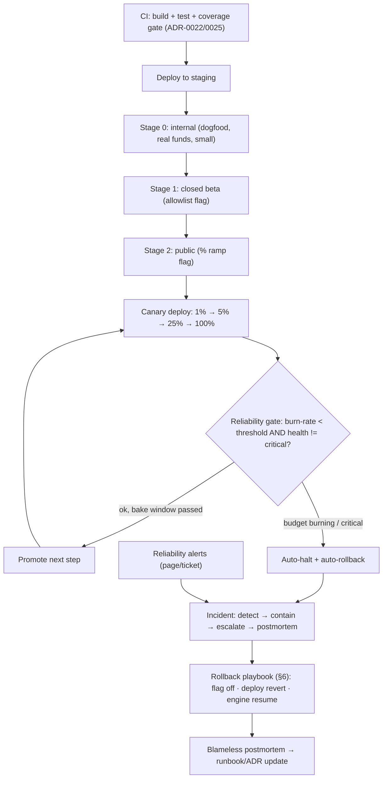
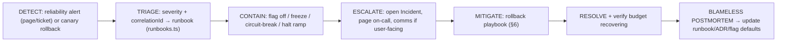

# 31 — Launch Readiness & Day-2 Operations

> Package: _none new — orchestrates existing engines_ · ADR: [0027](../adr/0027-deployment-topology.md), [0022](../adr/0022-cicd-platform.md), [0043](../adr/0043-reliability-and-self-healing.md) · Status: **process + infra (documented, not coded)** · related: [24 — Observability/SRE](24-observability-sre.md), [25 — Global Scalability](25-global-scalability.md), [22 — Settlement](22-settlement-engine.md), [14 — Execution](14-execution-engine.md), [26 — Compliance](26-compliance-governance.md)

Every engine in this repo is built; this doc is how we _turn it on for real users without losing anyone's funds or trust_. It is deliberately **not a package** — it introduces no new deterministic core. Instead it wires the existing ones into a launch and day-2 operational discipline: the [Reliability engine](24-observability-sre.md)'s error-budget/burn-rate math becomes the **automated deploy gate**; [Compliance](26-compliance-governance.md) feature flags become the **launch dial**; and the **event-sourced, parkable** [Execution](14-execution-engine.md) + **replayable-ledger** [Settlement](22-settlement-engine.md) engines are what make rollback _bounded_ rather than catastrophic. The doctrine holds through launch: because keys never leave the device and no server can sign, the worst a bad deploy can do is a **liveness event, never a loss-of-funds event** — the property that lets us ship aggressively behind flags. CODE reused: reliability, scale, settlement, execution, compliance. INFRA documented here: CI/CD gates, canary/blue-green mechanics, backups/PITR, on-call, DR drills.

## 1. Launch → detect → contain → recover control loop



The gate is not a human eyeballing Grafana: it is `packages/reliability` computing burn-rate over the canary's SLIs and returning `promote | hold | rollback`. A human can override to hold, never to force-promote through a burning budget.

## 2. Staged rollout

Additive rings; each ring must bake clean before the next opens. Ring membership is a **flag audience**, not a separate build.

| Stage               | Audience                                                     | Gate to advance                                                                       | Blast radius           |
| ------------------- | ------------------------------------------------------------ | ------------------------------------------------------------------------------------- | ---------------------- |
| **0 — Internal**    | Team + dogfood devices, real funds, capped micro-USD limits  | 1 week clean; every intent path exercised on all 3 chains (BTC/EVM/SOL)               | Us only                |
| **1 — Closed beta** | Allowlist (identity flag `beta`), invite codes, ≤ N users    | error budget ≥ 99% intact over the window; zero P0/P1; NPS + fund-safety survey clean | Consenting beta cohort |
| **2 — Public ramp** | Everyone, gated by a `%` rollout flag: 1 → 5 → 25 → 50 → 100 | each step bakes ≥ 24 h with burn-rate < 2× (slow) and no `FAST_BUDGET_BURN`           | Bounded to the ramp %  |

Chain-by-chain and feature-by-feature ramps are independent flags — e.g. Bitcoin sends can sit at 25% while EVM is at 100%, and Automation/Solver can launch on their own dial without moving the core send/swap dial. New white-label tenants launch on **their own** per-tenant flag ([Compliance §7 white-label profiles](26-compliance-governance.md)) over the same rings, so a tenant's rollout never disturbs another's.

## 3. Deployment strategies

Two mechanisms, chosen by workload shape. Both are INFRA (Argo Rollouts / mesh traffic split on the regional K8s of [ADR-0021](../adr/0021-kubernetes-strategy.md)); both are **gated by the reliability engine**, not by wall-clock alone.

| Workload                                                                       | Strategy                                         | Why                                                                              | Gate                                                                                                       |
| ------------------------------------------------------------------------------ | ------------------------------------------------ | -------------------------------------------------------------------------------- | ---------------------------------------------------------------------------------------------------------- |
| **API / intent / router** (stateless, request-path)                            | **Blue/green**                                   | instant, atomic cutover + instant switchback; no mixed-version request confusion | smoke + synthetic intents on green; flip; hold blue hot for the bake window                                |
| **Everything ramp-worthy** (new engine behaviour, planner changes, risk rules) | **Canary**                                       | progressive exposure with a real budget signal per step                          | `decideCanary` (§4) on the canary cohort's SLIs                                                            |
| **Execution / settlement workers** (stateful sagas)                            | **Rolling, drain-aware**                         | in-flight sagas must not be killed mid-step                                      | drain to a safe boundary first (§6); new pods resume parked work                                           |
| **DB / schema**                                                                | **Expand→migrate→contract**, backward-compatible | no lockstep deploy; old + new code both read the schema                          | migrations reversible or additive-only; never a destructive step in the same release that ships the reader |

Config/flag changes deploy through the **global control plane** ([Scale §9](25-global-scalability.md)) — thin, no hot-path load — so a launch dial moves in seconds without a redeploy.

## 4. The automated canary gate (reliability engine as CI/CD control)

The canary controller is a thin loop over `packages/reliability`; it owns **no new math**.

```
decideCanary(step, canarySLIs, baselineSLIs, budget, now) → 'promote' | 'hold' | 'rollback'
  fold canary SLIs → burn rate + ServiceHealth (reliability §3–4, worsen-only)
  FAST_BUDGET_BURN (≥14.4×) OR health=critical            → rollback   (auto)
  SLOW_BUDGET_BURN (≥3×)   OR canary p99 ≫ baseline p99    → hold       (stop ramp, page)
  bake window elapsed AND budget intact AND health healthy → promote
  otherwise                                                → hold
```

| Binding invariant            | Statement                                                                                                                                                                                          |
| ---------------------------- | -------------------------------------------------------------------------------------------------------------------------------------------------------------------------------------------------- |
| **Budget is the gate**       | No canary step promotes while its error budget is burning ≥ slow threshold. The gate reuses reliability's `slo.ts`/`health.ts`; deploy tooling never re-implements the math.                       |
| **Auto-rollback is bounded** | `rollback` triggers exactly one revert action via an injected actuator, then **escalates** — it never loops or re-deploys (same bound as self-healing, [reliability §6](24-observability-sre.md)). |
| **No promote through red**   | A human may force `hold`; no human or automation can force `promote` while the gate says rollback.                                                                                                 |
| **Bake before blast**        | Every step honours a minimum bake window; a clean 30-second window never promotes a change that fails at hour 3.                                                                                   |

Freeze interaction: an active **change freeze** ([Compliance governance](26-compliance-governance.md) / reliability §6) makes the gate refuse _all_ promotes — launches pause, in-flight canaries hold at their current %.

## 5. Incident response runbook

Detection is automatic (reliability alerts); the human process is contain → escalate → resolve → learn.



| Severity | Definition                                                                   | Response                                                                                                                           |
| -------- | ---------------------------------------------------------------------------- | ---------------------------------------------------------------------------------------------------------------------------------- |
| **P0**   | Funds at risk, security incident, or total outage                            | Page immediately; **contain first** (kill switch / freeze); IC + comms; settlement/execution ledgers pulled for the correlation id |
| **P1**   | Degraded money movement (elevated park/compensation rate, settlement stalls) | Page; halt ramp; auto-rollback usually already fired                                                                               |
| **P2**   | Partial degradation, one region/vendor/chain                                 | Ticket + on-call; provider failover / region `route()` shift ([Scale §7](25-global-scalability.md))                                |
| **P3**   | Cosmetic / no user impact                                                    | Ticket, next business day                                                                                                          |

The runbook for each alert code is **data**, not tribal knowledge: `packages/reliability`'s `runbooks.ts` maps every alert code → ordered diagnostics + remediation + the auto-action, rendered next to the page. Every incident is correlation-linked, so an IC replays the exact [Settlement ledger](22-settlement-engine.md) and [Execution events](14-execution-engine.md) for the affected users — no guessing where funds are.

## 6. Rollback playbooks — why rollback is _bounded_

Rollback has three layers; reach for the cheapest that contains the blast. The engines are what make the deep layers safe.

| Layer                    | Action                                                                  | Bound / safety                                                                                                                                                                                                                                                     |
| ------------------------ | ----------------------------------------------------------------------- | ------------------------------------------------------------------------------------------------------------------------------------------------------------------------------------------------------------------------------------------------------------------ |
| **1 — Flag** (seconds)   | Turn the launch/feature flag off or ramp % down via the control plane   | No redeploy; instant; the first move for a bad feature. Compliance **kill switch** overrides all flags.                                                                                                                                                            |
| **2 — Deploy** (minutes) | Blue/green switchback (API) or canary `rollback` to the last-good image | Previous version stays hot through the bake window; switchback is atomic.                                                                                                                                                                                          |
| **3 — State** (bounded)  | Let in-flight sagas settle to a safe boundary; **drain, don't kill**    | Execution is **event-sourced + parks** (funds location always recorded); Settlement is **idempotent + resumable** over a **replayable ledger**. Rolled-back code re-attaches and `resume()`s from the first unconfirmed step — no double-spend, no stranded funds. |

Binding invariants:

- **No destructive DB step ships in the same release as its reader** — schema is expand→contract, so a code rollback never faces a schema it can't read (§3).
- **A rollback never re-signs or re-broadcasts a confirmed step** — settlement idempotency (id derived from plan id) + execution's "confirmed steps never re-run" guarantee it.
- **Worst case is liveness, not loss** — because the server can't sign, a fully botched deploy pauses money movement (everything parks safely); it cannot move funds wrongly. Users' funds sit on-chain, locatable, resumable.
- **Rollback is idempotent and single-shot** — the auto-rollback path fires one revert then escalates; humans drive any further steps.

## 7. SLOs & error budgets (the launch contract)

Per-service objectives owned by `packages/reliability`; these are the numbers the canary gate and on-call defend. Budget = `1 − objective`; **burn rate** = `failureRate / allowedRate` (reliability §3).

| Service / path         | SLO (p95 / availability)                        | Budget policy                                      |
| ---------------------- | ----------------------------------------------- | -------------------------------------------------- |
| API                    | < 200 ms · 99.99%                               | 14.4× burn ⇒ page + auto-rollback; 3× ⇒ hold ramp  |
| Intent planning        | < 500 ms · 99.9%                                | 3× ⇒ hold                                          |
| Settlement success     | ≥ 99.9% of approved plans settle or safely park | any park/compensation-rate spike ⇒ P1              |
| Execution              | 0 stranded funds (hard invariant, not a %)      | any stranded-funds event ⇒ P0, freeze              |
| Availability (overall) | 99.99%                                          | multi-window burn alerts (reliability roadmap §10) |

Fund-safety is an **invariant, not an SLO** — there is no acceptable budget for lost funds; a single event is a P0 freeze, not a statistic.

## 8. Data model (launch/ops metadata — small, control-plane)

| Entity         | Fields (sketch)                                                                                                   | Notes                                      |
| -------------- | ----------------------------------------------------------------------------------------------------------------- | ------------------------------------------ |
| `release`      | `id, version, git_sha, strategy(blue_green\|canary\|rolling), stage, status, created_at`                          | one row per shipped artifact               |
| `canary_step`  | `release_id FK, pct, started_at, bake_until, gate_verdict(promote\|hold\|rollback), burn_rate, health`            | audit trail of every gate decision         |
| `feature_flag` | reuse [Compliance `feature_flags`](26-compliance-governance.md): `scope, feature, enabled, audience, rollout_pct` | launch dial = flag; no new store           |
| `incident`     | reuse reliability `Incident`: `id, correlation_id, severity, opened_at, resolved_at, runbook_code`                | correlation-linked to settlement/execution |
| `dr_drill`     | `id, kind(az_kill\|region_blackhole\|vendor_fail\|restore), ran_at, rto_ms, rpo_ms, passed`                       | evidence the drills actually run           |

No new engine; `release`/`canary_step`/`dr_drill` are thin control-plane tables, flags and incidents are **reused** from existing modules.

## 9. Day-2 operations checklist

| Area               | Practice                                                                                                                                                                                                         |
| ------------------ | ---------------------------------------------------------------------------------------------------------------------------------------------------------------------------------------------------------------- |
| **Backups**        | Continuous DB backups + **point-in-time recovery** ([Scale §11](25-global-scalability.md)); backups are **client-encrypted, opaque ciphertext** — non-custodial, we never hold keys.                             |
| **Restore drills** | Periodic restore-from-backup **and** event-log replay drills; a backup unverified by restore is not a backup.                                                                                                    |
| **On-call**        | Follow-the-sun rotation, primary + secondary, defined escalation ladder; every page carries its runbook (`runbooks.ts`). Page budget tracked — chronic paging is a bug, filed as one.                            |
| **DR drills**      | Scheduled chaos: kill an AZ, blackhole a region, fail a top RPC vendor ([Scale §13](25-global-scalability.md)); assert graceful degradation + RTO/RPO, log a `dr_drill` row.                                     |
| **RTO/RPO**        | Read path RTO minutes / RPO ~0 (replicated); **execution RPO 0** (event-sourced, idempotent replay). Targets asserted by drills, not assumed.                                                                    |
| **Capacity**       | Watch autoscaler headroom + queue lag ([Scale §4/§8](25-global-scalability.md)); pre-scale ahead of known events (airdrop claim storm, market-crash execution spike).                                            |
| **Security**       | Security signal ⇒ `circuit_break` **and escalate**, never silent auto-heal ([reliability §6](24-observability-sre.md)); dependency/secret rotation on a cadence ([ADR-0023](../adr/0023-secrets-management.md)). |
| **Cost**           | Spot for interruptible workers, TTL'd caches, storage lifecycle ([Scale §12](25-global-scalability.md)); review post-launch spend vs. the [cost model](10-cost-and-scale.md).                                    |
| **Comms**          | Public status page fed by the SLO rollups; user-facing incidents get proactive comms — trust is the product.                                                                                                     |

## 10. Implementation roadmap (additive)

1. **Stage A — Gate the pipeline.** CI build/test/coverage gate ([ADR-0022/0025](../adr/0022-cicd-platform.md)) → staging → single-region blue/green for the API. Wire `decideCanary` over reliability SLIs as a manual-approval assist. Flags via the compliance store. Backups + PITR on from day one.
2. **Stage B — Automate the canary gate.** Argo Rollouts + mesh traffic split; the reliability gate drives promote/hold/**auto-rollback** unattended. Internal → closed-beta rings live. Runbooks rendered on every page; on-call rotation stood up.
3. **Stage C — Public ramp + DR.** Per-chain / per-feature / per-tenant `%` flags for the public ramp; second region (active-active reads); scheduled DR drills logging `dr_drill` rows; blameless-postmortem loop feeding runbook/ADR updates.
4. **Stage D — Full program.** Multi-window burn-rate alerts, load + chaos program ([Scale §13](25-global-scalability.md)), status page + comms automation, cost tuning. Launch discipline becomes routine, not heroic.

Every stage is additive and reuses existing engines — the launch machinery adds process and thin control-plane infra, **never a new signing path and never a way for a server to move funds**. That boundary, drawn everywhere else in this architecture, is what makes shipping fast _safe_.

## Related

- Gate + alerts + runbooks + self-healing bounds: [24 — Observability/SRE](24-observability-sre.md) ([ADR-0043](../adr/0043-reliability-and-self-healing.md)). Autoscaling, regional `route()`, DR, load/chaos: [25 — Global Scalability](25-global-scalability.md) ([ADR-0044](../adr/0044-global-scalability.md)). Bounded rollback substrate: [22 — Settlement](22-settlement-engine.md) (replayable ledger) + [14 — Execution](14-execution-engine.md) (event-sourced parks). Launch dials + kill switch + white-label tenants: [26 — Compliance](26-compliance-governance.md) ([ADR-0045](../adr/0045-compliance-and-governance.md)). Deployment topology + freeze: [ADR-0027](../adr/0027-deployment-topology.md); CI/CD: [ADR-0022](../adr/0022-cicd-platform.md); K8s: [ADR-0021](../adr/0021-kubernetes-strategy.md); secrets: [ADR-0023](../adr/0023-secrets-management.md).
