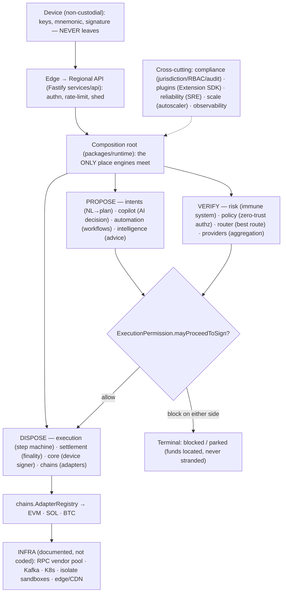

# 32 — Version 1.0 Master Blueprint

> Package: _(none — this doc is the synthesis)_ · ADR: none new (this doc **freezes** [0001](../adr/0001-monorepo-and-package-manager.md)–[0046](../adr/0046-plugin-marketplace.md)) · Status: **engine cores DONE + NL→plan→execute loop running · production launch NOT done** · related: [README](README.md), [architecture-review-2026-07](architecture-review-2026-07.md), [25-global-scalability](25-global-scalability.md), [07-api](07-api.md)

This is the capstone. Twenty-seven architecture docs and forty-six ADRs describe a platform whose doctrine is one sentence — **X proposes, deterministic code verifies, the device signature disposes** — and whose entire structure exists to make that sentence unbreakable at every layer. This doc does not add an engine. It states the **truthful state of the platform**: what is CODE (twenty-five pure engine cores + a composition root, tested, running an end-to-end NL→plan→authorize→execute loop today) versus what is INFRA-or-unbuilt (production dist build, real vendor/RPC integration, real device-signing wiring, mobile app, external audit). It freezes the v1 API surface, certifies the p95 targets against each path, indexes the frozen docs, lists the honest launch gaps, and points at V2/V3. Read it as the map you hand a new principal engineer on day one.

## 1. Final architecture review — the layered map

Twenty-five domain packages, one composition root, one HTTP service, one web client. The dependency graph is **acyclic and cleanly layered** (verified in [architecture-review-2026-07](architecture-review-2026-07.md)); every engine is a pure core over injected sources ([ADR-0030](../adr/0030-universal-identity-and-portfolio-layering.md) doctrine). Layers, bottom-up:

| Layer              | Packages                                           | Role                                                                                          | Doctrine position                                                                                                                                        |
| ------------------ | -------------------------------------------------- | --------------------------------------------------------------------------------------------- | -------------------------------------------------------------------------------------------------------------------------------------------------------- |
| **L0 Device**      | `core`                                             | mnemonic, HD derivation, EVM/BTC/SOL signing, session-lock, `SecureStore`                     | keys live here; nothing above can sign                                                                                                                   |
| **L1 Chains**      | `chains`, `identity`, `portfolio`                  | `BlockchainAdapter` per ecosystem + `AdapterRegistry`; identity↔account map; unified balances | chains are adapters ([03](03-data.md), [11](11-universal-identity.md), [12](12-blockchain-adapters.md))                                                  |
| **L2 Foundation**  | `config`, `observability`, `events`, `ui`          | typed env, structured errors/logs, event schema registry, tokens                              | plumbing — boring on purpose                                                                                                                             |
| **L3 Verify**      | `risk`, `policy`, `router`, `providers`            | immune system; zero-trust authz; best-route IP; health-scored aggregation                     | **deterministic code verifies** ([16](16-route-optimizer.md), [17](17-security-risk-engine.md), [19](19-policy-engine.md))                               |
| **L4 Propose**     | `intents`, `copilot`, `intelligence`, `automation` | NL→plan; AI decision layer; financial advice; autonomous workflows                            | **X proposes** ([13](13-intent-engine.md), [18](18-portfolio-intelligence.md), [20](20-ai-copilot.md), [21](21-automation-engine.md))                    |
| **L5 Dispose**     | `execution`, `settlement`, `solver`                | resumable step machine; finality/ledger; competitive solving                                  | **the signature disposes** ([14](14-execution-engine.md), [22](22-settlement-engine.md), [23](23-solver-network.md))                                     |
| **L6 Cross-cut**   | `compliance`, `plugins`, `reliability`, `scale`    | jurisdiction/RBAC/audit; Extension SDK; SRE; autoscaler+resilience                            | governance & survival ([24](24-observability-sre.md), [25](25-global-scalability.md), [26](26-compliance-governance.md), [27](27-plugin-marketplace.md)) |
| **L7 Composition** | `runtime`                                          | the composition root — the **only** place engines meet                                        | wires L1–L6 into one `EngineContext`                                                                                                                     |
| **L8 Surface**     | `services/api` (Fastify), `apps/web` (React)       | HTTP + WebSocket; client                                                                      | `POST /v1/intents/plan` is live                                                                                                                          |

The one non-negotiable: **money = integer micro-USD (`bigint`)** everywhere it moves; derived statistics (returns/vol/weights/scores) are `number`. The `bigint`/`number` boundary is a reviewed invariant, not a convention.

## 2. The API freeze (v1 surface)

`/v1` is a **major-versioned, additive-only** contract ([07-api](07-api.md)): within v1, add endpoints/fields — never break one; deprecations run ≥90 days with a `Sunset` header. These endpoints are **frozen** as the v1 promise:

| Group              | Frozen endpoints                                                                                                                       | Status                                             |
| ------------------ | -------------------------------------------------------------------------------------------------------------------------------------- | -------------------------------------------------- |
| Auth               | `POST /v1/auth/{challenge,verify,refresh,revoke}`                                                                                      | spec frozen · handlers pending                     |
| Identity           | `POST/GET /v1/identities…` · `PUT/GET /v1/backups…` · `/v1/contacts` CRUD                                                              | spec frozen                                        |
| **Intents (core)** | `POST /v1/intents/parse` · `POST /v1/intents` · **`POST /v1/intents/:id/plan`** · `POST /v1/plans/:id/approve` · `GET /v1/intents/:id` | **`/plan` LIVE** (via `runtime`); rest spec-frozen |
| Execution          | `GET /v1/executions/:id` · `POST /v1/executions/:id/resume` · `GET /v1/executions`                                                     | spec frozen · seam built (fake driver)             |
| Portfolio          | `GET /v1/portfolio/:id[/asset/:assetId]` · `/v1/activity` · `/v1/prices`                                                               | spec frozen                                        |
| Risk               | `POST /v1/risk/scan`                                                                                                                   | spec frozen · engine done                          |
| Enterprise / WS    | `/v1/enterprise/*` · `wss://…/v1` · signed webhooks                                                                                    | spec frozen                                        |

**Freeze invariants:** (1) every mutating POST honors `Idempotency-Key`; (2) errors are RFC-9457 problem+json with a stable machine `code`; (3) amounts on the wire are `{amount: string, decimals}` — **no floats**; (4) `/v1/intents/:id/plan` returns a plan with `expires_at` (30 s hard) and never a signed transaction — the device signs `/plans/:id/approve`. What is genuinely live today is exactly one endpoint (`POST /v1/intents/plan`, currently un-versioned in the path) wired to the composition root; the rest are frozen shapes awaiting handlers. **That gap is the launch work of §5, not a redesign.**

## 3. Performance certification (p95, from [doc 25 §13](25-global-scalability.md))

Targets are **binding budgets**, asserted by the load-test program (ramp to 1M concurrent + peak events), not aspirations. Each target maps to a path and the engines on it:

| Path               | p95 target   | Engines on the path                               | Certified by                                                                                           |
| ------------------ | ------------ | ------------------------------------------------- | ------------------------------------------------------------------------------------------------------ |
| API (any read)     | **< 200 ms** | gateway → cache/replica                           | mesh RED metrics + edge cache (95% hit)                                                                |
| Intent planning    | **< 500 ms** | `intents` parser+planner over injected sources    | pure engine ⇒ deterministic latency; LLM path budgeted separately (parse < 2.5 s, [README](README.md)) |
| Route optimization | **< 300 ms** | `providers` aggregate → `router` score+ML re-rank | best-of-N with stale-quote reject                                                                      |
| Portfolio load     | **< 2 s**    | `portfolio` aggregate + `intelligence` analytics  | eventual-consistency read path, cached                                                                 |
| Availability       | **99.99%**   | all — regional isolation, no SPOF                 | active-active reads; execution favors correctness over availability                                    |

Certification method: every load run asserts the p95s **and** that the `scale` autoscaler reaches steady state without flapping, the shedder protects `critical` (in-flight settlement/security), and DLQ depth stays bounded ([25 §13](25-global-scalability.md)). **Not yet run against production hardware** — the engines are pure so their compute cost is measured and small, but the certified numbers require the real dist build + real RPC latency (§5).

## 4. Documentation freeze index

The design corpus is **frozen at v1.0** with this doc as its capstone. Additive edits only; supersede via new ADRs.

| Set          | Range                                                                                             | Contents                                                                                                                       |
| ------------ | ------------------------------------------------------------------------------------------------- | ------------------------------------------------------------------------------------------------------------------------------ |
| Architecture | **[01](01-system-overview.md)–[10](10-cost-and-scale.md)**                                        | system/services/data/flows/infra/security/API/repo/decisions/cost — the platform substrate                                     |
| Engine docs  | **[11](11-universal-identity.md)–[27](27-plugin-marketplace.md)**                                 | one doc per engine, each: doctrine intro · mermaid · invariants · data model · Stage A→D roadmap                               |
| This doc     | **32**                                                                                            | the synthesis / freeze marker _(docs 28–31 reserved: white-label, AI-agent framework, security-audit, launch-ops — see §6/§5)_ |
| ADRs         | **[0001](../adr/0001-monorepo-and-package-manager.md)–[0046](../adr/0046-plugin-marketplace.md)** | 46 canonical decisions, supersede-only ([adr/README](../adr/README.md)); 0001–0028 stack, 0029–0046 one per engine             |
| Requirements | [`requirements.md`](../../requirements.md)                                                        | the PRD (WHAT); this set is the HOW                                                                                            |
| Security     | [wallet-core-threat-model](../security/wallet-core-threat-model.md)                               | + per-engine threat models inline                                                                                              |

**Honest note:** the doc numbering has a gap (27 arch docs exist, this is 32). Docs 28–31 were roadmap slots (white-label / AI-agent / audit / launch-ops); their content is folded into §5–§6 here rather than forked into thin stubs.

## 5. Production launch checklist — the honest remaining gaps

**DONE (real, tested):** 25 engine cores as pure deterministic libraries over injected fakes; ~700 tests green; typecheck/lint/format clean; git hooks enforced; the composition root (`packages/runtime`) wiring `intents`+`risk`+`identity`+`policy`+`execution`; and a **running end-to-end loop** — `POST /v1/intents/plan` → parse → plan → (holdings·prices·routes·**real** risk·recipient resolution) → verified `ExecutionPlan`, plus `authorize()` (Policy∘Risk gate) and `execute()` over an injected step driver.

**NOT DONE (blocks a real launch):**

| #   | Gap                                  | What it means                                                                                                                                                                                                   | Blocker?      |
| --- | ------------------------------------ | --------------------------------------------------------------------------------------------------------------------------------------------------------------------------------------------------------------- | ------------- |
| 1   | **Production dist build**            | engines run under Vitest/ts-src via `paths`+alias; no compiled, tree-shaken, published dist per package                                                                                                         | yes           |
| 2   | **Real vendor/RPC integration**      | `providers` interfaces have only fakes — need 0x/1inch/Jupiter (swap), LiFi/Across (bridge), CoinGecko (price), per-chain gas, Tenderly (sim) behind the plugin boundary; `chains` needs a real RPC vendor pool | yes           |
| 3   | **Real device-signing wiring**       | the `execute()` seam uses a fake `StepDriver`; the REAL one wires `core.WalletSigner` + `chains.AdapterRegistry` + `router` + `risk` + vendor plugins — **the seam that moves money**                           | yes (safety)  |
| 4   | **Pre-broadcast re-validation gate** | plan-time checks (balance, route liveness, risk, slippage) must be **re-run at sign time** inside `execution` — the CRITICAL gap flagged in the [review](architecture-review-2026-07.md)                        | yes (safety)  |
| 5   | **Backend handlers**                 | `services/api` wires exactly one engine; the frozen §2 surface needs its handlers + auth (challenge/verify/refresh) + WS + idempotency store                                                                    | yes           |
| 6   | **Mobile app**                       | Expo shell deferred (needs a simulator; handbook 06 §8) — no shipped iOS/Android client                                                                                                                         | yes (product) |
| 7   | **External security audit**          | independent audit of the signing path, the isolate sandbox ([27](27-plugin-marketplace.md)), and the non-custodial guarantee before any mainnet funds                                                           | yes           |
| 8   | **Infra stand-up**                   | K8s/Kafka/edge/multi-region are **documented** ([05](05-infrastructure.md), [25](25-global-scalability.md)) not provisioned; IaC apply + DR drills pending                                                      | yes           |

The doctrine makes gap #3/#4 the ones to guard hardest: because keys never leave the device, worst-case server loss is a **liveness** event, never loss-of-funds — but a mis-wired sign seam would forfeit exactly that property. **No mainnet money moves until #3, #4, and #7 are closed.**

## 6. Vision — V2 / V3

Additive on the frozen substrate; each is an existing engine maturing, not a rewrite.

| Theme                            | V1 today                                                                                                                          | V2                                                                                           | V3                                                                                                |
| -------------------------------- | --------------------------------------------------------------------------------------------------------------------------------- | -------------------------------------------------------------------------------------------- | ------------------------------------------------------------------------------------------------- |
| **Decentralized solver network** | `solver` core: verified-not-trusted proposals, reputation, staking/slashing ([23](23-solver-network.md))                          | permissioned solver set competing on real routes; on-chain reputation                        | open, staked, cross-domain solver market; MEV-aware settlement                                    |
| **Plugin marketplace**           | `plugins` Extension SDK: capability permissions, trust levels, signing gauntlet, isolate sandbox ([27](27-plugin-marketplace.md)) | curated marketplace, revenue share, verified publishers                                      | open ecosystem; third-party intent/risk/analytics plugins as first-class engines                  |
| **AI agent framework**           | `copilot` (constrained decision layer) + `automation` (gated autonomous workflows) — both structurally **cannot** sign            | specialized agents (tax, rebalancing, yield) behind the same gate; multi-agent orchestration | planning-vs-execution separation as a public agent SDK; tool routing over the capability registry |
| **Cross-chain intents**          | `intents` plans single-outcome; `router` sees multi-venue; `providers` has bridge interface                                       | first-class cross-chain intents (BTC→ETH→SOL in one plan) with atomic-ish settlement         | intent-centric cross-chain: user states the outcome, the solver network fills it across N domains |
| **White-label**                  | `compliance` feature-flags + jurisdiction profiles + RBAC; `plugins` trust model                                                  | tenant branding/theme/feature-flags over existing primitives (reserved doc 28)               | multi-brand platform; enterprise self-serve                                                       |

The V2/V3 north star is the **capability registry** (CTO standing recommendation): a central, dynamic record of what each chain/provider/plugin supports — so `intents` and `router` decide over live capabilities, and adding chain #9 or provider #20 touches one registry, not nine engines. That is the seam that turns a wallet into a platform.

## 7. Implementation roadmap (additive)

- **Stage A — Wire reality (now):** close launch gaps #2–#5 — real vendor plugins, the REAL device-signing `StepDriver`, the pre-broadcast re-validation gate, and the §2 handlers. One region, modular monolith. This is the single step from "25 tested libraries" to "a system that moves money safely."
- **Stage B — Ship the client:** the Expo mobile app + `apps/web` parity over the frozen `/v1` surface; the SDK (`@intent-wallet/sdk`) with a bring-your-own-signer callback.
- **Stage C — Certify & audit:** run the load program against real hardware to certify §3 p95s; external security audit of the signing + sandbox paths; stand up infra (IaC apply, DR drills).
- **Stage D — Platform:** capability registry, solver network + plugin marketplace maturity, cross-chain intents, white-label — the §6 vision.

Every boundary that makes these additive — pure cores over injected sources, the single composition root, `bigint` money, the non-custodial signing seam, additive-only `/v1` — is **already drawn**. That is the point of the freeze: nothing here requires an architectural rewrite. The remaining work is integration and hardening, not design.
