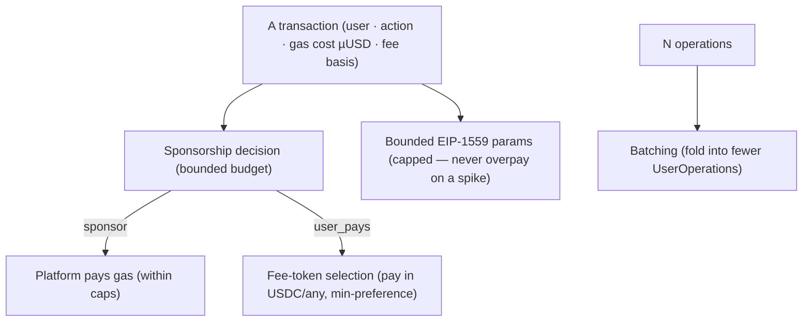

# 33 — Gas Abstraction & Smart Accounts

> Package: [`packages/gas`](../../packages/gas) · ADR: [0050](../adr/0050-gas-abstraction.md) · Status: **engine implemented** (11 tests) · related: [Execution (14)](14-execution-engine.md), [Providers (15)](15-provider-framework.md), [Chains (12)](12-blockchain-adapters.md)

"A user should never have to hold ETH to send USDC, or watch a fee spike." Gas abstraction makes that true — and, like every other engine, it does so as a **deterministic decision core** that is bounded so a bug can't cost real money. `packages/gas` DECIDES; the ERC-4337 UserOperation construction + paymaster signing is execution/infra.

## 1. What it decides

## 2. Binding invariants

1. **Sponsorship is bounded.** A per-transaction cap AND a per-user-per-UTC-day cap; it fails toward `user_pays` (the safe direction — the user can always pay their own gas), never toward over-sponsoring. A bug or a spam attack can't drain the paymaster.
2. **The paymaster is never short.** Fee-token amounts round UP and add a margin, so a small price move between quote and execution can't underpay.
3. **Never overpay.** EIP-1559 params are clamped to hard caps; during a base-fee spike the wallet pays at most the cap, never silently more.
4. **Decides, never signs.** It computes sponsorship / fee-token / params / batching; the UserOperation and paymaster signature happen in execution, device-side. Non-custodial preserved.
5. **Deterministic.** Only the clock is injected (for the daily budget window); everything else is pure bigint math.

## 3. Modules

| Module           | Responsibility                                                                                                      |
| ---------------- | ------------------------------------------------------------------------------------------------------------------- |
| `sponsorship.ts` | `decideSponsorship` → sponsor / user_pays, bounded by per-tx + daily budget; `recordSponsorship` threads the spend. |
| `feetoken.ts`    | `selectFeeToken` → the preferred held token that covers gas + margin, exact base-unit amount (rounded up).          |
| `estimate.ts`    | `computeGasParams` → EIP-1559 maxFee/maxPriority scaled by speed, clamped to caps (`bounded` flag).                 |
| `batch.ts`       | `decideBatch` / `batchCount` → fold N ops into ≤ `maxBatchSize` UserOperations.                                     |
| `engine.ts`      | `GasEngine.quote` → one call: sponsorship → (if user pays) fee token → bounded params; threads the daily budget.    |

## 4. What's infra (not here)

The ERC-4337 bundler, the paymaster contract + its signature, the EntryPoint, and the actual smart-account deployment are on-chain + infra — this engine produces the _decisions_ they act on. Chain-specific gas mechanics (BTC sat/vByte, SOL compute units) reuse the [chain adapters'](12-blockchain-adapters.md) `estimateFees`; the EIP-1559 math here is the EVM path.

## 5. Roadmap

1. **Stage A (now):** the decision engine (this package) + a static sponsorship policy.
2. **Stage B:** wire it into the [execution](14-execution-engine.md) StepDriver — quote gas per step, attach the fee token / sponsorship to the UserOperation.
3. **Stage C:** a real paymaster + bundler integration; per-tenant sponsorship budgets (via [white-label (28)](28-white-label.md)).
4. **Stage D:** cross-chain gas (pay once, execute across chains) as the solver/settlement layers mature.
