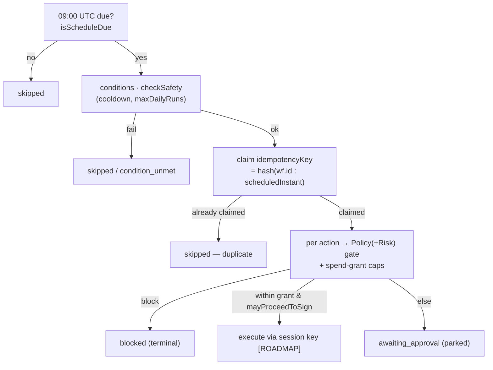
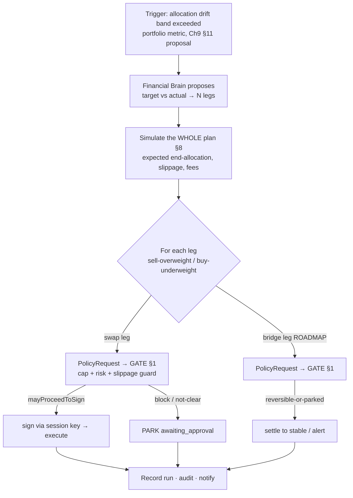

[Founder Bible](../../FOUNDER_BIBLE.md) · Project Aether · Volume V — the long-form behind [Chapter 14 — Automation Engine](../bible/chapter-14-automation-engine.md)

# The Automation Engine Reference

*Automate routine workflows without surrendering control — grounded in the real automation engine, with one law central: automation depth = authorization depth.*

**About this document.** [Chapter 14](../bible/chapter-14-automation-engine.md) is the memorize-it charter.
This is its **reference spec**: the architecture & safety gate, conditional intents, scheduled & recurring,
auto invest/bridge/stake/rebalance, smart yield optimization, AI-driven suggestions, safety policies &
approval rules, simulation/monitoring/transparency, and the boundary — each tagged **SHIPPED** or
**ROADMAP**. The invariant: **nothing runs beyond a cryptographically-granted, capped, revocable, auditable
permission; the AI never signs.**

| § | Section | Grounded in |
|---|---|---|
| 1 | Architecture & the Safety Gate | `packages/automation` + `autoDecision` (shipped) |
| 2 | Conditional Intents | `packages/automation` conditions/triggers (engine shipped) |
| 3 | Scheduled & Recurring | `packages/automation` scheduler (engine shipped) |
| 4 | Auto Invest / Bridge / Stake / Rebalance | Ch8 execution (largely roadmap) |
| 5 | Smart Yield Optimization | Ch9 + Ch10 (roadmap) |
| 6 | AI-Driven Suggestions | Ch9 §8 + the intelligence engine |
| 7 | Safety Policies & Approval Rules | `packages/policy` + `autoDecision` (shipped; session keys roadmap) |
| 8 | Simulation, Monitoring & Transparency | `packages/automation` simulate + the audit log |
| 9 | The Boundary & Definition of Done | the doctrine + Ch10 |

Honesty first: the automation engine, the Auto/Manual mode, and the deterministic policy gate are shipped;
the DCA/auto-bridge/auto-stake/rebalancing/conditional-intent products, yield optimization, and session keys
are roadmap.

---

## §1 · Automation Architecture & the Safety Gate

> **Section objective.** Define the machine that lets a user say *"buy ₹5,000 of BTC every Monday"* once and
> have it run itself — and the single law that keeps that machine from ever becoming a way to move money the
> user did not authorize. This is the load-bearing frame of the whole chapter: the pipeline
> (sources → trigger → conditions → compiler → scheduler → **the Safety Gate** → simulate → execute), the
> Auto/Manual mode that removes the per-tap confirm *within bounds*, and the one rule —
> **automation depth = authorization depth** — that §2 (conditional intents), §3 (scheduled & recurring),
> §4 (auto invest/bridge/stake/rebalance), §5 (yield), and §6 (AI suggestions) all inherit, that §7 codifies
> as policy grammar, and that §8 makes observable. Every later section is an *action type flowing through the
> gate this section builds.*

Automation is the doctrine's most easily-violated surface. Every other chapter puts a human between the plan
and the signature; this one is explicitly about *taking the human out of the loop for routine work.* The naïve
way to build it — an agent with the keys and a cron job — is a custodial bot wearing a wallet's clothes. We
refuse it. What makes our automation safe is not that we trust the rule, and not that the AI that wrote the
rule is clever. It is a structural guarantee, proven in code: **a fired workflow is provably no more capable
than a manual tap.** It reaches the exact same deterministic Risk/Policy gate a hand-driven transaction
reaches (Ch7 §16, Ch10 "Security sits between AI and execution"), and it disposes funds only through a
pre-authorized, *bounded* permission the user granted in advance. The engine orchestrates; it holds no keys
and authorizes nothing itself.

### 1.1 · The one law: automation depth = authorization depth

State it plainly, because everything downstream is a corollary:

> **Automation never exceeds a permission the user cryptographically granted.** An automated action runs only
> *within* the caps and policy the user configured; anything beyond requires an explicit, informed approval.
> Manual is the default. The safety decision **fails safe** — on any doubt it blocks or parks.

This is not a slogan bolted onto the engine; it is the engine's shape. The package header
(`packages/automation/src/engine.ts`) states the contract without hedging: *"The engine never authorizes
anything itself and never holds a key. A `block` from the gate is terminal; anything short of a clean
`mayProceedToSign` parks the action as `awaiting_approval`. This is what makes an automated action provably no
more capable than a manual one."* "Depth" is authority — how much value, to which recipients, under what risk,
for how long. A workflow's depth is *defined* by the grant it runs under, never by the ambition of the rule.
If the rule says "move everything" but the grant says "up to $50 to these two addresses," the rule can move
$50 to those two addresses and not one wei more. The gate, not the goal, decides.

### 1.2 · The pipeline: from a sentence to a gated action

A **`Workflow`** is a typed rule — `TRIGGER → CONDITIONS → ACTIONS` — modeled as a discriminated union
(`packages/automation/src/types.ts`), not a string DSL, so it typechecks at authoring time, serializes to
JSON, versions, and diffs. Money inside it is integer **`bigint` micro-USD (µUSD)** end-to-end
(`amountMicros`), never a float (Doctrine #4), and every timestamp is *injected*, never read from the clock —
the whole engine is deterministic and time-travel testable (`env.ts`). A firing walks a fixed lifecycle, and
each arrow is a stage that can only *narrow* what proceeds:

```
  sentence                         injected, never fetched
     │                                     │
     ▼                                     ▼
 COMPILER ──▶ Workflow ──▶ TRIGGER met? ──▶ CONDITIONS met? ──▶ SCHEDULER safety ──▶ idempotency claim
 (NL→typed)               (triggers.ts)    (conditions.ts)     (cooldown/day cap)   (one firing = one run)
                                                                                          │
                        ┌─────────────────────────────────────────────────────────────┘
                        ▼   per action:
                 ┌──────────────┐   block ─────────────▶ terminal (blocked)
                 │  SAFETY GATE │   not clear-to-sign ─▶ PARK (awaiting_approval)
                 │  Policy+Risk │   clear-to-sign ─────▶ SIMULATE ─▶ EXECUTE via session key
                 └──────────────┘
```

**Compiler (shipped core).** `compileTemplate` (`compiler.ts`) turns common utterances into a fully-typed
`Workflow` with *zero* LLM cost via deterministic templates — DCA (`buy ₹5,000 BTC every Monday`),
buy-the-dip / stop-loss, scheduled reward-claim, exploit-triggered exit. An injected `WorkflowLlmClient` is
the fallback for everything else. Critically, the compiler *"never grants authority, it only structures
intent"*: its output is data that will still run the gate. **AI proposes structure; deterministic code and the
device dispose.**

**Sources (shipped seam).** Triggers and conditions read *only* an injected `EvalContext` — prices (µUSD),
percentage moves, portfolio metrics, gas, variables, and active events — built by a `ContextProvider`
(`sources.ts`). Nothing in the core fetches a live feed or reads a clock, which is exactly what makes gating
logic deterministic and unit-testable.

**Trigger (shipped).** `triggerMet` (`triggers.ts`) decides whether the workflow fires *now.* Schedule
triggers fire by the injected clock, and `isScheduleDue` fires **once** for the most recent missed instant so
a burst of missed windows never replays as a burst of trades. Event triggers (price, portfolio drawdown, risk
event, gas, volatility, bridge incident, AI recommendation…) are matched against the `EvalContext`.

**Conditions (shipped).** `evaluateCondition` (`conditions.ts`) is a total, pure evaluator over a typed AST
(`and/or/not`, price/metric/gas/day-of-week/variable comparisons). It gates *whether* the actions run.

**Scheduler-level safety (shipped).** `checkSafety` (`safety.ts`) bounds *how often* a workflow fires —
`maxDailyRuns`, `cooldownSeconds`, `timeoutSeconds`. This is deliberately **not** authorization: its own header
is explicit that amount limits, trusted recipients, biometric thresholds and automation pre-approval *"is the
Policy Engine's job and is NOT duplicated here."* Two layers, two concerns — frequency here, authority at the
gate.

**Idempotency (shipped).** Before any action runs, the engine claims `env.hash(`${wf.id}:${instance}`)`
against the `RunStore` (`engine.ts`); a duplicate firing for the same trigger instant is dropped. One logical
firing executes at most once — the automation analogue of Ch8's exactly-once settlement.

Only after all of that does an action reach the gate.

### 1.3 · The Safety Gate is the *same* gate, applied per automated action

This is the mechanical heart of the one law, and it is worth being precise about, because "it uses the same
gate" is the whole safety argument. When a financial action is ready, the engine does not decide anything. It
translates the action into a `PolicyRequest` tagged `policyType: 'automation'` and stamped with the workflow's
id and owner (`mapActionToPolicyRequest`, `engine.ts`), then hands it to the injected `PolicyAuthorizer` — in
production, `PolicyEngine.evaluate` (`packages/policy/src/engine.ts`), which **always composes Risk
internally** and returns one `ExecutionPermission`. The engine then reads exactly the fields a manual flow
reads:

```ts
// packages/automation/src/engine.ts — runAction (elided)
const permission = await this.deps.authorizer.authorize(mapActionToPolicyRequest(action, wf, i));
if (permission.gate === 'block')            return blocked(permission);          // terminal, non-overridable
if (!permission.mayProceedToSign
    || wf.safety.requireApproval === true)  return awaitingApproval(permission);  // PARK for a human
// only here — clear to sign — does it execute, via the pre-authorized session key
```

`mayProceedToSign` is the single boolean the whole system trusts: in the Policy Engine it is true *iff*
`gate === 'allow'` and no confirmation `requirements` remain (`packages/policy/src/types.ts`). The automation
engine grants itself no exception to it. The mapping from the composed verdict to what the engine does is
total and fails safe:

| Composed gate | `mayProceedToSign` | Automated outcome |
|---|---|---|
| `allow` | `true` | **execute** via session key (or, in Auto UI, no confirm — see §1.4) |
| `require_confirmation` / `defer` / `escalate` | `false` | **park** as `awaiting_approval` — surfaces to the user |
| `block` | `false` | **blocked**, terminal — never retried, never overridden |
| authorizer *throws* | — | **blocked** — *"authorization failed — failing closed"* |

Two more fail-safe seams: a workflow may set `safety.requireApproval` to force a human even when policy would
allow (a floor the automation can raise but never lower), and the whole engine carries a `killSwitch` that
skips every workflow when tripped. Note also that pure **control actions** — `notify`, `report`,
`pause_workflow`, `disable_workflow` — never touch the gate, because they move no funds; only the financial
kinds (`swap`, `bridge`, `transfer`, `stake`, `unstake`, `approve`, `claim_rewards`, `execute_intent`) are
authorized. The gate this section describes is the *identical* deterministic Risk + Policy + capability gate
of Ch7 §5 and Ch10 — the same "most-restrictive wins, `block` on either side terminal" composition
(`packages/policy/src/index.ts`) — applied once per automated action. Because Policy can only ever *tighten*
Risk and never loosen it, and because the automation engine can only *narrow* what the gate returns, an
automated action is bounded above by exactly the manual action's authority. That is the theorem the whole
chapter rests on.

### 1.4 · Auto / Manual mode — the frictionless case, still gated

The pipeline above is the workflow engine (`packages/automation`). Its shipped, end-to-end sibling in the app
today is the **transaction mode** on the live AI execution flow (`apps/web/src/settings.ts`) — the thing a
user actually toggles. **Manual is the default:** every transaction is confirmed. **Auto** removes the per-tx
confirmation *within bounds the user set* — and only that. The distinction the module comment draws is the one
that matters: *"Auto never bypasses safety; it only removes the per-tx click once the user has consented to
bounded automation."* A signature still happens on-device (that is how a chain accepts a tx), the key never
leaves the browser, and the Risk/Policy gate still runs. Auto removes a *click*, not a *check*.

The decision is one pure, fail-safe function:

```ts
// apps/web/src/settings.ts — the auto-execute decision
export function autoDecision(usdVal: number | null, riskLevel: string): { auto: boolean; reason?: string } {
  if (getTxMode() !== 'auto')  return { auto: false };                       // Manual default → always confirm
  if (riskLevel === 'block')   return { auto: false, reason: '…risk engine' }; // a BLOCK is never auto
  const { perTxUsd, dailyUsd } = getAutoCaps();
  if (usdVal != null && usdVal > perTxUsd)                    return { auto: false, /* over per-tx cap */ };
  if (usdVal != null && autoSpentTodayUsd() + usdVal > dailyUsd) return { auto: false, /* over daily cap */ };
  return { auto: true };
}
```

Read it as four fail-safe gates in series: auto is possible *only* in Auto mode; a risk `block` is never
auto (the gate is non-overridable here too); a known USD value above the per-tx cap (default **$25**) parks
for a confirm; and a value that would push the day past the daily cap (default **$100**) parks. The caps bind
against a real-USD ledger that resets each calendar day (`autoSpentTodayUsd` / `recordAutoSpendUsd`), and
`setAutoCaps` clamps both ≥ 1 and forces the daily cap ≥ the per-tx cap — *"a daily cap below the per-tx cap is
nonsensical."* This is `autoDecision` embodying the one law at the app's altitude: automation depth is capped
at exactly the dollar authority the user dialed in.

Two honesty notes carried straight from the code. First, this web build **broadcasts on testnets only**, so
the caps mostly protect a *future* mainnet path — *"but they bind whenever a real USD value is known"*
(mainnet is opt-in and every mainnet broadcast is additionally guarded by an explicit confirm). Second, when
no real USD value is known (testnet, no priced asset), auto runs freely — the frictionless "just do it" case —
which is honest precisely because there is no real value at stake to cap.

### 1.5 · Non-custodial by construction — session keys and spend-grants

How does an automated action *sign* without the user present, and still stay non-custodial? Not by holding the
master key — the engine never sees it. It executes through a **pre-authorized, policy-bounded session key**
(`Workflow.sessionKeyId`; the `Executor` seam in `sources.ts`), which the comment underlines is *"never given
the master key, so automation stays non-custodial."* The session key is the cryptographic form of the granted
depth: a bounded, revocable capability the user approved once.

The shipped, deterministic core of that grant is `evaluateSpendGrant` (`packages/policy/src/grants.ts`) — the
authorization primitive for autonomous agents, *"a permission, not a wallet."* A `SpendGrant` is
*"bounded, revocable permission a human approves ONCE"*: a single asset, a cumulative `maxTotalBase`, an
optional per-tx `maxPerTxBase`, a recipient `allowlist`, an expiry `notAfterMs`, and a hard `revoked`
kill-switch — all in integer base units, `bigint`. The evaluator is total and fail-closed: *"Anything it
cannot positively authorize is denied."* It checks, in order, malformed inputs → revoked → expired → wrong
asset → recipient not allowlisted → over per-tx cap → over cumulative cap, and returns the remaining budget on
success. An empty allowlist authorizes *nobody*. This is the depth = authorization identity made literal:
depth is the grant's caps, and the grant is a signed thing the user can revoke.

**Benchmark.** Keeper-network automators (Gelato, Chainlink Automation) and DCA/limit-order bots make the same
promise — "run my rule when the condition hits" — but usually by holding an approval or a delegated key with
broad reach. Our boundary is narrower on purpose: the execution authority is a *capped, allowlisted, expiring*
grant, funds are disposed only by a device-held or session key, and the deterministic gate re-checks every
firing. The industry's cleanest expression of this shape is **ERC-4337 session keys** for bounded delegated
execution — which is precisely where we are headed and which we tag **roadmap**, not shipped.

### 1.6 · The honest inventory — the engine ships; the products largely do not

The single most important act of this section is to not overclaim. The *engine* exists and is real; most of
the *user products* built on it are roadmap. "The engine exists" ≠ "the product ships it."

| Capability | Status | Where / note |
|---|---|---|
| Workflow model (trigger→conditions→actions), pure & typed | ✅ **Shipped** | `packages/automation/src/types.ts` |
| Compiler (templates: DCA / dip / claim / exit) + LLM seam | ✅ **Shipped** (core) | `compiler.ts` — structures intent, grants no authority |
| Trigger / condition / scheduler-safety / idempotency | ✅ **Shipped** | `triggers.ts`, `conditions.ts`, `safety.ts`, `engine.ts` |
| **The Safety Gate** (per-action Policy+Risk authorization) | ✅ **Shipped** | `engine.runAction` → `PolicyEngine.evaluate` |
| `simulate` (dry-run: same gate, never executes/persists) | ✅ **Shipped** | `engine.simulate` — see §8 |
| Auto/Manual mode + `autoDecision` + USD caps + daily ledger | ✅ **Shipped** | `apps/web/src/settings.ts` |
| Spend-grants (bounded, revocable, fail-closed) | ✅ **Shipped** (core) | `packages/policy/src/grants.ts` |
| DCA / auto-invest / auto-bridge / auto-stake / rebalance *as shipped products* | 🔜 **Roadmap** | typed actions + templates exist; **§4** |
| Conditional intents as a live feature; scheduled/recurring UX | 🔜 **Roadmap** | modeled; **§2 / §3** |
| Smart yield optimization | 🔜 **Roadmap** | **§5** |
| Broadcastable `Executor` for stake / unstake / rebalance / recurring / emergency-exit | 🔜 **Roadmap** | typed + planned, not end-to-end broadcastable |
| ERC-4337 session keys (on-chain bounded delegation) | 🔜 **Roadmap** | the `sessionKeyId` seam's target form |

The `Executor` is a seam: the core defines the interface and an in-memory fake, and the actions
(`stake`, `unstake`, `rebalance` via `execute_intent`, recurring transfers, emergency exit) are *typed and
planned* — they compile, they gate, they simulate — but they are **not fully broadcastable to settlement
today.** The genuinely end-to-end shipped path is the Auto/Manual AI-execution flow of §1.4 over the swap/send
rails that already broadcast. Presenting DCA, auto-stake, or a recurring-payments product as *shipped* would
be exactly the kind of fabricated UI the Doctrine forbids; §2–§6 each tag their own boundary in the same way.

**What §1 commits us to.** Automation is a pipeline of narrowings — compile, trigger, condition, schedule,
claim, **gate**, simulate, execute — in which no stage can add authority and several can remove it. The rule
that binds it is one line: **automation depth = authorization depth.** A fired workflow reaches the *same*
deterministic Risk/Policy gate a manual tap reaches, is bounded above by the *same* authority, and disposes
funds only through a pre-authorized, capped, revocable grant signed by the user's device — never the master
key, never the AI. Manual is the default; Auto removes a click within user-set caps, never a check; every
safety decision fails safe; money is `bigint` throughout; and the honest boundary — engine shipped, most
products roadmap — is stated on the record. Everything in §2 through §9 is an action type flowing through this
gate, and earns its place only when it can pass it.


## §2 · Conditional Intents

> **The claim of this section:** a user can say *"if BTC falls 10%, buy ₹50,000"* and the wallet will hold
> that sentence as a **typed, monitored, pre-authorized rule** — watching a condition it can read
> deterministically, and, the instant the condition is true, proposing an intent that runs through the
> **exact same Policy (+Risk) gate and simulation a manual trade runs through**. A fired trigger is a
> *permission to ask the gate*, never a permission to skip it. The amount the rule may spend was fixed when
> the user armed it and is re-derived at execution from the plan quote; the trigger can decide *whether*, it
> can never decide *how much*. Nothing here can act one wei beyond what the user cryptographically granted.

This is the section of Chapter 14 where the honesty split is sharpest, so we draw it first and hold to it.
The **engine is real today**: the trigger/condition model, the pure evaluator, the "buy-the-dip" compiler
template, the safety gate that delegates every action to Policy, and the simulate path all ship in
`packages/automation`. **Conditional intents as a live, price-feed-wired, self-executing user product are
roadmap** — the monitor loop reads an *injected* context, and delegated execution over a bounded session key
(ERC-4337) is a target, not a shipped broadcast path. We say "the engine exists," never "the product
executes your standing order against a live feed." §1 owns the architecture and the gate; §3 owns
schedules; §7 owns the policy grammar. This section owns the *conditional* shape — "if X, then intent" — and
where its safety lives.

---

### 2.1 · What §2 owns

A **conditional intent** is one row of the automation model with an *event* trigger (not a clock): a
condition the wallet monitors, bound to a pre-authorized action it will *propose* when the condition fires.
The canonical example — *"if BTC falls 10%, buy ₹50,000"* — is a **limit-order-shaped** rule: watch a price
move, then place a bounded buy. §2 answers three questions and no others:

1. **How is the condition expressed** so it typechecks, serializes, versions, and diffs — never a fragile
   string DSL evaluated at fire time?
2. **How is it evaluated** — from what sources, and why can the evaluation never enlarge the spend?
3. **What happens the moment it fires** — specifically, where the gate is, and why a fired trigger is not a
   shortcut around it.

Scheduled/recurring rules ("every Monday") are §3; the auto-invest/bridge/stake *products* are §4; the
policy grammar that decides a conditional's fate is §7; monitoring and transparency are §8. §2 stops at the
condition boundary.

---

### 2.2 · The conditional model — trigger + condition + pre-authorized action

A `Workflow` (`packages/automation/src/types.ts`) is **data, not code** — a discriminated union that
typechecks at authoring time and serializes to JSON:

```ts
interface Workflow {
  trigger: Trigger;          // what starts it — for a conditional intent, an EVENT trigger
  condition: Condition;      // a typed AST gating whether the actions run
  actions: Action[];         // what it proposes — each authorized before it runs
  safety: Safety;            // scheduling-level bounds (cadence), NOT authorization
  sessionKeyId?: string;     // the pre-authorized, policy-bounded key execution uses (roadmap wire)
  // …status, version, catchUp, lastRunAtIso
}
```

Two of the trigger variants carry the conditional-intent semantics directly:

| Trigger | Shape | "if X" it expresses |
|---|---|---|
| `price` | `{ symbol, direction: 'above'\|'below', thresholdMicros: bigint }` | *"if BTC is below $58,000"* — a limit level |
| `price_move` | `{ symbol, direction: 'drops'\|'rises', pct: number }` | *"if BTC falls 10%"* — a relative move |
| `portfolio` | `{ metric: 'health'\|'drawdown'\|'risk_score'\|'net_worth', direction, value }` | *"if my drawdown exceeds 20%"* |
| `risk_event` | `{ minSeverity: 'low'\|'medium'\|'high' }` | *"if a protocol I'm in is exploited"* |
| `gas` | `{ direction, gwei }` | *"when gas drops below 15 gwei"* |

Note the unit discipline up front: a price **threshold is `bigint` µUSD** (`thresholdMicros`), never a
float, exactly as money is everywhere else in the system (Doctrine #4). A percentage move is a plain
`number` because it is a ratio, not money.

The `Condition` is a second, orthogonal gate — a small typed AST (`and`/`or`/`not`/`price_gte`/`price_lte`/
`metric`/`gas_below`/`day_of_week`/`variable`) that lets a rule add *and*-guards on top of its trigger:
*"if BTC falls 10% **and** gas is below 20 gwei **and** it's a weekday."* The trigger says *start
evaluating*; the condition says *and only if these also hold*. Both are pure data, so a conditional intent
can be shown to the user, versioned, and diffed before it ever arms.

---

### 2.3 · Compiling *"if BTC falls 10%, buy ₹50,000"* — the real path

The exact utterance in the brief is a **shipped deterministic template**. `compileTemplate()`
(`packages/automation/src/compiler.ts`) matches it with zero LLM cost:

```ts
// Buy the dip — "If BTC falls 10%, buy ₹50,000"
const dip = /if\s+([a-z]{2,6})\s+(?:falls|drops)\s+([\d.]+)%[,\s]+buy\s+[₹$]?\s?([\d,]+(?:\.\d+)?)/i.exec(s);
if (dip) {
  const [, asset, pct, amount] = dip;
  return {
    title: `Buy the dip on ${asset.toUpperCase()}`,
    trigger: { kind: 'price_move', symbol: asset.toUpperCase(), direction: 'drops', pct: Number.parseFloat(pct) },
    condition: { op: 'always' },
    actions: [{ kind: 'swap', fromAsset: 'USDC', toAsset: asset.toUpperCase(),
                amountMicros: usd(amount), chainId: 'ethereum' }],
  };
}
```

Three things about this output matter for safety. First, `usd(amount)` converts the human number into
**`bigint` µUSD once, at authoring time** — `BigInt(Math.round(parseFloat(...) * 1_000_000))` — and that
frozen `amountMicros` is the *entire* ceiling this rule can ever propose. There is no path by which a
sharper-than-expected drop makes the buy larger; the trigger is a boolean, the amount is a constant.
Second, `condition: { op: 'always' }` says the price move is the whole gate here — a more complex utterance
would compile to an `and` of guards, and anything the templates can't structure falls back to the injected
`WorkflowLlmClient`, whose output is the *same typed `Workflow`* and is verified identically. The compiler
**never grants authority; it only structures intent** — its docstring says exactly that. Third, the action
is a `swap` from a stablecoin, so "buy ₹50,000 of BTC" is a bounded conversion the downstream gate already
knows how to authorize.

The compiler is the "AI proposes" edge (Doctrine #7): natural language in, a schema-forced typed rule out.
Everything after it is deterministic.

---

### 2.4 · Evaluating the condition — injected sources, and why it can't inflate the cap

The evaluator is where a lot of "automation" products quietly cheat, so this is the part we made boring on
purpose. `isEventTriggerMet()` (`triggers.ts`) and `evaluateCondition()` (`conditions.ts`) are **total, pure
functions that read only an injected `EvalContext`** — never a live feed, never a clock:

```ts
case 'price_move': {
  const m = ctx.priceMoves[trigger.symbol];
  if (m === undefined) return false;                       // no reading ⇒ FAIL CLOSED, never "assume fired"
  return trigger.direction === 'drops'
    ? m <= -(trigger.pct / 100)                             // "falls 10%" ⇔ move ≤ −0.10
    : m >= trigger.pct / 100;
}
```

The `EvalContext` (`types.ts`) is the sealed set of readings the rule may see:

```ts
interface EvalContext {
  nowIso: string;
  prices: Record<string, bigint>;      // symbol → µUSD per whole token
  priceMoves: Record<string, number>;  // percent move over the reference window (−0.1 = down 10%)
  portfolio: { health; drawdown; risk_score; net_worth };
  gasGwei: number;
  variables: Record<string, number>;
  events: Array<{ kind; subject; severity }>;
}
```

Because the context is **injected**, the entire firing decision is deterministic and time-travel testable —
you can replay any market minute and prove exactly what the rule would have done. The `ContextProvider`
seam (`sources.ts`) is what a production build wires to a real price/portfolio source; today it has an
in-memory fake, which is the honest boundary between the shipped engine and the roadmap live feed.

Now the crux the brief demands: **evaluation reads price data; it never touches the spend.** The condition's
job is to return a boolean. It has no access to `amountMicros` — that field lives on the `Action`, was fixed
at authoring (§2.3), and the evaluator's type signature literally cannot see it. So there is no mechanism,
even in principle, by which a bigger crash buys more BTC than the ₹50,000 the user wrote. A 10% drop and a
40% drop fire the *same* pre-authorized action. This is the difference between a wallet and a trading bot:
the trigger controls *whether*, the granted cap controls *how much*, and the two are structurally
separated.

And every reading fails closed: a missing price (`m === undefined`), an unpriced asset, an unreachable
source — all return `false`, "not fired," never a guessed fire (Doctrine #5). We would rather miss a dip
than execute on a number we can't positively read.

---

### 2.5 · The fired trigger is not a bypass — the same gate, the same permission

Here is the load-bearing paragraph of the whole section. When a condition fires, the automation engine does
**not** execute. It builds a proposed action and hands it to the **identical Policy (+Risk) gate a manual
tap uses**. `AutomationEngine.runWorkflow` (`engine.ts`) runs this pipeline:

```
trigger fires → conditions hold → SCHEDULING SAFETY → idempotency claim
   → for each action: build a PolicyRequest → authorizer.authorize()  ← THE GATE (Policy composes Risk)
      → gate === 'block'            ? BLOCKED (terminal)
      → !mayProceedToSign || requireApproval ? PARK as awaiting_approval
      → else                          execute via pre-authorized session key
   → record run → notify
```

The action is mapped to a first-class `PolicyRequest` with `policyType: 'automation'`
(`mapActionToPolicyRequest`), carrying the `automationRuleId` so the gate *knows* this came from a rule and
can apply automation-specific policy. Then `runAction` reads the one boolean that governs the manual path
too:

```ts
const permission = await this.deps.authorizer.authorize(mapActionToPolicyRequest(action, wf, index));
if (permission.gate === 'block')                                   return blocked(...);   // terminal
if (!permission.mayProceedToSign || wf.safety.requireApproval)     return awaiting_approval(...);
// only now, gate === 'allow' && no requirements remain:
await this.deps.executor.execute(action, { ownerId, permission, sessionKeyId });
```

`mayProceedToSign` is defined in exactly one place — `composeWithRisk` in `packages/policy/src/decision.ts`
— as `gate === 'allow' && requirements.length === 0`, most-restrictive-wins over Risk and Policy. The
automation engine imports that verdict; it does not re-derive it and cannot soften it. A `block` from
*either* Risk or Policy is terminal. Anything short of a clean allow is **parked as `awaiting_approval`**,
which surfaces to the user as a normal confirmation — the fired trigger has bought the user a *prepared,
simulated proposal*, not an execution. If `authorize()` even throws, `runAction` returns `blocked` —
"authorization failed — failing closed." As the engine's own header says, this is what makes an automated
action **provably no more capable than a manual one.**

The engine also authorizes *before* it executes and holds no keys: the `Executor` moves funds only over a
pre-authorized, policy-bounded session key, never the master key (`sources.ts`), so a fired conditional
intent stays non-custodial end to end (Doctrine #1).

---

### 2.6 · Automation depth = authorization depth — what "pre-authorized" actually means

"Pre-authorized" is a precise claim, not a hand-wave. A conditional intent can only execute within
authority the user granted with three composing bounds, each fail-closed:

- **The frozen action amount** — `amountMicros`, fixed at arming (§2.3) and re-checked at execution. The
  `PolicyRequest.amountMicros` is explicitly *advisory only*; the ContextEngine **re-derives the
  authoritative amount from the live plan quote** before the gate rules on it, so a stale or manipulated
  authoring number cannot widen the spend.
- **The Policy gate itself** — the `automation` policy domain, with conditions like
  `automation_not_preapproved` (`packages/policy/src/types.ts`) that *escalate a rule that lacks explicit
  pre-approval*. Automation that the user didn't bless is tightened, not waved through.
- **The spend-grant** (`packages/policy/src/grants.ts`) — the portable, revocable capability that *is* the
  cryptographic grant: `evaluateSpendGrant` is a pure, fail-closed check of `{ maxTotalBase, maxPerTxBase,
  allowlist, notAfterMs, revoked }` in integer base units. A `revoked` grant "authorizes nothing, whatever
  else is true"; an expired one is dead; a spend over the running cumulative total is denied. This is the
  bounded-delegation primitive — the wallet's answer to an **ERC-4337 session key**: spend up to N, only to
  these recipients, until time T, revocable at any instant.

On today's shipped surface, the same law shows up in the web **Auto/Manual mode** (`apps/web/src/
settings.ts`). Manual is the default. In Auto, `autoDecision(usdVal, riskLevel)` removes the *per-tap
click* but never the gate: a risk `block` is never auto (`'blocked by the risk engine'`), a spend over the
per-tx cap is refused (`'over your $${perTxUsd} per-transaction cap'`), and a daily-cumulative overflow is
refused (`'would exceed your $${dailyUsd} daily cap'`). That is the manual embodiment of the same principle
the conditional-intent engine encodes structurally: **automation depth never exceeds authorization depth.**
A trigger cannot raise a cap; only the user, re-consenting, can.

---

### 2.7 · Simulate before you arm

A conditional intent should never be armed blind. `AutomationEngine.simulate()` runs the *entire* pipeline —
trigger, conditions, safety, and the real authorization gate — with `dryRun: true`, so it **authorizes but
never executes and never persists a run or claims idempotency**. In a dry run the executed branch returns
`'simulated (authorized)'` instead of moving funds. The user (and §8's monitoring surface) can therefore see
exactly what *would* happen when BTC falls 10% — would this buy be allowed, would it require a biometric
step-up, would Risk block it — *before* the market ever moves. Comprehension precedes signature, even for an
action that will fire while the user sleeps.

Two more scheduler-level safeties bound how *often* a conditional intent can act (never *how much* —
authorization is Policy's job): `Safety.cooldownSeconds` and `Safety.maxDailyRuns` (`safety.ts`), plus an
**idempotency claim** on `hash(workflowId : trigger-instance)` so one logical firing executes at most once
even under a retry or a burst of readings that all cross the threshold.

---

### 2.8 · Shipped vs roadmap (no blurring)

| Capability | Status | Where |
|---|---|---|
| Typed trigger/condition model (price, price_move, portfolio, gas, risk_event…) | **Shipped** | `packages/automation/src/types.ts` |
| Pure, total condition + event-trigger evaluators (fail-closed on missing reading) | **Shipped** | `conditions.ts`, `triggers.ts` |
| `"if BTC falls 10%, buy ₹50,000"` compiler template → typed workflow | **Shipped** | `compiler.ts` (`compileTemplate`) |
| Fired-trigger → same Policy(+Risk) gate → block / park / execute | **Shipped** | `engine.ts` (`runWorkflow`, `runAction`) |
| Simulate/dry-run a conditional intent through the real gate | **Shipped** | `engine.ts` (`simulate`) |
| Spend-grant bounded delegation (cap, allowlist, expiry, revoke) | **Shipped (core)** | `packages/policy/src/grants.ts` |
| Auto/Manual mode with per-tx + daily caps, fail-safe | **Shipped** | `apps/web/src/settings.ts` (`autoDecision`) |
| **Live price/portfolio feed wired to the monitor loop** | **Roadmap** — `ContextProvider` is a seam with an in-memory fake today | §8 |
| **Conditional intent as a self-executing user product** (armed, monitored, broadcast) | **Roadmap** | this §, §4 |
| **ERC-4337 session keys** as the shipped bounded-execution key | **Roadmap** | §1, §7 |
| Stake / rebalance / emergency-exit actions as broadcastable | **Roadmap** — typed + gated, not fully wired | §4 |

The nuance stated plainly: the *decision machinery* of a conditional intent — parse, structure, evaluate,
gate, simulate — is real and tested at its interfaces. What is roadmap is the *production wiring* that turns
it into a standing order acting against a live market on your behalf: the price feed behind
`ContextProvider`, and the session-key execution behind `Executor`. The engine can already tell you,
deterministically, what it *would* do; it does not yet stand a live watch and broadcast. We never dress the
seam up as the product.

---

### 2.9 · Benchmark & boundary

Against the field: our conditional intent is a **limit order with the safety of a non-custodial wallet**.
Where a centralized-exchange limit order or a DCA bot holds custody and executes on its own authority, and
where **Gelato** and **Chainlink Automation** give a keeper network the right to call your contract when a
condition trips, our fired trigger earns *only the right to ask the gate* — the same gate a human tap faces,
composing Risk and Policy, re-deriving the amount from the live quote, bounded by a revocable spend-grant,
and falling back to an explicit approval on any doubt. The nearest honest analogue is an **ERC-4337 session
key** scoped to a cap and an expiry — which is exactly our roadmap execution primitive, tagged as such.

The invariant that never moves: a condition can decide *whether*, never *how much*; a fired trigger is a
prepared proposal, never a signed transaction; and nothing automated is ever more capable than the same
action done by hand. The next section, **§3 · Scheduled & Recurring**, applies this same trigger→gate
discipline to the *clock* — where "every Monday" replaces "if BTC falls 10%," and the catch-up and
idempotency questions come to the fore.


## §3 · Scheduled & Recurring

> **Status up front — read this before anything else.** The *engine* is real. `packages/automation`
> ships time triggers, a scheduler projection, the compiler that turns *"buy $50 of BTC every Monday"*
> into a typed workflow, missed-window and idempotency logic, and the **Safety Gate** every firing must
> clear (§1). The *bounded standing permission* that makes time-based automation safe — the spend-grant —
> is also real: `evaluateSpendGrant` in `packages/policy/src/grants.ts` is a pure, fail-closed cap on how
> much an agent may spend, to whom, until when. **What is roadmap is the shipped user product.** No
> production process runs the scheduler on a clock, no session key signs an unattended transaction, and
> `transfer`/`stake` legs are **typed but not fully broadcastable** — today the only value path that
> signs and settles is the same-chain testnet swap (Ch8, `apps/web/src/broadcast.ts`). So *DCA*,
> *scheduled payments*, and *recurring transfers* as **things a user turns on and walks away from** are a
> **target design, tagged `[ROADMAP]`.** Never present them as live. The doctrine that governs the whole
> section: **automation depth = authorization depth.** A scheduled workflow may act only inside a
> permission the user cryptographically granted, and never one micro-unit further.

Time is the most seductive kind of automation and the most dangerous. *"Do this every week"* sounds like a
convenience toggle, but it is a request to spend the user's money **while they are not looking** — no
per-transaction glance, no last-second veto, possibly for months. Every serious version of this feature —
exchange recurring buys, on-chain DCA bots, ERC-4337 session keys, Gelato and Chainlink Automation — is at
bottom an argument about *what the machine is allowed to do unattended.* Our answer is not "trust the
schedule." It is: a schedule is only a **clock**; the **authority** is a separate, bounded, revocable
grant; and every tick still walks through the same gate a manual transaction does. The schedule decides
*when to ask.* The grant decides *what may be answered yes.* The device still decides *whether it signs.*

### 3.1 · The clock — time triggers and the scheduler (shipped engine)

A scheduled workflow is an ordinary `Workflow` whose `trigger.kind === 'schedule'` (`types.ts`):

```ts
type Trigger =
  | { kind: 'schedule'; every: 'day' | 'week' | 'month'; atHourUtc: number; dayOfWeek?: number; dayOfMonth?: number }
  | ...  // price, portfolio, risk_event, gas, … (the event triggers of §2)
```

All time math is **UTC over an injected instant** — the engine never reads `Date.now()`, so the whole
thing is deterministic and time-travel testable (`triggers.ts` header). Three pure functions carry it:

- `nextFireTime(schedule, fromIso)` — the earliest scheduled instant strictly after `fromIso`. This is
  projection only; it powers the dashboard's "upcoming tasks."
- `lastScheduledInstant(schedule, nowIso)` — the most recent scheduled instant ≤ now. This is the
  **dedup identity** of a firing (see §3.5).
- `isScheduleDue(schedule, lastRunIso, nowIso)` — `true` iff a scheduled instant has passed since the
  last run.

The dashboard's read-only view is `upcomingRuns` (`scheduler.ts`): it filters to `active` scheduled
workflows and sorts by next fire. Note the honesty built into its own comment — *"Firing itself is the
engine's job; this is read-only projection."* The scheduler surfaces **what will happen**; it does not
make it happen. In production, some process must call `AutomationEngine.tick()` on a cadence; **that
driver is not wired** (roadmap — it is the difference between "the engine can fire" and "the product fires
unattended").

### 3.2 · The pre-authorization model — a bounded standing permission, not an open one

Here is the whole safety argument for time-based automation, and it is worth stating precisely, because
this is where the category usually goes wrong. A naive DCA integration asks the user for a **blanket token
approval** — an ERC-20 `approve(spender, MAX_UINT)` — and then the bot spends freely forever. That is the
opposite of our doctrine: the authority is unbounded, opaque, and outlives any single decision. We refuse
it.

Instead, the user grants a **spend-grant**: a permission approved **once**, that reads in English as *"this
agent may spend up to N of asset X, only to these recipients, until time T."* It is the portable
authorization primitive in `packages/policy/src/grants.ts`, and it is the shipped core underneath every
"buy $X every Monday, capped at $Y total" the product will offer:

```ts
interface SpendGrant {
  id: string;
  asset: string;              // the ONE asset this grant authorizes (case-insensitive match)
  maxTotalBase: bigint;       // cumulative ceiling across the whole grant, base units
  maxPerTxBase?: bigint;      // optional per-transaction ceiling, base units
  allowlist: readonly string[]; // recipients/spenders the agent may pay — EMPTY ⇒ nobody
  notAfterMs: number;         // expiry; at/after this instant the grant is dead
  revoked?: boolean;          // hard kill-switch — a revoked grant authorizes nothing
}
```

And the gate is a single pure function that decides whether one proposed spend falls inside the grant,
given how much has **already** been spent under it (`spentBase`):

```ts
evaluateSpendGrant(grant, spentBase, req) →
  | { ok: true;  remainingBase: bigint }
  | { ok: false; code: 'MALFORMED'|'REVOKED'|'EXPIRED'|'WRONG_ASSET'
                     |'RECIPIENT_NOT_ALLOWLISTED'|'OVER_PER_TX_CAP'|'OVER_TOTAL_CAP'; reason }
```

Read the order of its checks (`grants.ts`, lines 64–86) as the shape of the authorization: it **fails
closed on nonsense** (non-positive amounts → `MALFORMED`), then honours the **kill-switch** (`revoked`),
then **expiry**, then **asset**, then the **allowlist** (empty means *nobody* — a grant with no recipients
can pay no one), then the **per-transaction cap**, then the **running cumulative total**. Every quantity is
integer `bigint` base units — never a float. Every path returns a verdict; it never throws, holds no keys,
and never signs. This is exactly the "buy $X every Monday capped at $Y total" contract expressed as code:

| The user's sentence | The grant field that binds it |
|---|---|
| "buy $50…" | `maxPerTxBase` = $50 in base units |
| "…of BTC…" | `asset` = BTC (any other asset → `WRONG_ASSET`) |
| "…every Monday…" | the **schedule trigger** — the clock, *not* the authority |
| "…capped at $2,000 total…" | `maxTotalBase` = $2,000; the running `spentBase` closes the gate at the ceiling |
| "…for the next 12 months…" | `notAfterMs` — the grant self-expires |
| "…paying only my own exchange address" | `allowlist` — recipients the spend may reach |
| "stop." | `revoked = true` — a hard kill, whatever else is true |

**Where the gate is.** The spend-grant does *not* replace the Policy/Risk gate — it composes with it. When
a scheduled workflow fires, the engine (§3.4, §1) builds a `PolicyRequest` per action and calls
`authorizer.authorize(...)`; the full Policy (+Risk) evaluation runs, and a `block` is terminal. The
spend-grant is the **standing-permission layer** that lets a *within-caps* automated action reach
`mayProceedToSign` at all without a fresh human tap — the same idea as the Auto/Manual mode's
`autoDecision` (§3.6), but bound to a specific asset, recipients, ceiling and expiry rather than a global
daily USD budget. Two independent bounds must *both* be satisfied; the most restrictive wins. Automation
never becomes more capable than the narrowest active permission.

**Benchmark — where this sits.** This is the same instinct as an **ERC-4337 session key** (a bounded,
delegated signer) and as the "spending limit" a good limit-order or DCA venue *should* offer — but with the
non-custodial boundary kept: the grant is a **permission the agent carries, not a key it holds**
(`grants.ts` header). The user's master key stays on-device; the grant only narrows what a *separately
authorized* signer may do. **Session keys / ERC-4337 delegated execution are `[ROADMAP]`** — `Workflow`
already carries a `sessionKeyId` seam and the `Executor` is an injected interface, but no live signer is
wired to sign an unattended transaction.

### 3.3 · DCA — dollar-cost averaging on a schedule

DCA is the canonical time-based flow and the one the engine already **compiles**. The deterministic
template in `compiler.ts` turns *"Buy ₹5,000 BTC every Monday"* into a fully typed workflow with **zero
LLM cost** — a `schedule` trigger (`every: 'week', dayOfWeek: Monday, atHourUtc: 9`) and a single `swap`
action `USDC → BTC` for `amountMicros` in µUSD `bigint`:

```ts
// compiler.ts — DCA template (paraphrased)
{ title: 'DCA into BTC',
  trigger: scheduleFor('monday'),            // → { kind:'schedule', every:'week', dayOfWeek:1, atHourUtc:9 }
  condition: { op: 'always' },
  actions: [{ kind:'swap', fromAsset:'USDC', toAsset:'BTC', amountMicros: 5_000_000_000n, chainId:'ethereum' }] }
```

The compiler *structures intent; it never grants authority* (its header says so explicitly). The workflow
this produces still runs through the gate on every fire, and it can only spend inside the grant the user
attached. What is **shipped** here: the trigger model, the compiler, the swap-action type, the whole gate.
What is **`[ROADMAP]`**: DCA as a **product a user enables and forgets** — because that needs (a) the
production scheduler driver of §3.1 and (b) a wired session-key executor of §3.2, neither of which exists.
The honest framing for the UI is: *the wallet can plan and simulate a recurring buy today; it cannot yet
run one unattended.*

### 3.4 · Scheduled payments & recurring transfers

A recurring transfer is the same shape with a `transfer` action instead of a `swap`:

```ts
type Action = ... | { kind:'transfer'; asset:string; toAddress:string; chainId:string; amountMicros:bigint } | ...
```

When the engine maps a `transfer` action to a `PolicyRequest` (`engine.ts`, `mapActionToPolicyRequest`) it
carries **both** the `amountMicros` and the `recipient { address, chainId }` — precisely the two things the
spend-grant bounds (`maxPerTxBase` and `allowlist`). A recurring rent payment, then, is: a `month`
schedule + a `transfer` to a **single allowlisted address** + a `maxPerTxBase` at the rent amount + a
`maxTotalBase` for the lease term + a `notAfterMs` at the lease end. The gate refuses any tick that would
pay a different address (`RECIPIENT_NOT_ALLOWLISTED`), overshoot the amount (`OVER_PER_TX_CAP`), or run past
the term (`EXPIRED` / `OVER_TOTAL_CAP`). This is strictly safer than a standing bank mandate, which can be
drafted for any amount at any time.

**Honest status:** `transfer` is a **typed-but-not-fully-broadcastable** intent (Ch7 §— the parser and
planner accept it; no code path signs and broadcasts an unattended transfer). `stake` / `unstake` /
`emergency_exit` are likewise typed and planned, not broadcastable. So **scheduled payments and recurring
transfers as a shipped UX are `[ROADMAP]`.** The model is real; the last mile is not.

### 3.5 · Reliability — missed windows, catch-up vs skip, idempotency

This is the backend engineer's heart of the section, and the property that separates a toy scheduler from a
trustworthy one: **a scheduled transaction must execute at most once per scheduled instant, and must never
double-spend, no matter how the driver hiccups.** Machines sleep, processes restart, a driver that should
have ticked at 09:00 UTC may not run until 09:47, or may crash mid-run and be retried. A careless design
double-buys. Ours cannot.

**Missed windows — fire once, not a burst.** `isScheduleDue` compares the *last run* against the *most
recent due instant*, not against every instant that has passed (`triggers.ts`):

```ts
isScheduleDue(s, lastRunIso, nowIso):
  lastDue = lastDueBefore(s, now)                 // the latest scheduled instant ≤ now
  return (lastRun ?? -∞) < lastDue                // due iff we have not yet run for this-or-a-later instant
```

If a daily 09:00 workflow misses three days because the driver was down, waking at day 3 fires **once** for
the most recent instant, not three times to "catch up" the backlog. This is deliberate and it is the safe
default: replaying three days of buys because a server was asleep would be a doctrine violation (spending
beyond what the user watched for). The user's per-instance intent was "buy today," not "buy for every day I
happened to be offline."

**Catch-up vs skip — the user's explicit choice.** `Workflow.catchUp: 'skip' | 'once'` (`types.ts`)
encodes the policy: `once` (the compiler default) fires a single catch-up run for the missed window when
the driver next wakes inside the tolerance; `skip` abandons a missed window entirely and simply waits for
the next one. Neither ever replays a *burst.* The related `Safety.timeoutSeconds` bounds staleness from a
different angle — *"a run older than this (from fire to execute) is abandoned"* — so a firing that has been
queued too long is dropped rather than executed against stale prices.

| Situation | Behaviour | Why |
|---|---|---|
| Driver ticks on time | Fire once for the current instant | Normal path |
| Missed one or more windows, `catchUp:'once'` | Fire **once** for the most recent instant | Honour intent; never replay a backlog |
| Missed windows, `catchUp:'skip'` | Fire nothing; wait for the next window | User chose to skip missed windows |
| Same instant reached twice (retry, race) | Second attempt is **rejected by the idempotency claim** | Never double-execute |
| Firing sat queued past `timeoutSeconds` | Abandoned | Never act on stale context |

**Idempotency — the claim that makes double-execution impossible.** Even with correct due-logic, a driver
retry or two racing ticks could try the same firing twice. The engine derives a **dedup identity per
firing** and atomically claims it before touching any action (`engine.ts`):

```ts
const instance = wf.trigger.kind === 'schedule' ? lastScheduledInstant(wf.trigger, now) : now;
const idempotencyKey = env.hash(`${wf.id}:${instance}`);
const claimed = await runs.claim(idempotencyKey);
if (!claimed) return run('skipped', ['duplicate — already run for this trigger instance']);
```

Because a scheduled instance keys on `lastScheduledInstant` (the *scheduled* time, not the wall-clock of
the tick), two ticks at 09:00:01 and 09:00:02 for the same daily instant hash to the **same key**; the
first `claim` wins, the second returns `false` and the run is `skipped`. `WorkflowRun.idempotencyKey`
records the claim, and `RunStore.claim` is the atomic gate — *"returns false if a run with this key already
exists"* (`sources.ts`). The claim happens **before** any `authorize`/`execute`, so a duplicate never even
reaches the gate. This is the same defence a payments processor uses; it is not optional for money.

**Scheduling-level rate limits.** Orthogonal to idempotency, `checkSafety` (`safety.ts`) enforces
`maxDailyRuns` and `cooldownSeconds` — a bound on *how often* a workflow may fire, which policy doesn't see.
`runsTodayCount` counts only runs that actually reached the gate (`executed`, `awaiting_approval`,
`blocked`, `failed`), never skips — so a burst of duplicate-skips can't exhaust the daily budget.

### 3.6 · The through-line, and the honest boundary

Put the pieces in one line and the doctrine is visible: **schedule (clock) → conditions → scheduling-safety
→ idempotency claim → per-action Policy(+Risk) gate → within-grant? sign via session key : park for
approval → record → notify.** A scheduled firing is *provably no more capable than a manual one* — same
gate, same `block`-is-terminal, plus a standing grant that only ever **narrows** what may run.



The Auto/Manual mode (`apps/web/src/settings.ts`, **shipped**) is the same principle at the wallet edge and
worth naming as the live proof: **Manual is the default**; `autoDecision` lets a tx run without a per-tx tap
*only* in Auto mode, *never* when risk says `block`, and *only within* the per-tx and daily USD caps — it
**fails safe** on every doubt. The spend-grant generalizes that budget into a signed, asset-scoped,
recipient-scoped, expiring capability.

**What ships vs what is roadmap** (say it plainly to any user surface):

| Piece | Status |
|---|---|
| Time triggers, `nextFireTime` / `isScheduleDue` / `lastScheduledInstant`, `upcomingRuns` projection | **Shipped** (`packages/automation`) |
| DCA compiler template + typed swap/transfer/stake actions | **Shipped** (typed; the compiler) |
| Missed-window (fire-once), `catchUp` skip/once, `timeoutSeconds`, idempotency claim | **Shipped** (`engine.ts` / `triggers.ts` / `safety.ts`) |
| Spend-grant pre-authorization (`evaluateSpendGrant`) — bounded, revocable, fail-closed | **Shipped** (`packages/policy/src/grants.ts`) |
| Auto/Manual mode, `autoDecision` fail-safe caps | **Shipped** (`apps/web/src/settings.ts`) |
| Production scheduler **driver** running `tick()` on a real clock | `[ROADMAP]` |
| Session keys / ERC-4337 delegated signer for unattended execution | `[ROADMAP]` |
| DCA / scheduled payments / recurring transfers as an **enable-and-forget product** | `[ROADMAP]` |
| Broadcasting `transfer`/`stake` legs (typed-but-not-fully-broadcastable) | `[ROADMAP]` |

The one-sentence test for this section: *a scheduled workflow may spend only what a human granted in
advance — a specific asset, to specific recipients, under a running cap, until a set expiry — and every
tick still passes the same gate, signs on the device, and executes at most once.* Everything the engine
does is buildable and honest today; everything the *product* promises to run unattended waits on the
driver and the session key. We never blur the two. See §1 for the Safety Gate this section relies on, §2
for conditional (event) triggers, §4 for auto-invest/bridge/stake/rebalance, §7 for the full safety-policy
and approval-rule grammar, and §8 for simulation, monitoring, and the audit trail every firing writes.


## §4 · Auto Invest / Bridge / Stake / Rebalance

Everything to this point in Chapter 14 has been about *when* — the trigger engine (§1), conditional
intents (§2), the schedule (§3). This section is about *what an automation does when it fires*: the
financial action types the autonomous layer can propose. Four families matter most to a wallet whose
promise is "talk to your money": **auto-invest** (dollar-cost averaging, buy-the-dip), **auto-bridge**
(move value to where it is needed across chains), **auto-stake** (put idle assets to work), and
**auto-rebalance** (hold a target allocation as the market drifts).

The single most important architectural claim of this section is that **none of these is a new engine.**
An automated invest is a *swap* the user did not have to click; an automated bridge is the Ch13 Liquidity
route with the human removed from the middle; an automated rebalance is a *set of swaps* the Financial
Brain (Ch9 §11) proposed and the user pre-authorized. Automation composes the intent engine (Ch7), the
liquidity engine (Ch13), and the execution engine (Ch8) — it does not reimplement them, and it is never
allowed to be *more capable* than the manual path it shadows. That is the doctrine of this chapter stated
in one line: **automation depth = authorization depth.** An automated action is a manual action minus the
per-transaction click, never minus a gate.

### 4.1 · One action vocabulary, one gate

The engine speaks a typed action union, not a string DSL — every automatable move is a discriminated
member of `Action` in `packages/automation/src/types.ts`, so it typechecks at authoring time, serializes
to JSON, versions, and diffs. Money is integer bigint micro-USD (`amountMicros`), never a float. The four
families of this section map onto that vocabulary directly:

| Family | Composes `Action` kind(s) | Composes engine | Broadcast status today |
|---|---|---|---|
| **Auto-invest** | `swap` (USDC → asset) | Intent (Ch7) → DEX route (Ch13) → Execute (Ch8) | **Real** — swap/transfer are the shipped broadcast paths (testnet: Sepolia · Solana devnet · BTC testnet) |
| **Auto-bridge** | `bridge` | Liquidity bridge graph (Ch13 §Bridge) → Execute | **Roadmap** — bridge *orchestration* is typed + planned, not fully broadcastable (Ch8, Ch13) |
| **Auto-stake** | `stake` · `unstake` · `claim_rewards` | Protocol adapter → Execute | **Roadmap** — stake execution is roadmap (Ch8); the action is typed |
| **Auto-rebalance** | *composition of* `swap` (+ `bridge`) — **there is no atomic `rebalance` action** | Financial Brain proposal (Ch9) → N gated legs | **Partial** — the swap legs are real; any bridge leg is roadmap |

The crucial honesty is in the last column. The **trigger engine is real** for all four — `packages/automation`
will fire a price-move, a schedule, a drawdown, or an AI-recommendation trigger against a fully injected
`EvalContext` today. What differs is the **execution side**. `transfer` and `swap` are the real, shipped
broadcast paths (the browser and mobile wallets sign on-device and broadcast on testnets — Sepolia, Solana
devnet, BTC testnet — with the same code that will carry a guarded mainnet path). `bridge`, `stake`, and
`unstake` are **typed and planned but not fully broadcastable** — the Execution Engine reference tags bridge
orchestration, the named aggregators, the solver network, and stake execution as roadmap. So an
auto-invest workflow can run end-to-end today; an auto-bridge or auto-stake workflow can be *authored,
triggered, gated, and simulated* today, but its executor leg is roadmap. We ship the honest thing: the
engine exists, and it does not pretend the product does.

Whatever the family, the action takes exactly one path through the run pipeline in
`packages/automation/src/engine.ts`. `runAction` maps each financial action to a `PolicyRequest`
(`mapActionToPolicyRequest`) and delegates authorization to the injected **Policy gate**, which composes
Risk — the engine holds no key and authorizes nothing itself:

```
trigger fires → conditions met → scheduling safety (cooldown, daily cap)
   → idempotency claim → for each Action:
        build PolicyRequest → authorizer.authorize()   ← THE GATE (§1)
          gate === 'block'            → blocked         (terminal, non-overridable)
          !mayProceedToSign           → awaiting_approval (parked for the human)
          safety.requireApproval      → awaiting_approval (forced review)
          else                        → execute via the pre-authorized session key
   → record run → notify
```

There is no branch in this machine where an auto-invest gets a weaker check than an auto-rebalance, and no
branch where "it was automated" upgrades a `require_confirmation` to an `allow`. `permission.gate === 'block'`
is terminal; anything short of a clean `mayProceedToSign` **parks** the action as `awaiting_approval`. That
uniformity is the proof that an automated action is provably no more capable than a manual one.

### 4.2 · Auto-Invest — the one that is real today

Auto-invest is the most complete of the four because its action is a `swap`, and swap is a shipped broadcast
path. Two templates in `packages/automation/src/compiler.ts` structure the common cases deterministically,
with zero LLM cost:

- **DCA** — *"Buy $500 of ETH every Monday"* → a `schedule` trigger (weekly, Monday 09:00 UTC), condition
  `always`, one `swap` action (`USDC → ETH`, `amountMicros = 500_000_000n`).
- **Buy-the-dip** — *"If BTC drops 10%, buy $50,000"* → a `price_move` trigger (drops 10%), one `swap`.

This is the wallet-native answer to the DCA bot and the limit order — but with the non-custodial boundary
kept. A centralized exchange's recurring-buy holds your funds and its keys; a DEX limit-order protocol holds
a signed order against your allowance. Intent Wallet holds **neither**: the schedule lives in the workflow,
the authorization lives in a bounded grant the user approved once, and the **device still produces the
signature** at execution time (via a session key, §4.6) — that is how a chain accepts a transaction; the
master key never leaves the device.

**Where the gate is, concretely.** When the DCA workflow fires, the `swap` action becomes a
`PolicyRequest{ policyType: 'automation', intentKind: 'swap', amountMicros, automationRuleId }`. Policy
re-derives the authoritative amount from the plan quote (the request's `amountMicros` is advisory only —
see `PolicyRequest` in `packages/policy/src/types.ts`), composes Risk, and returns an `ExecutionPermission`.
Only if `mayProceedToSign` is true does the swap sign. And even then it is doubly bounded: the Auto-mode
caps in `apps/web/src/settings.ts` (`autoDecision`) enforce a **per-transaction USD cap** and a **daily USD
budget ledger** — a real-funds automated swap over `autoPerTxUsd`, or that would push the day past
`autoDailyUsd`, refuses to auto-execute and falls back to a manual confirm. Manual is the default (§1); a
risk `block` is *never* auto; the decision **fails safe**.

### 4.3 · Auto-Bridge — trigger real, execution roadmap

Auto-bridge answers *"keep $2,000 of USDC on Base for gas and fees; top it up from Ethereum when it runs
low."* The trigger (a `portfolio`/`variable` condition on a per-chain balance) and the `bridge` action are
typed today; the **bridge executor is roadmap** (Ch8 execution, Ch13 liquidity both tag bridge orchestration
as not-yet-shipped). So an auto-bridge workflow authored today runs to the gate, authorizes, and — in the
current build — parks at the executor seam rather than broadcasting a live cross-chain transfer. We label
that plainly; we do not fabricate a "bridged ✓" that did not happen (Doctrine #3).

Bridging is where the **fail-partial** risk of §8 (and Ch8 §Partial Settlement) is sharpest, and it shapes
the design even before the executor ships. A bridge is not atomic: value can leave chain A and be in flight
when chain B's leg cannot complete. The rule the automation layer inherits from Ch8 is **reversible-or-parked**:
a multi-leg automated route that cannot complete does not silently strand funds — it settles to a safe,
user-owned resting asset (typically the source stablecoin) and raises an alert, exactly as the compiler's
emergency-exit template resolves *"if a bridge is exploited, move my funds to USDC"* to a `risk_event`
trigger and an `execute_intent` action. When the bridge executor does ship, each automated bridge leg will
carry its own `PolicyRequest` and its own cap; a two-leg bridge is two authorizations, not one blanket
approval.

### 4.4 · Auto-Stake / Unstake / Claim — typed, protocol adapters roadmap

Auto-stake answers *"stake idle SOL and claim rewards every Friday."* The `stake`, `unstake`, and
`claim_rewards` actions are in the union; the compiler already recognizes *"claim staking rewards every
Friday"* → a weekly `schedule` + `claim_rewards`. The **protocol adapters that broadcast a real stake are
roadmap** (Ch8 tags stake execution as not-yet-shipped). Three properties bind these actions when they do
ship:

- **Approve is a gated action, not a footnote.** Staking usually needs an ERC-20 `approve` first. `approve`
  is its own `Action` with its own `PolicyRequest` (carrying token, spender, `amountBase`, decimals). An
  automated stake that requires an allowance produces *two* authorizations — and an unbounded/infinite
  approval trips the policy condition `approval_is_unlimited` (`packages/policy/src/types.ts`), so it cannot
  slip through automatically. Automation never mints a blanket allowance on the user's behalf.
- **Claim looks harmless but is still financial.** `claim_rewards` moves value and touches a protocol, so it
  goes through the gate like any other financial action — it is *not* on the `CONTROL_ACTIONS` free-list
  (`notify`, `report`, `pause_workflow`, `disable_workflow`) that the engine executes without authorization.
- **Unstake is time-shaped.** Many protocols impose an unbonding delay; the automation layer models that as
  a scheduling reality (the run parks until the position is liquid), never as a promise the UI shows as done.

### 4.5 · Auto-Rebalance — the riskiest, and there is no "rebalance" button

Auto-rebalance is the automation this section treats with the most care, because **rebalancing moves real
funds by design** — not a fixed amount to a fixed recipient, but a computed set of trades across the whole
portfolio. The single most important architectural fact: **there is no atomic `rebalance` action in the
union.** A rebalance is a *composition* of primitive, individually-gated actions — a set of `swap`s (sell
each overweight asset, buy each underweight one), plus a `bridge` where the target sits on another chain.
That composition is deliberate: it means a rebalance can never be "one big approval." Every leg is a
separate `PolicyRequest`, separately authorized, separately capped, separately simulated.

The flow, from drift to disposed:



Four rules make automated rebalancing safe enough to run without a human in the loop:

1. **Bounded.** A rebalance only fires inside a **drift band** (e.g. "rebalance when any asset is >5% off
   target") and each leg is subject to the Auto-mode per-tx and daily caps (`autoDecision`) plus the
   workflow's `Safety` (`maxDailyRuns`, `cooldownSeconds` in `packages/automation/src/safety.ts`). A
   rebalance cannot become a churn loop — the cooldown and daily-run cap bound *how often*, the USD caps
   bound *how much*.
2. **Simulated first.** The whole plan is simulated before any leg signs — `AutomationEngine.simulate()`
   runs the identical gate evaluation with `dryRun`, executing nothing and persisting nothing (§8). The user
   (and the audit log) see the *predicted* end-allocation, slippage, and fees before real funds move.
3. **Reversible-or-parked.** If a leg cannot clear the gate or cannot complete, the rebalance does not leave
   the portfolio in a half-rebalanced, worse-than-before state on the sly — the leg parks
   (`awaiting_approval`) or settles to a safe resting asset, and the run is recorded honestly as partial.
4. **Slippage-guarded.** Each swap leg inherits the shipped `minReceived`/slippage guard from Ch13 — an
   automated leg that would fill worse than the user's tolerance fails closed rather than eating the loss.

This is the wallet-native counterpart to an index fund's periodic rebalance or a robo-advisor's threshold
rebalancing — but where the robo custodies your money, here the target lives in a workflow, each trade is
proven safe by deterministic code, and **your device signs each leg**. Auto-rebalance as a *shipped user
product* is **roadmap** (its swap legs ride real rails; any bridge leg is roadmap); the engine that would
gate and simulate it exists today.

### 4.6 · Where the authorization actually lives

Every family above shares one authorization spine, and it is worth naming the pieces precisely because this
is where "automation depth = authorization depth" stops being a slogan and becomes code:

- **The grant.** `packages/policy/src/grants.ts` defines the `SpendGrant` — the portable authorization
  primitive a human approves **once**: *"this agent may spend up to N of asset X, only to these recipients,
  until time T."* `evaluateSpendGrant` is the pure, fail-closed gate that decides whether a single proposed
  spend falls inside an active grant: cap, allowlist, expiry, per-transaction ceiling, and running
  cumulative total — all in integer base units, deterministic over an injected `nowMs`, never throwing,
  denying anything it cannot positively authorize (`MALFORMED`, `REVOKED`, `EXPIRED`, `WRONG_ASSET`,
  `RECIPIENT_NOT_ALLOWLISTED`, `OVER_PER_TX_CAP`, `OVER_TOTAL_CAP`). An automated invest/bridge/stake/rebalance
  action is authorized **only** if it fits inside a grant the user cryptographically approved. There is no
  automation without a grant, and a `revoked` grant is a hard kill-switch that authorizes nothing whatever
  else is true.
- **The session key.** The `Executor` (`packages/automation/src/sources.ts`) moves funds via a
  **pre-authorized, policy-bounded session key** — it is *never* handed the master key, so automation stays
  non-custodial. Bounded delegated execution via **ERC-4337 session keys is roadmap**; the interface (the
  `sessionKeyId` on a `Workflow`, the executor seam) is in place today so the roadmap slots in without a
  redesign. This is the same idea as a Gelato/Chainlink Automation task or an ERC-4337 session key —
  automated on-chain execution without the human clicking each time — but scoped so the delegated key can
  only ever act *within* the grant's caps and allowlist, and the safety decision still fails closed.
- **The mode.** Manual is the **default** (`apps/web/src/settings.ts`). Auto mode removes the per-tx click
  only after the user consents to bounded automation, and `autoDecision` still refuses a risk `block`, still
  enforces the per-tx and daily USD caps whenever a real USD value is known, and still runs the Risk/Policy
  gate. Auto never bypasses safety; it removes friction, not verification.

Put together: a firing workflow proposes an action; the action must fit an active `SpendGrant`; it must
clear the Policy+Risk gate (`mayProceedToSign`); it must fit the Auto-mode caps; and only then does a
**bounded session key on the device** produce the signature. Four independent bounds, each fail-closed, none
of which "it was automated" can relax.

### 4.7 · Honest status, in one place

| Capability | Trigger engine | Action typed | Broadcast path | Product status |
|---|---|---|---|---|
| Auto-invest (DCA / buy-the-dip) | ✅ real | ✅ `swap` | ✅ real (testnet today) | Engine real; DCA as a polished **user product** is roadmap |
| Auto-bridge | ✅ real | ✅ `bridge` | ⏳ roadmap (Ch8/Ch13) | **Roadmap** on execution |
| Auto-stake / unstake / claim | ✅ real | ✅ `stake`/`unstake`/`claim_rewards` | ⏳ roadmap adapters | **Roadmap** on execution |
| Auto-rebalance | ✅ real | ✅ *composition of* `swap`(+`bridge`) | ⚠️ swap legs real · bridge leg roadmap | **Roadmap** as a shipped product |
| The gate / caps / grant / simulate | ✅ **shipped** — `packages/automation`, `packages/policy`, `autoDecision`, `SpendGrant`, `simulate()` | | | ✅ shipped |

The line to hold: **the engine exists — the trigger fires, the gate binds, the run is simulated and audited
— but "the engine exists" is not "the product ships it."** Auto-invest is close to end-to-end today because
its rail (swap) is shipped; auto-bridge, auto-stake, and auto-rebalance are authored, triggered, gated, and
simulated today, and their execution legs land as the bridge/stake/aggregator rails of Ch8 and Ch13 ship —
without a redesign, because the action vocabulary and the gate seam already anticipate them.

The safety policies and approval rules that govern *which* of these an automation may run unattended are
§7; the simulation, monitoring, and transparency guarantees each run inherits are §8; the trigger and
scheduling machinery are §1–§3. This section only added the *actions* — and the promise that no action,
however routine, ever exceeds a permission the user cryptographically granted. The formal Definition of Done
for the automation engine is §9.


## §5 · Smart Yield Optimization

**This is the section where the doctrine is easiest to betray, so it is the section where the boundary must
be drawn hardest.** "Smart yield optimization" is the promise that idle assets should not sit idle — that the
wallet can *notice* stablecoins earning nothing, *propose* a vetted place for them to earn, *auto-compound*
the rewards, and *move* when a better rate appears — all without the user babysitting a dashboard. It is also,
in one honest sentence, **the exact mechanic by which every drained wallet in DeFi got drained**: an
optimizer that chases the highest number wanders into an un-vetted contract with an infinite approval, and the
funds are gone. Yield is DeFi, and DeFi is risk. So the whole of this section is one argument stated five
ways: **a yield optimizer is worth building only if it can never, by construction, do more than the user
cryptographically granted it.**

Be scrupulous about status. The *engine* that would run yield optimization is **shipped and readable today**:
the autonomous run pipeline and its safety gate ([`packages/automation`](../../packages/automation/src),
ADR-0040), the deterministic authorization gate it delegates to
([`packages/policy`](../../packages/policy/src), ADR-0038 + the spend-grant primitive in
[`grants.ts`](../../packages/policy/src/grants.ts)), the risk composition it inherits (Ch10), and the
Auto/Manual transaction mode that is live in the web wallet
([`apps/web/src/settings.ts`](../../apps/web/src/settings.ts)). The *product* — "park my idle USDC at the
best safe rate and keep it compounding" as a one-tap feature — is **roadmap**, and the DeFi/yield protocol
integrations it needs are **partial**. This section designs it now, against the shipped rails, and tags every
line that does not yet ship.

---

### 5.1 · What it is — and the four moves it is allowed to make

Strip away the marketing and smart yield optimization is exactly four operations, each of which maps onto an
**already-typed automation action** in [`types.ts`](../../packages/automation/src/types.ts):

| Move | Plain-English intent | Typed action(s) today | Status |
|---|---|---|---|
| **Park idle** | "Move idle USDC into a vetted yield source" | `approve` → `stake` | actions typed; broadcast **partial** |
| **Auto-compound** | "Reinvest rewards so they earn too" | `claim_rewards` → `stake` | actions typed; **roadmap** loop |
| **Migrate on rate** | "Move to a better *vetted* rate" | `unstake` → `stake` (different protocol) | actions typed; **rate trigger roadmap** |
| **Withdraw to safety** | "If risk rises, exit to the base asset" | `unstake` | actions typed; **roadmap** |

Two things about that table are load-bearing. First, there is **no `deposit-to-arbitrary-contract` action** —
the closest typed primitive is `stake { asset, protocol, amountMicros, chainId }`, and `protocol` is a named,
resolvable handle, not a raw address the AI got to pick. A dedicated vault/LP-deposit action kind is roadmap;
until it exists, yield operations ride the `stake`/`unstake`/`claim_rewards` primitives, and that constraint
is a *feature* — it keeps the surface small and reviewable. Second, every amount is `amountMicros: bigint`
(µUSD / base units end-to-end, Doctrine #4). No float ever decides how much money moves into a protocol.

The benchmark to have in mind is the auto-compounding vault (Yearn, Beefy) and the automation keeper
(Gelato, Chainlink Automation). Those are excellent at the *mechanics* of "claim, swap, re-deposit on a
schedule." But they achieve it by taking **custody**: you deposit into the vault's contract and it acts with
pooled authority. Our version keeps the opposite boundary — **non-custodial, capped, device-signs** — and pays
for it in honesty: we cannot promise "set it and forget it forever," because forever is exactly the window a
capped mandate refuses to grant.

---

### 5.2 · The propose-only default — the Brain suggests, it never deposits

Manual is the default here as everywhere (Doctrine, and [`settings.ts`](../../packages/automation/src)
Auto/Manual mode ships Manual-first). Yield optimization **begins as an observation, not an action.** The
Financial Brain already, today, *watches for idle assets* and is mandated to only ever propose: Chapter 9 §12
lists **idle assets** among the things it monitors and explains, §11 states plainly that "**Automation is
always opt-in**," and the chapter's closing commitment is **"Propose, never dispose — the Brain suggests,
explains, and remembers; the user decides and the device signs. It has zero signing authority."**

So the yield flow starts as an `ai_recommendation` — a *suggestion object*, not a transaction:

```
Brain observes:  4,200 USDC on Base, idle 41 days, earning 0.
Brain proposes:  "Park up to 4,000 USDC in a vetted lending market (~4.1% est.),
                  auto-compound weekly, exit if its risk score drops below Verified.
                  This is an estimate, not a promise. Grant a bounded mandate?"
Nothing moves.   ← the suggestion has no signing authority; §6 details the suggestion engine.
```

The estimate is labelled an estimate (Doctrine #3 — numbers are computed or clearly-labelled estimates, never
promised returns; Ch9's anti-manipulation rule forbids hype/FOMO/profit-promises). The user's response to that
suggestion is the *only* thing that can create authority — and what it creates is not an execution, it is a
**mandate**.

---

### 5.3 · The yield mandate — automation depth = authorization depth

This is the core of the section. A yield optimizer does not get "permission to optimize." It gets a
**bounded, revocable, signed mandate** that says exactly this much and no more — which is precisely the
shipped spend-grant primitive in [`grants.ts`](../../packages/policy/src/grants.ts), the "portable
authorization primitive for autonomous agents … a bounded, revocable permission a human approves *once*."

```ts
// A yield mandate is a SpendGrant (shipped) attached to a Workflow (shipped).
const yieldMandate: SpendGrant = {
  id: 'grant_yield_usdc_base',
  asset: 'USDC',                    // one asset — WRONG_ASSET denies anything else
  maxTotalBase:  4_000_000000n,     // 4,000 USDC lifetime ceiling for this mandate (bigint base units)
  maxPerTxBase:  1_000_000000n,     // no single move exceeds 1,000 USDC
  allowlist: [                      // ONLY these vetted protocol addresses — see §5.4
    '0xVettedLendingMarket…',
    '0xVettedStakingRouter…',
  ],
  notAfterMs: nowMs + THIRTY_DAYS,  // the mandate dies; "forever" is not on offer
  revoked: false,                   // one-flag kill switch
};
```

`evaluateSpendGrant(grant, spentBase, req)` is the **pure, fail-closed gate** that decides whether one
proposed yield move falls inside the mandate. Read its refusals as the literal charter of the optimizer — it
authorizes *nothing* it cannot positively verify:

| Denial code (`grants.ts`) | The yield move it stops |
|---|---|
| `WRONG_ASSET` | optimizer tries to move ETH under a USDC-only mandate |
| `RECIPIENT_NOT_ALLOWLISTED` | the destination protocol is **not on the vetted allowlist** (§5.4) |
| `OVER_PER_TX_CAP` | a single deposit above the per-move ceiling |
| `OVER_TOTAL_CAP` | cumulative deposits would exceed the lifetime cap (running `spentBase` tracked) |
| `EXPIRED` | the mandate's window has closed |
| `REVOKED` | the user pulled the kill switch — "authorizes nothing, whatever else is true" |
| `MALFORMED` | any non-positive / nonsensical amount — fails closed on doubt (Doctrine #5) |

Everything is integer base units; the gate is deterministic over an injected `nowMs`, holds no keys, never
signs, and — the comment says it and the tests prove it — **never throws.** A yield optimizer that could move
$4,001 under a $4,000 mandate is not a bug we tolerate and patch; it is a category of thing this architecture
cannot express.

The mandate rides on a `Workflow` ([`types.ts`](../../packages/automation/src/types.ts)), and the workflow
carries the *second* half of the non-custodial story: `sessionKeyId` — "the pre-authorized, policy-bounded
session key automated execution uses (non-custodial)." The optimizer never holds the master key. It holds a
**session key whose reach is the mandate itself** — the same idea ERC-4337 session keys generalize
(**roadmap** for us as delegated bounded execution), but bounded here by the deterministic grant rather than
by trust in a bundler.

---

### 5.4 · Where the gate sits — and why no yield move skips it

Every financial action a workflow proposes is delegated, un-negotiably, to the same authorization gate a
*manual* transaction uses. That is not a claim; it is the shape of `runAction` in
[`engine.ts`](../../packages/automation/src/engine.ts):

```
yield workflow fires
   → trigger met?  condition met?  scheduling safety (cooldown/daily-cap)?     [§1, §3]
   → for each action (approve / stake / claim_rewards / unstake):
        permission = await authorizer.authorize(policyRequest)     ← Policy ∘ Risk (Ch10)
        gate === 'block'                → status BLOCKED   (terminal; non-overridable)
        !mayProceedToSign  OR  requireApproval → status AWAITING_APPROVAL  (parked)
        else                            → execute via the session key, within the mandate
```

Three properties make this trustworthy for yield specifically. **(1) A `block` is terminal.** If the Risk
engine (Ch10) flags the destination contract — unverified, freshly deployed, unlimited-approval trap, known
bad history — `composeWithRisk` takes the *most-restrictive* of policy and risk
([`decision.ts`](../../packages/policy/src/decision.ts)); a block on *either* side ends the move. The
optimizer cannot out-vote the security engine. **(2) `mayProceedToSign` is the only green light** — it is
`gate === 'allow' && no requirements`; anything short of a clean allow **parks the action as
`awaiting_approval`** and pings the user, exactly like the Auto-mode `autoDecision` in the shipped web wallet,
which returns `{ auto:false }` the instant a value clears the per-tx or daily cap, and *never* auto-executes a
risk `block` ([`settings.ts`](../../apps/web/src/settings.ts) — "A risk BLOCK is never auto … the gate is
non-overridable"). **(3) The vetting boundary is the allowlist**, and it is enforced *inside* the pure gate,
not in a UI check that a bug could skip. This is how §5.3's `RECIPIENT_NOT_ALLOWLISTED` becomes the concrete
answer to "never chase yield into an un-vetted contract" (Ch10): a protocol earns its way onto a mandate's
allowlist only through Ch10's Contract Intelligence — verification status, audit history, permission model,
upgradeability, deployment age — and its device trust tier (**Trusted · Verified · Limited · Unknown ·
Blocked**). An `Unknown` protocol is off the allowlist by definition, and off the allowlist authorizes
nothing. **The optimizer physically cannot deposit into a contract the user never vetted**, no matter how
attractive its advertised APY.

Yield chasing also binds to the user's **risk profile**, not just their caps. A conservative profile narrows
the eligible allowlist to the top trust tiers and caps mandate size and duration; the migrate-on-rate move
(§5.5) only ever hops between destinations *both already on the allowlist* — it can never rank an
un-vetted-but-higher-yielding pool into consideration, because such a pool has no address the gate will accept.

---

### 5.5 · Auto-compounding and moving on rate changes — within the cap, or not at all

**Auto-compounding** is a recurring `claim_rewards → stake` loop. It is the safest kind of automation to grant
because it never touches new counterparties — it re-deposits into a protocol *already on the allowlist and
already staked into*. It is gas-aware by construction: the workflow gates the compound on
`{ op: 'gas_below', gwei }` (a shipped `Condition`) or a `{ kind: 'gas', direction: 'below' }` trigger, so it
only fires when fees will not eat the yield — the discipline a good keeper (Gelato/Chainlink Automation)
applies, here expressed as a typed condition rather than off-chain keeper logic. Scheduling-level abuse is
capped independently in [`safety.ts`](../../packages/automation/src/safety.ts): `maxDailyRuns` and
`cooldownSeconds` bound *how often* it can fire, orthogonally to *how much* it can move (which is the mandate's
job). **Status:** the actions are typed and the loop is designed; the compound loop as a shipped product is
**roadmap**, and `claim_rewards`/`stake` are typed-and-planned, not yet fully broadcastable.

**Moving on rate changes** — "leave when a better safe rate appears" — is the most seductive and least ready
feature, so here is the honest edge. The trigger machinery ships (`price`, `price_move`, `portfolio`,
`ai_recommendation`, `volatility` triggers exist), but the `EvalContext` the engine reads
([`types.ts`](../../packages/automation/src/types.ts)) carries **prices, portfolio, gas, and events — not
yield rates.** A first-class "APY dropped below X / a vetted source now pays Y more" trigger requires a rate
oracle feeding `EvalContext`, and that source is **roadmap** (the Liquidity Engine, Ch13, is where vetted-rate
sourcing will live). Today, a rate-driven migration would be *proposed* via an `ai_recommendation` and run only
after the user grants (or has pre-granted) a mandate — never fired from a silent internal rate read. When it
does ship, every migration is a two-step `unstake → stake` that passes the gate twice, both legs simulated
(§8) and both destinations already allowlisted. There is no path where "a better rate appeared" lets the
optimizer visit a contract the mandate never authorized.

The unifying rule across all three moves: **caps compose, they never relax.** A single compound or migration
must clear the mandate's `maxPerTxBase`, keep the running `spentBase` under `maxTotalBase`, stay inside its
`notAfterMs` window, and pass Policy ∘ Risk — *and* respect the scheduler's cooldown/daily-run limits. Any one
of those failing parks or blocks the move. There is no "the optimizer decided it was worth it" override.

---

### 5.6 · Status ledger — what ships, what's partial, what's designed

Honesty demands the boundary be a table, not a vibe:

| Capability | Status | Where |
|---|---|---|
| The autonomous run pipeline + safety gate (propose → authorize → park/execute) | **Shipped** | `packages/automation` (ADR-0040) |
| Deterministic authorization + fail-closed spend grants (the mandate) | **Shipped** | `packages/policy` — `grants.ts`, `decision.ts` |
| Risk composition — block on unverified/unsafe contracts | **Shipped** | Ch10 · `composeWithRisk` |
| Auto/Manual mode + per-tx & daily caps, Manual default, risk-block-never-auto | **Shipped** | `apps/web/src/settings.ts` |
| `stake` / `unstake` / `claim_rewards` / `approve` as **typed** actions | **Shipped (typed)** | `automation/src/types.ts` |
| Actual DeFi/yield protocol integrations (real deposit/claim broadcast) | **Partial / roadmap** | — |
| Yield-park / auto-compound / migrate as a one-tap **user product** | **Roadmap** | — |
| Yield-**rate** trigger (APY into `EvalContext`) + vetted-rate sourcing | **Roadmap** | Ch13 seam |
| Dedicated vault/LP-deposit action kind | **Roadmap** | — |
| ERC-4337 session keys for bounded delegated execution | **Roadmap** | `Workflow.sessionKeyId` seam exists |

The optimizer's *skeleton* — the part that could actually lose money — is the part that is **built, pure, and
exhaustively tested.** The optimizer's *reach* — real protocol integrations, a rate oracle, a polished
one-tap product — is the part that is **honestly labelled roadmap.** We are not shipping a yield product and
calling the safety "coming soon"; we shipped the safety and are building the product behind it. That ordering
is the whole point.

Sibling sections carry the rest: the gate architecture is §1; the *conditional* logic ("if BTC drops 10%…")
is §2; the recurring/scheduled machinery is §3; auto-invest/stake/rebalance as products are §4; the suggestion
engine that opens every yield flow is §6; the mandate grammar and approval rules are §7; and simulation,
monitoring, and the auditable trail of every automated move are §8.

---

**What §5 commits us to.** Idle money *should* work — and a wallet that watches for it is a better wallet. But
smart yield optimization earns the word "smart" only if the smartest thing it does is **refuse**: refuse the
un-vetted contract, refuse the over-cap deposit, refuse the expired mandate, refuse to act on a rate it read
silently instead of a mandate the user signed. The Brain proposes, the deterministic grant bounds, the Risk
engine can veto, and the device (via a session key that is *only* the mandate) signs. Automation depth equals
authorization depth — and in the one corner of the product most tempted to forget that, we made forgetting it
un-expressible.


## §6 · AI-Driven Automation Suggestions

The most valuable automation is the one the user never had to think to ask for. They buy BTC most
Mondays; they claim staking rewards by hand every few weeks; they top up a stablecoin reserve whenever it
dips. The AI Financial Brain (Chapter 9) sees these rhythms because the deterministic engine already
measures them — and the product promise of this section is that the Brain may **offer to automate the
rhythm**, in one honest sentence, without ever crossing the line that the rest of Chapter 14 defends.

That line is the chapter's governing law restated for suggestions: **automation depth = authorization
depth.** A suggestion is speech. It moves no money, grants no permission, and enables nothing. It is a
proposal the user is free to ignore, and until the user *cryptographically grants* a bounded, capped,
revocable automation, nothing changes about what the wallet is allowed to do. The Brain proposes;
deterministic code verifies; the device signs (Doctrine #2). A suggestion is the very first word of that
sentence, and it carries none of the sentence's authority.

This section specifies four things: what a suggestion *is* (§6.1), where it comes from and why it can be
trusted (§6.2), how a user turns one into a real automation without the Brain ever doing it for them
(§6.3), and the rule that keeps suggestions in service of the user rather than of our engagement metrics
(§6.4). It closes with a scrupulous shipped-vs-roadmap ledger (§6.5), because the *engine* that produces
suggestions exists today, while the *product* that packages them as one-tap automations is largely ahead
of us.

---

### 6.1 · What a suggestion is — and what it is not

A suggestion has a precise, buildable definition, and the definition is enforced in the type system rather
than promised in prose. In the intelligence engine an insight already carries an optional
`suggestedAction`, and its contract is written into the type (`packages/intelligence/src/types.ts`):

```ts
export interface Insight {
  code: string;
  severity: InsightSeverity;
  title: string;
  detail: string;
  /** The exact metrics that triggered this insight — verifiable, never invented. */
  evidence: MetricRef[];
  /** A non-executable suggestion. The engine never executes; the user/Intent layer decides. */
  suggestedAction?: string;   // ← "the engine never executes"
}
```

Two clauses in that comment are the whole boundary. **Non-executable:** the field is a string of prose,
not an `Action`, not a `Workflow`, not a signed `SpendGrant`. There is no code path from
`suggestedAction` to a broadcast — by construction, not by discipline. **The user/Intent layer decides:**
authoring an automation is a separate, explicit act the human performs, downstream of the suggestion,
through the same review the whole product uses (Ch2 §8's fixed lifecycle: *Understand → … → Approval →
Execution*).

So a suggestion is: an **evidence-backed observation plus an offer**, rendered as text, that a human may
accept, dismiss, or silence. It is *not*: an enabled automation, a pending action, a queued transaction, a
pre-checked box, or a grant of any permission. The distinction is not pedantic — it is the difference
between a wallet that respects Rule 5 (*Never Surprise The User* — "no hidden action, no silent transfer,
no hidden approval, ever," Ch2) and one that quietly opts people into moving their money.

---

### 6.2 · Where suggestions come from — patterns computed by code, narrated by the AI

A suggestion is only trustworthy if its premise is true. "You buy BTC most Mondays" must be a *fact about
the user's history*, not a plausible-sounding sentence an LLM produced to seem helpful. The wallet
guarantees this with the same narrator boundary that governs every number in the product
(`packages/intelligence/src/narrator.ts`, Doctrine #3/#7):

> The engine computes every financial fact deterministically; a `Narrator` only turns those facts into
> prose. A narrative may cite **only** figures that resolve against the verified analytics —
> `verifyNarrative` checks exactly that, so an LLM narrator plugged in behind this interface cannot
> fabricate a number: any citation that doesn't reconcile fails the guard and the narrative is rejected.

Applied to automation suggestions, the pipeline is:

```
Wallet history ─▶ deterministic pattern computation ─▶ Insight{evidence[], suggestedAction} ─▶ Narrator ─▶ verifyNarrative ─▶ shown
   (real txs)        (Ch9 §3 Behavioral Memory)          (facts + offer, code-produced)      (prose)     (guard)      │
                                                                                                                       ▼
                                                                                                              user reads a claim
                                                                                                              backed by evidence[]
```

The **pattern** — the cadence, the typical size in µUSD, the frequency — is arithmetic over the user's own
transaction history, computed by deterministic code and attached to the insight as `evidence: MetricRef[]`
("the exact metrics that triggered this insight — verifiable, never invented"). This is Chapter 9's
Behavioral Memory (§3: *learned patterns — DCA schedule, typical sizes, frequent contacts, usual times*)
made concrete: the memory is data the engine derived, not a vibe the model asserted. The **narration** —
the sentence "You've bought roughly $50 of BTC on eight of the last ten Mondays — want me to automate a
capped weekly buy?" — is the AI's only job, and every figure in it must reconcile against `evidence` or
`verifyNarrative` rejects it. The AI is the mouth, never the ledger.

This is exactly the boundary Chapter 9 draws for its Recommendation Engine (§9): recommendations are
**explainable · relevant · non-intrusive**, and every one of them answers the Explainability questions
(§18) — *Why am I seeing this? What information was considered? What assumptions were made? What are the
alternatives?* A suggestion that cannot show its evidence is not shown. A suggestion whose confidence is
low (Ch9 §17) is softened into a question or withheld, never dressed up as advice.

One consequence worth stating plainly: because the premise is computed, the suggestion is **honest about
what it does not know**. If the "Monday BTC" pattern is really an artifact of two payday buys, the evidence
will be thin, confidence low, and the Brain will say so or stay quiet — rather than inventing a habit to
justify an offer.

---

### 6.3 · The opt-in grant flow — from a suggestion to a bounded automation

A suggestion becomes an automation only by the user granting one, and the grant is where all the authority
enters. This is the heart of the section, so it is worth being exact about *where the gate is* and *what
the user actually granted.*

Accepting a suggestion does **not** execute anything and does **not** hand the automation a blank cheque.
It opens an authoring step in which the user sets the bounds, and the "yes" mints a **bounded, capped,
revocable permission** — modeled today by the policy engine's spend-grant primitive
(`packages/policy/src/grants.ts`):

```ts
export interface SpendGrant {
  asset: string;             // the single asset this grant authorizes
  maxTotalBase: bigint;      // cumulative ceiling across the whole grant (base units)
  maxPerTxBase?: bigint;     // optional per-transaction ceiling (base units)
  allowlist: readonly string[]; // recipients/spenders — empty ⇒ nobody
  notAfterMs: number;        // expiry; at/after this instant the grant is dead
  revoked?: boolean;         // hard kill-switch — a revoked grant authorizes nothing
}
```

Read that as the sentence the user is signing: *"An automation may spend up to `maxTotalBase` of this one
asset, at most `maxPerTxBase` at a time, only to these recipients, until `notAfterMs` — and I can revoke it
at any moment."* Every field is a bound; there is no field that means "unlimited." The grant's evaluator,
`evaluateSpendGrant`, is pure and **fail-closed**: it checks asset, allowlist, per-tx ceiling, expiry, and
the running cumulative total in integer base units, "and anything it cannot positively authorize is
denied." Money is bigint end-to-end; there is no float in the authorization path.

From "yes" to a firing, the flow — and its gates — is:

```
 suggestion (§6.2)
      │  user reviews evidence, sets caps + recipients + expiry
      ▼
 [ GRANT ]  ── user cryptographically approves a SpendGrant  ← authority enters HERE, and only here
      │       + a typed Workflow is authored (trigger → conditions → actions)
      ▼
 automation ACTIVE, but idle — it has done nothing yet
      │
      ▼  trigger fires (e.g. schedule: Monday 09:00 UTC)
 [ GATE ]  ── AutomationEngine builds a PolicyRequest per action and calls the SAME
      │       Policy(+Risk) gate a manual action uses (engine.ts):
      │         • block            → terminal, never auto
      │         • mayProceedToSign → within grant + Auto-mode caps ? execute via session key
      │         •                    otherwise                     → PARK as awaiting_approval
      ▼
 recorded, simulated, notified — every firing auditable (Doctrine #8)
```

Two properties make this safe, and both are already true in the shipped engine
(`packages/automation/src/engine.ts`, §1):

**The automation is never more capable than a manual action.** When a workflow fires it "does NOT act on
its own authority — it builds a proposed action and runs it through the SAME Policy (+Risk) gate a manual
action uses." A `block` is terminal; anything short of a clean `mayProceedToSign` parks the action as
`awaiting_approval` for the human. The engine "holds no keys, authorizes nothing itself, and can never
make an automated action more capable than a manual one." So the ceiling on an accepted suggestion is not
the suggestion's ambition — it is the intersection of the grant the user signed, the policy rules, the risk
verdict, and the Auto-mode caps.

**The caps bind on top of the grant.** The Auto/Manual transaction mode is the second, independent
throttle. `autoDecision` (`apps/web/src/settings.ts`) fails safe by construction: it returns "no auto" if
the user is not in Auto mode, if the risk engine says `block` (the gate is non-overridable), if a known USD
value exceeds the per-transaction cap, or if it would breach the running daily cap. Manual is the default;
a suggestion the user accepts on Monday still cannot spend past a cap the user set on Sunday.

The benchmark here is deliberate. A DCA bot, a CEX limit order, a Gelato/Chainlink Automation job, or an
ERC-4337 **session key** all let software act later on your behalf. What distinguishes this design is that
the delegated authority is (a) explicit and human-granted, (b) *bounded in the same integer money the
execution uses*, (c) revocable as a hard kill-switch, and (d) non-custodial — the grant is a permission the
automation carries, never the user's key ("a permission, not a wallet," `grants.ts`). Session keys are the
roadmap mechanism for expressing exactly this bound on-chain (§1, §7); the spend-grant is the
deterministic core they will be checked against.

---

### 6.4 · The anti-manipulation rule — suggestions serve the user, never engagement

A wallet that can propose automations holds a dangerous lever: it could nudge people into more trades, more
frequency, more "opportunities" — all of which might look like engagement and none of which serve the
person. Chapter 2 forecloses this in the AI's character, and this section binds it as an acceptance
criterion for the suggestion surface. The AI must **never create hype, manufacture FOMO, promise profits,
or give financial guarantees** (Ch2 §4). A suggestion that would fail that test is not shipped, whatever it
would do for our numbers.

Concretely, the suggestion engine is held to five rules:

| # | Rule | How it is enforced |
|---|---|---|
| 1 | **Evidence or silence.** No suggestion without reconciling `evidence[]`. | `verifyNarrative` rejects any claim not backed by verified metrics (§6.2). |
| 2 | **Serve the user's stated goals, not activity.** A suggestion must trace to a goal or an observed habit — never to "more volume." | Ch9 §9 (*relevant · non-intrusive*), §10 Goal Engine; suggestions that only increase trading are out of scope. |
| 3 | **Non-intrusive by default.** No urgency, no countdowns, no dark-pattern defaults; nothing is pre-enabled. | Ch2 §4/§7 (animation only to *explain/guide/confirm/reduce anxiety*); the opt-in flow (§6.3) starts from off. |
| 4 | **Frequency-capped and dismissible.** A dismissed or "don't suggest this" pattern is remembered and not re-surfaced. | Ch9 §15 Learning Engine records *rejected suggestions*; user can reset/disable learning (§16). |
| 5 | **Honest confidence.** Low confidence → a clarifying question, never a strong recommendation. | Ch9 §17 AI Confidence. |

The test we hold a suggestion to is the mirror of Chapter 2's Rule 5: *would the user, seeing the evidence,
recognize this as something they'd have asked for themselves?* If yes, the suggestion is a convenience —
the "reduce repetitive work" that is the Brain's whole purpose (Ch9 §1). If the honest answer is "no, but
they might click it," it is a manipulation, and it fails Product Review before it is ever built. The
Recommendation Engine's own exemplar sets the tone: *"You currently hold 82% in one asset. If
diversification is one of your goals, you may wish to review your allocation"* (Ch9 §9) — conditional on
*the user's* goal, offered without pressure, and safe to ignore.

There is a governance point here too. Because every automated firing is simulated, gated, and logged with
its inputs and reason (§8, Doctrine #8), a suggestion that led to a grant is auditable end to end: the user
can see *why* the Brain proposed it, *what* they granted, and *every* action that grant has since
authorized. Manipulation hides; this design cannot.

---

### 6.5 · Honest status — what ships, what is roadmap

The discipline of this section is to keep the engine's real capability distinct from the product's promise.
The substrate is real; the packaged experience is largely ahead of us.

| Capability | Status | Where |
|---|---|---|
| Insight with `evidence[]` + non-executable `suggestedAction` | **Shipped** | `packages/intelligence/src/types.ts`, `insights.ts` |
| Narrator boundary — AI narrates, cannot fabricate a figure (`verifyNarrative`) | **Shipped** | `packages/intelligence/src/narrator.ts` |
| Spend-grant primitive — bounded, capped, allowlisted, revocable, fail-closed | **Shipped** | `packages/policy/src/grants.ts` (`evaluateSpendGrant`) |
| Auto/Manual mode + per-tx & daily caps, fails safe | **Shipped** | `apps/web/src/settings.ts` (`autoDecision`) |
| Automation engine — compile utterance → typed workflow → SAME gate → park-or-execute | **Shipped** | `packages/automation/src/{compiler,engine}.ts` |
| A behavioral-pattern *detector* that emits "you buy BTC most Mondays" as a first-class automation suggestion | **Roadmap** | new insight code over Behavioral Memory (Ch9 §3) |
| The suggestion → one-tap grant *product surface* (a card in the Brain that mints a `SpendGrant` + `Workflow`) | **Roadmap** | Brain UI + grant-signing flow |
| DCA / auto-invest / auto-stake / auto-rebalance as **shipped user products** | **Roadmap** | §4; engine supports the actions, product does not ship them |
| Session keys (ERC-4337) as the on-chain expression of a bounded grant | **Roadmap** | §1, §7 |

The one-line summary: **the intelligence engine can produce an evidence-backed, non-executable suggestion
today, and the automation engine can turn an authored, granted rule into gated execution today — but
"suggest an automation and let me accept it in one tap" is a product we are building, not one we ship.**
Saying otherwise would violate Doctrine #3 (*never fake data* — including never faking a feature). The
engine exists; the product is roadmap; and neither the engine nor the roadmap will ever let a suggestion
act beyond a permission the user granted.

Where a suggestion *becomes* an automation, the rules that then bound it — approval requirements, policy,
and the fail-safe defaults — are specified in **§7 (Safety Policies & Approval Rules)**; the gate every
firing passes through is **§1 (Architecture & the Safety Gate)**; and the simulation, monitoring, and audit
trail that make the whole loop transparent are **§8**. This section's single contribution to that chain is
the first, quietest, most easily-abused link: an offer that carries no power at all.


## §7 · Safety Policies & Approval Rules

Every other section of Chapter 14 describes *what* an automation does and *when* it fires. This section
describes the only thing that actually matters for safety: *how far it is allowed to go*. It is the
**permission grammar** — the vocabulary in which a human says "yes, but only this much, only here, only
until then," and the deterministic machinery that holds an autonomous workflow to that sentence and not one
wei further. If §1's Safety Gate is the wall, §7 is the deed that says how high the wall stands for each
user, on each asset, on each day.

The doctrine of this chapter, stated once more because §7 is where it is easiest to betray:
**automation depth = authorization depth.** An automated action is never more capable than the manual
action it shadows — it is a manual action *minus the per-transaction click*, never *minus a gate*. The AI
proposes; deterministic code verifies against a permission the user granted; the device (or a bounded key
that stands in for it) disposes. **Manual is the default** (`apps/web/src/settings.ts` ships `txMode:
'manual'`), automation is opt-in, and the safety decision **fails safe** — anything a guard cannot
*positively* authorize is refused. Nothing here is aspirational about the enforcement path: the policy
engine, the spend-grant primitive, and the Auto/Manual gate are shipped code. What is roadmap — the
session-key delegation that lets a grant execute without a live device signature — is tagged as such,
loudly, wherever it appears.

### 7.1 · The permission grammar — the dimensions of a grant

A grant is not a boolean ("automation on/off"). It is a bounded region in a six-dimensional space, and a
proposed automated action is authorized **iff it falls inside the region on every axis**. Miss one axis and
the whole grant refuses — fail-closed, not fail-degraded.

| Axis | What the user grants | Enforced by (shipped) |
|---|---|---|
| **Caps** | a **per-transaction** ceiling, a **daily** ceiling, and a **total** (lifetime-of-grant) ceiling | `SpendGrant.maxPerTxBase` / `autoDailyUsd` / `SpendGrant.maxTotalBase`; `amount_gte` + `amount_exceeds_daily_remaining` policy conditions |
| **Recipient allowlist** | the exact set of addresses funds may move to; empty ⇒ nobody | `SpendGrant.allowlist` (case-insensitive match); `recipient_is_new` / `recipient_trust_below` conditions |
| **Protocol / venue allowlist** | which DEXes, bridges, staking contracts a spender may touch | `SpendGrant.allowlist` (spenders); `intent_kind_in`; approval spender binding |
| **Expiry** | a hard "dead after" instant | `SpendGrant.notAfterMs`; the session-key `expiry ≤ 90d` (ADR-0028, roadmap) |
| **Asset & chain scope** | the single asset (and its chain) the grant covers | `SpendGrant.asset` (one asset per grant); `PolicyRequest.recipient.chainId` |
| **Risk ceiling** | the maximum risk the user will tolerate before a human is pulled in | `risk_score_gte` / `risk_verdict_is` conditions composed with the Risk engine |

The portable, shipped form of this grammar is `SpendGrant` in `packages/policy/src/grants.ts` — the
authorization primitive an autonomous agent carries so it can act *without ever holding the user's key*:

```ts
interface SpendGrant {
  id: string;                 // the signed capability's stable handle
  asset: string;              // ONE asset, matched case-insensitively
  maxTotalBase: bigint;       // cumulative ceiling, base units
  maxPerTxBase?: bigint;      // optional per-transaction ceiling, base units
  allowlist: readonly string[]; // recipients/spenders; EMPTY ⇒ nobody
  notAfterMs: number;         // expiry — at/after this instant the grant is dead
  revoked?: boolean;          // hard kill-switch, dominates everything else
}
```

Two properties of this shape are load-bearing. First, **money is integer `bigint` base units** end-to-end
(`maxTotalBase`, `maxPerTxBase`, and the request's `amountBase`) — never a float, so no rounding can widen
a cap. (The web Auto-mode caps in `settings.ts` are USD *numbers* — a UI preference, honest about being
one — and they bind "whenever a real USD value is known"; the authoritative cores compute in `bigint`.)
Second, **an empty allowlist authorizes nothing** — the default is refusal, and a grant with no named
recipient is not a permissive grant, it is a dead one.

`evaluateSpendGrant(grant, spentBase, req)` is the pure, total, fail-closed gate over this grammar. It
threads the already-spent running total (`spentBase`) so the cumulative cap is enforced across the life of
the grant, and it returns a typed denial the moment any axis is violated — every path returns a verdict, it
never throws, and it holds no key:

| Denial code | The axis that refused |
|---|---|
| `MALFORMED` | non-positive amount / negative total — nonsense in, refusal out |
| `REVOKED` | the kill-switch is set |
| `EXPIRED` | `nowMs ≥ notAfterMs` |
| `WRONG_ASSET` | the spend is not the granted asset |
| `RECIPIENT_NOT_ALLOWLISTED` | the destination is off-list |
| `OVER_PER_TX_CAP` | one spend exceeds the per-tx ceiling |
| `OVER_TOTAL_CAP` | this spend would push the cumulative total past `maxTotalBase` |

This is the same shape the best of the field converge on — a limit order is a price-and-size grant, a DCA
bot is a cadence-and-cap grant, an ERC-4337 session key is a cap-allowlist-expiry grant — but with the
non-negotiable difference that ours never migrates custody: the grant is a *permission*, not a wallet, and
the private key never leaves the device.

### 7.2 · The deterministic policy engine enforces it — most-restrictive-wins

Grants describe a region; the **Universal Policy Engine** (`packages/policy`, ADR-0038) is the machine that
decides whether a specific proposed action sits inside it, and it is where automation and manual actions
meet the *same* wall. The engine answers a different question than Risk and the two are orthogonal:
**Risk asks "is this dangerous?"** (scam token, sanctioned address, honeypot); **Policy asks "is the user
authorized / has the user approved this?"** (over a cap, new recipient, automation not pre-approved,
biometric required). Both must pass, and they are fused by `composeWithRisk` (`decision.ts`) taking the
**most-restrictive of the two** over a combined-gate rank:

```
allow < require_confirmation < defer < escalate < block
gate = max(riskGate, policyGate)          // a block on EITHER side is terminal
mayProceedToSign = gate === 'allow' && requirements.length === 0
```

Policy can only ever *tighten* Risk, never loosen it, and vice-versa — neither side has silent authority to
downgrade the other, and `drivenBy` records which side forced the gate so there is no unattributed refusal.
The single boolean the Execution layer reads is `permission.mayProceedToSign`; the permission also
**binds to one exact `planId`/`intentId`**, so a permission minted for plan A can never authorize plan B.

Within Policy itself, conflicts resolve by a **total, shuffle-invariant order** (`resolveConflicts` in
`rules.ts`): (1) any fired `blocked` wins and is terminal; (2) a **non-overridable** rule's outcome is a
floor nothing below it may win; (3) highest priority decides; (4) a priority tie breaks to the
**more-restrictive** outcome; (5) a final tie breaks by rule-id for a stable audit trail. The rule that
guards *this chapter specifically* lives in the shipped rule library (`presets.ts`) and is
**`overridable: false`**:

```ts
AUTOMATION_UNAPPROVED = {
  id: 'automation-not-preapproved', priority: 700, overridable: false,
  when: { op: 'automation_not_preapproved' },
  effect: { outcome: 'blocked', reason: 'automation outside an approved rule' },
}
```

No user preset, no child policy set, no "permissive" basis can loosen this — an automated action with no
backing grant is **blocked, terminally**, and it sits above the user step-up band (200–399) and below the
hard-security band it belongs to. It stands alongside the other non-overridable floors: `RISK_BLOCK`
(honor a Security-engine block), `UNLIMITED_APPROVAL` (reject max-uint token approvals — the classic
drainer vector), and `EMERGENCY_FREEZE`. The three shipped presets are nested by construction —
**strict ⊇ balanced ⊇ permissive** — so on any request strict is at least as restrictive as balanced,
which is at least as restrictive as permissive (proven in `presets.test`); a user choosing "permissive"
still cannot cross a non-overridable floor.

Crucially, the automation engine routes through this *exact* gate. `packages/automation/src/engine.ts`
maps every financial `Action` to a `PolicyRequest` with `policyType: 'automation'` and delegates to the
injected `PolicyAuthorizer.authorize` — it **authorizes nothing itself and holds no key**:

```
gate === 'block'          → blocked            (terminal, non-overridable)
!mayProceedToSign         → awaiting_approval  (parked for the human)
safety.requireApproval    → awaiting_approval  (workflow-forced review)
else                      → execute via the pre-authorized session key
```

There is no branch where an automated action is checked more weakly than a manual one — that structural
identity is *what makes* automation depth = authorization depth true rather than merely aspirational.
(Note the two safety layers are distinct: `packages/automation/src/safety.ts` bounds *how often* a workflow
fires — cooldown, daily-run cap — which is a scheduler concern; *authorization* safety — amount, recipient,
risk — is Policy's job and is never duplicated. Frequency limits and permission limits are different walls.)

### 7.3 · Approval tiers — runs-within-caps vs requires-explicit-approval

Chapter 4's Human Approval Model gives three tiers matched to risk; §7 is where they become the four
combined-gate outcomes above. The mapping is exact, and it is the contract between "the automation just
ran" and "the automation is waiting for you":

| Ch4 tier | Combined gate | Automation behavior | Where the human is |
|---|---|---|---|
| **Low risk** | `allow` (+ within caps) | **runs automatically** — no per-tx click | consented once, up front |
| **Medium risk** | `require_confirmation` | **parked** `awaiting_approval` — quick confirm (biometric) | pulled in for one tap |
| **High risk** | `escalate` | **parked** — detailed review, simulation, second approver | full review before anything |
| **(any)** | `block` | **refused, terminal** | told why; nothing runs |

The shipped incarnation of the Low-risk tier is the **Auto/Manual transaction mode** and its
`autoDecision` in `apps/web/src/settings.ts` — the real code that decides whether a planned tx may run
*without* a per-transaction confirmation:

```ts
export function autoDecision(usdVal, riskLevel) {
  if (getTxMode() !== 'auto') return { auto: false };               // Manual is the default
  if (riskLevel === 'block')  return { auto: false, reason: 'blocked by the risk engine' };
  const { perTxUsd, dailyUsd } = getAutoCaps();
  if (usdVal != null && usdVal > perTxUsd)               return { auto: false, /* over per-tx cap */ };
  if (usdVal != null && autoSpentTodayUsd()+usdVal > dailyUsd) return { auto: false, /* over daily */ };
  return { auto: true };
}
```

Read what this *cannot* do. It can never return `auto: true` in Manual mode. It can never override a Risk
`block` — the gate is non-negotiable and Auto only removes the *click*, never the *check* (the on-device
signature still happens, the key still never leaves the browser, Risk/Policy still runs). And when a real
USD value is known it is bounded on **both** the per-tx and the running daily ledger (`autoSpentTodayUsd`,
a real budget that resets each calendar day). Auto mode buys the user frictionlessness *inside* a box they
drew — `perTxUsd`, `dailyUsd`, defaulting to a deliberately small $25 / $100 — and nothing outside it. This
is exactly Ch4's "Low Risk → Automatic *(only if the user enabled automation, within their caps)*," made
mechanical. The device signature always disposes; the AI never signs.

The failure direction is the honest one. When `autoDecision` returns `false`, or Policy returns anything
short of a clean `mayProceedToSign`, the automation does **not** silently do less — it **parks the action
as `awaiting_approval` and notifies the human**. An automated workflow that hits a cap does not skip the
over-cap leg and quietly execute the rest as if nothing happened; it stops and asks. Fail-safe means the
uncertain case escalates to a person, never to a smaller-but-unauthorized action.

### 7.4 · Session keys — bounded delegated signing (ROADMAP)

Everything above is shipped and enforces on the manual path today. The one piece that lets a grant
*execute on a schedule without a live device signature each time* — the thing that turns "buy ETH every
Monday" from a weekly notification into a hands-off automation — is **ERC-4337 session keys**, and it is
**roadmap** (ADR-0028). Stated plainly so no reader mistakes the seam for the feature: the automation
engine already carries a typed `sessionKeyId?` on `Workflow` and hands it to the `Executor`, but the
smart-account infrastructure that mints and honors those keys is not shipped. The engine exists; this
product surface does not yet.

The design, when built, keeps every boundary of §7.1–7.3 on-chain rather than in application code. The user
signs **once** to authorize a session key with **hard on-chain limits** — amount per period, a venue
allowlist, and an expiry of **≤ 90 days** — and the key is **revocable on-chain at any time**. The platform
can *never* exceed the grant because the limits are enforced by the smart account itself, not by our
servers; the worst case is bounded by the caps + expiry + allowlist the user set, and a one-tap revoke
kills it. This is the same class of mechanism the automation field runs on — Gelato and Chainlink
Automation keepers, limit-order relayer keys — but with two lines we do not cross: it is **non-custodial**
(we never hold a key; a session key is the *user's* smart account delegating to a bounded sub-key, not us
signing for them) and it is **EVM-only initially**. Chains without account abstraction do not get a
silent lesser guarantee — **BTC and SOL recurring intents round-trip to the device**, and the UX says so
honestly rather than implying an automation depth the chain cannot enforce. The alternatives were
considered and rejected in ADR-0028 for exactly the reason this chapter exists: custodial delegation
(we hold a key) violates the prime non-custodial constraint, and an MPC co-signing server reintroduces a
trusted signer — a partial-custody smell. Session keys are the only mechanism that keeps automation depth
provably equal to authorization depth *with no human in the loop* — so they are the only one we will ship.

### 7.5 · The absolute rule — never exceed, always revocable, always auditable

Three invariants close the section, and a change that breaks any of them is wrong even if it works.

**Never exceed.** Automation never crosses a permission the user cryptographically granted. This is not a
policy we hope holds — it is a structural property: the automation engine has no `authorize`, no key, and
no branch that reaches the executor without a clean `mayProceedToSign` from the composed gate; the
non-overridable `AUTOMATION_UNAPPROVED` floor blocks any un-backed automated action terminally; and
`evaluateSpendGrant` fails closed on every axis. Out-of-bounds is not a smaller action — it is a
"needs you" notification.

**Always revocable.** Every grant carries an instant off-switch, and there are three nested ones: the
per-grant `revoked` flag (dominates cap, allowlist, and expiry — a revoked grant authorizes nothing,
whatever else is true), the engine-level `setKillSwitch(true)` that skips *all* workflows globally, and —
for session keys — **on-chain revocation** that no server can veto. Revocation is immediate and total, not
a request queued behind the automation.

**Always auditable (#8).** Every risky decision is logged with its inputs and its reason. The Policy engine
appends a hash-chained `DecisionRecord` (each linked to the previous by `prevHash → hash`, tamper-evident)
carrying the full `ExecutionPermission` — the gate, the fired rules, the `drivenBy`, the requirements, and
the bound `planId`. Every workflow firing is a `WorkflowRun` with a per-action `ActionResult` recording its
status and the permission that authorized (or refused) it. A user, an auditor, or the Security Engineer can
reconstruct *exactly* why any automated action ran, was parked, or was blocked — and correctness here is
*demonstrated*, not asserted.

That is the whole safety contract of the Automation Engine in one line: **a workflow may do, unattended,
precisely what its owner signed for — no more, revocable in an instant, and provable after the fact.**
For how these grants are *simulated before they arm*, monitored while live, and surfaced transparently, see
§8; for the boundary of what §7 does and does not claim to ship, see §9.


## §8 · Simulation, Monitoring & Transparency

> **Section objective.** Guarantee the one property that makes autonomous money moral: **never a silent
> action.** Every automated firing is *simulated before it runs* (an automation that would fail or exceed a
> cap is blocked or parked, not attempted), *monitored while it lives* (you can see what is running, when it
> fires next, and how much of its cap it has spent — and a partial failure parks safely instead of
> half-executing), and *transparent forever after* (a per-automation audit trail records what every workflow
> did and will do, in the same hash-chained log a manual action writes to). And over all of it sits one
> control the user can always reach: a **kill-switch** that pauses every automation at once. This is where
> the chapter's law — *automation depth = authorization depth* (§1) — becomes *observable*. §2–§6 defined
> action types; §7 defined the policy that bounds them; this section proves, in shipped code, that none of
> them can act where the user cannot see.

An autonomous system earns trust the way a good accountant does: not by promising it will never err, but by
making every action reconstructable and every future action foreseeable. A limit-order bot or an on-chain
DCA keeper typically discovers that a run is impossible only when the transaction *reverts on-chain* — gas
already spent, a failed tx now permanently in the user's history, and no explanation the user didn't have to
dig for. We refuse that shape. The doctrine is stricter than "log what happened": it is **simulate → gate →
observe → audit**, with the gate on the *inside* of the automation loop (Ch1 Principle 5; Doctrine #8). A
firing that cannot positively pass is stopped *before* it touches the wire, and everything that does happen
is recorded against the workflow that caused it.

### 8.1 · Simulation before every run — the dry run that never touches funds

The automation engine ships a first-class **`simulate`** entry point
(`packages/automation/src/engine.ts`):

```ts
/** Simulate a workflow: same gate evaluation, but never executes or persists. */
simulate(wf: Workflow, nowIso?: string): Promise<WorkflowRun> {
  return this.runWorkflow(wf, { dryRun: true, ...(nowIso !== undefined ? { nowIso } : {}) });
}
```

The critical word is **same**. `simulate` is not a parallel code path that *approximates* what a run would
do; it is the exact `runWorkflow` pipeline with one flag flipped. `dryRun` walks the identical lifecycle —
trigger check → conditions → scheduler safety → *the Safety Gate* → per-action authorization — and differs
only in what it is *structurally forbidden* to do: it never calls `executor.execute`, never `runs.append`s a
record, and never `claim`s an idempotency key (`RunOptions.dryRun`; `finish()` skips persistence; the
per-action branch returns `'simulated (authorized)'` instead of executing). A simulation therefore has no
side effects on funds, on the run history, or on the daily-run ledger — it is a pure question asked of the
gate.

Because it runs the *real* gate, the simulation's verdict is the run's verdict. Each action comes back with a
concrete `ActionResult.status`:

| Simulated status | Meaning for the user | What the live run would do |
|---|---|---|
| `authorized_executed` (detail `simulated (authorized)`) | clear-to-sign under the granted permission | execute via the session key |
| `awaiting_approval` | over a cap, or the workflow demands approval | **park** — ask the user, never auto-run |
| `blocked` | the Risk/Policy gate refused (terminal) | refuse — nothing signs |

This is the concrete meaning of *"an automation that would fail or exceed a cap is blocked, not attempted."*
If a DCA rule's next buy would push the day past the `autoDailyUsd` cap (`apps/web/src/settings.ts`,
`autoDecision`) or past a `SpendGrant`'s `maxTotalBase` (`packages/policy/src/grants.ts`), the *simulation*
returns `awaiting_approval` — the user sees, in advance, "this run needs your approval because it exceeds
your $X daily cap," rather than watching a transaction fail. If the recipient falls off the grant's allowlist
or the risk engine flags the target, the simulation returns `blocked`. The gate's answer is available before
a single wei moves.

Two honesty boundaries must be stated, because simulation is exactly the surface where over-claiming is
tempting:

1. **Simulation proves *authorization*, not *on-chain success*.** The automation `simulate` answers "would
   the gate let this proceed, under the permission the user granted?" It does not, by itself, prove the swap
   will fill at the quoted price or that gas is sufficient — that is the execution engine's *preflight
   simulation* at broadcast time (Ch8 §4, and Ch8 §5's recovery when reality diverges from preflight). The
   two compose: automation-`simulate` gates the *decision*; execution-preflight gates the *transaction*.
   Claiming the first covers the second would be a lie the doctrine forbids (#3).
2. **A second simulator exists for policy edits.** `PolicySimulator.simulate`
   (`packages/policy/src/simulate.ts`) dry-runs a *candidate policy set* against a battery of requests and
   diffs it against the live set — `{ total, changedOutcomes, newlyBlocked, newlyApproved }` — **without
   writing anything** (it holds only read-side collaborators, so it is *structurally* incapable of
   persisting). This is how a user (or admin) sees "if I tighten my automation policy, which of my running
   workflows would newly be blocked?" *before* shipping the change — the same "what would change" discipline,
   applied to the rules rather than a single firing.

### 8.2 · Monitoring — what is running, when it fires, what it has spent

Transparency about the *future* is as much a duty as transparency about the past. A user who has enabled
automation must be able to answer, at a glance: *what is running, when does it next fire, and how much of its
budget is left?* The shipped engine supplies each of these as deterministic, read-only projections.

**Next-fire.** `upcomingRuns(workflows, fromIso)` (`scheduler.ts`) returns every active *scheduled*
workflow's next fire instant (`nextFireTime`), soonest first — the data behind an "upcoming tasks" list.
Note the honest limitation encoded in the code: only `schedule` triggers have a predictable next fire; an
event trigger (price-drop, drawdown, exploit) *cannot* be given a countdown, so it is deliberately excluded
rather than shown with a fabricated ETA. The dashboard says "fires when ETH drops 10%," not a fake clock.

**Spend-against-cap.** The running total is not inferred — it is ledgered. `autoSpentTodayUsd()` reads the
real per-day auto-spend ledger (`settings.ts`); `getAutoCaps()` returns the configured per-tx and daily
ceilings; and for a signed grant, `evaluateSpendGrant` returns `remainingBase` — *the exact bigint remaining
under the grant's `maxTotalBase`* — on every authorized spend. At the scheduling layer,
`runsTodayCount(history, nowIso)` and `checkSafety` (`safety.ts`) expose how many times a workflow has fired
today against its `maxDailyRuns`, and whether a `cooldownSeconds` window is still open. Every number a
monitoring surface shows traces to a stored value in base units (Doctrine #4) — never an estimate.

**Recovery / park / resume on partial failure.** A multi-action workflow (e.g. `approve` → `swap`) can
partially complete, and the engine's honesty here is load-bearing. Per-action results are folded by
`aggregate()` into a run status with a strict precedence — **`blocked` > `failed` > `awaiting_approval` >
`executed`** — so a run is *never* reported as fully `executed` if any action stalled. An action the gate did
not clear to sign is **parked** as `awaiting_approval` (it does not silently drop and it does not force
through); the `WorkflowRun` retains the completed actions and the parked one, and the user resolves the park
with an explicit approval — the recovery/park/resume discipline the execution engine defines in Ch8 §5,
applied to automation. Two more guards bound a stalled run: `Safety.timeoutSeconds` — *"a run older than this
is abandoned"* — so a firing cannot hang half-done indefinitely; and the **idempotency claim**
(`RunStore.claim(idempotencyKey)`, keyed on `hash(wf.id : instance)`) plus `catchUp: 'skip' | 'once'`, which
together guarantee one logical firing executes *at most once* even under retries or a burst of missed
schedule windows. A crashed keeper cannot double-spend by re-running the same instant.

```
 per action ─▶ SAFETY GATE ─┬─ block ──────────▶ status: blocked   (terminal; nothing signs)
                            ├─ not clear-to-sign ▶ status: awaiting_approval  ── PARK, ask the user
                            └─ clear-to-sign ────▶ execute ─┬─ ok ─▶ authorized_executed
                                                            └─ err ▶ failed  (recorded, not hidden)
        aggregate():  any blocked ▸ any failed ▸ any awaiting_approval ▸ else executed
```

### 8.3 · Transparency — a per-automation audit trail, in the same tamper-evident log

Every firing produces a **`WorkflowRun`** (`types.ts`): its `id`, `workflowId`, `ownerId`, `firedAtIso`,
overall `status`, the `idempotencyKey`, `notes[]`, and — the heart of the record — `actions: ActionResult[]`,
where each entry carries the `action`, its `status`, the `permission` the gate returned, the `requirements`
that were checked, and a human `detail`. This *is* the per-automation audit log: for any workflow, `RunStore.
history(workflowId)` returns the full sequence of what it has done, each firing annotated with *why the gate
decided what it decided.* Nothing about an automated action is less visible than a manual one — it is, if
anything, more, because the rule that caused it is recorded too.

Crucially, automated financial decisions do not write to a separate, weaker ledger. When the engine gates an
action it builds a `PolicyRequest` tagged `policyType: 'automation'`, `automationRuleId: wf.id`, and
`principalId: wf.ownerId` (`engine.ts`, `mapActionToPolicyRequest`), and hands it to the *same* Policy gate a
manual action uses (Ch10). That decision lands in the **append-only, hash-chained audit log**
(`packages/policy/src/audit.ts`): each `DecisionRecord` embeds the `prevHash` of the record before it, so any
later tampering breaks the chain and `verifyChain` pinpoints the break — and the backing store's DB role
revokes `UPDATE`/`DELETE`, so there is *no* edit surface at all. An automated transfer is therefore
attributable end to end: from the workflow id, through the exact policy decision and permission, to the
recorded run. **Manipulation hides; this design cannot** (§6.4).

And the engine actively *tells* the user. After every real run it calls `notifier.notify(ownerId, "Workflow
\"…\" → {status}")` (`engine.ts`) — success, park, block, or fail. This is the code-level expression of Ch1
Principle 5: **the AI never silently performs an action outside the user's granted permissions, and never
performs one silently *within* them either.** There is no "hidden automated transfer" state in the machine; a
run that moved funds emitted a notification and wrote an immutable record, or it did not move funds.

**"You saved $X"–style summaries** follow the same honesty rule (Doctrine #3). The *data* to compute an
honest summary — every executed action's recorded amount, in bigint base units, across a workflow's run
history — ships today in the audit trail. A summary is legitimate only when it is *derived from those
recorded facts*: "your DCA bought 0.0142 BTC across 8 runs; average cost basis $X" is honest because each run
is in the log; a borrowed or projected "you saved $X vs. lump-sum" number that isn't grounded in recorded
executions is not, and does not ship. The presentation surface that renders these summaries as a polished
product is **roadmap** (it belongs to the DCA/auto-invest products of §4–§5); the auditable substrate it must
be built on is **real**.

### 8.4 · The kill-switch — pause everything, in one reach

Autonomy the user cannot instantly stop is not autonomy the user controls. The engine ships a **global
kill-switch** as its very first check:

```ts
setKillSwitch(on: boolean): void { this.killSwitch = on; }
// …in runWorkflow, before any context, trigger, or gate evaluation:
if (this.killSwitch) return finish(run('skipped', [], ['global kill switch active']));
```

When engaged, *every* workflow short-circuits to `skipped` with the note `global kill switch active` — before
any trigger fires, before any gate runs, before any key is even considered. It is checked ahead of everything
precisely so nothing can slip past it. Below the global switch sit finer stops: each workflow's `status`
(`active | paused | disabled`) is checked next (a non-active workflow returns `skipped` with note `workflow is
{status}`), so a user can pause one rule without pausing all. And at the authorization layer, a `SpendGrant`
carries `revoked` — *"a hard kill-switch; a revoked grant authorizes nothing, whatever else is true"* — and
`notAfterMs` expiry; revoking the grant kills automation's *power* even if a workflow were somehow still
ticking. Three concentric stops: pause a workflow, pause all workflows, revoke the permission underneath.

These are the mechanisms Ch10's **Emergency Mode** composes into one tap: *Freeze Sessions → **Pause
Automations** → Disconnect Active Sessions → Review Security → Recovery Options.* The engine's `setKillSwitch`
is the "Pause Automations" primitive; grant revocation is the on-chain expression. And here the doctrine
demands one more honest sentence, which Ch10 states plainly and this section inherits: **on-chain transactions
that are already confirmed cannot be reversed.** The kill-switch stops *future* firings with certainty; it
cannot un-send a settled transaction. We never imply otherwise — the emergency surface pauses what is
pausable and tells the truth about what is already final.

### 8.5 · Honest status — what ships, what is roadmap

| Capability | Status | Where |
|---|---|---|
| `simulate(wf)` — full dry-run of the real gate; never executes or persists | **Shipped** | `packages/automation/src/engine.ts` |
| Simulated per-action verdict (`authorized_executed` / `awaiting_approval` / `blocked`) | **Shipped** | `engine.ts` (`runAction`, `aggregate`) |
| Policy-edit simulator — candidate-vs-live diff, structurally cannot persist | **Shipped** | `packages/policy/src/simulate.ts` |
| Next-fire projection for scheduled workflows (event triggers honestly excluded) | **Shipped** | `packages/automation/src/scheduler.ts` |
| Spend-against-cap: daily ledger, per-tx/daily caps, grant `remainingBase`, run count | **Shipped** | `settings.ts`, `policy/grants.ts`, `automation/safety.ts` |
| Park-on-partial-failure + timeout + one-run idempotency + catch-up | **Shipped** | `engine.ts`, `types.ts` (`Safety`, `WorkflowRun`), `sources.ts` (`claim`) |
| Per-automation run history (`WorkflowRun.actions[]` with permission + reason) | **Shipped** | `automation/types.ts`, `sources.ts` (`RunStore.history`) |
| Append-only, hash-chained decision log; `verifyChain`; no update/delete surface | **Shipped** | `packages/policy/src/audit.ts` |
| Automated decisions tagged & written to the *same* audit chain as manual ones | **Shipped** | `engine.ts` (`mapActionToPolicyRequest`, `policyType: 'automation'`) |
| Notify-after-every-run (no silent action) | **Shipped** | `engine.ts` (`notifier.notify`) |
| Global kill-switch + per-workflow pause/disable + grant revoke | **Shipped** | `engine.ts` (`setKillSwitch`), `types.ts`, `grants.ts` |
| Emergency Mode one-tap surface (Freeze → Pause Automations → …) | **Roadmap** | Ch10 spec; composes the shipped primitives |
| "You saved $X" summary *presentation* (data substrate is shipped) | **Roadmap** | §4–§5 products over the shipped run history |
| A live monitoring dashboard (running/next-fire/spend) as a product surface | **Roadmap** | web/mobile UI over `upcomingRuns` + `RunStore` |

The one-line summary: **the engine can already simulate a firing against the real gate, park a partial
failure, ledger every spend against its cap, write every automated decision into a tamper-evident chain, and
pause everything in one call — today, in code.** What remains roadmap is the *product skin* over that
substrate: the emergency-mode button, the savings card, the live dashboard. The substrate is what the
doctrine cares about, and the substrate refuses, structurally, to ever let an automation act where the user
cannot see, cannot foresee, and cannot stop it.

The gate every firing passes is **§1**; the policy that bounds it is **§7**; the recovery discipline this
section reuses is **Ch8 §5**; the audit log it writes to is **Ch10**; and the boundary that declares the whole
chapter done — that an automated action is provably no more capable, and no less visible, than a manual tap —
is **§9**.


## §9 · The Boundary & Definition of Done

> **The closing invariant of Chapter 14.** Automation is a way to spend *fewer clicks*, never a way to spend
> *more authority*. Every automation the wallet runs is **bounded, capped, simulated, gated, revocable, and
> auditable** — and the AI that proposes it holds **zero signing power**. An automated action reaches the chain
> exactly two ways: a **per-action device signature**, or a **pre-authorized, policy-bounded session key acting
> strictly inside caps the user cryptographically granted**. On any doubt the decision **fails safe** and blocks.
> No trigger, no schedule, no optimizer, and no AI suggestion can move one wei beyond a permission the user
> signed. If that sentence is ever false, the code is the defect — not this page.

As the Principal Security Engineer I write this section last on purpose. The eight sections before it added
*capability* — conditions (§2), schedules (§3), auto-actions (§4), yield (§5), suggestions (§6). Capability is
where custody dies. So §9 is the ledger that reconciles every one of those capabilities back to the single law
of the chapter — **automation depth = authorization depth** — and states, in checkable terms, what "done" means
for a system whose worst failure is not a crash but a *silent, authorized-looking theft*.

---

### 9.1 · The boundary, restated as seven properties it can never lack

The boundary is not a policy we promise to enforce; it is a set of properties the **shipped code makes
structural**. Each is a thing an automated action *cannot be missing*, mapped to the deterministic core that
guarantees it. Read the right column as "the place a bug would have to live to break the left column" — and note
that most of those places are pure, exhaustively-tested functions, not UI checks.

| Property | What it means for automation | Where it is enforced (shipped) |
|---|---|---|
| **Bounded** | one asset, named recipients, an expiry — never open-ended | `SpendGrant` (`packages/policy/src/grants.ts`): `asset`, `allowlist`, `notAfterMs` |
| **Capped** | a per-move ceiling and a lifetime/daily total, in bigint base units | `maxPerTxBase` / `maxTotalBase` (grants) · `autoPerTxUsd` / `autoDailyUsd` (`apps/web/src/settings.ts`) |
| **Simulated** | authorized-but-not-executed before it ever signs | `AutomationEngine.simulate()` dry-run + Ch8 simulation (§8) |
| **Gated** | every financial action clears the *same* Policy ∘ Risk gate a manual one clears | `runAction` → `authorizer.authorize` (`packages/automation/src/engine.ts`) |
| **Revocable** | one flag kills the permission, whatever else is true | `SpendGrant.revoked` → `REVOKED` · `Workflow.status` · engine kill switch (§9.3) |
| **Auditable** | every firing records its inputs, verdict, and reason | `WorkflowRun` / `ActionResult` + Policy `DecisionRecord` (§8, Doctrine #8) |
| **Non-signing (AI)** | the model proposes; only the device/session key disposes | engine holds no keys; `mayProceedToSign` is the only green light (`decision.ts`) |

The seventh property is the one worth staring at. Nowhere in `packages/automation` is there a private key, a
seed, or a call that could sign. The engine's job ends at producing an `ActionResult` whose status is
`authorized_executed`, `awaiting_approval`, or `blocked`; the *signing* is delegated outward, to a signer bound
by the permission. This is Doctrine #2 made mechanical — **AI proposes, deterministic code verifies, the device
signs** — and it is why an automated action is, provably, *no more capable than a manual one*. The gate cannot
tell whether the request in front of it came from a human tapping "confirm" or from a workflow that fired at 3
a.m.; it evaluates the same `PolicyRequest` either way. Automation removes the tap. It does not remove the gate.

---

### 9.2 · Who signs — never the AI

There are exactly two paths by which an automated action becomes an on-chain transaction, and both keep the key
on the device.

**Path A — per-action device signature (the default posture).** Manual is the default everywhere in this
product (Doctrine; `settings.ts` ships `txMode: 'manual'` as the built-in default). Under Manual, a workflow may
*fire, evaluate, and park a fully-authorized action*, but the last step is a human signature. The automation did
all the tedious work — watched the condition, built the plan, ran the simulation, cleared Policy and Risk — and
then handed the user a ready-to-sign transaction with the reasoning attached. Nothing signs without the person.

**Path B — the bounded session key (opt-in, within caps).** When the user turns on Auto mode, the per-tx
confirmation is removed *only inside the caps the user set*. The shipped decision is `autoDecision(usdVal,
riskLevel)` in `apps/web/src/settings.ts`, and it is worth quoting its refusals because they are the literal
shape of "convenience within a cap":

```ts
if (getTxMode() !== 'auto')            return { auto: false };                    // Manual is default
if (riskLevel === 'block')             return { auto: false, reason: '…' };       // a risk BLOCK is never auto
if (usdVal > perTxUsd)                 return { auto: false, reason: 'over cap' };  // per-tx ceiling
if (spentToday + usdVal > dailyUsd)    return { auto: false, reason: '…' };        // daily ceiling
return { auto: true };                                                            // within bounds → no per-tx click
```

The Auto-mode signature still happens on-device — *that is how a chain accepts a transaction* — the key never
leaves the browser, and the Risk/Policy gate still runs. What Auto removes is the click, not the check. The
future, tagged **[ROADMAP]**, is the **session key** — the `Workflow.sessionKeyId` seam already typed in
`automation/src/types.ts`, generalized by **ERC-4337 session keys** — a delegated signer whose entire reach *is
the grant*: it can spend `USDC`, up to `maxTotalBase`, only to allowlisted protocols, until `notAfterMs`, and
not one micro-unit more, because `evaluateSpendGrant` denies everything outside those bounds before a signature
is ever requested. Where a limit-order desk or a Gelato/Chainlink keeper achieves unattended execution by taking
**custody** of the funds, our session key achieves it by taking a **bounded, revocable capability** — the key
stays on the device, the capability is the cap.

The gate that both paths pass through is the same, and its only "yes" is narrow: `mayProceedToSign === (gate ===
'allow' && requirements.length === 0)` (`packages/policy/src/decision.ts`). A `block` on **either** the Policy or
the Risk side is terminal — `composeWithRisk` takes the *most-restrictive* of the two, so an optimizer can never
out-vote the security engine. Anything short of a clean allow **parks** the action as `awaiting_approval` and
pings the user. That is fail-safe by construction: the system's default answer to uncertainty is *stop and ask*,
never *proceed and hope*.

---

### 9.3 · The emergency stop — one action pauses all automation

Automation earns trust only if it can be *stopped instantly and completely*. Chapter 10's **Emergency Mode** is
the promise — one tap: **Freeze Sessions → Pause Automations → Disconnect Active Sessions → Review Security →
Recovery Options** — and the automation engine ships the mechanism behind the "Pause Automations" step at three
concentric radii, so the user (or the security engine, autonomously) can stop the smallest thing or everything.

```
                              ┌─ RADIUS 3 · GLOBAL KILL SWITCH ─────────────────┐
                              │  engine.setKillSwitch(true)                     │
                              │  → every tick returns 'skipped'                 │
                              │    ['global kill switch active']                │
                              │   ┌─ RADIUS 2 · PER-WORKFLOW PAUSE ───────────┐ │
                              │   │  Workflow.status = 'paused' | 'disabled'  │ │
                              │   │  → runWorkflow → 'skipped'                │ │
                              │   │    ['workflow is paused']                 │ │
                              │   │   ┌─ RADIUS 1 · REVOKE THE PERMISSION ──┐ │ │
   one action, chosen by      │   │   │  SpendGrant.revoked = true          │ │ │
   scope, halts …             │   │   │  → evaluateSpendGrant → REVOKED     │ │ │
                              │   │   │  "authorizes nothing, whatever      │ │ │
                              │   │   │   else is true"                     │ │ │
                              │   │   └─────────────────────────────────────┘ │ │
                              │   └───────────────────────────────────────────┘ │
                              └─────────────────────────────────────────────────┘
```

**Radius 3 — the global kill switch (shipped).** `AutomationEngine.setKillSwitch(true)` is checked *first* in
`runWorkflow`, before trigger, condition, or safety: with it on, every firing short-circuits to `'skipped'` with
the note `global kill switch active`. This is the "Pause Automations" tap made real — one boolean freezes the
entire autonomous layer, and it composes with the Security Engine so a high-severity risk event can flip it
without a human in the loop (fail-safe autonomy that can only *stop* things, never start them).

**Radius 2 — pause or disable one workflow (shipped).** `Workflow.status` is `'active' | 'paused' | 'disabled'`;
any non-active status makes `runWorkflow` skip with `workflow is ${status}`. And because `pause_workflow` and
`disable_workflow` are themselves typed **control actions** (`CONTROL_ACTIONS` in `engine.ts`, which never touch
the money gate), a workflow can pause *another* workflow — or itself — as a first-class, non-financial move. A
guardian automation that trips a circuit breaker is expressible in the same vocabulary as the automation it
guards.

**Radius 1 — revoke the permission (shipped).** The narrowest and most durable stop is to kill the *grant*, not
the workflow. `SpendGrant.revoked = true` makes `evaluateSpendGrant` return `REVOKED` for every subsequent
request — the code comment is the guarantee: *"a revoked grant authorizes nothing, whatever else is true."* Even
if a paused workflow were somehow re-activated, even if a session key were still held, a revoked grant authorizes
nothing. Revocation is the hard floor; pause and kill-switch are the fast, coarse levers above it.

**The one honesty this section owes.** A stop is instantaneous for everything the wallet controls — future
firings, parked actions, unsigned plans, the session key's next request. It **cannot reverse a transaction that
has already confirmed on-chain**; Chapter 10 states this plainly and so do we. This is not a weakness we hide, it
is the reason the *whole rest of the architecture* exists: because settlement is irreversible, the safety must
live entirely *before* the signature — in the cap, the allowlist, the simulation, the gate. Emergency Mode stops
what hasn't happened; the caps ensure that what *did* happen was always inside the mandate.

---

### 9.4 · Definition of Done

"Done" for the Automation Engine is a claim about reality, tested against two concrete, unglamorous workflows —
the kind a real person actually wants. It is met when a user can run **both**, end-to-end, and never once be
exposed to a loss they did not authorize.

**Scenario A — a capped weekly DCA.** *"Buy $50 of BTC every Monday at 10:00, cap it at $250/month, stop after
90 days."* This compiles to a `schedule` trigger + a `swap` action inside a `Workflow`, bounded by a `SpendGrant`
(`maxPerTxBase = 50_000000n` µUSD, `maxTotalBase = 250_000000n`/cycle, `notAfterMs = +90d`) and the scheduler's
`cooldownSeconds` / `maxDailyRuns`. Every Monday it simulates, clears Policy ∘ Risk, and either signs within the
cap (Auto) or parks a ready plan (Manual).

**Scenario B — rebalance-on-drift, alert-to-action.** *"If my allocation drifts more than 5% from target, rebalance
— but always ask me first if a single move is over $200."* A `portfolio` trigger + a composed set of `swap`
actions; `Workflow.safety.requireApproval` and the per-tx cap force the human step-up on the large leg while
letting small corrections run within the mandate.

Each scenario must pass the five checks of the Design Review Gate (CLAUDE.md §4). The automation-specific
acceptance criteria:

| # | Gate | Done when… |
|---|---|---|
| 1 | **Product** | it serves a routine the user actually repeats (DCA, drift-correction); nothing the anti-scope list forbids is auto-executed. |
| 2 | **UX (Ch4)** | the user *understands before it signs* — the rule, its caps, its expiry, and every pending/blocked run are legible; comprehension precedes any signature. |
| 3 | **Security** | every financial action clears Policy ∘ Risk; `block` is terminal; keys never leave the device; **no fund moves outside a signed grant** — Principal Security Engineer signs. |
| 4 | **Performance** | the tick is bounded work over active workflows; simulation and the gate are deterministic; no unbounded loops. |
| 5 | **Accessibility** | the see/pause/revoke controls are keyboard-reachable, labelled, and reduced-motion-safe. |

And three invariants that are not "nice to have" — they are the definition:

1. **See.** Every automation, every scheduled next-run (`scheduler.ts` projection), and every past `WorkflowRun`
   with its verdict and reason is inspectable. No hidden autonomy.
2. **Pause & revoke instantly.** The three radii of §9.3 are reachable in one action each; the coarsest freezes
   *everything* the moment the user is uneasy.
3. **No unauthorized fund movement — ever.** This is the one that cannot be graded on a curve. There is no input,
   no trigger, no LLM output, no race, and no "the optimizer decided it was worth it" that lets an automated
   action move a fund outside a cryptographically-granted, unexpired, unrevoked, allowlisted, capped permission.
   `evaluateSpendGrant` and `composeWithRisk` are pure and exhaustively tested precisely so this invariant is
   *demonstrated, not asserted* (Doctrine #8).

**Where "done" stands today — the honest split.** The **engine meets this definition now**: the run pipeline,
the safety gate, the fail-closed grant, the risk composition, the simulate path, and Auto/Manual mode with
per-tx and daily caps are all **shipped and tested** (`packages/automation`, `packages/policy`,
`apps/web/src/settings.ts`; ADR-0040/0038). What is **[ROADMAP]** is the *shipped user product* on top of them:
DCA, auto-invest, auto-bridge, auto-stake, auto-rebalance, and conditional/scheduled/recurring automations as
one-tap features a user turns on and walks away from; smart yield optimization (§5); and the ERC-4337 session
key for unattended bounded execution. The `stake` / `rebalance` / `bridge` / recurring-transfer legs are *typed
and gated* but **not yet fully broadcastable** — today the value path that actually signs and settles is the
same-chain testnet swap (Ch8). We shipped the safety and are building the product behind it; we did not ship the
product and label the safety "coming soon." That ordering is the entire ethic of the chapter.

---

### 9.5 · What §9 — and Chapter 14 — commit us to

Automation is where a wallet is most tempted to trade custody for convenience, and the whole of this chapter has
been one refusal to make that trade. The trigger can decide *whether*, never *how much* (§2). The schedule runs
inside a standing cap, never a blank cheque (§3). The action composes existing engines, never a new signing
authority (§4). The optimizer can only *refuse* its way to safety (§5). The suggestion proposes and the human
disposes (§6). And here in §9 the guarantee closes: bounded, capped, simulated, gated, revocable, auditable, and
never AI-signed — with a one-tap emergency stop above three concentric radii of control, and a Definition of Done
whose non-negotiable clause is that **no automation moves a fund the user did not cryptographically permit.**

**Automation is convenience — never a surrender of custody or control.** The user hands the wallet a *rule*, and
keeps the *key*, the *cap*, and the *off switch*. Everything the automation engine does, it does inside a
permission the user signed and can withdraw in a single action. That is the promise "talk to your money" can only
keep if talking never becomes losing — and it is why, in the corner of the product most tempted to forget it, we
made forgetting it un-expressible.


---

## Where this sits

This is the reference behind [Chapter 14 — the Automation Engine charter](../bible/chapter-14-automation-engine.md),
and the material Volume V is built from. Shipped: the automation engine (conditions / triggers / compiler /
scheduler / safety-gate / simulate), the Auto/Manual mode (`autoDecision` — Manual default, caps, fails safe),
and the deterministic policy engine; roadmap: DCA / auto-bridge / auto-stake / rebalancing / conditional
intents as user products, smart yield optimization, and session keys (ERC-4337 bounded delegated signing).
**Automation depth = authorization depth** — nothing runs beyond a granted, capped, revocable permission;
every run is simulated, gated, and auditable; and the AI never signs.
