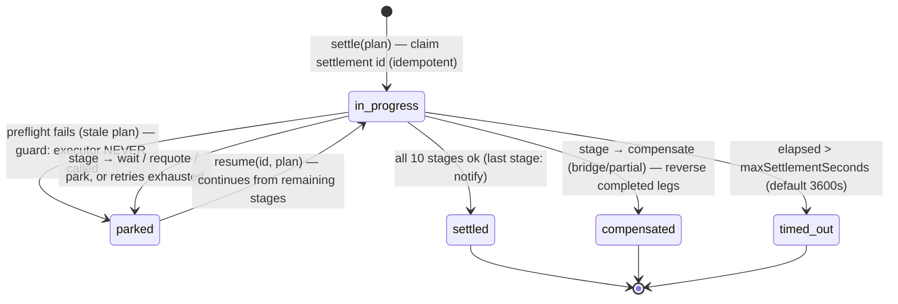

[Founder Bible](../../FOUNDER_BIBLE.md) · Project Aether · Volume V — the long-form behind [Chapter 8 — Universal Execution Engine](../bible/chapter-08-universal-execution-engine.md)

# The Universal Execution Engine Reference

*The buildable expansion of Chapter 8's charter — turning an approved plan into a reliable on-chain outcome — grounded in the real execution / router / provider / settlement engines, shipped-vs-roadmap tagged.*

**About this document.** [Chapter 8](../bible/chapter-08-universal-execution-engine.md) is the memorize-it
charter — what-vs-how and the guarantees. This is its **reference spec**: the execution graph & state
machine, DEX routing, bridge / multi-chain orchestration, provider selection & health, retry / partial /
rollback, monitoring & settlement, the signing & safety boundary, analytics, and reliability — each tagged
**SHIPPED** (cite the real code) or **ROADMAP**. Two truths anchor everything: **on-chain is irreversible**
(rollback = compensation, never undo), and **the engine never holds a key** — every step signs on-device.

| § | Section | Grounded in |
|---|---|---|
| 1 | Execution Graph & State Machine | `packages/execution` (state machine, StepDriver, store, sandbox) |
| 2 | DEX Aggregation & Routing | `packages/router` (scoring, candidate optimizer) |
| 3 | Bridge & Multi-Chain Orchestration | AdapterRegistry + the execution graph (roadmap) |
| 4 | Provider Selection & Health Scoring | the provider framework (health, circuit breaker) |
| 5 | Retry, Partial Completion & Rollback | `packages/execution` recovery/park/resume |
| 6 | Monitoring & Settlement Confirmation | `packages/settlement` (preflight, coordinator, ledger) |
| 7 | The Signing & Safety Boundary | the execution↔signing seam + the mainnet guard |
| 8 | Execution Analytics & Observability | the observability package + audit/ledger |
| 9 | Reliability & Definition of Done | `packages/reliability` + the invariants |

Honesty first: shipped vs roadmap is tagged throughout; "the engine exists" ≠ "the product ships it".

---

## §1 · The Execution Graph & State Machine

Chapter 7 ended one signature short of doing anything. The Intent Engine turned a sentence of
English into a **validated, approved `ExecutionPlan`** — a closed, Zod-checked shape that says
*what to do*, proven safe, and then **stopped**. That deliberate stop is where this chapter
begins. The Execution Engine's whole job is to take that plan and make it *happen* on real
chains — in the right order, only when each precondition is provably true, resumably across a
crash, and without ever holding a key or stranding a coin. It is the machinery that turns *a
proposal the user signed off on* into *satoshis and wei actually moving*, one on-device
signature at a time.

This section is the frame for the rest of Chapter 8. Before we talk about *how* a swap gets
routed (§2), *how* a bridge is orchestrated (§3, roadmap-heavy), *how* a provider is chosen
(§4), or *how* a partial failure is recovered (§5), we have to be precise about the shape of
the thing that does all of it: an **execution graph** (the plan's steps as a dependency DAG)
driven through a **two-level state machine** whose every edge carries a guard, persisted after
every transition so it is **resumable and auditable**. That machinery is shipped today:
`packages/execution/src` — `state.ts`, `driver.ts`, `store.ts`, `engine.ts`, `events.ts` —
exercised end-to-end by `packages/execution/test/engine.test.ts`, specified in
[ADR-0033](../adr/0033-execution-engine-step-machine.md) and
[docs/architecture/14-execution-engine.md](../architecture/14-execution-engine.md). Where a
capability is designed but not yet a shipped user path, this section says so out loud.

The engine is the concrete instantiation, *inside execution*, of Doctrine (2): **AI proposes,
deterministic code verifies, the device signature disposes.** The AI proposed the plan. The
guards in this state machine verify each step against reality before it can advance. The user's
on-device signature — produced by the Ch6 signing pipeline, *never* by anything in
`packages/execution` — is the sole disposer of funds. The engine orchestrates; it never signs.

---

### 1.1 · The seam: an approved plan in, a terminal `Execution` out

The engine's public surface is two methods on `ExecutionEngine` (`packages/execution/src/engine.ts`):

```ts
class ExecutionEngine {
  execute(plan: ExecutionPlan): Promise<Execution>            // start a fresh plan
  resume(executionId: string, plan: ExecutionPlan): Promise<Execution>  // continue after a crash
}
```

Both return a **terminal `Execution` record** — never a half-answer, never a throw into the
void for anything the caller could have prevented. The `Execution` (in `state.ts`) is the
persisted system-of-record: an `id`, the `planId` it came from, a `status`, the list of
per-step `StepState`, and — the invariant that makes the whole thing safe to operate — a
`fundsLocation` that is **always known**, even when the run stops early. The engine is the only
writer of that record; everything else (Portfolio, Notifications, Audit, the live UI tracker)
reads it or the events it emits.

Two dependencies are *injected*, and both injections are load-bearing:

- **A `StepDriver`** — the chain-facing boundary. The engine owns ordering, retries, recovery,
  parking, and persistence; the driver owns the single-step chain interaction: *simulate,
  build → **device-sign** → broadcast, confirm, verify*. Because the driver is an interface, the
  entire engine is testable without a network (the test suite drives a scriptable fake), and —
  the cardinal rule, stated in the file's own header — **the driver signs on the device and the
  engine never sees a key.** The real driver (the `RuntimeStepDriver` in `packages/runtime`,
  wired to `apps/web/src/broadcast.ts`) reads the live nonce and fees, signs a real EIP-1559 /
  PSBT / Solana transaction with the unlocked in-browser wallet, and calls the RPC. The
  non-custodial invariant holds *through* execution, not just up to it.
- **An `ExecutionStore`** — `save(execution)` / `load(id)`. The engine saves after **every**
  transition; durability is the entire point. The shipped in-memory implementation serves tests
  and simple callers; the backend persists to the Postgres `executions` table.

The engine also takes an `onEvent` sink and a `maxAttempts` cap (default 3), plus a `deps`
object supplying a stable id generator and an optional `now()` — because the core does **no**
RNG or clock access of its own (Doctrine: deterministic cores). Every timestamp and id enters
from the edge.

---

### 1.2 · The Execution Graph — a plan is a DAG of steps

An `ExecutionPlan` is not a script; it is a **directed acyclic graph**. Each `PlanStep`
(`packages/intents/src/schema.ts`) carries a `seq` (its node id), a `kind`
(`transfer | swap | bridge | approve | stake`), a `chainId`, and — the edges — a `dependsOn`
array of the `seq` numbers that must complete before it may start:

```ts
export const PlanStepSchema = z.object({
  seq: z.number().int().nonnegative(),
  kind: z.enum(['transfer', 'swap', 'bridge', 'approve', 'stake']),
  chainId: z.string(),
  description: z.string(),
  dependsOn: z.array(z.number().int().nonnegative()),  // edges into this node
  params: z.record(z.unknown()),
});
```

The graph is what makes execution *general* rather than a hard-coded sequence. Three real
shapes the shipped planner produces:

```
  Single transfer        Approve-then-swap            Rebalance (fan-out)
  ───────────────        ─────────────────            ───────────────────
     [0 transfer]        [0 approve] → [1 swap]        [0 swap]   [1 swap]   [2 swap]
                                                        (each dependsOn: [])
```

- **A plain send** is one node with no edges — it can start immediately.
- **A swap that needs an ERC-20 allowance first** is `approve` (seq 0) → `swap` (seq 1,
  `dependsOn: [0]`): the swap is *not runnable* until the approval is confirmed on-chain. This
  is the shipped **settlement-safe `approve → confirm → swap` sequencing** (task #91) expressed
  as graph edges rather than as imperative code — the swap literally cannot be attempted before
  its allowance exists.
- **A rebalance-to-stables** fans out into several independent legs, each with `dependsOn: []`,
  because moving your ETH and your SOL into stablecoins are unrelated operations.

The graph is walked by two pure functions in `state.ts`, the topological scheduler of the whole
engine:

```ts
// A step is runnable when it is pending AND all its dependencies are confirmed.
export function isRunnable(step: StepState, execution: Execution): boolean {
  if (step.status !== 'pending') return false;
  return step.dependsOn.every(
    (dep) => execution.steps.find((s) => s.seq === dep)?.status === 'confirmed',
  );
}
// The next runnable step in seq order, or null if none can start right now.
export function nextRunnableStep(execution: Execution): StepState | null { … }
```

`isRunnable` is the **precondition guard on entry to a node**: a step advances out of `pending`
*only* when every one of its `dependsOn` predecessors is in the terminal `confirmed` state.
A dependency test (`dependency ordering`, `engine.test.ts`) proves that with `0 → 1 → 2` the
engine broadcasts in exactly `[0, 1, 2]` order, never starting a child before its parent's
on-chain confirmation. If no step is runnable and not all are confirmed, the run cannot make
progress — the engine resolves the graph to a terminal status rather than spinning.

> **Honesty on the graph's reach.** The *engine* walks an arbitrary DAG today. The *planner*
> ships mostly linear chains and the rebalance fan-out; genuinely branching cross-chain graphs
> depend on the **bridge** step kind, whose driver is roadmap (§3). `kind: 'bridge'` exists in
> the schema and the graph would sequence it correctly; there is no shipped bridge driver to
> execute it as a user path. The machinery is general; the shipped surface is honest about which
> shapes actually run.

---

### 1.3 · The state machine — two levels, explicit states

Execution is a **two-level state machine**: the run as a whole, and each step within it. Both
sets of states are a small, closed enum in `state.ts` — nothing is implicit, because an implicit
state is a state you cannot persist, resume into, or audit.

**Execution-level** (`ExecutionStatus`): `running → { completed | parked | failed }`.
**Step-level** (`StepStatus`): `pending → simulating → broadcasting → confirming → confirmed`,
with `failed` and `reverted` as off-ramps.

```
                       EXECUTION-LEVEL STATE MACHINE
                       ─────────────────────────────
                              ┌───────────┐
                    init ────▶│  running  │
                              └─────┬─────┘
              all steps confirmed   │   next step parks     no runnable step,
                       ┌────────────┼────────────┐          not all confirmed
                       ▼            │            ▼                  │
                 ┌───────────┐      │      ┌──────────┐            ▼
                 │ completed │      │      │  parked  │◀── resume ──┐  ┌────────┐
                 └───────────┘      │      └──────────┘   (re-arm)  └─▶│ failed │
                                    │            ▲                     └────────┘
                                    └────────────┘  funds location recorded


                          STEP-LEVEL STATE MACHINE
                          ────────────────────────
   ┌─────────┐  isRunnable   ┌────────────┐  sim.ok   ┌──────────────┐
   │ pending │──────────────▶│ simulating │──────────▶│ broadcasting │
   └─────────┘   (deps       └─────┬──────┘  (SANDBOX  └──────┬───────┘
                  confirmed)       │          GATE)           │ device-signed txid
                        sim NOT ok │                          ▼
                                   ▼                   ┌──────────────┐
                              ┌────────┐  revert /     │  confirming  │
                              │ failed │◀── invariant ─┴──────┬───────┘
                              └───┬────┘   fail               │ confirmed on-chain
                                  │                  verify ok │
                        retryable?│ transient                  ▼
                          ┌───────┴───────┐            ┌─────────────┐
                    yes ──┘ (same step,   │            │  confirmed  │  (terminal ✓)
                            attempts < N)  └─▶ park     └─────────────┘
                                              │
                          reverted on-chain ──┘  (defined terminal; engine records the
                                                  revert through the park path)
```

The per-step happy path is a strict four-phase pipeline —
**`simulate → broadcast → confirm → verify`** — and each arrow is an exit gate you may not
cross until it is green. The next section is about those gates.

---

### 1.4 · The guard on each edge — a step advances only when its precondition is verified

The design principle is Doctrine (5), **fail closed**: no edge is taken on optimism. Every
transition in the step machine is gated by a condition the engine *positively verifies*, and
anything it cannot verify blocks. The loop lives in `engine.ts` (`#runStep`); here is the guard
on each edge, in order.

| From → To | Guard (the precondition) | On failure |
|---|---|---|
| `pending → simulating` | `isRunnable`: step is pending **and** all `dependsOn` are `confirmed` | not selected; another step runs or the run resolves |
| `simulating → broadcasting` | **Sandbox gate**: `driver.simulate()` returns `ok` — simulated effects match the plan's promise | `failed` → **park**; *never broadcast* |
| `broadcasting → confirming` | `driver.broadcast()` returns a `txid` (built + **device-signed** + sent) | retryable error → retry same step; else `failed` → park |
| `confirming → (verify)` | `driver.confirm()` returns `confirmed && !reverted` | reverted / not confirmed → park (an on-chain revert is **not** retried) |
| `(verify) → confirmed` | `driver.verify()` returns `ok` — post-execution invariant holds (e.g. received ≥ `minReceived`) | `failed` → park: *funds moved, but not as promised* |

Read top to bottom, that table is the entire safety argument of execution. Three of its rows
deserve emphasis, because each is a place a lesser wallet lies to the user or loses their money:

- **The simulate gate is the one that cannot be skipped.** If the pre-broadcast simulation's
  effects do not match what the plan promised, the step is set `failed` and the run parks — and
  crucially, `broadcast()` is **never called**. There is no "simulate but send anyway." The test
  `Execution Sandbox (simulate gate)` asserts exactly this: on a mismatch, `broadcasts === 0`.
- **A confirmed-but-reverted transaction parks; it does not retry.** Re-sending a transaction
  that already reverted on-chain would just burn more gas toward the same failure. The engine
  throws a non-retryable `DriverError` and parks.
- **A post-confirmation invariant failure parks even though funds already moved.** If a swap
  confirms but delivered less than `youReceiveMin`, `verify()` returns `!ok`. The chain action
  is done and irreversible — so the engine stops, records where the funds now sit, and parks
  rather than blindly marching the graph forward on a broken assumption.

This is where "AI proposes, code verifies, the device disposes" becomes mechanical rather than
slogan. The plan came from the AI layer. Every one of these guards is deterministic code that
can only *refuse*. And the single edge that actually moves money — `broadcast` — does so only
by asking the **device** to sign, inside the driver, with a key the engine cannot see.

---

### 1.5 · The Execution Sandbox — simulate before you sign

The most important guard deserves its own name: the **Execution Sandbox**, the
`simulating` phase. Its contract is tiny and total (`driver.ts`):

```ts
interface SimulationResult {
  ok: boolean;       // true iff the simulated effects match what the plan promised
  reason?: string;   // why it was rejected — shown to the user, NEVER broadcast
}
```

Before any signature, the driver simulates the exact transaction it is about to build — an
`eth_call` / state-override dry-run on EVM, the analogous dry-run on each chain — and compares
the *simulated* effect against the plan's stated intent: does this approval grant only what we
expect, does this swap's output land in the user's own account, does the balance delta match the
quote. If the answer is anything but a positive *yes*, `ok` is `false`, the step parks with a
human-readable `reason`, and the transaction that would have moved funds is never signed and
never sent. This is the wallet's structural answer to the drainer-approval and malicious-callback
class of attacks: a hostile step gets rejected in a sandbox, not in your account. The deeper
threat model lives in §7 (the signing & safety boundary); here it is enough to see that the
sandbox is a *mandatory* gate on the edge into `broadcasting`, not an optional preview.

---

### 1.6 · Resumable & non-stranding — the park guarantee

On-chain actions are **irreversible**. You cannot un-send a confirmed transaction. So the engine
does not pretend "rollback" means undo — throughout this chapter, **rollback means compensation
or park, never reversal** (§5 owns compensation in depth). The execution machine's two structural
promises make that honesty operable:

**Resumable.** The engine calls `store.save()` after *every* transition, so the persisted
`Execution` always reflects reality up to the last completed edge. `initExecution` builds the
fresh record; `resume(id, plan)` reloads it and continues from `nextRunnableStep` — which, by
construction, is the first *unconfirmed* step, since confirmed steps are skipped by `isRunnable`.
A crash mid-execution therefore resumes **exactly** where it stopped, and — the property that
makes this safe rather than merely convenient — **already-confirmed steps are never re-run or
re-broadcast.** The `resumability (crash recovery)` test proves it: after a mid-run park, a
resume with a healthy driver finishes the pending step while `step0Broadcasts === 0`. Idempotent
resume is the difference between "we recovered" and "we double-spent."

**Never strand funds — the park guarantee.** When a failure is unrecoverable, the engine does
not leave the run in limbo; it **parks**. Parking is a deliberate, terminal, *safe* stop that
(a) sets `status = 'parked'`, (b) records `fundsLocation` — the chain the money is on and a
plain-English note the user can read (*"Paused safely. Your funds are on base and can be
resumed."*), and (c) emits an `execution.parked` event carrying `fundsChainId`. The invariant is
that **the location of the user's funds is always known** — even, especially, on failure. The
`park guarantee` tests assert a known `fundsLocation.chainId` after a permanent broadcast
failure, after an on-chain revert, and after an invariant failure. `fundsLocation` is seeded at
`initExecution`, advanced after each confirmed step (via the driver's optional `fundsAfter`
hook), and pinned on park — so the answer to "where is my money right now?" is never *unknown*.

Retry policy, partial-completion handling, and compensation strategy are the subject of §5;
what §1 fixes is the *frame* those live in — a machine that persists every step, resumes without
re-spending, and stops safely with the funds located.

---

### 1.7 · Auditable by construction — every transition is an event

Doctrine (8): everything auditable. The engine takes an `EventSink` and emits a typed
`ExecutionEvent` on every meaningful transition (`events.ts`):

```ts
type ExecutionEvent =
  | { type: 'execution.started';  executionId; planId }
  | { type: 'step.simulating';    executionId; seq }
  | { type: 'step.broadcast';     executionId; seq; txid }
  | { type: 'step.confirmed';     executionId; seq; txid }
  | { type: 'step.failed';        executionId; seq; reason; retryable }
  | { type: 'execution.completed'; executionId }
  | { type: 'execution.parked';   executionId; reason; fundsChainId }
  | { type: 'execution.failed';   executionId; reason };
```

The engine is decoupled from *what happens next*: it just calls `onEvent`. The backend maps that
stream onto the `execution.steps.v1` Kafka topic (`packages/events`), from which the Portfolio,
Notification, Audit, and live-UI-tracker consumers stay in sync. Because a step id and a `txid`
ride on the events, every risky decision — a simulation rejection, a revert, a park, the reason
for each — is reconstructable from the log with its inputs. This is the seam §8 (Execution
Analytics & Observability) builds its metrics and traces on; §1's contribution is that
observability is *designed into the state machine*, not bolted on after.

Note also that in the shipped topology, execution does not run naked: the **Settlement Engine**
(§6, `packages/settlement`) is the mandatory front door. Its non-skippable pipeline —
`preflight → quote_lock → gas → prepare → execute → …` — re-validates the approved plan against
*current* state (balance, quote TTL, risk, gas) before its `execute` stage delegates to this
engine as the injected executor. An approved-but-stale plan can never reach `broadcast`. §1
describes the executor; §6 describes the settlement wrapper around it.

---

### 1.8 · What ships vs. what is roadmap

Honesty ledger, so no reader mistakes an engine that *exists* for a product path that *ships*:

| Capability | Status | Where |
|---|---|---|
| Execution graph (DAG) + topological scheduling (`isRunnable`/`nextRunnableStep`) | **Shipped** | `packages/execution/src/state.ts` |
| Two-level state machine + four-phase step loop + retries/park/resume | **Shipped** | `engine.ts`, `driver.ts`, `store.ts` |
| Execution Sandbox (simulate-before-broadcast gate) | **Shipped** (contract + engine gate; driver-side simulation depth grows with §2/§4) | `driver.ts`, `engine.ts` |
| Typed lifecycle events → `execution.steps.v1` | **Shipped** | `events.ts`, `packages/events` |
| Full engine coverage (happy, sandbox-halt, retry, park, resume, ordering, invariant) | **Shipped** | `packages/execution/test/engine.test.ts` |
| Real broadcast: transfer + swap on testnets, guarded mainnet ETH | **Shipped** | `apps/web/src/broadcast.ts`, `RuntimeStepDriver` |
| `approve → confirm → swap` sequencing as graph edges | **Shipped** | planner + `dependsOn` |
| **Bridge** step execution / cross-chain orchestration | **Roadmap** | `kind:'bridge'` in schema; no shipped driver (§3) |
| **Stake / rebalance / recurring / emergency-exit** execution | **Roadmap** | plannable; not shipped user paths |
| **Solver network** as an execution source | **Roadmap** | `packages/solver` engine exists; not a shipped path |

The rule the rest of Chapter 8 holds to: *"the engine exists" ≠ "the product ships it."* The
state machine in this section is real and under test. With that frame fixed — an approved plan
becomes a persisted DAG driven through guarded, device-signed, resumable, auditable steps that
never strand funds — §2 turns to how a single `swap` step gets the best route, §3 to bridging,
§4 to provider selection, §5 to retry and compensation, §6 to settlement confirmation, §7 to the
signing boundary, and §8–§9 to observability and the reliability bar this all has to clear.


## §2 · DEX Aggregation & Routing

> *"Swap 1 ETH for USDC"* names a destination, not a road. Between the word and the wire lie a dozen
> venues, three fee tiers, a mempool full of adversaries, and a quote that goes stale in thirty seconds.
> The user should never have to know any of it — and must never be lied to about the part that reaches
> them. This section is the wallet's cartographer: the stage that takes the Intent Engine's **abstract
> execution request** (Ch7 §17) and turns it into *one* concrete, best-under-your-constraints route,
> proven by simulation, ranked by a pure deterministic score, and honest to the base unit about the
> minimum you are guaranteed to receive. The router **proposes** the road; it never drives — the
> Execution Graph (§1) walks the legs and your device (§7) signs each one. A router with no signing
> authority can afford to be clever about *which* road; the cage of §1/§7 is what makes the cleverness safe.

The governing fact of this section, inherited from Doctrine #2, is that **the optimizer never executes.**
`GlobalRouteOptimizer.optimize()` (`packages/router/src/optimizer.ts`) returns a `RouteResult` — a best
route, ranked alternatives, and a confidence number — and stops. Nothing in `packages/router` holds a key,
touches an RPC, or moves a wei. It is standalone by design: it depends only on the provider framework
(`packages/providers`), so the very same engine that routes this wallet can route a third-party wallet
through a public API (ADR-0035). That separation is not architectural vanity; it is what lets the routing
IP be exhaustively unit-tested as a pure function while the irreversible parts stay quarantined behind the
signing boundary.

---

### 2.1 · The seam — from an abstract execution request to a concrete route

Chapter 7 is deliberate about *not* choosing a venue. The planner emits a `RouteProvider.findRoute({
fromSymbol, toSymbol, amountBase, fromDecimals })` call against an injected interface
(`packages/intents/src/plan/context.ts`) and consumes back a `Route` whose only load-bearing promise is
`outMinBase` — the **guaranteed minimum output in base units**. The planner does not know whether that route
is Uniswap, a bridge, or a stub; it knows only the typed shape. This is Ch7 §17's Provider Abstraction made
concrete: *"the Intent Engine does not hard-code bridges or DEXs; it creates an abstract execution request;
the Execution Engine later chooses the best provider."* §2 is where "later chooses the best provider" is
actually done.

The router's own request type is smaller and sharper than the planner's context — a pure conversion spec
(`packages/router/src/request.ts`):

```ts
export interface RouteRequest {
  fromSymbol: string;
  toSymbol: string;
  amountInBase: bigint;      // money is bigint, base units, end-to-end (#4)
  fromDecimals: number;
  chainId: string;
  toChainId?: string;        // set (and ≠ chainId) ⇒ cross-chain (roadmap; see §2.9 / Ch8 §3)
}
```

`toChainId` is the single bit that forks same-chain **swap** discovery from cross-chain **bridge**
discovery. Today the shipped path is same-chain only; the cross-chain branch is a real code path with a real
test but **not a shipped user route** — that honesty is spelled out in §2.9 and owned by Ch8 §3.

---

### 2.2 · Candidate generation — route discovery, not route guessing

The first stage is discovery: *what are all the ways to do this conversion?* `CandidateGenerator.generate()`
(`packages/router/src/candidates.ts`) answers by asking **every healthy provider at once**, never by
consulting a hardcoded venue list. It fans out through the registry's `collect()`:

```ts
const quotes = await this.#opts.swaps.collect((p) =>
  p.quote({ fromSymbol, toSymbol, amountInBase, fromDecimals, chainId }),
);
```

`ProviderRegistry.collect()` (`packages/providers/src/registry.ts`) runs the quote against all *available*
providers concurrently, records each success/failure into the `HealthTracker`, and returns only the
successes — a circuit-broken provider is simply absent from the fan-out (health scoring and the breaker are
§4's subject; here we only consume their verdict). Every raw `SwapQuote` that comes back is then normalized
into a single comparable shape, a `RouteCandidate` (`packages/router/src/types.ts`), so that "best of N
aggregators" is a *fair* comparison rather than a units mismatch:

| `RouteCandidate` field | Meaning | Source |
|---|---|---|
| `outputBase: bigint` | destination asset delivered, base units | provider quote |
| `feeMicros: bigint` | total route fees, micro-USD | provider quote |
| `slippageBps` | quoted slippage tolerance | provider quote |
| `etaSeconds` | expected completion time | provider quote |
| `healthScore` | provider reliability, [0,1] | registry snapshot (§4) |
| `riskLevel` | destination-asset risk (low/med/high) | Risk Engine (Ch7/Ch9), default `low` |
| `quoteAgeMs` | freshness at generation time | `now() − quote.quotedAt` |
| `priceImpactBps?` | optional price-impact estimate | provider (undefined ⇒ scored neutral) |

Two guards fire *inside* generation, before a candidate is ever ranked (fail-closed, #5): a quote with
`amountOutBase <= 0n` is dropped (a zero/negative output is nonsense, never a "route"), and a quote older
than `maxQuoteAgeMs` (default 30 000 ms) is dropped as stale. This mirrors, at the candidate layer, the
provider framework's own `isValidSwapQuote()` (`packages/providers/src/aggregate.ts`), which additionally
rejects negative fees and any slippage above a 10 % ceiling. A provider that returns garbage cannot win by
returning garbage *fast*; it is filtered, not merely down-weighted.

Multi-hop composition (sell A → acquire USDC → buy B) is the documented extension point: the scorer ranks
whatever candidates it is handed, so composing multi-leg candidates is additive and does not touch the
scoring core. It is not shipped today.

---

### 2.3 · The simulation gate — never rank a route that cannot execute

Discovery yields *plausible* routes; simulation proves *executable* ones. When a `SimulationProvider` is
injected, `GlobalRouteOptimizer` runs **every** surviving candidate through `simulateCandidates()` before a
single one is scored:

```ts
if (this.#simulator) {
  simulated = await simulateCandidates(candidates, this.#simulator);
  if (simulated.length === 0)
    throw new RouterError('ALL_ROUTES_FAILED_SIMULATION', 'every candidate route failed simulation');
}
```

The gate is emphatically fail-closed. In `simulateCandidates()` a simulation that returns `ok: false` **or
throws** rejects the candidate — the catch block returns `null`, with the standing comment *"a simulation
error rejects the candidate — never execute an unsimulated route."* An unreachable simulator does not
produce an optimistic pass; it produces an empty set and a typed `RouterError`. This is the routing-layer
echo of the shipped swap path's on-chain preflight (§2.8): a route that *would* revert should die cheaply in
simulation, long before it costs gas or, worse, mines and reverts while the UI claims success.

The gate is also honest about its own absence. `optimize()` records `didSimulate = this.#simulator !==
undefined` and folds it into the confidence score (§2.7): a route ranked *without* simulation is not
presented as if it had passed one.

---

### 2.4 · The scoring engine — the crown-jewel pure IP

Surviving candidates are ranked by `scoreCandidates()` (`packages/router/src/scoring.ts`), the optimizer's
most valuable and most testable component. It is a **pure function of the candidate set and a weight
vector** — no clock, no randomness, no I/O — which is exactly why it can be driven to exhaustion in unit
tests and why the same inputs always produce the same ranking.

Scoring is two moves: **normalize, then weight.** Every candidate is scored on seven factors, and each
factor is normalized *against the candidate set itself* by min-max so that `1` always means "best among
these candidates" regardless of the factor's native units or direction:

| Factor | Native direction | Normalized so 1 = |
|---|---|---|
| `output` | higher `outputBase` better | most destination asset |
| `cost` | lower `feeMicros` better | cheapest |
| `slippage` | lower `slippageBps` better | tightest slippage |
| `time` | lower `etaSeconds` better | fastest |
| `reliability` | higher `healthScore` better | healthiest provider |
| `risk` | lower risk better | `low` risk (`{low:1, med:0.6, high:0.25}`) |
| `freshness` | fresher quote better | `1 − quoteAgeMs/30 000` |

The direction handling is where correctness lives. `normHigherBetter` maps `output` so the max scores 1;
`normLowerBetter` maps `cost/slippage/time` so the *min* scores 1 (`1 − (v−min)/(max−min)`). A degenerate
set where every candidate ties on a factor (`max <= min`) returns a neutral `1` for all — no divide-by-zero,
no phantom winner. The composite is a plain weighted sum of the seven normalized terms, and candidates are
sorted highest-first with a **deterministic tie-break on raw `outputBase`** (more tokens delivered wins a
score tie) so ordering is stable and never depends on input order.

Because the money terms (`outputBase`, `feeMicros`) are `bigint`, they are converted to `Number` *only*
inside the normalizer, where they have already been reduced to a bounded [0,1] ratio — the base-unit amounts
themselves never round through a float (#4). The comparison stays exact; only the score is fractional.

---

### 2.5 · Presets — how "cheapest / fastest / safest" become weights

A weighted model is only as good as the weights, and the weights are the user's preference, not the
engineer's guess. `scoring.ts` ships four presets, each a `ScoringWeights` vector that sums to 1:

```ts
export const WEIGHT_PRESETS = {
  balanced: { output:0.30, cost:0.20, slippage:0.15, time:0.10, reliability:0.10, risk:0.10, freshness:0.05 },
  cheapest: { output:0.25, cost:0.40, slippage:0.20, time:0.02, reliability:0.05, risk:0.05, freshness:0.03 },
  fastest:  { output:0.20, cost:0.10, slippage:0.10, time:0.40, reliability:0.12, risk:0.05, freshness:0.03 },
  safest:   { output:0.15, cost:0.10, slippage:0.10, time:0.05, reliability:0.30, risk:0.27, freshness:0.03 },
};
```

This is the concrete mechanism by which the Intent Engine's abstract constraints — *"cheapest,"* *"fastest,"*
*"I don't care about speed, keep it safe"* (Ch7 §6 Constraint Engine, §7 Preference Engine) — become a
routing decision. A user who says "fastest" moves 40 % of the score onto `time` and starves it out under
"cheapest" (2 %). Callers may also pass a raw custom `ScoringWeights`; `normalizeWeights()` rescales any
non-normalized vector by `1/Σ` (and falls back to `balanced` if the sum is ≤ 0), so a caller can express
*relative* priorities without doing the arithmetic. The effective, normalized weights are returned in
`RouteResult.weightsUsed` — the optimizer shows its work, which is the raw material Ch7 §11's
Explainability Engine turns into *"why this route."*

---

### 2.6 · The ML re-rank boundary — bounded, separable, and off by default

The deterministic score is the model of record. An **optional** `RoutePredictor`
(`packages/router/src/predictor.ts`) may then nudge scores with learned signals (historical provider
reliability, latency/failure prediction) — but it is quarantined by design, a hard requirement echoing
Doctrine #7 (deterministic cores, AI at the edges):

- The default is `identityPredictor` — **no ML** — so the shipped ranking is pure and deterministic unless a
  predictor is explicitly injected.
- A predictor can only **re-rank candidates that already passed simulation and validation.** It cannot
  bypass the simulation gate, cannot conjure a candidate, and cannot move funds. The worst case of a
  misbehaving model is a *suboptimal but still-valid, still-simulated* route.
- `boundedPredictor(predict, band = 0.1)` clamps any adjustment to `±band` around the deterministic score,
  so ML can reorder near-ties but can never crown a clearly-worse route over a clearly-better one.

The re-rank is applied *after* deterministic scoring and re-sorted, keeping the two models physically
separate in the pipeline rather than entangled in one opaque score.

---

### 2.7 · What the optimizer returns — best, alternatives, confidence

`optimize()` returns a `RouteResult` (`packages/router/src/types.ts`):

```ts
interface RouteResult {
  best: ScoredCandidate;          // highest-scoring route that passed simulation
  alternatives: ScoredCandidate[]; // other viable routes, ranked (fallbacks / "show alternatives")
  confidence: number;              // [0,1] — how sure the winner holds at quoted terms
  weightsUsed: ScoringWeights;     // the effective normalized weights (explainability)
}
```

`alternatives` is not decoration: it is the ranked fallback set the Execution Graph (§1) and the retry logic
(§5) draw on when the winner's provider degrades between quote and broadcast. `confidence` is a deliberate,
inspectable blend rather than a vibe:

```
confidence = 0.5·health + 0.3·margin + 0.2·(simulated ? 1 : 0.5)
```

where `health` is the winning provider's score, `margin` is the winner's lead over the runner-up capped at a
0.2 gap (a clear winner earns the full margin term; a near-tie earns little), and the last term *halves* the
contribution when the route was ranked without simulation. A close race between two providers, unsimulated,
reads as low confidence — which is the honest thing to surface before asking for a signature.

---

### 2.8 · minReceived & price-impact honesty — the promise that reaches the user

Everything above optimizes *expected* output. The number that must never lie is the **guaranteed** one. The
whole routing stack is built so that the figure shown to the user before they sign is a hard on-chain floor,
not a hopeful estimate.

The floor originates at the type boundary: the planner's `Route.outMinBase` is *"guaranteed minimum output
in base units of the destination asset"* — an amount *after* slippage, not before. It is carried as `bigint`
and computed with integer math. In the shipped swap path (`apps/web/src/App.tsx`) the user picks a max
slippage in bps and the minimum received is derived and displayed *before* signing:

```ts
// minOut is the on-chain amountOutMinimum — a hard floor, not an estimate.
const minOut = swapQuote.amountOut * BigInt(10_000 - slippageBps) / 10_000n;
```

That exact `minOut` becomes the swap's `amountOutMinimum` when the transaction is encoded
(`encodeExactInputSingle` in `sendSwap`, `apps/web/src/broadcast.ts`). Its meaning on-chain is absolute: if
the pool would deliver less than `minOut` — because of slippage, a moving market, or an MEV sandwich — the
swap **reverts** rather than settling for less. The user pays gas on a failed swap but never silently
receives less than the floor they were shown. As the code comment puts it, the swap *"reverts on-chain
rather than delivering less, so slippage/MEV can never silently cost the user."* There is no invisible
default slippage baked into a real-funds swap; the tolerance is the user's, visible, and enforced by the
chain itself.

Price impact is treated with the same honesty about *uncertainty*. `RouteCandidate.priceImpactBps` is
optional, and when a provider cannot supply it the field is `undefined` and the factor is **scored
neutrally** rather than assumed benign — the router never invents a reassuring "0 % impact" it did not
measure (#3). Ch7 §12's Simulation Layer already commits to presenting *expected output · fees · price
impact · slippage · ETA* before approval; §2 is the stage that produces those figures truthfully and hands
the un-fudgeable one (`minReceived`) down to the wire.

---

### 2.9 · Shipped vs. the engine that waits — the honest ledger

This section describes two real bodies of code at two different maturities. Stating which is which is itself
a Doctrine obligation (#3): *"the engine exists" ≠ "the product ships it."*

**Shipped — the real user swap path.** Today a user's *"swap ETH for USDC"* is routed for real by
`quoteSwap()` and executed by `sendSwap()` in `apps/web/src/broadcast.ts`. This is genuine on-chain
aggregation, just at the fee-tier granularity of a single venue: `quoteSwap` calls Uniswap v3's **QuoterV2**
via `eth_call` across every tier in `V3_FEE_TIERS`, and the tier returning the most output wins
(`if (out > 0n && (!best || out > best.amountOut)) best = …`). The winning quote flows into a
**settlement-safe** execution sequence (Ch8 §1 / §6): read the live allowance → approve only if short →
**wait for the approval receipt** (a revert throws) → `eth_call`-preflight the swap so a guaranteed revert
fails cheaply → sign in-browser → broadcast. The device signs; the router proposes. This path is real on
Sepolia (testnet) and behind the mainnet guard. A pair not listed on the wired pools is **refused, not
faked** — `sendSwap` throws *"can't swap … on Sepolia"* and nothing is broadcast.

**Shipped — the standalone routing engine.** `packages/router` (the `GlobalRouteOptimizer`, `scoreCandidates`,
`WEIGHT_PRESETS`, `CandidateGenerator`, `simulateCandidates`) and its substrate `packages/providers`
(`ProviderRegistry.collect`, `bestSwapQuote`, `HealthTracker`) are complete, pure, and unit-tested (build
tasks #30–#32, #27–#29; ADR-0035, ADR-0034). This is the multi-provider aggregation-and-ranking engine —
the intended future of the user path, and already the intended product for third-party wallets via the
public routing API. What has *not* yet happened is wiring several third-party DEX aggregators into the live
web `SwapProvider` registry and switching the shipped web swap from the direct QuoterV2 fee-tier scan onto
`GlobalRouteOptimizer`. The engine is ready for that; the product has not thrown the switch. Saying so
plainly is the point.

**Roadmap — do not present as shipped.** The cross-chain branch of `CandidateGenerator` (`#bridgeCandidates`)
and `RouteOptimizer.findBridgeRoute` are real code with a real test, but **bridge orchestration is not a
shipped user route** — it belongs to Ch8 §3 and is tagged there. Multi-hop route composition is a documented
extension point, unshipped. The `RoutePredictor` ML re-rank is off by default (`identityPredictor`) and no
learned model is wired in production. None of these may be described to a user as something the wallet does
today.

---

### 2.10 · Benchmark & standard

The bar for this section is exchange-grade routing, and the design borrows the right instincts from the best
in the field while staying honest about what is wired:

- **1inch / 0x — best-of-N aggregation.** Their core promise is "quote every venue, deliver the best net
  outcome." Our `collect()` fan-out + `bestSwapQuote` / `scoreCandidates` is the same shape; the gap is
  breadth of wired venues (one venue's fee tiers today vs. dozens of aggregators), not the ranking model.
- **CoW Protocol — protect the user from the route.** CoW's value is surplus capture and MEV resistance.
  Our analog is enforced `amountOutMinimum` (§2.8): the user's floor is on-chain law, so a sandwich reverts
  the swap instead of skimming it. Batch-auction / solver-driven surplus is the `packages/solver` engine's
  ambition and is explicitly **not** a shipped path (Ch8 §5 lane; roadmap).
- **LI.FI / Socket — cross-chain routing.** The bridge candidate model exists (`#bridgeCandidates`) but
  bridge orchestration is Ch8 §3's roadmap subject, not a claim we make here.

The routing decision is only ever a **proposal**. It is proven safe by the simulation gate, ranked by a pure
deterministic score, bounded even when ML touches it, and it hands the Execution Graph (§1) a route whose
worst-case output the user has already seen and the chain will enforce. The optimizer chooses the road; §7's
on-device signature — and only that signature — ever disposes of the funds that travel it.

---

> **Definition of done for §2.** A conversion request produces a concrete route or a typed refusal — never a
> fabricated one. Every ranked candidate passed simulation (or the missing gate is reflected in confidence).
> The score is a pure, deterministic, weight-driven function whose weights trace to the user's stated
> preference. `minReceived` is `bigint`, shown before signing, and enforced as the on-chain floor.
> Price impact is measured or scored neutral, never invented. Shipped venue routing (Uniswap v3 fee-tier
> aggregation) and the standalone multi-provider optimizer are both real and both correctly labelled; bridge
> orchestration, multi-hop, the solver network, and ML re-ranking are tagged roadmap, not sold as today.


## §3 · Bridge Aggregation & Multi-Chain Orchestration

This is the most honest section in Chapter 8, and it earns that by opening with a line the
demo would rather you didn't read: **the wallet cannot yet move value across ecosystems in a
single shipped user path.** It can hold value across all of them — a Bitcoin UTXO, an Ethereum
account, a Solana account, all under one identity (Chapter 5's 3-address model) — and it can
transfer or same-chain-swap on each. But *bridging* — turning BTC on Bitcoin into ETH on Base —
is designed, seamed, and partly built, and **not** something a first-time user can drive
end-to-end today. The engineering here is real; the shipped surface is deliberately smaller than
the ambition. This section specifies the target, marks the seam where it plugs in, and refuses to
narrate a capability the code does not have.

Two doctrines govern everything below. Doctrine (5), **fail closed**: a route that crosses a
trust boundary we cannot *positively* verify is blocked, not attempted. And the brute physics of
this domain — **on-chain actions are irreversible.** When this section says "rollback," it means
*compensation* (a new, forward transaction that offsets a completed one) or *park* (stop, record
exactly where the funds are, and wait), never *undo*. A bridge leg that has burned tokens on the
source chain cannot be un-burned; the only safe design is one that never signs the next leg until
the current one has provably landed.

---

### 3.1 · One identity, three settlement domains

Chapter 5 gives the user a single **universal identity** that deterministically owns three
addresses — a P2WPKH Bitcoin address, an EVM address (Ethereum + L2s), and a Solana address —
derived from one seed (BIP-32/44/84 for EVM/BTC, SLIP-0010 for Solana; the known-answer
conformance tests are shipped). To the user this is *one wallet*. To the network it is **three
disjoint settlement domains** that share no state, no mempool, and no notion of each other's
finality. Bitcoin does not know Solana exists. This is the entire difficulty of cross-chain
orchestration compressed into one sentence.

A same-chain intent ("swap 100 USDC for ETH on Sepolia") lives inside one domain: one adapter,
one nonce space, one confirmation model, atomic at the transaction level. A cross-ecosystem
intent ("move everything to Solana") spans domains that can only be joined by a **bridge** — an
external system that accepts a deposit on chain A and releases (or mints) a corresponding asset
on chain B. The bridge is a third party with its own trust model, its own liveness, and its own
failure surface. It is the single largest new risk this section introduces, and §3.4 treats it as
such.

The `AdapterRegistry` (`packages/chains/src/adapter-registry.ts`) is where the three domains meet
in code: given a `ChainId` it returns the correct `BlockchainAdapter` wired to the right transport
(EVM/Solana JSON-RPC pools, Bitcoin esplora REST), switching on `chain.ecosystem` (`'evm' | 'sol'
| 'btc'`). Orchestration is, at bottom, the discipline of driving an ordered sequence of
operations *across* these adapters while the funds' location is known at every instant — and while
no key ever leaves the device (Chapter 6; §7 of this chapter owns that boundary).

---

### 3.2 · Shipped vs roadmap — the honest ledger

Before the design, the truth. The breadth is real; the cross-chain *execution* is not.

| Capability | Status | Where it lives |
|---|---|---|
| 3-address identity across BTC + EVM + SOL | **SHIPPED** | `packages/identity`, Ch5; conformance tests pass |
| Real per-chain broadcast — native + token **transfer** | **SHIPPED** | `apps/web/src/broadcast.ts` (`sendEvmTransfer`, `sendSolTransfer`, `sendBtcTransfer`, `sendErc20Transfer`, `sendSplTransfer`) |
| Real same-chain **swap** (Uniswap v3, Sepolia), settlement-safe | **SHIPPED** | `broadcast.ts#sendSwap` (see §2) |
| `bridge` as a first-class plan step **kind** | **SHIPPED (schema)** | `PlanStepSchema.kind` includes `'bridge'`; `sourceChains` / `destChains` on `ExecutionPlan` (`packages/intents/src/schema.ts`) |
| Bridge **candidate generation** + scoring | **SHIPPED (engine)** | `packages/router` — `CandidateGenerator.#bridgeCandidates`, `BridgeProvider` registry, 7-factor scorer |
| Cross-chain **settlement stage** + bridge recovery classes | **SHIPPED (engine)** | `packages/settlement` — `SETTLEMENT_STAGES` `'cross_chain'`; `RecoveryClass` `'bridge_delay' | 'bridge_failure'`; `Settlement.bridgeIds` |
| Bridge **broadcast** (a real on-chain bridge tx) | **ROADMAP** | *no* `executeBridgeStep` in `broadcast.ts`; `crossChain` source ships as a no-op `OK` stub |
| Bridge-then-swap **multi-hop composition** | **ROADMAP** | `RouteOptimizer.findBridgeRoute` — "Bridge-only for MVP"; `candidates.ts` — "Multi-hop composition is the extension point" |
| Decentralized **solver network** (competitive cross-chain fills) | **ROADMAP (engine exists)** | `packages/solver` — `SolveRequest.fromChain/toChain`; not a shipped user path |

Read the table as one claim: **every seam a cross-chain operation needs is built, but the last
mile that actually signs and broadcasts a bridge deposit is not.** The router will happily *rank*
bridge candidates; the settlement pipeline will *run* a `cross_chain` stage; the plan schema will
*carry* a `bridge` step across `sourceChains → destChains`. What no shipped code does is turn that
step into a signed transaction on a real bridge contract. "The engine exists" ≠ "the product ships
it," and this is the canonical example.

---

### 3.3 · Cross-chain orchestration: one intent → an ordered multi-chain plan

The user says one sentence; Chapter 7 turns it into a plan. A cross-ecosystem goal decomposes into
a chain of operations the user never sees as steps — exactly the Ch7 §9 example:

> **User:** "Convert my BTC into ETH on Base."
> **Plan:** sell BTC → acquire a stable → **bridge** → swap → deliver ETH → verify balance.

The planner (`packages/intents/src/plan/planner.ts`) already emits a `PlanStep[]` with a
`kind: 'bridge'` variant and a `dependsOn: number[]` edge set — the plan is a **DAG**, and that DAG
*is* the orchestration. Nothing about the Execution Engine's shipped step machine (§1) is
same-chain-specific: `nextRunnableStep` (`packages/execution/src/state.ts`) picks the lowest-`seq`
step whose `dependsOn` are all `confirmed`, and `isRunnable` gates on nothing but that. A step on
Bitcoin followed by a step on Base is, to the machine, just two nodes with an edge — it will run
the Solana leg after the Ethereum leg the moment the dependency clears, whichever adapters those
chains resolve to. **The graph engine is already multi-chain; what is missing is a driver that can
execute the `bridge` node.**

Concretely, a cross-chain plan is modelled like this (bigint base units throughout — Doctrine 4;
amounts on the wire are integer strings):

```
seq 0  swap    BTC → USDC    chain=bitcoin*   dependsOn:[]     ── acquire the bridgeable stable
seq 1  bridge  USDC          chain=bitcoin → base   dependsOn:[0]   ── cross the trust boundary  [ROADMAP driver]
seq 2  swap    USDC → ETH     chain=base       dependsOn:[1]    ── deliver the destination asset
        sourceChains: [bitcoin], destChains: [base]
        fallback:  "If the bridge is delayed, your USDC is safe on <chain> and will complete or be resumed."
        rollback:  null   ── bridging is irreversible; there is no undo, only compensate/park
```

`*` Bitcoin→USDC is itself illustrative of the roadmap gap: today the shipped swap path is Uniswap
v3 on Sepolia, so this whole plan is a *design target*, not a demoable flow. The point of showing
it is the shape: **the plan is honest about irreversibility** (`rollback: null`), and its
`fallback` string commits, in advance, to the park guarantee across the boundary.

Orchestration adds three responsibilities over same-chain execution, all of which the graph model
already expresses:

1. **Ordering across domains.** The `dependsOn` edges encode "do not bridge before you hold the
   stable; do not swap on the destination before the bridge lands." The machine enforces this for
   free — it cannot run `seq 2` until `seq 1` is `confirmed`.
2. **A confirmation model per leg.** "Confirmed" means different things on Bitcoin (N block
   confirmations), on an EVM chain (a `0x1` receipt at some depth), and on Solana (finalized
   commitment). The per-chain `StepDriver.confirm` (§1) already abstracts this; a bridge leg needs
   a *second* confirmation — landing on the **destination** — which §3.5 handles as its own stage.
3. **A funds-location invariant.** `Execution.fundsLocation` (`state.ts`) is never unknown, even
   mid-bridge: after `seq 1` broadcasts, the funds are "in flight on <bridge>," and on any park the
   engine records precisely that (`#park` in `engine.ts`). The user is never told "$0" because a
   bridge is slow (Doctrine 3).

---

### 3.4 · Bridge aggregation & selection

When bridge execution ships, the wallet must not hard-code a bridge any more than it hard-codes a
DEX (Ch7 §17 — provider abstraction). The router already treats a bridge as one more quotable
provider. `packages/providers/src/provider.ts` defines the `BridgeProvider` plugin
(`kind: 'bridge'`, `quote(BridgeRequest) → BridgeQuote` carrying `amountOutBase: bigint`,
`feeMicros: bigint`, `etaSeconds`, `quotedAt`), and `CandidateGenerator.#bridgeCandidates`
(`packages/router/src/candidates.ts`) fans a request out to **every** healthy bridge in parallel
via the registry's `collect`, drops stale quotes (`now() - quotedAt > maxQuoteAgeMs`), and
normalizes each into the *same* `RouteCandidate` shape a swap produces. That normalization is the
whole trick: a canonical-bridge quote and a third-party-aggregator quote become directly
comparable, and the pure 7-factor scorer (`scoring.ts` — output, cost, slippage, time,
reliability, risk, freshness; `WEIGHT_PRESETS` for cheapest/fastest/safest) ranks them with no
special case. This is the LI.FI / Socket pattern — aggregate the aggregators, present *one* best
route — but expressed as a deterministic, testable core rather than a remote black box, and
benchmarked as such: 1inch / CoW-grade "best of N" comparison, applied to bridges.

The selection policy that a bridge integration must add on top of raw score is a **trust
classification**, because a bridge is not just another price:

| Route class | Trust model | Risk posture |
|---|---|---|
| **Canonical / native bridge** (e.g. an L2's official bridge) | Inherits the destination chain's security; lock-and-mint with on-chain proofs | Lowest added trust; preferred when available even at worse price/ETA |
| **Trust-minimized third-party** (light-client / optimistic) | External verifiers, challenge windows | Acceptable with a health + audit gate; ETA reflects the challenge window honestly |
| **Liquidity-network / custodial relay** | Trusts an off-chain operator's solvency | Highest added trust; permitted only inside strict caps + explicit disclosure, or refused |

This is where bridges differ fundamentally from DEXs (§2): a swap's worst case is *bad price*
(bounded by `amountOutMinimum` — the swap either delivers the minimum or reverts atomically). A
bridge's worst case is **total loss of the in-flight amount** if the bridge is compromised or halts
mid-transfer, and there is no `minReceived` that reverts a burned deposit. So the Risk Engine's
verdict (surfaced through `RouteCandidate.riskLevel` and the plan's `RiskReport`) must weigh the
*bridge itself* as a counterparty, not merely its quote — and under the `safest` preset the scorer
already tilts hard toward `reliability` + `risk` (0.30 + 0.27). Fail-closed (Doctrine 5) means: an
unknown bridge, an unpriced destination asset, or a route whose trust class we cannot positively
establish is **blocked**, never signed on optimism.

---

### 3.5 · Settlement-safe sequencing across chains

Same-chain settlement safety (§2's approve → confirm → swap; the shipped `sendSwap` waits for the
approval receipt before it will broadcast the swap) generalizes to a hard cross-chain rule:

> **No leg N+1 is signed until leg N has provably landed on its destination chain.**

The settlement pipeline is built for exactly this. `SETTLEMENT_STAGES`
(`packages/settlement/src/types.ts`) places `'cross_chain'` **after** `'execute'` and **before**
`'reconcile'`:

```
preflight → liquidity → quote_lock → gas → prepare → execute → cross_chain → reconcile → portfolio → notify
```

`execute` signs and broadcasts the source-side deposit (delegated to the Execution engine, on
device). `cross_chain` then does the second confirmation the ordinary step machine cannot: it
**tracks the bridge transfer to the destination**, recording every `bridgeId` on
`Settlement.bridgeIds`, and does not let the pipeline advance to `reconcile` (which checks actual
on-chain effects against the plan) until the destination credit is observed. The coordinator's
recovery model already speaks bridge: `classifyRecovery` maps a stalled transfer to
`RecoveryClass` `'bridge_delay'` (→ `wait`, resumable — the settlement parks and can be continued)
or `'bridge_failure'` (→ `park` or `compensate`), never to a silent success. And the whole thing is
resumable: state is saved after every stage, so a crash mid-bridge resumes at `cross_chain`, not at
a re-broadcast of the deposit (idempotency is enforced by the plan-derived settlement id claim).

**Honest status:** the `cross_chain` stage is a *seam*. The shipped default source
(`createInMemorySources` in `sources.ts`) wires `crossChain` to a pass-through `OK` — it records
the stage as complete without watching a real bridge, because there is no real bridge to watch yet.
Shipping cross-chain means implementing that `StageCapability` against a live bridge's
destination-confirmation API (or an on-chain light client), plus the driver in §3.7. The
*state machine that would supervise it* is done and tested; the *thing it supervises* is roadmap.

The transition table the cross-chain leg must obey — every edge guarded, every terminal honest:

| From | Event / guard | To | Note |
|---|---|---|---|
| `prepare` | destination + bridge route re-validated | `execute` | fail → **park** (never broadcast a stale bridge quote) |
| `execute` | source deposit tx `confirmed` on source chain | `cross_chain` | irreversible past this point — funds now "in flight" |
| `cross_chain` | destination credit observed within budget | `reconcile` | the only success edge |
| `cross_chain` | not yet landed, within `maxSettlementSeconds` | `cross_chain` (wait) | `bridge_delay`; resumable, funds located "in flight on \<bridge\>" |
| `cross_chain` | budget exceeded / bridge reports failure | **parked** \| **compensated** | `bridge_failure`; **compensate = a new offsetting tx, not an undo** |
| any | wall-clock > budget | **timed_out** | stop safely; funds-location recorded; user notified |

There is no edge that discards a completed leg. That absence is the design: because bridging is
irreversible, the machine's only tools past `execute` are *wait*, *compensate forward*, or *park
and tell the user exactly where their money is*.

---

### 3.6 · The signing boundary holds across every chain

Multi-chain does not dilute the non-custodial invariant — it multiplies the number of places it
must hold. Each leg is signed **on the device** through the Chapter 6 signing pipeline (EVM
EIP-1559, Bitcoin PSBT, Solana ed25519), by the same `StepDriver.broadcast` contract the shipped
transfers already honor: the driver builds → device-signs → broadcasts and returns a `txid`; the
Execution Engine "never sees a key" (the cardinal rule in `driver.ts`). A bridge leg is no
exception — the deposit transaction on the source chain is a normal signed transaction, and the
device signs it exactly as it signs a transfer. The AI has **zero signing authority** across all of
it (Doctrine 2); a solver or bridge that *proposes* a cross-chain route (§3.7) still terminates in a
user-authorized, on-device signature. This boundary is §7's charter; it is named here only to make
the multi-chain promise complete: **N chains, N signatures, zero server keys.**

---

### 3.7 · Roadmap: what "shipping cross-chain" actually requires

To turn the seams above into a real user path, in dependency order:

1. **A bridge `StepDriver` / `executeBridgeStep`.** The one missing broadcast primitive: build →
   device-sign → broadcast a deposit to a specific bridge contract, returning a `bridgeId` the
   `cross_chain` stage can track. It slots into `broadcast.ts` beside `executeTransferStep` and
   `sendSwap`, and must be as paranoid as `sendSwap` is — preflight the deposit (a guaranteed-revert
   fails cheap, before gas), and never broadcast a leg whose downstream cannot complete.
2. **Real `crossChain` `StageCapability` implementations,** one per integrated bridge, that watch
   destination confirmation via the bridge's proof/oracle or an on-chain light client — replacing
   the no-op `OK` stub.
3. **`BridgeProvider` plugins** for a first canonical bridge and one trust-minimized aggregator, so
   the already-shipped `#bridgeCandidates` path has something real to rank, gated by the Risk Engine
   trust classification of §3.4.
4. **Bridge-then-swap composition** in the router — lifting `RouteOptimizer.findBridgeRoute` past
   its "bridge-only for MVP" limit so a single `RouteCandidate` can carry `[bridge, swap]` legs, the
   "extension point" the candidate generator already anticipates.
5. **(Later) the decentralized solver network** (`packages/solver`) as an *alternative* fill path:
   independent solvers compete on a `SolveRequest` (which already carries `fromChain`/`toChain`),
   the platform independently verifies each proposal against reality, and the winning plan still
   clears Risk + Policy and a device signature. The engine is built; it is explicitly **not** a
   shipped user path, and must not be presented as one.

Each item is a *target*, tagged. Until (1) and (2) land, a cross-chain intent is planned honestly
and then **refused at execution** with a real reason — which is itself the doctrine working, not a
gap papered over.

---

### 3.8 · Honest status, and the handoff

**What is true today:** the wallet spans BTC + EVM + SOL under one identity and executes real
transfers and same-chain swaps on each. Every structural piece cross-chain needs — the `bridge`
step kind, the multi-chain DAG the graph engine already runs, bridge candidate generation +
scoring, the `cross_chain` settlement stage with bridge-specific recovery, the always-known
funds-location invariant, and the device-signing boundary that holds across chains — is built and
tested. **What is not true today:** no shipped path signs and broadcasts a bridge deposit; the
`crossChain` source is a stub; bridge-then-swap composition and the solver network are roadmap. A
cross-ecosystem intent is therefore *plannable and refusable*, not *executable* — and the wallet
says so rather than faking it.

The reliability bar this must eventually clear — destination-confirmation SLAs, the never-strand
guarantee across a bridge outage, and the definition of "done" for a cross-chain operation — is
set in **§9 (Reliability & Definition of Done)**. Provider health and failover that a bridge
integration leans on is **§4**; the retry / partial-completion / compensation model the
`cross_chain` recovery classes plug into is **§5**; the destination-confirmation tracking is a
special case of **§6 (Monitoring & Settlement Confirmation)**.


## §4 · Provider Selection & Health Scoring

> **Authored by the Principal SRE / Reliability Engineer.** Choosing who to route through — reliably.
> Grounded in the real provider framework: `packages/providers/src` (`provider.ts`, `health.ts`,
> `registry.ts`, `aggregate.ts`, `errors.ts`), 16 offline tests in `packages/providers/test`, and
> [ADR-0034](../adr/0034-provider-aggregator-framework.md) / [architecture 15](../architecture/15-provider-framework.md).

Every real money operation this engine performs — a swap quote, a bridge estimate, a price, a gas number,
a pre-broadcast simulation — is fetched from a **third party**. Third parties fail: they time out, they
rate-limit, they go dark mid-incident, they occasionally lie. A wallet that hard-wires one vendor inherits
that vendor's worst day as its own, and a wallet that keeps hammering a degrading vendor because "it's
configured" is choosing to be slow and wrong on purpose. The job of this layer is to make vendor choice a
**runtime, health-driven decision** instead of a config constant — and to do it without ever letting a
degraded provider be *silently* trusted.

This is exchange-grade smart-order-routing discipline brought to a non-custodial wallet. 1inch and CoW route
a trade across many venues and drop the ones quoting badly; LI.FI and Socket keep a live view of bridge
health and fail over. We build the same muscle one level down: a **health-scored, circuit-broken registry**
that any provider *kind* plugs into, so the Execution Engine (§1) and the Router (§2) select the healthiest
available provider by score — **never by name** (`provider.ts:1–8`). The one thing this layer never touches
is a key: providers only quote, price, and simulate; the device signs (Ch6, and §7 of this chapter). A
provider is untrusted infrastructure, and it is treated as such end to end.

---

### 4.1 · The contract — a provider is a thin plugin; the registry owns reliability

A provider is deliberately almost nothing. It declares an `id` and a `kind`, and it implements the one
method its kind requires (`provider.ts:11–82`). Everything operational — selection, health, failover,
aggregation — lives in the registry, so a plugin stays a thin adapter over a vendor API and adding a vendor
is *writing one file*, never editing the money path (ADR-0034).

| Kind | Interface (`provider.ts`) | The one call | Money-safe by design |
|---|---|---|---|
| `swap` | `SwapProvider` | `quote(SwapRequest) → SwapQuote` | amounts are **bigint base units**, `quotedAt` stamped for staleness |
| `bridge` | `BridgeProvider` | `quote(BridgeRequest) → BridgeQuote` | same; **roadmap user path** (§3) — engine exists, no shipped vendor |
| `price` | `PriceProvider` | `getPrices(symbols) → USD strings` | USD decimals only at the edge; never mixed into base-unit math |
| `gas` | `GasProvider` | `estimateFeeMicros(chainId) → bigint` | fees in integer micro-USD |
| `simulation` | `SimulationProvider` | `simulate(req) → { ok, reason? }` | the pre-flight gate; a `false` blocks (fail closed) |

The invariant across all five: **a provider produces a proposal, never an authorization.** No provider is
handed a key, a seed, or a signing capability — the framework's entire surface is read/quote/simulate. That
is what makes it safe to route through an untrusted, possibly-lying vendor at all: the worst a bad provider
can do is return a bad number, and bad numbers are caught by validation (4.6) before they reach a signature.

---

### 4.2 · Health scoring — three signals into one number

The `HealthTracker` (`health.ts`) keeps a per-provider record and folds every call outcome into it. It
scores on two measured signals plus a derived one:

- **Error rate** — `successRate = successes / total`. A neutral prior of `0.5` for a provider with no calls
  yet (`health.ts:94`), so a cold provider is neither trusted nor condemned.
- **Latency** — an **EWMA** (α = 0.3, `health.ts:40,63–64`) of end-to-end call time, measured by the
  registry wrapping each op with a clock (`registry.ts:55–58`). It is real observed latency — network,
  vendor, and all — not a vendor's self-reported number.
- **Circuit state** — a hard override: an open circuit scores **0** regardless of history (`health.ts:93`).

The composite is a fixed weighted blend, reliability-weighted over speed:

```
score = 0.7 · successRate  +  0.3 · latencyScore          (health.ts:96)
latencyScore = latencyMid / (latencyMid + ewmaLatencyMs)  (health.ts:95)   → 800ms EWMA scores 0.5
```

| Parameter | Default | Meaning |
|---|---|---|
| `failureThreshold` | **3** consecutive failures | trips the breaker (`health.ts:50`) |
| `cooldownMs` | **30 000 ms** | breaker stays open before a probe (`health.ts:51`) |
| `latencyMidpointMs` | **800 ms** | the EWMA latency that scores `0.5` (`health.ts:52`) |
| `now` | injectable clock | **deterministic tests** — no `Date.now()` in the tested core |

The weighting is a deliberate reliability engineer's stance: **a provider that answers correctly is worth
more than a provider that answers fast.** A vendor 10× slower than midpoint still keeps most of its score if
it is accurate (latency term degrades gracefully toward 0), but a vendor that *fails* is dropped hard and,
past the threshold, removed entirely. Cold-start ordering falls out cleanly: a proven-good provider (>0.7)
outranks an untried one (0.5) outranks a struggling one (<0.5) outranks an open circuit (0).

> **Honest scope note — freshness.** The prompt's third health axis, *freshness*, is **not** a
> `HealthTracker` dimension in the shipped code, and this section will not pretend it is. Freshness is
> enforced one layer up as **quote staleness** (`isValidSwapQuote` / `maxAgeMs = 30s`, `aggregate.ts:20–29`)
> and scored as a first-class routing weight in the Router (§2's `freshness` term). Health scoring measures
> *error rate and latency*; a stale-but-fast provider is caught by validation, not by its health score.
> Folding freshness into the composite health score is **roadmap** (4.7).

---

### 4.3 · The circuit breaker — states, transitions, and the guard on each

The breaker is the mechanism that turns "this provider is failing" into "stop calling this provider." It is
a three-state machine per provider (`CircuitState = 'closed' | 'open' | 'half_open'`, `health.ts:9`), and on
an irreversible-money engine the guards matter more than the states.

```
                 N consecutive failures                 cooldown elapsed
                 (≥ failureThreshold)                    (now ≥ openUntil)
    ┌──────────┐ ───────────────────▶ ┌────────┐ ─────────────────────▶ ┌───────────┐
    │  CLOSED  │                       │  OPEN  │                        │ HALF_OPEN │
    │ (serve)  │ ◀─────────────────── │ (shed) │ ◀───────────────────── │ (1 probe) │
    └──────────┘   any recorded        └────────┘   probe fails          └───────────┘
         ▲          success                              (recordFailure)        │
         └───────────────────────────────────────────────────────────────────┘
                          probe succeeds (recordSuccess)
```

| From → To | Guard (the condition that must hold) | Where |
|---|---|---|
| `closed → open` | `consecutiveFailures ≥ failureThreshold` → set `openUntil = now + cooldownMs` | `health.ts:72–74` |
| `open → open` | `now < openUntil` → `available()` returns **false**, provider shed | `health.ts:83–84` |
| `open → half_open` | `now ≥ openUntil` → set `halfOpen = true`, admit **exactly one** probe | `health.ts:82–85` |
| `half_open → closed` | probe `recordSuccess` → reset failures, `openUntil = 0`, `halfOpen = false` | `health.ts:56–65` |
| `half_open → open` | probe `recordFailure` → `consecutiveFailures` still ≥ threshold → re-arm cooldown | `health.ts:67–75` |
| `closed → closed` | any `recordSuccess` resets `consecutiveFailures = 0` | `health.ts:60` |

Two properties deserve an SRE's attention. First, the **half-open probe is admission-gated, not
count-gated**: `available()` itself flips `halfOpen = true` and returns `true` once the cooldown elapses
(`health.ts:82–85`), so the "one probe" is *one selection pass's worth* of admission. On `run()` (single
best) that is genuinely one call; on `collect()` (fan-out) the recovering provider is included in that one
concurrent pass and either graduates or re-opens on its result — bounded, and correct. Second, recovery is
**success-latching**: a single good probe wipes the failure counter and the open timer clean (`health.ts:56–65`),
so a vendor that recovered is fully restored, not left on probation forever. These transitions are pinned by
tests — open-after-threshold, half-open-then-close, re-open-on-probe-failure, and the health snapshot —
in `packages/providers/test/health.test.ts:24–73`.

---

### 4.4 · Selection policy — best healthy provider, deterministic tie-break

Selection is one small, auditable function. `ProviderRegistry.#candidates()` (`registry.ts:41–45`):

1. **Filter** to providers that `available()` — i.e. circuit not open. An open provider is not a low-priority
   candidate; it is *not a candidate at all*.
2. **Sort** the survivors by `score()` **descending** — highest health first.

Because the registry backs its providers with an insertion-ordered `Map` (`registry.ts:19`) and V8's
`Array.prototype.sort` is **stable**, ties resolve to **registration order** — a fully deterministic
tie-break with no `Math.random()` anywhere. Register your preferred/cheaper vendor first and it wins every
coin-flip; nothing about selection is nondeterministic.

Two selection modes sit on top of the same candidate list:

- **`run(op)` — single best, with failover** (`registry.ts:48–66`). Try the top-scored provider; on success,
  `recordSuccess(latency)` and return `{ providerId, result }`; on error, `recordFailure` and fall to the
  next candidate. Only if **every** candidate throws does it raise `ALL_PROVIDERS_FAILED`; an empty candidate
  set raises `NO_PROVIDERS` (`errors.ts:2`). These are typed, log-safe, and fail **closed** — the caller
  gets an explicit "no healthy provider," never a silent empty result mistaken for "$0" or "no route."
- **`collect(op)` — fan-out for aggregation** (`registry.ts:69–86`). Call *all* available providers
  concurrently, record each outcome into health, and return **only the successes**. This is the substrate for
  best-of-N quote aggregation (4.6) and for the Router's candidate generation (§2).

"Selection under constraints" is a separation of concerns the framework enforces on purpose: the registry
selects for **operational health**; *economic* constraints (best output, cost, slippage, ETA) are applied by
the aggregator (`bestSwapQuote`, 4.6) and by the Router's weighted scorer (§2). Health decides *who is
allowed to answer*; the quote decides *whose answer wins*. Keeping those two axes distinct is what stops a
fast-but-expensive vendor from being mistaken for a healthy one, and vice-versa.

---

### 4.5 · Failover in practice — and the one place it must not happen

The canonical scenario, proven in `registry.test.ts:73–84`: a provider `flaky` throws, its breaker trips
(threshold reached), `available('flaky')` goes `false`, and the *next* `run` skips it entirely and serves
from `solid` — no config edit, no human, no restart. Traffic drains from a degrading vendor automatically and
returns after a clean probe. That is the whole point, and it is real, tested behavior.

But failover has a hard boundary, and naming it is the difference between an SRE spec and a fairy tale:

> **Failover is safe only for idempotent read/quote/simulate operations. It is NOT safe across a broadcast.**

A `quote`, a `getPrices`, an `estimateFeeMicros`, a `simulate` can be retried against another provider for
free — asking a different vendor the same question costs nothing and changes nothing on chain. A **signed
broadcast is irreversible**: once the device signs and the transaction is on the wire, there is no provider to
"fail over" to and no undo. If the *broadcast RPC* for a chain is unhealthy, the correct move is a different
**RPC endpoint for the same signed transaction** with idempotent re-submission — which is retry/settlement
territory (§5, §6), not provider selection. This layer chooses *who computes the plan*; it deliberately does
**not** get to silently re-route a signature. The registry's failover loop is scoped to the quote/price/gas/
simulate providers precisely because those are the operations where "try someone else" is a free, correct
action.

---

### 4.6 · The honesty rule — a degraded provider is labelled and avoided, never silently trusted

This is the doctrine (#3, #5, #8) applied to third parties, and it has two enforcement points:

**Labelled.** Health is never hidden state. `registry.snapshots()` (`registry.ts:36–38`) exposes a
`HealthSnapshot` per provider — `available`, `circuit` (`closed`/`open`/`half_open`), `score`,
`successRate`, `ewmaLatencyMs`, `consecutiveFailures` (`health.ts:11–19`). A degraded provider is *visible*
as degraded: to metrics/traces (§8), to auditors, and — via the Router — to the user. The Router's
confidence score explicitly folds provider health in: `computeConfidence` weights `best.candidate.healthScore`
at 0.5 (`packages/router/src/optimizer.ts:84–89`), so routing through a shakier venue lowers the confidence
the user is shown. Nobody is quietly told "all good" while running on a limping vendor.

**Avoided, and never taken at its word.** Two independent filters stand between a provider and a signature:

1. *Health filter* — an open circuit scores 0 and is dropped from candidates (4.3–4.4). A degraded provider
   stops receiving traffic on its own.
2. *Response validation* — even a *healthy* provider's answer is not trusted blindly. `isValidSwapQuote`
   (`aggregate.ts:20–29`) rejects non-positive output, negative fees, out-of-band slippage (>10% default),
   and **stale** quotes (older than 30s); `bestSwapQuote` (`aggregate.ts:36–49`) collects every healthy
   provider's quote, drops the invalid/stale ones, and ranks by **output descending, tie-breaking on lower
   fee** — a deterministic best-of-N. A lying or lagging provider is *filtered out*, not executed against
   (`registry.test.ts:87–119`).

The rule in one line: **health decides who may answer; validation decides whether the answer is believable;
only a validated answer from an available provider can ever reach the signing boundary.** A provider is
infrastructure, and honest infrastructure is infrastructure you can *see the health of* and *never have to
take on faith.*

---

### 4.7 · Shipped vs roadmap — no fog

| Capability | Status | Evidence / tag |
|---|---|---|
| Provider interfaces (5 kinds), thin-plugin contract | **Shipped** | `provider.ts`; ADR-0034 |
| Health scoring (success rate + latency EWMA composite) | **Shipped** | `health.ts:90–97`; `health.test.ts` |
| Circuit breaker (closed/open/half-open, one-probe recovery) | **Shipped** | `health.ts`; `health.test.ts:24–73` |
| Registry select + failover (`run`) + fan-out (`collect`) | **Shipped** | `registry.ts`; `registry.test.ts:36–85` |
| Best-of-N quote aggregation + validation (stale/lying dropped) | **Shipped** | `aggregate.ts`; `registry.test.ts:87–119` |
| Typed fail-closed errors (`NO_PROVIDERS`, `ALL_PROVIDERS_FAILED`) | **Shipped** | `errors.ts` |
| Health feeds Router confidence surfaced to the user | **Shipped** | `router/src/optimizer.ts:84–89` |
| **Real vendor plugins** (0x / 1inch / Jupiter swaps, LI.FI bridge, price/gas feeds) | **Roadmap** | framework is tested **offline with fake providers** (16 tests); the production vendor fleet is unwritten (arch 15 §8, "Next: real vendor plugins") |
| **Bridge** provider as a shipped user path | **Roadmap** | interface + registry exist; no shipped vendor (see §3) |
| Shared / persisted health across the fleet | **Roadmap** | today `HealthTracker` records live in an **in-memory `Map`, per process** (`health.ts:43`); a restart resets to neutral priors and each worker learns health independently. Fleet-wide circuit coordination (shared store) is not built. |
| Freshness as a health dimension; adaptive thresholds | **Roadmap** | freshness is enforced at the quote layer today (4.2); per-provider adaptive `failureThreshold`/`cooldownMs` are future work. |

The honest headline: **the selection *engine* is shipped, tested, and correct; the production *vendor fleet*
it selects among is roadmap.** In the shipped product the registries back the injected route/price/gas/
simulation interfaces (arch 15 §7), and the real user broadcast path (`apps/web/src/broadcast.ts`) executes
against chain RPC directly rather than through a live multi-aggregator swap registry. "The engine exists" is
true; "the product ships a fleet of health-scored third-party aggregators" is not yet — and this spec says
so. The reliability contract for this layer — the SLOs it must meet and the Definition of Done — is stated in
§9.


## §5 · Retry, Partial Completion & Rollback

> A database transaction can be rolled back because the database owns every byte it touched. **A blockchain
> owns nothing back to you.** Once a signed transaction is included, it is included — the block is final, the
> gas is spent, the tokens have moved. There is no `ROLLBACK`, no undo, no "just reverse it." Any wallet that
> promises otherwise is lying about the medium it runs on. So this section is not about undoing money that
> already moved — that is impossible and we will not pretend it is possible. It is about the three honest
> things a reliable engine *can* do when a multi-step plan breaks in the middle: **retry the part that
> never landed, without ever double-spending; stop in a state whose funds location is exactly known, never a
> mystery; and, where a forward corrective action exists, take it deliberately.** This is where Doctrine (5)
> — *fail closed* — stops being a slogan and starts paying for itself.

Every prior section of Chapter 8 assumed the happy path: the graph runs (§1), the router picked a route
(§2), a healthy provider was selected (§4), the tx confirmed (§6). This section is the specification for
the day that assumption is false — the RPC times out mid-broadcast, the block reverts the swap, step 2 of 3
succeeds and step 3 cannot, the node returns an ambiguous error and we genuinely do not know whether our
transaction is in the mempool. Those are not edge cases to bolt on later. On public chains, under real gas
markets, with third-party liquidity, they are **Tuesday.** The engine is judged not by how it behaves when
everything works, but by whether it can ever leave a stranger's money in a place they cannot see. It cannot.
That is the whole promise of the section.

The governing law of the chapter is inherited unchanged: **AI proposes, deterministic code verifies, the
device signature disposes.** Nothing here weakens it. Retry does not re-authorize; a compensating action is
itself a plan step the device must sign; a parked execution holds no key and can resume only by driving the
same signed pipeline again. The recovery machinery is pure, deterministic, and exhaustively testable
(`packages/execution`, `packages/settlement`) precisely because it is the code that runs when a human is
not watching.

---

### 5.1 · Three failure shapes, three honest answers

Before mechanism, taxonomy. A step can fail in exactly three places relative to the wire, and the safe
response is different for each — conflating them is how wallets double-spend.

| # | Failure shape | Did money move? | The only safe answer |
|---|---|---|---|
| **A** | Failed **before** the wire (simulate mismatch, gas estimate revert, RPC refused the send) | **No** — nothing was broadcast | **Retry** the same step (it is truly idempotent) or **park** if non-transient |
| **B** | Failed **on** the wire — ambiguous (RPC timed out *after* send; we don't know if it landed) | **Unknown** | **Never blind-retry.** Reconcile by nonce/txid, then resume or park |
| **C** | Failed **after** inclusion (mined-but-reverted; confirmed-but-invariant-violated) | **Yes** — irreversibly | **Park** with the funds' true location, or take a signed **compensating** step. Never "undo" |

The engine's job is to always know which shape it is in, and to treat B and C as the dangerous ones. The
shipped step machine encodes exactly this: the `StepDriver` boundary (`packages/execution/src/driver.ts`)
returns a `ConfirmationResult { confirmed, reverted }` and throws a typed `DriverError` carrying
`retryable: boolean` and a `recovery: 'retry' | 'requote' | 'park'` hint. That single `retryable` flag is
the seam between shape A (safe to retry) and shapes B/C (must not be). Getting its classification right is a
driver responsibility we specify precisely below — because the whole no-double-spend guarantee rests on it.

---

### 5.2 · Retry with backoff — and why the pure core does not sleep

The shipped retry loop lives in `ExecutionEngine.#runStep` (`packages/execution/src/engine.ts`). Per step it
runs `simulate → broadcast → confirm → verify` inside a bounded attempt loop:

```
while (step.attempts < maxAttempts) {          // maxAttempts default 3
  step.attempts += 1;
  simulate()   → if !ok: PARK (never broadcast — the sandbox)
  broadcast()  → txid                          // device-signed inside the driver
  confirm()    → if reverted || !confirmed: throw non-retryable → PARK
  verify()     → if !ok: PARK (moved, but not as promised)
  return 'confirmed'
  // on a thrown DriverError:
  //   retryable && attempts < maxAttempts → continue   (re-drive the SAME step)
  //   else                                → PARK
}
```

Two design choices in that loop are load-bearing and worth defending.

**First: the pure core does not implement backoff timing — deliberately.** There is no `sleep`, no
`Date.now()`, no jitter inside `#runStep`. That is not an omission; it is Doctrine (7) and the
deterministic-cores standard (no clock, no RNG in a core that must be replayable and unit-tested to
exhaustion). Exponential backoff, jitter, and circuit-breaking are *timing* concerns, and timing is the
**provider framework's** job — the health scorer and circuit breaker specified in **§4** (`packages/providers`)
decide *when* the next attempt may go out and to *which* endpoint, and the settlement layer bounds the whole
operation with a wall-clock budget (`maxSettlementSeconds`, default 3600s, in `SettlementCoordinator`). The
execution core owns *how many* attempts and *whether* an attempt is legal; the provider/settlement layers
own *how long to wait.* Splitting it this way is what lets the core stay a pure state machine while the
system as a whole behaves like exchange-grade infrastructure with proper backoff. This is the same layering
1inch and CoW use: the settlement/solver layer paces and re-quotes; the pure route/order object does not
carry a wall clock.

**Second: retry re-drives the *entire* step, starting at `simulate`.** A retry is not "re-send the same
bytes" — it re-simulates against *current* chain state first. If the world moved (price, allowance, balance)
such that the step would no longer do what the plan promised, the sandbox catches it and parks *before*
re-broadcasting. A retry can therefore never be less safe than the original attempt.

#### The three idempotency layers — never double-spend on retry

The dangerous question is shape B: an attempt threw *after* `broadcast` may have put a transaction on the
wire. If the engine naively retried, it could sign and send a *second* transfer. Three real, shipped
mechanisms make that impossible, at three altitudes:

1. **Retryability is a contract, not a guess.** The driver may set `retryable: true` **only** for failures
   that provably did not reach the mempool — a connection refused, a pre-send RPC error, a simulate/estimate
   failure. Anything ambiguous (a timeout *after* send, an unknown node error) is `retryable: false → park`.
   A mined-but-reverted result is hard-coded non-retryable: `#runStep` throws
   `new DriverError('transaction reverted on-chain', { retryable: false, recovery: 'park' })`. So the loop
   only ever re-drives shape A. This is the primary defence and it is enforced in the pure engine.

2. **The nonce is a natural idempotency key.** On EVM, a re-broadcast of a same-nonce signed transaction is
   deduplicated by the network — a second send of an already-included nonce simply fails at the node, it does
   not double-spend. The wallet leans on this deliberately: the stuck-transaction path
   (`apps/web/src/broadcast.ts` → `checkStuckTx` / `cancelStuckTx`) *replaces* a stuck tx by re-using the
   **same nonce** with a bumped fee — it never allocates a new one, so "get unstuck" can only ever result in
   one of the two txs mining, never both. Nonce discipline turns retry from a double-spend risk into a no-op
   or a clean replacement.

3. **The settlement id claim dedupes whole plans.** One layer up, the Universal Settlement Engine derives a
   deterministic settlement id from the plan id (`settlementIdFor(planId)` in `packages/settlement/src/env.ts`,
   a pure content hash) and gates execution on `store.claim(id)` (`packages/settlement/src/sources.ts`). A
   claimed id is never re-executed: re-settling the same approved plan returns the *existing* settlement
   record — a no-op — rather than running it twice. And the recovery classifier has an explicit idempotency
   safety net: `duplicate_execution` and `unexpected_confirmation` classify to the `ignore` action
   (`packages/settlement/src/recovery.ts`), so a "you already did this" signal is absorbed, not re-run.

Together these are the crypto-native equivalent of a payment processor's idempotency key: Stripe dedupes on a
client-supplied key; we dedupe on the plan-derived settlement id at the top and the on-chain nonce at the
bottom, with a strict retryable-only-if-it-never-landed rule in between.

---

### 5.3 · Partial completion — parked in a known state, never a mystery

The hardest real scenario is the multi-step plan where **step 2 of 3 succeeded and step 3 cannot.** A swap
that needed `approve → swap`, or a route with two legs, is now *half done.* The naïve wallet shows a spinner
forever, or worse, reports success. The engine's contract is the opposite: it stops in a state that is fully
described, durable, and resumable, and it tells the user precisely which steps happened and which did not.

Three shipped properties make this true:

**State is saved after every transition.** `ExecutionEngine.#drive` calls `store.save(execution)` after each
step resolves (`packages/execution/src/store.ts`; the production store is Postgres, the in-memory store
serves tests). A confirmed step is durable *the instant it confirms* — a crash the following millisecond
loses nothing.

**Dependency order is explicit and a confirmed step is never re-run.** `nextRunnableStep`
(`packages/execution/src/state.ts`) returns the lowest-`seq` step that is `pending` **and whose every
`dependsOn` predecessor is `confirmed`.** So on resume, the engine picks up exactly at the first unconfirmed
step; steps 1–2 remain `confirmed` and are not touched. The settlement pipeline has the identical property
one level up: `remainingStages(done)` (`packages/settlement/src/stages.ts`) returns only the stages not yet
recorded `ok`, so a resumed settlement never redoes completed work. "Resume from where it stopped" is proven
by the resume tests behind Task #25/#26.

**The funds' location is always known — structurally.** The `Execution` record carries a non-optional
`fundsLocation: { chainId, note }` (`state.ts`), and its own comment states the invariant: *"Where the
user's funds are right now — never unknown, even when parked."* After each confirmed step, `#advanceFunds`
updates it (via the driver's optional `fundsAfter` hook, else the step's chain). When a step cannot complete,
`#park` overwrites it with the *failing* step's chain and a human note — so a plan that got the input token
onto Ethereum but could not execute the swap parks with `fundsLocation` pointing at Ethereum holding that
token, not at some intended-but-never-reached destination. The parked record is a complete, honest map:
`steps[]` shows each `seq`'s status (`confirmed` / `failed`) and its `txid`; `status = 'parked'`;
`fundsLocation` says where the money is. Nothing is inferred; nothing is hidden.

```
 plan: [approve(seq0)] → [swap(seq1)] → [transfer(seq2)]
                                   │
        seq0 confirmed ✓     seq1 confirmed ✓     seq2 broadcast → RPC error (shape A, retryable)
        save()               save()               attempt 1 fails → attempt 2 …
                                                        │
                                    attempts exhausted → PARK
        ┌───────────────────────────────────────────────────────────────┐
        │ Execution { status:'parked',                                   │
        │   steps:[ seq0:confirmed(tx…), seq1:confirmed(tx…),            │
        │           seq2:failed ],                                       │
        │   fundsLocation:{ chainId:'ethereum',                         │
        │     note:'Paused safely. Your funds are on ethereum and       │
        │           can be resumed.' } }                                 │
        └───────────────────────────────────────────────────────────────┘
                     resume(executionId, plan) → re-drives seq2 only
```

`resume` (`engine.ts`) reloads the persisted record and, if it is still `running`, continues driving; if it
is already terminal (`completed` / `parked` / `failed`) it returns it untouched — resuming a parked
execution is an explicit act that re-enters the same signed pipeline, not an automatic loop. LI.FI and Socket
solved the analogous cross-chain problem with a status/tracking API that lets a half-finished bridge be
queried and resumed; our parked `Execution` record *is* that status object, persisted and resumable, for the
in-chain multi-step case we ship today.

---

### 5.4 · The hard truth: "rollback" means compensation or park — not undo

The Intent Engine (§13/§19 of Chapter 7) hands us an `ExecutionPlan` that is scrupulously honest about this
in its own schema (`packages/intents/src/schema.ts`):

```ts
fallback: z.string(),          // "What happens if a step fails mid-flight (never strand funds)."
rollback: z.string().nullable(),  // "Reversal strategy where possible; null when irreversible."
```

`rollback` is **nullable on purpose.** For most on-chain actions it is `null`, because there is no reversal —
and the plan says so to the user's face rather than implying a safety net that does not exist. When it is
non-null, it does not mean "undo." It means one of exactly two things:

**Park (the default, always available).** Stop, hold position, describe the state, wait for the user or a
resume. The pure execution engine's *only* rollback primitive is park: it has no `compensate` path and no
authority to move funds on its own. When a step fails unrecoverably, `#park` sets `status = 'parked'`, stamps
the funds location, and emits `execution.parked`. That is the safe floor for every plan.

**Compensate (a forward corrective step, where one exists).** Compensation is the distributed-systems **Saga
pattern**: you cannot roll back a committed sub-transaction, so you issue a *new* transaction that
counteracts it — sell back what you bought, bridge back what you bridged, revoke the approval you granted.
Note what this is: **another signed, forward, on-chain action**, subject to the same simulate-and-sign
pipeline, that costs its own gas and can itself fail. It is not an undo; it is a deliberate second move. The
Settlement layer models it explicitly. `RecoveryAction` (`packages/settlement/src/types.ts`) is exactly
`'retry' | 'requote' | 'wait' | 'park' | 'compensate' | 'ignore'` — **there is no `'undo'` and there never
will be.** The deterministic classifier maps failure classes to actions (`recovery.ts`):

| Failure class | Action | Meaning |
|---|---|---|
| `rpc_failure`, `provider_outage` | `retry` | transient — re-attempt (paced by §4) |
| `quote_expiry`, `gas_spike` | `requote` | amounts are stale — re-price upstream, do not force through |
| `bridge_delay` | `wait` | still settling — hold, resumable *(roadmap: no shipped bridge path)* |
| `bridge_failure`, `partial_execution` | `compensate` | reverse the completed legs with a corrective step |
| `chain_halt`, `unknown` | `park` | stop safely, funds untouched |
| `duplicate_execution`, `unexpected_confirmation` | `ignore` | idempotency — already done, absorb it |

When the coordinator hits a `compensate` decision it calls `this.compensate(plan)` and drives the settlement
to the distinct terminal status **`compensated`** (`SettlementStatus` in `types.ts`), recording it on the
ledger — a first-class outcome, not a silent failure. **Honesty tag:** the compensator is wired as an
*optional seam* today (`compensator?: StageCapability` in `sources.ts`; the coordinator runs it only
`if (this.sources.compensator)`). The plumbing, the state, and the ledger entry are **shipped**; the actual
corrective-transaction *builders* (reverse-a-bridge, unwind-a-partial-fill) are **roadmap**, gated behind the
same work as bridge orchestration (§3) and the solver network — neither of which is a shipped user path. The
engine exists; the product does not yet route a user through automated compensation. We say so rather than
imply a reverse button that is not there.

One irreversibility case deserves its own line because it is the subtlest lie a wallet can tell: the
**confirmed-but-wrong** step. A transaction can mine successfully (`confirmed: true, reverted: false`) and
*still* not have done what the plan promised — a swap that filled below `youReceiveMin`. The engine does not
call that success. The `verify` stage runs a post-confirmation invariant check (e.g. received ≥ the plan's
`quote.youReceiveMin`); on failure it **parks** with the reason *"funds moved but not as promised"* and does
**not** proceed to dependent steps. The money moved and cannot be unmoved — but the engine refuses to
compound the error by continuing, and it tells the user exactly what the chain did versus what was promised.

---

### 5.5 · The state machine — states, transitions, guards

Recovery is only trustworthy if the states are closed and every transition is guarded. Two coordinated
machines run: the per-execution step machine (`packages/execution`) and the settlement pipeline
(`packages/settlement`). Their terminal vocabularies:

- **Execution** (`ExecutionStatus`): `running → { completed | parked | failed }`. Step vocabulary
  (`StepStatus`): `pending · simulating · broadcasting · confirming · confirmed · failed · reverted`.
- **Settlement** (`SettlementStatus`): `in_progress → { settled | parked | compensated | failed | timed_out }`.

The execution step machine, with the guard on each transition:

| From | To | Guard (the condition that must hold) |
|---|---|---|
| `pending` | `simulating` | all `dependsOn` predecessors are `confirmed` (`isRunnable`) |
| `simulating` | `broadcasting` | `simulate().ok` — effects match the plan (**the sandbox**; mismatch ⇒ park, never broadcast) |
| `broadcasting` | `confirming` | driver returned a `txid` (device-signed; no key in the engine) |
| `confirming` | `confirmed` | `confirm().confirmed && !reverted` **and** `verify().ok` |
| `confirming` | *park* | `reverted` or `!confirmed` — non-retryable (shape C) |
| `confirmed` | *(advance)* | `#advanceFunds` updates `fundsLocation`; loop seeks next runnable step |
| any attempt | `failed` → *park* | retryable exhausted (`attempts ≥ maxAttempts`) or non-retryable error |
| terminal | terminal | `resume` on a non-`running` execution returns it unchanged (no re-entry) |

Every one of those transitions is followed by a `store.save`, so the machine is crash-consistent at each
edge. The settlement machine adds the outer guarantee that nothing reaches `broadcasting` on a stale plan at
all: its **mandatory, non-skippable `preflight` stage** re-validates the approved plan against *current*
state (balance, quote TTL, risk, gas, policy) and **parks before any transaction is prepared** if the world
has moved (`SettlementCoordinator.drive`). An approved-but-stale plan therefore cannot double-spend or
mis-execute on a retry, because it cannot pass preflight on the second look.

---

### 5.6 · Telling the user exactly what did and did not happen

Doctrine (3) — *never fake data* — and Doctrine (8) — *everything auditable* — are the acceptance criteria
for this section, not decoration. A recovery system that lies about state is worse than one that crashes.
Four shipped mechanisms make the truth unavoidable:

- **Typed lifecycle events** (`packages/execution/src/events.ts`). Every transition emits a structured event.
  The failure/park events carry the *reason and the location*, not a generic "something went wrong":
  `execution.parked { reason, fundsChainId }`, `step.failed { seq, reason, retryable }`,
  `execution.failed { reason }`. The UI renders these directly — a parked execution shows *which* step
  stopped and *where the money is*, per Task #134 (failed txs are surfaced, never swallowed).
- **The funds-location note** is written for a human: *"Paused safely. Your funds are on ethereum and can be
  resumed."* It is on the record, always, so the confirm/activity surfaces never have to guess.
- **The append-only settlement ledger** (`packages/settlement/src/ledger.ts`). Every transition — created,
  each stage `ok`/`failed`/`recovery`, and the terminal — is appended, and `replay()` reconstructs the entire
  life of a settlement, in order, deterministically. That is the audit substrate: correctness is
  *demonstrated* by replaying what actually happened, not asserted.
- **Terminal always notifies.** `SettlementCoordinator.finish` calls the notifier on every non-`settled`
  terminal (parked, compensated, failed, timed_out), best-effort, wrapped so a notification failure can never
  mask the real outcome. The user is told the plan parked *and why*, in the same moment it parks.

The honesty rule that ties it together: **nothing is ever shown as "confirmed / done" that did not confirm on
chain, and nothing is ever shown as "$0" or "success" for a state we could not positively verify.** A parked
execution reads as *paused, here is exactly what happened, here is where your money is, resume when ready* —
which is the truth, and which is the only thing this section was ever trying to protect.

---

### 5.7 · Shipped vs roadmap — the honest ledger for §5

| Capability | Status | Evidence |
|---|---|---|
| Attempt-capped retry of the same step (`maxAttempts` default 3) | **Shipped** | `execution/src/engine.ts` `#runStep` |
| Simulate-before-rebroadcast (sandbox) on every retry | **Shipped** | `#runStep` step 1; `SimulationResult` |
| Retryable-only-if-never-landed contract (no double-spend on shape B/C) | **Shipped** | `DriverError.retryable`; hard-coded non-retryable revert |
| Nonce-as-idempotency-key + same-nonce replacement | **Shipped** | `broadcast.ts` `checkStuckTx` / `cancelStuckTx` |
| Plan-level dedup via deterministic settlement id + `claim` | **Shipped** | `settlement/src/env.ts`, `sources.ts` |
| Partial completion → durable park with known funds location | **Shipped** | `state.ts` `fundsLocation`, `engine.ts` `#park` |
| Resume from first unconfirmed step / remaining stage | **Shipped** | `nextRunnableStep`, `remainingStages`; resume tests |
| Post-confirm invariant `verify` → park on "moved but not as promised" | **Shipped** | `#runStep` step 4 |
| Recovery classifier (retry/requote/wait/park/compensate/ignore) | **Shipped** | `settlement/src/recovery.ts` |
| `compensated` terminal + ledger entry + optional compensator seam | **Shipped (seam)** | `coordinator.ts`, `sources.ts` `compensator?` |
| Backoff/jitter/circuit-breaker *timing* | **Shipped, in §4** | `packages/providers` (not the pure core, by design) |
| Corrective-transaction *builders* (reverse-bridge, unwind partial fill) | **Roadmap** | tied to §3 bridge orchestration + solver — not a shipped user path |
| `bridge_delay → wait` recovery as a live user flow | **Roadmap** | no shipped bridge path today |

---

### What §5 commits us to

- **On-chain actions are irreversible, and we say so in the schema.** `rollback` is nullable; a wallet that
  implies undo is lying about the medium.
- **Retry can never double-spend.** Three layers — a retryable-only-if-it-never-landed contract, nonce
  idempotency, and a plan-derived settlement-id claim — make a re-attempt either a legal re-drive of a step
  that never reached the wire, or a safe no-op. Ambiguous states park; they do not retry.
- **Partial completion parks in a fully-described, durable, resumable state** — every confirmed step stays
  confirmed, the funds' location is structurally always known, and resume continues from the first
  unconfirmed step without redoing work.
- **"Rollback" is compensation or park, not undo.** Park is the always-available floor; compensation is a
  signed forward corrective step (the Saga pattern), shipped as a seam with roadmap builders — labelled
  honestly, never implied.
- **The user is never lied to about state.** Typed events carry reason and location, the funds note is
  human-readable, the ledger replays the full truth, and every non-settled terminal notifies. This is where
  *fail closed* earns its keep.

Backoff *timing* and provider health live in **§4 · Provider Selection & Health Scoring**; confirmation and
the settlement pipeline's happy path live in **§6 · Monitoring & Settlement Confirmation**; the invariant
that every recovery step is still device-signed with zero AI signing authority is proven in **§7 · The
Signing & Safety Boundary in Execution.**


## §6 · Monitoring & Settlement Confirmation

*Authored by the Principal Blockchain Architect.*

A broadcast is not an outcome. The moment `eth_sendRawTransaction` returns a txid, the wallet knows one
thing and one thing only: *the network accepted the bytes.* It does **not** know the transaction mined, that
it did not revert, that the swap returned what the quote promised, or that a reorg will not un-mine it three
blocks later. Everything the user is told after this point — "Sent," "Confirmed," "You received 1,904.22
USDC" — is a claim about chain state, and under **Doctrine #3 (never fake data)** a claim about chain state
must be *read back from the chain*, never inferred from the fact that we asked. This section is the discipline
that turns an accepted broadcast into a proven settlement, or into an honest "we don't know yet."

The division of labour is the same one that governs the rest of Chapter 8: the **Execution Engine**
(`packages/execution`, §1) drives each step through `simulate → broadcast → confirm → verify` and owns the
per-step confirmation loop; the **Settlement Engine** (`packages/settlement`, the mandatory front door)
treats *confirmed-on-chain* as the only definition of done, reconciles the real effects against the plan, and
updates the portfolio only from settled truth. Neither ever holds a key — confirmation is a **read** path,
and the only write to the chain already happened, on-device, in §7's signing boundary.

---

### 6.1 What "confirmed" means — per-chain finality is not one thing

The worst monitoring bug is a single hard-coded notion of "done" applied to three chains that finalize
differently. Finality on a public chain is **probabilistic**, not a boolean, and the wallet must encode each
chain's real settlement semantics rather than pretend an accepted broadcast is money moved.

| Chain family | "Accepted" (broadcast) | "Confirmed" (shown as done) | "Final" (irreversible for real value) | Reorg reality |
|---|---|---|---|---|
| **EVM** (Ethereum, Sepolia, L2s) | `eth_sendRawTransaction` returns a hash — in the mempool, not mined | receipt present with `status: 0x1` at ≥ 1 block | post-Merge economic finality after ~2 epochs (~13 min / 64 slots); we require **K confirmations scaled to value** | shallow reorgs of 1–2 blocks are normal; a receipt at depth 1 can vanish |
| **Bitcoin** | `POST /tx` to the esplora node accepts the raw tx into the mempool | 1 confirmation (~10 min) — included in a block | convention is **6 confirmations** (~60 min) for meaningful value | deepest reorg risk of the three; PoW finality is asymptotic |
| **Solana** | `sendTransaction` returns a signature | `confirmed` commitment (supermajority voted) | **`finalized`** commitment (rooted, 31+ confirmations) | rare, but `processed`/`confirmed` can be dropped; only `finalized` is safe |

Two consequences are load-bearing and already visible in the code:

- **A receipt is necessary, not sufficient.** The real EVM confirmation poller in
  [`apps/web/src/broadcast.ts`](../../apps/web/src/broadcast.ts) (`waitForReceipt`) treats a `status: 0x0`
  receipt as an explicit failure — `throw new Error('approval transaction reverted on-chain')` — so a mined
  *revert* is never mistaken for success. This is the difference between "the chain saw it" and "the chain
  did what we wanted."
- **Solana reads at the strength it needs.** The devnet broadcast path fetches its blockhash with
  `commitment: 'finalized'` (`sendSolTransfer`, `sendSplTransfer`), the strongest commitment, rather than
  the cheaper `processed` — the honest default for a wallet that must not show phantom balances.

**Shipped today:** the EVM confirmation loop (`waitForReceipt`, 45 attempts × 2 s ≈ 90 s bounded, revert-aware),
the Solana `finalized`-commitment reads, and the Bitcoin esplora broadcast+read path. **Roadmap:** a unified,
value-scaled confirmation-depth policy (K confirmations as a function of USD value and chain), and a push
indexer feeding confirmations without polling (Ch6 §12 background-sync depth). Today the depth is a fixed,
conservative bound per path; the *engine* to make it value-adaptive is the settlement `reconcile` stage, not
yet a shipped user knob — say so plainly.

---

### 6.2 The per-step confirmation loop (Execution Engine)

Confirmation lives inside one step's lifecycle. The `StepDriver` boundary
([`packages/execution/src/driver.ts`](../../packages/execution/src/driver.ts)) exposes `confirm(step, txid)`
returning `{ confirmed: boolean; reverted: boolean }`, and the engine's step machine
([`engine.ts`](../../packages/execution/src/engine.ts), `#runStep`) consumes it with a fail-closed guard:

```
step.status = 'confirming';
const conf = await this.#driver.confirm(planStep, txid);
if (conf.reverted || !conf.confirmed) {
  throw new DriverError('transaction reverted on-chain', { retryable: false, recovery: 'park' });
}
// 4. Verify invariants (received ≥ minReceived) — funds moved, but as promised?
const verify = await this.#driver.verify(planStep, plan, txid);
if (!verify.ok) return 'park'; // funds moved but NOT as promised → stop and park
```

Read the guard carefully, because it encodes the doctrine:

1. **`!confirmed` and `reverted` are both terminal-park, not retry.** A reverted transaction already consumed
   gas on-chain; retrying blindly would spend again. The `StepStatus` union has a distinct `reverted` state
   ([`state.ts`](../../packages/execution/src/state.ts)) precisely so this is never conflated with "pending."
2. **Confirmation is not the last gate — verification is.** Even a `status: 0x1` swap can deliver less than
   `minReceived` if the pool moved. `verify` re-reads the *actual* received amount and parks if the on-chain
   effect violates the plan's invariant. "It confirmed" never implies "it did what you approved."
3. **A park is honest, not a failure to handle.** On any park the engine stamps `fundsLocation` with the
   chain the money is actually on and a human note ("Paused safely. Your funds are on `ethereum` and can be
   resumed."). The user is never left wondering where their money is — the **park guarantee** (§5) is the
   monitoring layer's safety net.

The step states the user's timeline renders — `broadcasting → confirming → confirmed | reverted | failed` —
are the same vocabulary as Ch6 §11's transaction state machine (`… → Broadcasting → Pending → Confirmed →
Completed`), so the execution timeline and the wallet's per-tx history speak one language.

---

### 6.3 The Settlement Engine — confirmed-on-chain is the only truth

The Execution Engine confirms *one step*. The **Settlement Engine** ([`packages/settlement`](../../packages/settlement))
owns the *financial outcome* of the whole plan and is the arbiter of "settled." It drives an approved
`ExecutionPlan` through a fixed, ordered, once-each pipeline
([`types.ts`](../../packages/settlement/src/types.ts), `SETTLEMENT_STAGES`):

```
preflight → liquidity → quote_lock → gas → prepare → execute → cross_chain → reconcile → portfolio → notify
```

Confirmation sits in three of those stages. `execute` delegates to the injected `executor` — which *is* the
Execution Engine's `simulate → sign-on-device → broadcast → confirm` path
([`sources.ts`](../../packages/settlement/src/sources.ts): "settlement never holds keys and never broadcasts
itself"). `cross_chain` tracks bridge legs to the destination chain (**roadmap** — the stage exists and is
wired, but multi-chain bridge orchestration is not a shipped user path; §3). `reconcile` is where "did it
actually happen, as planned?" is answered against on-chain state before anything is shown as real.

The settlement **state machine** — statuses from
[`types.ts`](../../packages/settlement/src/types.ts) (`SettlementStatus`), transitions and guards from the
coordinator ([`coordinator.ts`](../../packages/settlement/src/coordinator.ts)):



The guards that make this trustworthy, each proven by a test in
[`test/settlement.test.ts`](../../packages/settlement/test/settlement.test.ts):

- **Mandatory pre-flight before any broadcast.** `preflight` re-validates the *approved* plan against
  *current* state (balance, quote TTL, risk, gas, policy). A failure parks **before** `execute` — the test
  "PARKS an approved-but-stale plan at pre-flight and NEVER executes" asserts `executor.calls === 0`. An
  approved-but-stale plan can never reach the chain. This is the settlement analogue of the confirmation
  discipline: don't trust an old "yes," re-read the world.
- **Idempotency is the double-confirm guard.** The settlement id is derived deterministically from the plan
  id (`settlementIdFor`, [`env.ts`](../../packages/settlement/src/env.ts)); `store.claim(id)` succeeds once.
  Re-settling the same plan returns the existing result and runs the executor **exactly once** (test:
  "settles the same plan at most once"). In monitoring terms: if a confirmation callback fires twice, or the
  user retries, the wallet does not double-broadcast — it recognizes the already-claimed settlement.
- **Unexpected/duplicate confirmations resolve to `ignore`.** The recovery classifier
  ([`recovery.ts`](../../packages/settlement/src/recovery.ts)) maps `duplicate_execution` and
  `unexpected_confirmation` → `ignore`: a tx we thought failed but actually confirmed on-chain is treated as
  success, not re-sent. On-chain reality wins over our local belief — the correct bias for money.
- **Everything is on the ledger.** Every transition (created → each stage ok/failed/recovery → terminal) is
  appended to an append-only, replayable `LedgerEntry` stream ([`ledger.ts`](../../packages/settlement/src/ledger.ts),
  `replay()`), satisfying **Doctrine #8 (everything auditable)**. `engine.history(id)` reconstructs the exact,
  ordered life of a settlement — the substrate for §8's analytics and for any post-incident "what happened?"

---

### 6.4 Reconciliation — updating balances and activity from settled truth only

`reconcile` is the stage that closes the loop from "the chain confirmed it" to "the app shows it." Its
contract is narrow and strict: read the **actual on-chain effects** of the confirmed transaction(s) and check
them against what the plan promised, then hand off to `portfolio` to update the projection. The ordering is
deliberate — `reconcile` precedes `portfolio` precedes `notify`, so the user is only told "done," and the
net-worth number only moves, **after** on-chain effects are read back, never on the optimistic strength of a
broadcast.

This is the seam into the Wallet Core (Ch6):

- **Balances** (Ch6 §8 Balance Engine) are refreshed from the confirmed settlement, not decremented locally
  at send time. The four-state honesty rule from the balances memory applies verbatim: a failed *read* after
  settlement is "we couldn't refresh," **not** "$0" and not "unchanged." Reconciliation distinguishes a
  genuine post-settlement balance from a network failure to fetch it.
- **Activity** (Ch6 §11 state machine) advances the transaction from `Pending → Confirmed → Completed` using
  the reconciled result — and surfaces `Reverted`/`Failed` honestly when the receipt says so. The activity
  row's amount is the *actual* moved amount read back, in bigint base units, formatted for humans only at the
  edge (**Doctrine #4**).
- **Background sync** (Ch6 §12) is the steady-state confirmation channel for transactions the user did not
  initiate in-session (e.g. an inbound transfer, or a slow tx that finalized after the app closed) — it is
  the same read discipline applied continuously. **Roadmap:** a push indexer so confirmations arrive without
  polling; today the shipped path polls (`waitForReceipt`) within a bounded window and background sync fills
  the rest on next open.

Reconciliation is where **exchange-grade settlement** is the benchmark, not consumer-wallet norms. A CEX does
not credit a deposit on broadcast; it waits N confirmations and *reconciles the credited amount against the
observed on-chain amount* before the balance is spendable. LI.FI/Socket status APIs likewise resolve a
cross-chain transfer to `DONE` only when the destination-chain receipt is observed, and CoW settles a batch
only once the settlement tx is mined. Our `reconcile → portfolio → notify` ordering is the same principle:
**observed on-chain effect is the source of truth for what the user is shown.**

---

### 6.5 Settlement-safe sequencing across steps (approve → confirm → swap)

Confirmation is not only a *reporting* concern between plan and user — it is a *correctness* dependency
*between steps*. The canonical trap: broadcast an ERC-20 `approve` and a swap in the same breath; the swap
mines first (or the approval reverts for gas), the swap reverts, and a naïve UI reports success anyway. The
guard is to make the **swap depend on the approval's confirmation**, and this is shipped in the real path.

`sendSwap` in [`apps/web/src/broadcast.ts`](../../apps/web/src/broadcast.ts) executes settlement-safely:

1. **Read the existing allowance first** and approve *only if* it is short of `amountIn` — no redundant
   approval, no over-broad allowance.
2. **If approving, wait for the approval receipt** (`waitForReceipt`) — which **throws on a `0x0` revert or a
   timeout** — so the swap is **not broadcast until the router can actually pull the token**. This is the
   inter-step confirmation gate: step N+1's broadcast is fenced behind step N's proven on-chain confirmation.
3. **`eth_call`-preflight the swap** so a guaranteed revert (bad `amountOutMin`, no liquidity) fails cheaply,
   off-chain, *before* gas is spent — the same simulate-before-broadcast discipline as the Execution Sandbox
   (§1).
4. **Sign and broadcast the swap**, then confirm.

This maps one-to-one onto the Execution Engine's ordering primitive: a `StepState` carries `dependsOn`, and
`nextRunnableStep` ([`state.ts`](../../packages/execution/src/state.ts)) will only start a step when **all
its dependencies are `confirmed`** — not merely broadcast. Multi-step plans (approve → swap, or bridge →
swap) inherit settlement-safe sequencing structurally: a dependent step is unreachable until its predecessor's
confirmation is read back from the chain. This is exactly how 1inch/CoW-grade routers avoid the "approve race"
and how a bridge-then-swap must be staged — the confirmation of leg one is the *precondition* of leg two, not
a nicety.

---

### 6.6 Irreversibility — "rollback" means compensation, never undo

A monitoring section must be honest about the physics: **an on-chain action is irreversible.** There is no
`ROLLBACK;` for a mined transfer. So when the settlement state machine reaches a failure *after* some legs
confirmed, "recovery" cannot mean undo — it means one of a bounded, deterministic set of *compensating*
actions, chosen by [`recovery.ts`](../../packages/settlement/src/recovery.ts):

| Failure class | Action | Meaning in monitoring terms |
|---|---|---|
| `rpc_failure`, `provider_outage` | `retry` | transient read/broadcast failure — the tx may be fine; re-poll/re-send idempotently |
| `bridge_delay` | `wait` | destination leg still settling — keep monitoring, do not act |
| `quote_expiry`, `gas_spike` | `requote` | amounts are stale — park and bounce back to Ch7 for a fresh plan; no execution |
| `bridge_failure`, `partial_execution` | `compensate` | a leg confirmed but the outcome is broken — run the **compensator** to reverse/settle completed legs (a *new* forward transaction, not an undo) |
| `chain_halt`, `unknown` | `park` | stop safely, funds located and reported, resumable |
| `duplicate_execution`, `unexpected_confirmation` | `ignore` | it actually confirmed on-chain — accept reality, do not re-send |

`compensate` is proven by the test "compensates on a bridge failure": when the `cross_chain` stage fails with
`bridge_failure`, the coordinator invokes the injected `compensator` (`compensator.calls === 1`) and the
settlement terminates as `compensated`, not `settled`. Compensation is itself a forward, device-signed,
confirmed transaction — it obeys the same confirmation discipline as any other. Nothing is ever silently
"reverted"; the ledger records `compensated` with the reason, and the user is notified of the true state.
(Bridge orchestration and its compensator are **roadmap**; the *mechanism* is shipped and tested with an
injected compensator, but the shipped user paths today are same-chain transfers and Sepolia swaps.)

The `timed_out` terminal closes the last honesty gap: a settlement that exceeds `maxSettlementSeconds`
(default 3600 s) stops as `timed_out` rather than polling forever or lying that it succeeded — "we could not
confirm within the window" is a valid, honest outcome, and it too is `resume`-able.

---

### 6.7 Definition of done for this section

Monitoring and settlement confirmation are "done," per the Design Review Gate, when:

- **Nothing is shown confirmed that did not settle on-chain** — the app's "done," the balance change, and the
  activity row all derive from a read-back on-chain effect (`reconcile`), never from a returned broadcast id.
  (**Doctrine #3**, Product + UX checks.)
- **Every finality model is chain-correct** — EVM waits for a non-reverting receipt at a value-appropriate
  depth, Bitcoin for confirmations, Solana for `finalized`; no single hard-coded "done." (Security check.)
- **Confirmation is fail-closed** — `!confirmed`, `reverted`, or a broken invariant parks; unknown states
  never resolve to "success." (Security check.)
- **Inter-step ordering is confirmation-gated** — a dependent step is unreachable until its predecessor is
  `confirmed`, proven by the swap's `approve → wait-for-receipt → swap` path and `nextRunnableStep`.
- **Every settlement is fully auditable and resumable** — the append-only ledger reconstructs the exact life;
  idempotency guarantees a plan settles at most once; a crash resumes from the remaining stages.

**Shipped:** the execution confirmation loop and revert guard; the real EVM/Solana/BTC confirmation reads;
settlement-safe approve→confirm→swap; the settlement pipeline, state machine, recovery classifier, idempotent
ledger, and reconciliation-then-portfolio ordering (10 tests across execution + settlement). **Roadmap:**
value-scaled confirmation depth, a push indexer for confirmations, cross-chain (bridge) settlement tracking
as a live user path, and deep settlement analytics dashboards (§8). The engines exist and are tested; the
shipped user surface is same-chain, and this spec says so on purpose.


## §7 · The Signing & Safety Boundary in Execution

*Authored by the Principal Security Engineer.*

Everything else in Chapter 8 is orchestration — graphs (§1), routes (§2), bridges (§3, roadmap),
provider health (§4), recovery (§5), settlement reads (§6). This section is the one that decides
whether the whole product is trustworthy, because it governs the single irreversible instant in the
system: the moment a private key produces a signature over bytes that will move real value and can
never be recalled. My claim in this section is narrow and absolute. **The Execution Engine drives that
moment without ever touching, holding, transporting, or being able to reconstruct a key** — it can
*ask* the device to sign a fully-specified transaction, and it can *refuse* to let a signed
transaction reach the wire, but it can do nothing else. That is Doctrine (2) — *AI proposes,
deterministic code verifies, the device signature disposes* — reduced to the one place where a
violation would actually lose funds.

The reason this matters more during *execution* than anywhere upstream is that Chapter 7 dealt only in
proposals. A plan that fails its planner gates is a rejected sentence; nothing happened. Here, a single
weakness — a key that leaks to the engine, a guard that runs at plan-time but not at broadcast-time, an
LLM with a code path to the signer — is a real, irreversible, mainnet loss. So the design posture of
this section is not "add safety checks." It is *structural*: the components that could move funds are
architecturally incapable of holding the thing that authorizes moving them, and the deterministic gate
between a signature and the wire can only say no.

---

### 7.1 The seam, drawn as a trust boundary — who is even *allowed* to touch a key

The execution stack is three layers, and the key lives below all of them. The orchestrator
(`ExecutionEngine`, `packages/execution/src/engine.ts`) owns ordering, retries, parking, and
persistence. It drives each step through a narrow interface, `StepDriver`
(`packages/execution/src/driver.ts`), whose cardinal-rule comment is load-bearing, not decorative:

> *the driver SIGNS ON THE DEVICE and the engine NEVER sees a key — the non-custodial invariant holds
> through execution.*

The interface exposes exactly four verbs the engine may call — `simulate`, `broadcast`, `confirm`,
`verify` — and `broadcast`'s contract is "Build → device-sign → broadcast. Returns the txid." The key
appears in none of these signatures. The engine receives a `{ txid }`, never signed material, never key
material.

The concrete wiring is `RuntimeStepDriver` (`packages/runtime/src/execution.ts`), which composes three
injected seams so the entire path is testable offline *and* so no component that orchestrates can also
sign:

| Seam | Interface | Holds a key? | Can move funds? |
|---|---|---|---|
| Orchestrator | `ExecutionEngine` | **No** | No — only calls the driver's four verbs |
| Step driver | `RuntimeStepDriver` | **No** | No — composes the seams below |
| **Device signer** | `StepSigner.sign()` | **Yes — on-device only** | Produces a signed payload; *returns* it, never exposes the key |
| Chain gateway | `ChainGateway.broadcast/status` | No | Pushes already-signed bytes; reads status |
| Sandbox | `StepSimulator.simulate()` | No | No — read-only pre-broadcast check |

`StepSigner`'s doc states it plainly: *"Returns a signed, broadcast-ready payload; never exposes a
key."* And `broadcast()` composes them in the only safe order — gas is planned first so the device signs
a *fee-complete* transaction, then the device signs, then the gateway pushes:

```ts
async broadcast(step, plan) {
  const gas = this.deps.gasPlanner ? await this.deps.gasPlanner.planStep(step, plan) : null;
  const signed = await this.deps.signer.sign(step, plan, gas ?? undefined); // DEVICE signs — engine never sees a key
  return this.deps.gateway.broadcast(step, plan, signed.rawTx);
}
```

One detail here is a deliberate anti-footgun and worth calling out: the public execute path has **no
fake defaults**. `ExecuteDeps` requires a `signer` and a `gateway` with no fallback — *"so nothing
executes with a stub by accident."* The offline fakes (`fakeStepSigner`, `fakeChainGateway`) exist only
for tests and must be injected explicitly. You cannot accidentally ship a build that "executes" against
a stub; a real run demands a real device signer, by construction.

In the **shipped web wallet**, that device signer is `apps/web/src/broadcast.ts`. It signs entirely
in-browser with the unlocked wallet's key (`signEvmTransaction`, `signSolanaMessage`,
`signBitcoinPsbt`) and pushes the raw bytes over the `@intent-wallet/chains` adapters. `wallet.ts` holds
the decrypted key in memory only while unlocked; `broadcast.ts` calls the signer and immediately hands
off raw bytes. Neither the engine, the runtime seam, nor any server ever receives the key — the
non-custodial invariant (Doctrine #1) survives all the way to the wire.

**Benchmark.** A centralized exchange executes by holding your keys and moving balances in its own
ledger — it *can* freeze, reverse, and reconstruct, which is exactly the power we refuse. The
"signer-as-a-service" / server-side-HSM model is closer but still fatal: one server compromise signs
anything. Our posture is the strict one — the key never leaves the device, and the component that
orchestrates is *structurally* the wrong component to ask.

---

### 7.2 The per-step signing pipeline — Chapter 6's eight stages, re-run for every step

Chapter 6 (§10) defines one universal signing pipeline that **no module may bypass**:

> **Request → Security Validation → Policy Check → Simulation → User Approval *(when required)* → Sign →
> Broadcast → Monitor → Complete.**

The Execution Engine does not get a shortcut. It runs that entire pipeline **once per step**, in strict
dependency order, and a multi-step plan runs it N times. The engine's `#runStep` loop
(`engine.ts`) is the pipeline instantiated:

| Ch6 pipeline stage | Where it happens in execution | Guard on the edge |
|---|---|---|
| **Request** | `nextRunnableStep(execution)` selects the next `pending` step whose deps are all `confirmed` | a step is *runnable* only when every `dependsOn` is `confirmed` (`state.ts`) |
| **Security Validation** | the broadcast guard re-derived at the call site (§7.3) | `assertBroadcastAllowed(...)` — throws `GUARD_BLOCKED`, fails **closed** |
| **Policy Check** | re-derived risk / policy / capability (§7.3); settlement `preflight` re-validates the plan against live state | a stale/over-cap/blocked plan **parks** before any tx is prepared |
| **Simulation** | `driver.simulate()` — the Execution Sandbox | *"if the simulation's effects don't match the plan, the step is NEVER broadcast"* |
| **User Approval** | plan-time step-up (`requiresStepUp`) + the mainnet `acknowledge*` acks threaded into the guard | comprehension precedes signature; an elevated-risk or max-value action never rides the silent path |
| **Sign** | `StepSigner.sign()` — **on-device only** | engine never sees the key; returns `{ rawTx }` |
| **Broadcast** | `ChainGateway.broadcast()` / `broadcastRawTransaction` | already-signed bytes only |
| **Monitor → Complete** | `driver.confirm()` then `driver.verify()`; §6 owns finality | a revert or a failed invariant **parks**; only a verified confirm advances funds |

The security property that falls out of this is the important one: **simulation gates the signature, not
the other way round.** In `#runStep`, a simulation mismatch returns `park` *before* `broadcast` is ever
called — the step is "NEVER broadcast," and because nothing was signed, nothing irreversible occurred.
Refusing *before* the signature is free; refusing after it is impossible. The pipeline is ordered so that
every cheap, reversible refusal is exhausted before the one expensive, irreversible act.

And it is genuinely *universal*: transfer, swap, approve, revoke, and (roadmap) bridge/stake all become
one common step shape and take the identical simulate → guard → device-sign → broadcast → confirm →
verify path. There is no "fast path" that skips the guard for a small transfer, and no privileged caller
that signs without simulating. Chapter 6 §20's rule — *every value-moving operation, on every chain,
takes the same audited path* — is enforced here by there being only one path.

---

### 7.3 Re-deriving the guards at execution time — an approval is not a bypass

The most dangerous misconception this section exists to kill is: *"the plan was already approved in
Chapter 7, so execution can trust it."* It cannot. The Ch7 planner gates
(`packages/intents/src/plan/planner.ts`, §5 of Ch7) — balance sufficiency, recipient validity and
network match, route availability, the risk scan, the tier-split drain protection, `requiresStepUp` —
all ran at **plan time**, against a **snapshot** of holdings, prices, and chain state. Between then and
the signature, the world moved. So the guards are **re-derived at execution**, against live reality, on
the edge immediately before every signature.

**Guard 1 — the broadcast guard (`packages/chains/src/guard.ts`).** This is the doctrine's
"deterministic code verifies, device signature disposes" made concrete for the most dangerous moment in
the system. It is **pure and total** — no network, no clock, no keys, no I/O — so it is exhaustively
testable and cannot itself become an attack surface, and it **fails closed**: anything it cannot
*positively* verify is blocked. Every shipped broadcast in `broadcast.ts` calls
`assertBroadcastAllowed(guardInput(chain, to, ack))` *before* it builds or signs anything. Its rules, in
order:

1. **Unknown chain → refuse.** `getChain` throws → `ok: false`. Fail-closed on the chain identity
   itself (Doctrine #5).
2. **Malformed / mis-checksummed recipient → refuse.** An EVM address must be a well-formed 20-byte
   value; a *mixed-case* address that fails its EIP-55 checksum is "almost always a transcription typo"
   and is rejected — the cheapest defense against a subtly-wrong recipient.
3. **Mainnet requires explicit acknowledgement.** Testnets are free; a mainnet (real-funds) broadcast
   is **blocked** unless `acknowledgeMainnet` is set, and every mainnet send carries an *"cannot be
   undone"* warning even once acknowledged.
4. **Above the spend cap requires high-value acknowledgement.** `MAINNET_SPEND_CAP_USD = 1_000`: a
   mainnet transfer whose `amountUsd` exceeds the cap is **additionally** blocked without
   `acknowledgeHighValue`.

The imperative form, `assertBroadcastAllowed`, throws `ChainError('GUARD_BLOCKED')` and no signature is
produced. Because this runs at the *broadcast call site* and not at plan time, an **approved-but-stale**
plan — approved on testnet framing, or under the cap, then re-pointed at mainnet or at a value that has
since crossed the cap — **cannot slip a mainnet send through.** The approval authorized *intent*; the
guard authorizes *this broadcast, now.*

**Guard 2 — settlement pre-flight (`packages/settlement/src/coordinator.ts`).** Before the Settlement
Coordinator prepares or broadcasts anything, its **mandatory** first stage re-validates the plan against
current state; a failure **parks** the settlement *"before any transaction is prepared or broadcast. An
approved-but-stale plan can never reach execution."* This is the same principle at the settlement layer:
freshness is re-checked at the door, not trusted from upstream.

**Guard 3 — the re-derived risk / policy / capability verdict.** The pure gates from Ch7 §5 — the Risk
Engine (`packages/risk`, ADR-0036), the Policy Engine (`packages/policy`, ADR-0038), the Capability
Engine (`packages/capabilities`) — are deterministic functions of *inputs*, which means they can be, and
are, re-evaluated at execution against the live recipient, live route, and live limits rather than the
plan-time snapshot. Their contract is a gate that **can only refuse**; a `block` verdict parks the step.
None of them holds a key or can cause a send — like the broadcast guard, their only power is to say no.

**An honest note on scope.** The wallet is testnet-first today. Mainnet **ETH** is wired and reachable
*only* once the user has explicitly acknowledged a real-funds broadcast (and, above the cap, a
high-value one). Mainnet **SOL, BTC, and ERC-20** are deliberately **refused** in `executeTransferStep`
— *"a wrong address burns real funds — refuse honestly, don't fake"* — rather than shipped with an
unverified token map. That refusal *is* fail-closed doctrine in action: the guard does not wave through
what it cannot positively verify.

---

### 7.4 The AI is nowhere on this path

The strongest thing I can say about the LLM's signing authority is a statement about *imports*: there
is no path from a language model to a signature. `packages/execution` and `packages/runtime/execution.ts`
import no LLM client, expose no free-text field to the signer, and take no instruction from model output
at run time. The chain of custody is:

1. **The LLM parsed a sentence** into a typed `Intent`, behind a **schema-forced** boundary (Ch7) — its
   output is a validated shape or nothing, never executable instruction.
2. **A deterministic planner** (`planner.ts`) verified that Intent against holdings, recipients, routes,
   and risk and emitted a Zod-checked `ExecutionPlan` — *"The AI never reaches here."*
3. **The deterministic engine** orchestrates that plan; **the device** signs each step. The AI proposed;
   it did not, and structurally cannot, dispose.

So even a fully adversarial model — prompt-injected, jailbroken, hallucinating — can at worst emit a
*proposal*, which then faces the planner's gates, the sandbox, the re-derived broadcast guard, and a
device signature the user must produce. Every one of those can only refuse. The LLM has **zero** signing
authority (Doctrine #2), and that zero is guaranteed by architecture — the absence of a code path — not
by asking the model nicely.

---

### 7.5 Every executed step is auditable — inputs, decision, result

Doctrine #8 requires that every risky decision be logged with its inputs and its reason, and execution
is nothing *but* risky decisions. Two append-only records make every step reconstructable after the
fact:

**The execution event stream (`packages/execution/src/events.ts`).** Every meaningful transition emits a
typed event — `execution.started`, `step.simulating`, `step.broadcast` (with `txid`), `step.confirmed`,
`step.failed` (with `reason` and whether it was `retryable`), `execution.parked` (with `reason` and the
`fundsChainId`), `execution.failed`. The backend maps these to the `execution.steps.v1` Kafka topic
(`packages/events`), feeding the Portfolio, Notification, and Audit consumers. Because the engine
**persists state after every transition** (`store.save` — the durability that makes a crash resumable),
the record is complete even if the process dies mid-step: on restart, `resume` continues from the first
unconfirmed step, and the audit log shows exactly where it was.

**The settlement ledger (`packages/settlement`).** Every stage transition is appended via
`appendLedger` / `ledgerEntry` — created, pre-flight ok/failed with the failing checks, each stage's
recovery classification (`class → action: reason`), and the terminal status. The ledger is the
system-of-record for *why* a settlement did what it did.

What is logged is the decision surface: which step, on which chain, its `txid`, the guard/verify
verdicts and their reasons, attempt counts, and the funds' location. What is **never** logged is the
thing that would make the log an attack surface — keys, seed, or signed material. This is Chapter 6
§19's rule (*sensitive information must never appear in logs*) and Doctrine's *secrets never logged*
enforced at the noisiest layer in the system. Correctness here is **demonstrated** — you can replay the
event stream and the ledger and see every refusal and every send with its reason — not asserted.

---

### 7.6 Failure is compensation, not undo — the irreversibility contract

Because a confirmed on-chain action is irreversible, this boundary never pretends to "roll back." The
word *rollback* in this engine means **compensation or park**, never *undo*:

- A **simulation mismatch** returns `park` *before* broadcast — nothing was signed, so there is nothing
  to undo; this is a free, pre-signature refusal.
- A **post-broadcast failure** (revert, or a failed post-execution invariant such as *received <
  minReceived*) **parks** the execution with the funds' location recorded exactly — *"Never strand
  funds."* The coins are where they are; the engine tells the user precisely where and stops.
- A settlement stage that a recovery classifier marks `compensate` runs a **compensating action** (a new
  forward transaction that offsets the effect) — a fresh signed step, itself subject to the same guard
  and sandbox — not a magical reversal.

The full taxonomy of retry / partial-completion / compensation lives in §5 and finality in §6; the point
*here* is only the security invariant: **no failure mode in this engine can un-sign or un-send a
confirmed transaction, and none tries.** Honesty about irreversibility is a safety property — a UI that
claimed it could undo a mainnet send would be a lie that costs money.

---

### 7.7 Shipped vs roadmap, and the Definition of Done for this boundary

| Capability | Status | Grounding |
|---|---|---|
| Engine-never-holds-a-key seam (`StepDriver` / `RuntimeStepDriver`, no fake defaults) | **Shipped** | `packages/execution/src/driver.ts`, `packages/runtime/src/execution.ts`; ADR-0033 |
| On-device signing → real broadcast (transfer, swap) on testnets + guarded mainnet ETH | **Shipped** | `apps/web/src/broadcast.ts` (`sign*` + `broadcastRawTransaction`) |
| Pure, total, fail-closed broadcast guard + mainnet ack + $1k spend cap | **Shipped** | `packages/chains/src/guard.ts` (`guardBroadcast`, `MAINNET_SPEND_CAP_USD`) |
| Simulate-before-broadcast sandbox (mismatch never signs) | **Shipped** | `packages/execution/src/engine.ts` `#runStep` |
| Settlement pre-flight re-validation before any prepare/broadcast | **Shipped** | `packages/settlement/src/coordinator.ts`; ADR-0041 |
| Auditable event stream + persisted state + settlement ledger | **Shipped** | `events.ts` → `execution.steps.v1`; `ledger.ts` |
| Re-derived risk/policy/capability verdict *per step* at execution | **Partial** | engines shipped (ADR-0036/0038); planner enforces at plan-time — per-step execution re-eval is the wiring to finish |
| `RuntimeStepDriver.verify()` enforcing *received ≥ youReceiveMin* on-chain | **Roadmap** | currently a stub (`// TODO`); swap path enforces `amountOutMin` on-chain + eth_call preflight today |
| MPC / passkey / hardware-wallet signers behind the same `StepSigner` seam | **Roadmap** | Ch6 roadmap; the seam is designed to accept them unchanged |
| Mainnet SOL / BTC / ERC-20 device-signed paths | **Roadmap** | refused honestly today (`executeTransferStep`) pending verified token maps |
| Bridge / solver / stake device-signing user paths | **Roadmap** | engines exist (`packages/solver`); *not* a shipped signing path — see §3 |

**Definition of Done for the signing & safety boundary.** This boundary is complete when: (1) no
component that orchestrates execution can hold, transport, or reconstruct a key — proven by the seam's
types and the no-fake-defaults rule; (2) the Ch6 signing pipeline runs in full, per step, with the
sandbox gating the signature and the guard failing closed; (3) every guard from Ch7 §5 is re-derived at
execution against live state, so an approved-but-stale plan cannot broadcast; (4) the LLM has no code
path to a signature, verified by the absence of the import; (5) every executed step is reconstructable
from an append-only log that never contains a secret; and (6) every failure compensates or parks with a
known funds location, and nothing claims to undo. Where a row above says *roadmap*, the seam is designed
to accept it without weakening any of these six — the boundary holds; the surface behind it grows.


## §8 · Execution Analytics & Observability

> **Authored by the Principal SRE Engineer.** Seeing what the engine does — without ever seeing a key.
> Grounded in the real cross-cutting substrate: `packages/observability/src` (`logger.ts`, `redact.ts`,
> `problem.ts`, `errors.ts`), the request-path tracing in `services/api/src/plugins/request-context.ts`,
> the Prometheus RED metrics in `services/api/src/plugins/metrics.ts`, the two audit trails
> (`packages/policy/src/audit.ts` hash-chain + `packages/settlement/src/ledger.ts` replay), the execution
> event stream (`packages/execution/src/events.ts`, `packages/events/src`), and the reliability math
> (`packages/reliability/src`). It coheres with **Ch6 §19** (activity history vs internal diagnostics) and
> is the read-side counterpart to **§4** (provider health) and **§6** (settlement confirmation).

An execution engine that moves a stranger's money across three chains must answer two very different
questions, asked by two very different people, and it must never confuse them. The **user** asks *"what
happened to my money?"* — and is owed a truthful, legible history: this swap, that fee, this confirmation,
in their own language. The **operator** asks *"is the engine healthy, and where did that plan actually
go?"* — and is owed the low-level thread that reconstructs a request end to end. Doctrine #8 makes both
non-negotiable: *every risky decision is logged with its inputs and reason; correctness and security are
demonstrated, not asserted.* This section specifies how the engine is made **observable** — and draws the
bright line the whole system is built on: **the diagnostic firehose and the user's activity feed are two
different audiences, and a secret may cross into neither.** A wallet that leaks a seed phrase into a log
line has failed more completely than one that returns a 500.

The honest framing up front: a large part of the *raw signal* is already emitted and structured today —
structured logs, RED metrics, W3C trace propagation, an append-only settlement ledger, a hash-chained
policy audit log, a typed execution event stream. What is **not** shipped is the warehouse-and-dashboard
tier on top of it: per-provider success-rate boards, realized-vs-quoted slippage curves, time-to-settlement
distributions, cost analytics. Those are designed here as a **target** and tagged **roadmap**. The
distinction matters because it is the difference between *"we record the truth"* (shipped) and *"we have a
product surface that visualizes the truth at scale"* (not yet). We will never blur it.

---

### 8.1 · Two audiences, one truth — the activity/diagnostics split (Ch6 §19)

The foundational rule is inherited verbatim from **Ch6 §19**: *keep separate the user-facing activity
history and the internal diagnostic logs; sensitive information must never appear in user-visible logs.*
These are not two views of one stream — they are two streams with different contents, retention, redaction,
and access control. Conflating them is how wallets leak.

| | **Activity history** (user-facing) | **Internal diagnostics** (operator-facing) |
|---|---|---|
| Audience | The account holder | On-call SRE / engineer |
| Answers | "What happened to my money?" | "Is the engine healthy? Where did this request go?" |
| Source of truth | **Confirmed on-chain state only** (§6) — never inferred from "we broadcast" | Structured logs, metrics, traces, event stream |
| Content | Human amounts, tx hashes, chain, fee, risk verdict, status | requestId, traceId, latencies, error codes, decision inputs |
| Redaction | No internal detail; only what is honest to show | **Secrets stripped by key-name** (`redact.ts`) — same rule applies |
| Honesty rule | A network failure is **not "$0"** (`MEMORY.md` fail-soft) — null read ≠ genuine zero | 5xx internals flattened to a generic message (`problem.ts:36`) |
| Retention | Long-lived, user-owned, exportable | Short, rotated, access-controlled |

The critical invariant sits in the last two rows and it is symmetric: **neither stream ever carries a
secret.** The user's activity feed never carries internal diagnostics; the diagnostic log never carries key
material — enforced by the same `redact()` pass every log line goes through (§8.2). And the activity feed
obeys the balances-honesty doctrine: a read that failed is rendered as *"couldn't reach the network,"* not
as a confirmed `$0`, because a fabricated zero is a lie about the user's money.

Benchmark: exchange-grade platforms run exactly this bifurcation — a customer-facing transaction ledger and
an internal APM/tracing plane, physically separated. We hold the same line one trust-level higher, because
our diagnostic plane runs next to a signing boundary (§7) that must never be observed.

---

### 8.2 · Structured logs — the diagnostic substrate that cannot leak

Every diagnostic line in the platform goes through one small, audited logger (`observability/logger.ts`).
It emits **one JSON object per line** (machine-parseable by Loki), merges bound per-request context, and —
critically — passes every record through `redact()` before it reaches the sink (`logger.ts:46`).
`console.*` is banned in shipped code (`logger.ts:7`) precisely so there is exactly **one** chokepoint
where redaction is guaranteed; nothing can log around it.

Redaction is **by key name**, recursively, with hard bounds (`redact.ts`):

| Guard | Value | Why |
|---|---|---|
| `SENSITIVE_KEY` deny-list | `password\|passphrase\|mnemonic\|seed\|secret\|private_key\|api_key\|authorization\|token\|cookie\|signature\|jwt` | any matching key → `[REDACTED]` before serialization (`redact.ts:8,27`) |
| `MAX_DEPTH` | **6** | a hostile or cyclic object can't blow up the logger (`redact.ts:11,15`) |
| array cap | **100** | bounded work — no unbounded serialization (`redact.ts:23`) |
| cycle guard | `WeakSet` `seen` | `[CIRCULAR]` instead of a stack overflow (`redact.ts:16`) |
| `Error` handling | name + message + `code`/`statusCode` only | **no stack by default** — stacks can echo inputs (`redact.ts:19,33`) |

This is the mechanism that makes the §8.1 promise real rather than aspirational: a seed phrase passed to a
signer, an `authorization` header, a raw signature — all are stripped by *key name* before a byte is
written. The design is deliberately conservative: it over-redacts (any key that *looks* sensitive is gone)
rather than risk a leak. Note the pointed exclusion of `signature` from logs — a signature is user secret
output of the §7 boundary and has no place in a diagnostic stream.

The HTTP error edge is the log's public twin: `toProblem()` maps every error to RFC 9457 problem+json and
**never leaks internals** — only *expected* 4xx `AppError`s expose their message; unexpected 5xx errors are
flattened to *"An unexpected error occurred."* (`problem.ts:24–46`). So the operator gets the full story in
the (redacted) log with its `traceId`; the caller gets a stable code and nothing internal. Same event, two
audiences, zero leakage — the §8.1 split enforced at the wire.

---

### 8.3 · Trace-context propagation — one request, one thread, across the whole path

The single most valuable operator artifact is the ability to take *one* execution and pull the *entire*
thread: the HTTP request that carried the intent, the plan it produced, every step the engine drove, and
the settlement that confirmed it. The platform threads this with **W3C Trace Context** at the front door
(`request-context.ts`):

- On every request, an inbound `traceparent` trace id is **preserved** if well-formed (32-hex, validated by
  a strict regex), else a fresh 128-bit trace id is minted (`request-context.ts:20–27,37`). A request that
  spans services stays **one trace**.
- A fresh 8-byte span id is minted for this hop and echoed forward as `traceparent: 00-<traceId>-<spanId>-01`
  so the next service continues the same trace (`request-context.ts:38,43`).
- The `traceId` (plus `requestId`, method, path) is bound into a **child logger** (`log2`) so *every* line
  for that request carries the trace id automatically (`request-context.ts:41`) — you grep one id and get
  the whole request.
- An inbound `x-request-id` is accepted for correlation only, **never for authz** (`request-context.ts:1–5,31`) —
  a caller can name a request but can't authorize with it.

The thread continues *past* the HTTP edge into the money path by a second correlation key. Each
`Settlement` carries a `correlationId` (`settlement/types.ts:43,66`) that is stamped on **every** ledger
entry (`ledger.ts:20`), so the settlement's whole life is joinable to the request that started it. The
execution event stream (§8.6) carries `executionId` and `planId` on every transition. Chained together —
`traceId → planId → executionId → settlement.correlationId` — an operator reconstructs *"user typed a
sentence → engine planned it → device signed step 2 → it reverted → we parked"* as a single ordered story,
without ever touching a key or a balance.

```
inbound request ──(traceparent)──▶ services/api
   traceId ─┬─▶ log2 child logger  (every line tagged)
            ├─▶ Intent Engine (Ch7)  planId
            ├─▶ Execution Engine     executionId ─▶ execution.steps.v1 events
            └─▶ Settlement           correlationId ─▶ append-only ledger
```

---

### 8.4 · The audit log — tamper-evident proof, not a claim (Doctrine #8)

Logs are for debugging; the **audit log** is for proof. Doctrine #8 requires that *every risky decision is
logged with its inputs and reason* and that *correctness and security are demonstrated, not asserted.* Two
shipped, append-only trails carry this, at two layers:

**1. The policy decision chain (`policy/audit.ts`) — hash-chained and tamper-evident.** Every policy
decision (allow / deny / require-confirmation) is recorded with the **hash of the previous record**, so any
later mutation breaks the chain and `verifyChain()` pinpoints exactly where (`audit.ts:56–84`). There is
**no update or delete surface** — the interface is append + read-tail only, and the backing DB role revokes
`UPDATE`/`DELETE` (`audit.ts:4–5`). The hash is injected via `env` so tamper-evidence is offline-testable
with a fake hash. This is the record that answers *"why was this allowed to touch funds?"* and can prove it
was not altered after the fact — a Merkle-style discipline, brought to the authorization boundary.

**2. The settlement ledger (`settlement/ledger.ts`) — append-only, deterministically replayable.** A
settlement's entire life — `created → each stage ok/failed/recovery → terminal` — is reconstructable from
its ledger, in order, deterministically (`ledger.ts:29–36`). The coordinator appends a ledger entry on
**every** transition (`coordinator.ts:232–241`): preflight pass/fail with the exact failed checks, each
recovery classification (`class → action: reason`), each stage `ok`, the terminal `settled`/`parked`/
`compensated`. `replay()` sorts by `seq` and yields the ordered history — the same inputs always replay
identically, because time and ids are injected. This is the *"where did this plan actually go, step by
step"* record, and it is the substrate every future analytics dashboard (§8.7) reads from.

The two trails are complementary: the policy chain proves *the decision to act was sound and unaltered*;
the settlement ledger proves *what the engine then did with that authorization*. Neither holds a key;
neither logs a secret (they carry ids, stages, reasons, base-unit amounts — never key material).

---

### 8.5 · Metrics — the RED signals and where they become an error budget

Structured logs answer *"what happened to this one request."* **Metrics** answer *"how is the fleet
behaving right now."* The `/metrics` endpoint exposes Prometheus RED signals for every route
(`metrics.ts`):

| Metric | Type | Labels | Purpose |
|---|---|---|---|
| `http_requests_total` | Counter | `method, route, status` | **R**ate + **E**rrors (`metrics.ts:19–24`) |
| `http_request_duration_seconds` | Histogram | `method, route, status` | **D**uration → p50/p95/p99 (`metrics.ts:25–31`) |
| Node process metrics | (default) | — | heap, GC, event-loop lag (`metrics.ts:16`) |

Two design choices are load-bearing. **Cardinality is bounded on purpose**: the `route` label is the
matched *route pattern* (`/v1/intents/plan`), never the concrete URL — otherwise per-address paths would
explode the series count (`metrics.ts:34–36`); unrouted 404s collapse to a single `__unrouted__` series.
And **`/metrics` exposes only aggregate counters** — never request bodies, ids, or identifiers
(`metrics.ts:44`) — so scraping the metrics plane can never leak a user. Each app instance gets its **own**
registry so tests don't leak metrics into each other (`metrics.ts:14`).

These raw signals become an **error budget** in the reliability package (which exists as a deterministic,
offline-testable core; the actuator that *acts* on it is roadmap — see §8.8). `computeErrorBudget()` turns
failure rate + objective into a **burn rate** (`slo.ts:18–31`); `computeHealth()` folds burn + latency +
saturation into a health state that only ever **worsens** across signals and returns `unknown` on no
traffic — *we never claim healthy on no data* (`health.ts:38–39,44–66`); `evaluateAlerts()` pages on fast
budget burn and tickets on slow burn, with dedup/cooldown (`alerts.ts:34–63`). The money path gets special
weight: `MONEY_PATH_TOPICS` (execution + chain events) must page on-call when their DLQ depth exceeds zero
(`events/topics.ts:33–34`) — a stuck money event is never allowed to be silent.

---

### 8.6 · The execution event stream — the real-time spine

Between the per-request logs and the fleet metrics sits the **event stream**, the typed, real-time
backbone that keeps the Portfolio, Notification, Audit, and live-UI consumers in sync. The Execution Engine
emits a lifecycle event on every meaningful transition through an injected `onEvent` sink — the engine is
decoupled from transport (`execution/events.ts`, `engine.ts:60,91`):

```
execution.started → step.simulating → step.broadcast → step.confirmed → execution.completed
                                    ↘ step.failed(retryable?) ↘ execution.parked / execution.failed
```

The backend maps these to the versioned `execution.steps.v1` Kafka topic (`events/topics.ts:9`), keyed by
`executionId` so **per-execution ordering is total** (`topics.ts:22`). The payload schema is strict and
money-safe: `status ∈ {started, signing, broadcast, confirmed, failed, reverted}`, amounts are **base-unit
integer strings**, never floats (`events/schemas.ts:6–8,27–35`) — the bigint doctrine survives the trip
across the wire. The evolution rule is conservative: within a major version you may only **add optional
fields**; a breaking change is a new `.vN` topic (`schemas.ts:1–5`). This stream is what powers the live
execution timeline the user watches (Ch7 §18, mobile/web) and what the audit consumer persists — the same
truthful transitions, fanned out to every audience without any one of them reshaping the record.

---

### 8.7 · ROADMAP — execution-analytics dashboards

Everything above is the **shipped instrumentation**: the engine already emits structured, redacted,
trace-correlated, append-only truth. What is **not** shipped is the analytics *product* that aggregates
that truth across many executions into operator and (eventually) user-facing insight. This is designed
here as the target and tagged **roadmap** — *the signal exists; the warehouse and boards do not.*

| Dashboard *(roadmap)* | The question it answers | The signal that already exists | What's missing |
|---|---|---|---|
| **Success/failure rate per provider** | Which vendor is quietly degrading? | `HealthTracker` holds per-provider success/total/EWMA-latency in-process (`providers/health.ts:56–117`); registry outcomes feed it (`registry.ts:54–63`) | Export as labelled Prometheus series + a warehouse; today the signal is **in-memory per instance**, not persisted or aggregated |
| **Success/failure per route** | Which route class fails most? | Router scores every candidate on output/cost/**slippage**/time/reliability/risk (`router/scoring.ts:66–80`); execution events carry step outcomes | Join realized outcomes back to the chosen route id over time |
| **Realized-vs-quoted slippage** | Are we delivering what we quote? | **Per-tx** realized output *is* read back today: `verify()` enforces received ≥ `minReceived` (`execution/driver.ts:54`, §6.4) | The *distribution* across many txs — quoted `slippageBps` vs realized — is not aggregated or charted |
| **Time-to-settlement** | How long from intent to confirmed? | The settlement ledger stamps `createdAtIso`/`updatedAtIso` and every stage `atIso` (`settlement/types.ts:57–58`, `ledger.ts:20`) | Compute + chart the per-stage and end-to-end latency distribution |
| **Cost analytics** | What are fees costing users, by chain/route? | Fees are integer `feeMicros` on every candidate + settled tx (bigint, `router/scoring.ts:73`) | Roll up realized fees over time; attribute by chain/provider/route |

The `analytics.raw.v1` topic is already reserved in the registry (`events/topics.ts:15`) as the intended
sink for this tier — a placeholder for the pipeline, with **no shipped consumer or warehouse behind it
yet.** Building the dashboards is a data-engineering effort (durable storage of the event stream + ledger,
an aggregation layer, boards) — *not* a change to the engine, which already emits everything they need.
Benchmark for the target bar: 1inch/CoW publish route-level fill quality and price-improvement analytics;
LI.FI/Socket surface per-bridge success and time-to-destination; exchange execution desks live on
realized-vs-expected slippage and time-to-fill. That is the standard the roadmap tier is designed to meet —
honestly labelled as not-yet-shipped until the boards exist and are driven by real data.

---

### 8.8 · Feedback loops — analytics that change behaviour

Observability earns its keep when it **closes a loop** and makes the next execution better. Two loops exist
at very different maturities, and the honesty is in separating them:

**Shipped, in-process: analytics → provider health (§4).** This loop is real and live *today*, inside a
single process. Every provider call outcome (success + latency, or failure) is recorded on the
`HealthTracker`; the composite **score** (success-rate 0.7 + latency 0.3, zeroed when the circuit is open)
directly re-orders which provider the next call selects, and the circuit breaker sheds a failing vendor and
probes it after a cooldown — **no manual failover** (`providers/health.ts:56–97`, `registry.ts:41–66`, §4).
`snapshots()` exposes the current health of every provider for observation (`registry.ts:36–38`). The
honest limitation: this state is **ephemeral and per-instance** — it self-corrects within a running process
but is not yet persisted or shared across the fleet. Persisting and aggregating it is the §8.7 dashboard
work; the *live steering* is shipped.

**Roadmap: analytics → intent learning (Ch7 §15).** Ch7 §15 (Intent Memory) commits the engine to
*remember completed · failed · cancelled intents and preferred execution styles, and use this history to
improve future planning.* That is the natural consumer of the analytics tier: realized slippage,
time-to-settlement, and per-provider reliability, fed back so the planner learns *this user prefers cheapest
even if slower*, or *this route class under-delivers on this pair.* The guardrail is inherited unchanged
from the router's ML boundary: any learned signal may only **re-rank already-simulated, still-valid
candidates within a bounded band** — it can never bypass simulation or move funds (`router/predictor.ts:1–38`).
Today the *hooks* exist (bounded predictor, intent-memory spec) but the analytics-fed learning loop is **not
a shipped user path** — the engine plans from deterministic scoring, and learning is a designed target, not
a live behaviour. *The engine exists; the product does not yet ship the learning loop.*

---

### 8.9 · Definition of done for this section

Observability is "done" for a change when all of the following hold — and each is a blocker, not a "later":

1. **Two audiences, never crossed.** The change writes user-facing activity from **confirmed on-chain
   truth only** (§6), and internal diagnostics through the one redacting logger — and no field of one
   leaks into the other (Ch6 §19).
2. **No secret in any log, ever.** Every new logged object survives `redact()` by key-name; a leak-scan for
   known secret prefixes returns **zero** before commit (CLAUDE.md §8). `signature`, `seed`, `token`,
   `authorization` never appear.
3. **Traceable end to end.** A new code path binds and forwards the `traceId`/`correlationId` so one
   execution is reconstructable as a single thread (`traceId → planId → executionId → correlationId`).
4. **Every risky decision auditable.** Any new decision that touches funds/keys/policy appends to the
   hash-chained policy log or the append-only settlement ledger, with its inputs and reason — and the trail
   is deterministically replayable (Doctrine #8).
5. **Measured, bounded cardinality.** New hot paths emit RED metrics with **route-pattern** labels (never
   raw ids), and money-path events page on DLQ depth > 0.
6. **Roadmap labelled honestly.** Any analytics-dashboard or intent-learning surface is shipped as
   instrumentation only unless the board/loop is truly live — *"the engine exists" is never written up as
   "the product ships it."*

The test we hold this section to is the same one the chapter opens with, read from the operator's chair: a
non-technical stranger moved real money by typing one sentence — and afterwards, **they can see exactly
what happened to their money, we can prove exactly why we let it happen, and neither record ever exposed a
single secret.** That is observability worthy of a non-custodial wallet.


## §9 · Reliability & Definition of Done

*Authored by the Principal SRE Engineer.*

Every other section of this chapter describes a mechanism: the graph and its state machine (§1), the
router (§2), bridge orchestration (§3, roadmap), provider selection (§4), the recovery ladder (§5),
settlement confirmation (§6), the signing boundary (§7), and the observability plane (§8). This
section describes the **property those mechanisms have to add up to** — and the **bar they have to
clear before we call the Execution Engine "done."** It is the SRE's charter over the one subsystem in
Intent Wallet where an unhandled edge is not a bad user experience but a *lost coin*.

Reliability for a payments rail is not "high uptime." An exchange with five-nines availability that
occasionally double-sends a withdrawal is a catastrophe; a wallet that is down for an hour but *never*
strands a satoshi is merely inconvenient. So the reliability model here is deliberately asymmetric:
availability and latency are things we spend an **error budget** against (§9.1); correctness of money
movement is an **invariant** we never spend against at all (§9.2). The engine is allowed to be slow,
to refuse, to park, to page a human — it is *never* allowed to lose track of funds, re-send a
confirmed step, or show a number that did not happen on-chain. Those are not SLOs. They are laws.

This is the concrete instantiation, at the reliability layer, of the Doctrine that governs the whole
codebase: **fail closed** (#5), **never fake data** (#3), **everything auditable** (#8), **money is
integer bigint** (#4), and the cardinal one this chapter exists to protect — **AI proposes,
deterministic code verifies, the device signature disposes** (#2). The AI never signs, the engine
never holds a key, and *nothing* about reliability is allowed to weaken that.

---

### 9.1 · The reliability model — SLOs, error budgets, and bounded self-healing

The SRE brain is shipped as a standalone, deterministic engine: `packages/reliability`
([ADR-0043](../adr/0043-reliability-and-self-healing.md),
[docs/architecture/24-observability-sre.md](../architecture/24-observability-sre.md), exercised by
`packages/reliability/test/reliability.test.ts`). Its pipeline is a straight line, and every arrow is
a pure function of injected time so the same inputs replay identically:

```
SLIs ─▶ health ─▶ error-budget burn ─▶ alerts (page / ticket) ─▶ bounded recovery decision ─▶ actuator
 (RED + saturation)     (Google-SRE math)      (dedup + cooldown)      (rate-limit / cooldown / escalate)   (INJECTED — acts)
```

**Error budgets, not vibes.** `computeErrorBudget` (`packages/reliability/src/slo.ts`) turns an
`Slo.objective` (e.g. `0.999`) into an *allowed* failure rate and a **burn rate** — how fast the
service is spending its budget relative to that allowance. `computeHealth`
(`health.ts`) folds burn, p99 latency against `p99BudgetMs`, and resource saturation into a single
`HealthState`, and it only ever **worsens** across signals: a critical burn plus healthy latency is
still `critical`, and *no traffic yields `unknown`, not `healthy`* — we never claim health on the
absence of evidence, the same honesty rule the balance screens obey.

**Multi-severity alerting.** `evaluateAlerts` (`alerts.ts`) is multi-window burn-rate alerting done
properly: a fast burn (`DEFAULT_ALERT_CONFIG.pageBurnRate = 14.4`, ≈ 2% of a 30-day budget in an
hour) **pages**; a slow burn opens a **ticket**; saturation gets its own threshold; and a fired alert
stays quiet for its `cooldownHours` instead of spamming. This is the same discipline Google's SRE
book prescribes and that exchange-grade on-call rotations run on.

The **proposed SLOs for the execution path** are a target, tagged as such — the engine to enforce them
is shipped; the production wiring that feeds it live SLIs from the execution/settlement event streams
(§8) is roadmap:

| Indicator (execution path) | Proposed objective | Budget-spending? | Enforcement today |
|---|---|---|---|
| Plan → first-broadcast availability | 99.9% of approved plans reach broadcast or an *explained* park | yes | `packages/reliability` engine (shipped); live SLI feed **roadmap** |
| Step confirmation latency (p99) | within the per-chain confirmation bound of §6 | yes | bounded confirmation loop (`waitForReceipt`, shipped) |
| **Funds-never-stranded** | **100% — every terminal run has a known `fundsLocation`** | **NO — this is an invariant (§9.2), not a budget** | `state.ts` type + engine `#park` (shipped, tested) |
| **Never a phantom "confirmed"** | **100% — settlement is the only source of "confirmed"** | **NO — invariant** | Settlement `reconcile` stage + §6 (shipped) |

**Where self-healing is safe — and where it must not be.** The most important design decision in
`packages/reliability` is that the engine **DECIDES; an injected actuator ACTS.** `decideRecovery`
(`healing.ts`) maps a `FailureKind` to a `RecoveryAction`, but only inside bounds that stop it from
doing more harm than the failure: a change **freeze** disables all automatic recovery; a
**security incident is contained (circuit-break) *and* escalated**, never silently auto-remediated; a
per-service **rate limit + cooldown** throttles actions; and after `maxAutoRecoveries` failed attempts
it **escalates to a human** instead of looping. The engine itself has no power to restart, scale, or
drain anything.

Be scrupulously honest about what ships: the shipped `Actuator` is `noopActuator`
(`sources.ts`) — it records the decision and succeeds. **The self-healing engine is real, deterministic,
and tested; a production actuator wired to real infrastructure (worker restarts, provider failover at
the fleet level, autoscaling) is roadmap.** "The engine exists" is not "the product heals itself in
prod." What *is* shipped and safe at the money layer is a different, narrower kind of automatic
recovery — the kind that lives *inside* the deterministic execution/settlement cores and can only ever
refuse or park:

- **Bounded idempotent step retry** in the Execution Engine (`engine.ts` `#runStep`, `maxAttempts`
  default 3) — a transient RPC failure retries the *same* step; a non-retryable one parks (§5).
- **Provider failover + circuit breaking** in the provider framework (§4) — an unhealthy provider is
  routed around before it can fail a broadcast.
- **Settlement recovery classification** (`recovery.ts`) — `retry / requote / wait / compensate /
  ignore / park`, each deterministic from how the stage failed.
- **Stuck-transaction cancel** in `apps/web/src/broadcast.ts` (`cancelStuckTx`) — a nonce-collision
  0-ETH self-send with a bumped fee, the standard "get unstuck" move, signed on-device.

That is the line: infra self-healing (restart/scale/drain) is a *decide-only* engine today; money-path
recovery is shipped, deterministic, bounded, and can only stop safely — never blind-retry a broadcast.

---

### 9.2 · The invariants — the laws the engine cannot break

An SLO is something you are allowed to miss occasionally and pay for out of a budget. An **invariant**
is something that, if violated even once, means the code is wrong even if the run "succeeded" — and is
reverted (CLAUDE.md Doctrine). These are the invariants of the Execution Engine, each stated, motivated,
enforced by a named artifact, and *proven* by a test rather than asserted:

| # | Invariant | Why it is a law | Enforced by (shipped) | Proven by |
|---|---|---|---|---|
| **I1** | **Exactly-once effect on-chain.** An approved plan produces its financial effect at most once; re-settling the same plan is a no-op returning the existing result. | On-chain actions are **irreversible** — a double-send is unrecoverable, real money gone. | `settlementIdFor(planId)` + `store.claim(id)` (`coordinator.ts`): a claimed id is never re-executed. Execution resumes at the *first unconfirmed* step, never re-broadcasting a `confirmed` one (`nextRunnableStep`). | `settlement.test.ts`, `engine.test.ts` (resume) |
| **I2** | **Funds location is always known.** Every `Execution` — running, completed, *or parked* — carries a `fundsLocation` that is never "unknown." | The user must always be answerable: "where is my money right now?" A limbo state is a support nightmare and a trust breach. | `Execution.fundsLocation` is a required field of the type (`state.ts`); `#park` stamps it explicitly with a human-readable note. | `engine.test.ts` (park cases) |
| **I3** | **No partial state left unknown.** State is persisted after **every** transition; a crash mid-flight resumes exactly where it stopped. | A process that dies between broadcast and record must not lose the fact that it broadcast. | `store.save()` after every step (`engine.ts`); settlement saves after every stage (`coordinator.ts`); Postgres in prod. | resume tests in both suites |
| **I4** | **Fail closed, everywhere.** Anything a guard cannot *positively* verify is blocked — never broadcast, never assumed. | Doctrine #5. The default answer to uncertainty is "no," because "yes" can cost funds. | Simulate-mismatch is **never broadcast** (`#runStep` → `park`); pre-flight failure parks *before* prepare; a `verify` failure parks *after* a confirmed-but-wrong tx; unknown recovery class → `park` (`recovery.ts`). | `engine.test.ts` (sandbox), `settlement.test.ts` (preflight) |
| **I5** | **Money is integer bigint end-to-end.** Base units (wei/lamports/sats) everywhere; humans see decimals only at the edge. | Doctrine #4. A float rounding error is a silent theft. | `bigint` throughout `broadcast.ts` (`parseEther`, `parseSats`, `decimalToBase`), plan amounts, `minReceived`. | conformance + unit tests |
| **I6** | **The engine never holds a key; the AI never signs.** Every signature is produced on-device by the Ch6 signing pipeline. | Doctrine #2 + #1. This is the entire promise of the product. | `StepDriver.broadcast` signs inside the injected driver (`driver.ts` header: *"the driver signs on the device and the engine never sees a key"*); §7 is the full boundary. | interface + §7 |
| **I7** | **Settlement is the only source of "confirmed."** Nothing is shown as confirmed/real that was not read back from the chain. | Doctrine #3. A broadcast is an *acceptance*, not an *outcome* (§6). | Settlement `reconcile` stage reconciles actual on-chain effects against the plan; `waitForReceipt` treats a `status:0x0` receipt as failure. | §6, `settlement.test.ts` |

**The hard case — the unobserved broadcast — deserves its own paragraph**, because it is where naïve
"exactly-once" systems lose money. Suppose the engine signs and broadcasts a step, and then the process
dies (or the RPC times out) *before* it records the txid or reads a receipt. On resume, I2/I3 guarantee
the step is still marked not-`confirmed`, so it is *runnable* again — but re-broadcasting blindly would
risk a double-spend. The engine's answer is the conservative one required by I4: exactly-once **effect**
is preserved not by re-sending but by treating an unresolved broadcast as an `unexpected_confirmation`
/ `unknown` condition that **parks and reconciles** (`recovery.ts` classes `duplicate_execution` and
`unexpected_confirmation` → `ignore`; `unknown` → `park`), and by the EVM nonce discipline that makes a
same-nonce re-send collide rather than duplicate. We never trade a *possible* stuck tx for a *certain*
double-send. On an irreversible medium, "rollback" is always **compensation or park — never undo.**

---

### 9.3 · Graceful degradation — failing without harming the user

The engine spends most of its reliability engineering not on the happy path but on the ladder it walks
down when the world misbehaves — an RPC 500s, a quote goes stale, gas spikes, a bridge stalls, a whole
provider goes dark. The contract with the user across the entire ladder is fixed: **never a lie, never
a phantom balance, never a silent loss.** A failed read is *"we don't know yet,"* never `$0`
(Doctrine #3; the fail-soft honesty this codebase enforces on every balance surface). A degraded
execution is a *safe stop with the funds' location shown*, never a spinner that lies.

The ladder is deterministic — a failure signal maps to exactly one rung, and each rung is either
resumable or terminal-but-safe:

| Failure signal | Recovery class | Action | User-visible effect | Funds |
|---|---|---|---|---|
| Transient RPC / provider blip | `rpc_failure` / `provider_outage` | **retry** (bounded) then **failover** (§4) | none if it recovers within the cap | untouched |
| Quote expired / gas spiked | `quote_expiry` / `gas_spike` | **requote** — amounts are stale, re-price and re-confirm | "prices moved, here's the new quote" | untouched |
| Bridge still settling | `bridge_delay` | **wait** (roadmap path) | "still in flight" — honest pending, never "done" | in transit, tracked |
| Bridge failed / partial multi-leg | `bridge_failure` / `partial_execution` | **compensate** — reverse the legs that completed | explained, with what was reversed | returned / located |
| Chain halt / unknown | `chain_halt` / `unknown` | **park** — stop, funds untouched | "paused safely, your funds are on X and can be resumed" | known, safe |
| Duplicate / already-confirmed | `duplicate_execution` | **ignore** — idempotency (I1) | nothing double-happens | correct |
| Security incident | (reliability engine) | **circuit-break AND escalate** | blocked; human paged | protected |

Two degradation properties are worth naming against the best-in-class. **1inch / CoW** degrade a route
by re-solving and re-quoting; **LI.FI / Socket** degrade a bridge by re-routing across providers. Intent
Wallet does those too where the paths ship (requote is shipped for swaps; bridge re-routing is roadmap,
§3). But our *differentiator under total failure* is the bottom rung: when nothing else works, we
**park** — an exchange-grade "safe stop" that records exactly where the money is and refuses to guess.
The worst outcome an aggregator tolerates is a failed transaction; the worst outcome we tolerate is a
*parked* one, and a park is always answerable. Under a full provider outage the engine does not thrash:
it retries to its cap, fails over what it can, and then stops cleanly with I2/I3 intact.

And the degradation is **observable, not silent**: every rung emits an event (`step.failed` with its
`retryable` flag, `execution.parked` with `reason` + `fundsChainId`) and appends to the settlement
ledger (§8), so a degraded run explains *itself* — to the user, to on-call, and to the audit log.

---

### 9.4 · The Definition of Done for the Execution Engine

"Done" is a claim about reality, earned by driving the actual thing — not a green type-check
(CLAUDE.md §4). The Execution Engine is **done** when, and only when, all of the following hold. Each
is stated as a testable assertion, tagged **shipped** (with evidence) or **roadmap**:

1. **An approved plan executes reliably and observably.** — *shipped.* `ExecutionEngine.execute`
   drives `simulate → broadcast → confirm → verify` per step in dependency order, persisting after
   each transition and emitting a lifecycle event stream (`engine.ts`, `events.ts`); real transfers and
   swaps broadcast on testnets and guarded-mainnet ETH (`broadcast.ts`). Stake / rebalance / recurring
   / emergency-exit execution and cross-chain bridging are **roadmap** (§3, §5) — the engines exist,
   the shipped user paths do not.
2. **Partial failures park safely and explain themselves.** — *shipped.* `#park` sets `status:'parked'`,
   stamps `fundsLocation` with a human note, and emits `execution.parked{reason, fundsChainId}`; the
   settlement coordinator parks on pre-flight failure, exhausted retries, or an unrecoverable class,
   always after telling the user (`coordinator.ts` `finish`).
3. **Settlement is the only source of "confirmed."** — *shipped.* Nothing is shown as confirmed that
   was not reconciled from chain state; a mined revert (`status:0x0`) is an explicit failure, not a
   success (§6, `waitForReceipt`, settlement `reconcile`).
4. **Nothing bypasses the signing pipeline or the guards.** — *shipped.* Settlement is the mandatory
   front door — pre-flight re-validation is a **non-skippable stage**, so an approved-but-*stale* plan
   can never reach broadcast (`coordinator.ts`); the simulate gate means a mismatched step is **never**
   signed (`#runStep`); every broadcast passes `assertBroadcastAllowed` (`broadcast.ts`).
5. **The AI never signs; the engine never holds a key.** — *shipped, non-negotiable.* Signing happens
   on-device inside the injected `StepDriver` / §7 boundary; `packages/execution` and
   `packages/settlement` contain no key material and no signing code (I6).
6. **Every risky decision is auditable.** — *shipped.* The append-only settlement ledger
   (`ledger.ts`, replayable) plus execution events reconstruct any run's full history deterministically
   (Doctrine #8, §8).
7. **The reliability envelope is enforced.** — *engine shipped, production wiring roadmap.* The SLO /
   error-budget / bounded-self-healing engine (`packages/reliability`) is real and tested; feeding it
   live execution SLIs and wiring a production actuator is **roadmap** (§9.1).

Held against the **Design Review Gate** (CLAUDE.md §4), the engine clears all five for its shipped
scope: **Product** — it moves real money from a signed intent; **UX** — every state (running, parked,
failed, completed) is honest and explained; **Security** — keys never leave the device, guards fail
closed, the Principal Security Engineer's boundary (§7) is intact; **Performance** — bounded retries,
bounded confirmation polls, no unbounded work; **Accessibility** — the states it surfaces feed the
accessible flows of Ch4. Where a capability is engine-only, the gate is *not yet cleared for shipping
it as a product path*, and this chapter says so at each turn rather than letting "the engine exists"
masquerade as "the product ships it."

---

### 9.5 · Closing — the engine that must not lose money

The through-line of Chapter 8 is a single refusal: the machinery that moves funds will do many things
before it will ever guess. It will retry within a cap, fail over to a healthier provider, re-quote a
stale price, wait on a pending settlement, compensate a half-done multi-leg, park with the funds'
location written down, and — for the infrastructure around it — page a human rather than loop. What it
will **not** do is re-broadcast a step it cannot prove is unsent, show a balance it did not read,
sign anything the guards did not clear, or let a plan reach the wire without passing settlement's front
door. Availability we spend from a budget; correctness of money movement we never spend at all.

That asymmetry is the whole reliability posture, and it is why the Definition of Done for this engine is
harsher than for anything else in the product: an approved plan executes **reliably and observably**;
partial failures **park safely and explain themselves**; settlement is the **only** source of
"confirmed"; nothing bypasses the **signing pipeline or the guards**; and the **AI never signs.** When
all five are true against the shipped scope — and the roadmap parts are labelled, not faked — the
Execution Engine is done. Until then, it fails closed, which is the only way an engine that must not
lose money is ever allowed to fail.


---

## Where this sits

This is the reference behind [Chapter 8 — the Universal Execution Engine charter](../bible/chapter-08-universal-execution-engine.md),
and the material Volume V is built from. The shipped engines — the execution state machine + StepDriver +
recovery/park/resume, the route optimizer, the provider framework (health scoring + circuit breaker +
failover), and the settlement engine — are real today; bridge orchestration, the named aggregators, the
solver network, and stake execution are roadmap ("the engine exists" ≠ "the product ships it"). It executes
the plans produced by the [Universal Intent Engine](../ai/intent-engine-reference.md) (Chapter 7) and signs
each step through the [Wallet Core signing pipeline](wallet-core-reference.md) (Chapter 6).
