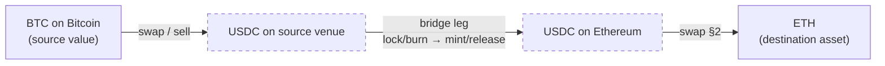
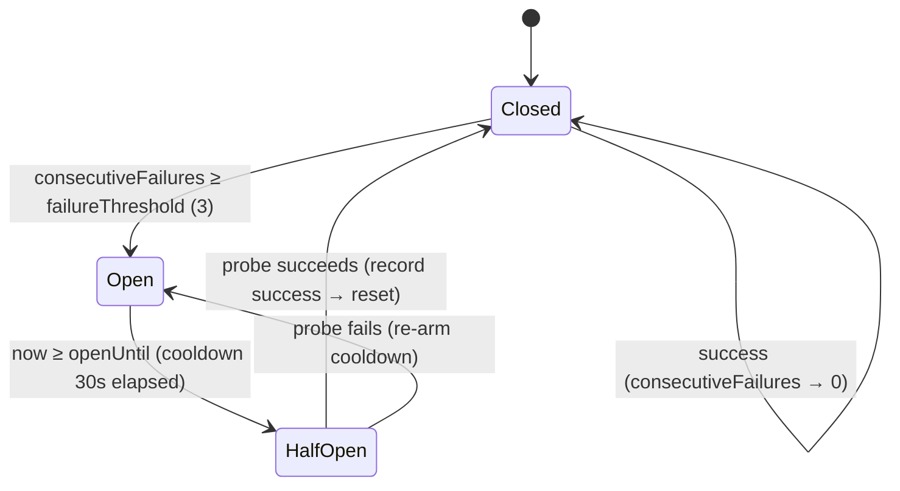
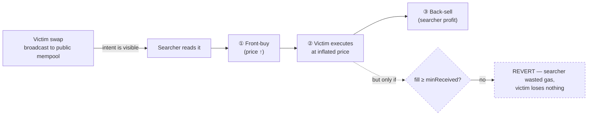

[Founder Bible](../../FOUNDER_BIBLE.md) · Project Aether · Volume V — the long-form behind [Chapter 13 — Universal Liquidity Engine](../bible/chapter-13-universal-liquidity-engine.md)

# The Universal Liquidity Engine Reference

*"I want ETH" → the best available path, honestly — grounded in the real router / provider / solver engines, shipped-vs-roadmap tagged.*

**About this document.** [Chapter 13](../bible/chapter-13-universal-liquidity-engine.md) is the memorize-it
charter. This is its **reference spec**: the liquidity graph, DEX aggregation, bridge & cross-chain planning,
RFQ & solver architecture, provider health & failover, order splitting & best-execution, MEV-aware routing,
forecasting & reliability, and the safety boundary — each tagged **SHIPPED** or **ROADMAP**. The invariant:
**the engine finds, the gate refuses, the device signs** — real minReceived + bounded slippage, never a
fabricated quote.

| § | Section | Grounded in |
|---|---|---|
| 1 | The Universal Liquidity Graph | `packages/router` (same-chain shipped) |
| 2 | DEX Aggregation & Quote Sourcing | `packages/router` + provider quote aggregation |
| 3 | Bridge & Cross-Chain Execution Planning | AdapterRegistry + Ch8 (roadmap) |
| 4 | RFQ & Solver Architecture | `packages/solver` (engine exists; user path roadmap) |
| 5 | Provider Health Scoring & Failover | the provider framework (shipped) |
| 6 | Smart Order Splitting & Best-Execution | route scoring (best-ex shipped; splitting roadmap) |
| 7 | MEV-Aware Routing | the bounded minReceived/slippage guard (shipped); private routing roadmap |
| 8 | Liquidity Forecasting & Reliability | simulation (shipped substitute); forecasting roadmap |
| 9 | The Safety Boundary & Definition of Done | Ch7/Ch8/Ch10 seams |

Honesty first: DEX routing/scoring, provider health & failover, and the slippage/minReceived guard are
shipped; bridge execution, RFQ/solver-as-user-path, MEV-aware private routing, order-splitting, and
forecasting are roadmap.

---

## §1 · The Universal Liquidity Graph

> **Section objective.** Define the model that turns a sentence — *"I want ETH"* — into a searchable,
> rankable, refusable *path*. This is the cartography layer of the Universal Liquidity Engine: the data
> structure the whole chapter traverses. §2 sources DEX quotes along its same-chain edges, §3 its
> cross-chain edges, §4 lets solvers propose whole paths, §5 keeps its edges honest, §6 splits an order
> across parallel edges, §7 protects the traversal from predators, §8 forecasts edge reliability, and §9
> is the gate that can only refuse the winner. Everything downstream is an operation *on this graph*.

The Intent Engine's job ends with an **abstract execution request** (Chapter 7 §17): it decides *what* the
user wants — a source asset, a target asset, an amount, and a set of constraints — and deliberately refuses
to name a DEX, a bridge, or an aggregator. *"The Intent Engine does not hard-code bridges or DEXs; it creates
an abstract execution request; the Execution Engine later chooses the best provider."* That sentence is a
promise, and this section is where the promise becomes a **buildable object**. The question *"how do I get
from what the user holds to what the user wants?"* is a graph-search problem, and we model it as one.

### 1.1 · The model: assets are nodes, venues are edges

Picture the entire supported crypto economy as a single directed, weighted graph.

A **node** is an `(asset, chain)` pair — `ETH@ethereum`, `USDC@ethereum`, `USDC@base`, `SOL@solana`,
`BTC@bitcoin`. The same symbol on two chains is *two distinct nodes*, because moving between them costs
something real. This is the whole reason cross-chain routing is hard and same-chain routing is not: within
one chain, `USDC@ethereum → ETH@ethereum` is a single hop; across chains, `USDC@ethereum → USDC@base`
requires an edge of an entirely different kind.

An **edge** is a *venue* — a concrete way to convert or move value between two nodes:

| Edge kind | Connects | Example venue | Weight it carries |
|---|---|---|---|
| **DEX pool** | two assets, same chain | Uniswap v3 ETH/USDC 0.05% | price/depth, fee, slippage, gas, health |
| **Bridge** | same asset, two chains | Across, deBridge, Stargate | fee, latency (ETA), depth, health |
| **RFQ maker** | two assets, same chain | a market maker's signed quote | firm price, expiry, fill probability |
| **Aggregator meta-edge** | two assets | 1inch / 0x / LI.FI path | a pre-composed multi-hop route as one edge |

Every edge carries the *same normalized weight vector*, so that "get from A to B" is a fair comparison no
matter which venue answers. In the shipped code this vector is the `RouteCandidate`
(`packages/router/src/types.ts`): `outputBase` (destination amount in base units), `feeMicros`,
`slippageBps`, `etaSeconds`, `healthScore`, `riskLevel`, and `quoteAgeMs`. A DEX quote and a bridge quote are
normalized into that *one* shape before either can win — the module comment states the design intent
plainly: *"All quotes — from any DEX or bridge aggregator — are normalized into this single comparable
shape, so 'best of N' is a fair comparison."*

The graph is never materialized in full — there is no giant in-memory adjacency list of every pool on every
chain, and there should not be (it would be stale the instant it was built, violating Doctrine #3's ban on
fabricated data). Instead the graph is **lazy and query-driven**: given a source and a target, we ask the
live venues *"what edges exist between these two nodes right now, and at what weight?"* The edges are
discovered at query time by fanning out to providers (§1.4). The graph is a *conceptual* structure that the
router walks on demand; its edges are only ever real, freshly-quoted ones.

### 1.2 · How an intent enters the graph: source → target

The abstract execution request crosses the Ch7 → Ch13 boundary as a `RouteRequest`
(`packages/router/src/request.ts`) — the minimal, typed contract that pins down exactly two nodes and the
amount travelling between them:

```ts
interface RouteRequest {
  fromSymbol: string;      // the source node's asset
  toSymbol: string;        // the target node's asset
  amountInBase: bigint;    // amount, base units — integer, never a float (Doctrine #4)
  fromDecimals: number;    // so base units are interpreted correctly
  chainId: string;         // the source node's chain
  toChainId?: string;      // set (and ≠ chainId) → this is a cross-chain conversion
}
```

*"I want ETH"* is not yet a `RouteRequest` — it is under-specified. The Intent Engine resolves the missing
coordinates first: which asset funds it (the source node), how much, on which chain, and whether the target
lives on a different chain. Only a *fully-pinned* source and target enter the graph. Amounts arrive as
`bigint` base units and stay that way through every edge weight and every comparison; humans see decimals
only at the very edge of the UI. A route that loses a wei to a float has already violated the Doctrine before
it has moved a cent.

The single most important bit in the request is `toChainId`. It is the fork in the road:

```
                       ┌──────────────────────────────────────┐
  RouteRequest ───────▶│  toChainId undefined  OR = chainId ?  │
                       └───────────────┬──────────────────────┘
                            same chain │ different chain
                                       ▼                    ▼
                          SWAP candidates            BRIDGE candidates
                        (DEX pool edges)        (cross-chain edges)
                          §2 · SHIPPED             §3 · ROADMAP
```

`CandidateGenerator.generate()` (`packages/router/src/candidates.ts`) reads exactly this bit —
`request.toChainId !== undefined && request.toChainId !== request.chainId` — and dispatches to swap-edge
discovery or bridge-edge discovery. That one boolean is the seam between what ships today and what is
designed-but-not-shipped, and this section labels it honestly rather than papering over it.

### 1.3 · Traversing the graph: discover → simulate → score → rank

The router does not "find the shortest path" in the textbook Dijkstra sense, because edge weights are not
scalars — they are *vectors* (output, cost, slippage, time, reliability, risk, freshness) whose relative
importance is the user's to set. So traversal is a four-stage pipeline, and it is **shipped** as
`GlobalRouteOptimizer.optimize()` (`packages/router/src/optimizer.ts`):

```
discover candidates → SIMULATE (gate) → score (weighted, pure) → ML re-rank (bounded)
                                                                        │
                                            best + ranked alternatives + confidence
```

**1 · Discover.** For the source→target pair, enumerate every currently-existing edge. Today this is the set
of direct one-hop edges a venue will quote (§1.4). Multi-hop composition — pathfinding *through*
intermediate nodes, e.g. `USDC → WETH → PEPE` when no direct pool exists — is the acknowledged extension
point: the candidates module notes *"Multi-hop composition is the extension point — the scorer already ranks
whatever candidates it is given."* The scorer is hop-count-agnostic, so the day a graph-walk generator
emits composed paths, they rank against direct ones for free. **That generator is roadmap; today's shipped
generation emits single-edge candidates.**

**2 · Simulate — the gate that can only refuse.** Before *any* candidate is ranked, it can be run through a
`SimulationProvider`. `simulateCandidates()` keeps only the candidates whose route simulates OK and drops the
rest; the optimizer throws `ALL_ROUTES_FAILED_SIMULATION` if none survive. This is Doctrine #2 and #5 made
literal at the routing layer: a route the deterministic layer cannot *positively* verify is never offered,
and the gate has exactly one power — to remove a candidate. It cannot invent one, cannot improve one, cannot
sign one.

**3 · Score — deterministic, pure, testable.** `scoreCandidates()` (`packages/router/src/scoring.ts`) is the
crown-jewel IP and it is a *pure function of the candidate set and the weights*. Each of seven factors is
min-max normalized **against the candidate set** so that `1 = best among the offered routes`, in the correct
direction — more output is better, lower cost/slippage/time is better, higher provider health is better,
lower risk is better, fresher quotes are better:

| Factor | Raw signal | Direction |
|---|---|---|
| `output` | destination base units | higher better |
| `cost` | `feeMicros` | lower better |
| `slippage` | `slippageBps` | lower better |
| `time` | `etaSeconds` | lower better |
| `reliability` | provider `healthScore` (§5) | higher better |
| `risk` | Risk Engine verdict (low/med/high) | lower better |
| `freshness` | `quoteAgeMs` vs 30 s expiry | fresher better |

The seven normalized factors are combined with a weight vector into one `[0,1]` score. The weights are the
user's voice in the math — `WEIGHT_PRESETS` ships `balanced`, `cheapest`, `fastest`, and `safest`, each
summing to 1 (the engine renormalizes any custom vector). "Best route" is therefore not a fixed notion: the
same candidate set ranks differently for a user who said *"cheapest"* than for one who said *"safest"*, and
because the function is pure it is exhaustively unit-testable and produces the identical ranking for identical
inputs — a property we lean on hard in §9.

**4 · Re-rank — ML at arm's length.** An optional `RoutePredictor` (`predictor.ts`) may nudge scores using
learned signals, but it is *bounded*: `boundedPredictor` clamps its adjustment to `±band` around the
deterministic score, so a misbehaving model *"can reorder near-ties but never crown a clearly-worse route."*
The default is `identityPredictor` — no ML, pure determinism. This is the whole doctrine in one class:
**AI may tune the order of already-verified, already-simulated candidates; it can never bypass the gate,
never fabricate a route, never move funds.** The worst case of a wrong prediction is a *suboptimal but still
valid, still-simulated* route.

The output is a `RouteResult`: the winning `ScoredCandidate`, ranked `alternatives` (shown as options and
held as fallbacks), and a `confidence` in `[0,1]` computed from provider health, the winner's score margin
over the runner-up, and whether simulation ran — `0.5·health + 0.3·margin + 0.2·(simulated ? 1 : 0.5)`. The
router *proposes*; it never executes. Its module header is categorical: *"It PROPOSES the optimal strategy;
the Execution Engine runs it."*

### 1.4 · Where edges come from: the provider fan-out

Edges are discovered, not stored. `CandidateGenerator` asks **every healthy provider at once** via the
provider framework's `ProviderRegistry.collect()` (`packages/providers/src/registry.ts`), which fans out to
all available providers concurrently and returns only the successes — flaky providers are shed by the
`HealthTracker`'s circuit breaker and probed again later (§5), with no manual intervention. Each returned
`SwapQuote`/`BridgeQuote` becomes one edge, tagged with its provider's live health score. This is the concrete
realization of Ch8 §4's provider registry: no DEX and no bridge is named in the router — everything flows
through the health-scored registries, so a venue can be added or retired without touching a line of routing
logic.

Two guards fire *inside* discovery, before ranking, so a bad edge never even competes (fail-closed, #5): a
quote with `amountOutBase <= 0` is dropped (a venue that cannot fill is not an edge), and a quote older than
`maxQuoteAgeMs` (default 30 000 ms) is dropped as stale. The provider framework's `isValidSwapQuote()`
(`packages/providers/src/aggregate.ts`) adds a slippage ceiling (default 1000 bps). An edge we cannot
positively vouch for is not offered — the graph refuses to draw it.

### 1.5 · The honest edge inventory — what ships, what is designed

This is the section's central act of honesty. The *engine* is more general than the *product*. Every edge
kind is modeled in the type system and rankable by the scorer; only some are executable end-to-end today.

| Edge kind | Modeled? | Quotable? | Executable to settlement? | Where |
|---|---|---|---|---|
| **Same-chain DEX swap** | ✅ | ✅ | ✅ **Shipped** — testnet + guarded mainnet ETH | `optimizer` + real Uniswap v3 path in `apps/web/src/broadcast.ts` |
| **Cross-chain bridge** | ✅ (`#bridgeCandidates`, `findBridgeRoute`) | ✅ (if a bridge provider is registered) | ❌ **Roadmap** — no shipped bridge driver | §3; Ch8 `kind:'bridge'` has no driver |
| **RFQ maker quote** | interface-ready | ❌ not a live path | ❌ | §4 |
| **Solver-proposed path** | ✅ engine (`packages/solver`) | verified, not a shipped user path | ❌ | §4 |
| **Multi-hop composed path** | scorer-ready | ❌ generator not shipped | ❌ | §1.3 extension point |

The one edge that goes all the way — quote to signed settlement — is the **same-chain DEX swap**, and it is
genuinely real, not a stub. `apps/web/src/broadcast.ts` sources a live Uniswap v3 quote by calling `QuoterV2`
over `eth_call` across every fee tier and keeping the best (`quoteSwap`), then executes it settlement-safely
(`sendSwap`): it approves only if the allowance is short, *waits* for the approval receipt, `eth_call`-
preflights the swap so a guaranteed revert fails cheaply before gas is spent, and only then signs and
broadcasts — in the browser, with the user's key. The `minReceived` (`amountOutMinimum`) handed to the router
is derived from that *real* quote and the user's own slippage tolerance; it is never a fabricated number.
This is the Doctrine's whole spine visible in one file: a real quote, honest and bounded `minReceived`, a
gate that refuses a would-revert route, and a device signature as the sole disposer of funds.

Everything else in the table is designed as a *target*. The bridge machinery exists in code —
`CandidateGenerator.#bridgeCandidates` will generate cross-chain candidates and the scorer will rank them —
but there is **no shipped bridge execution driver** (Ch8's `kind:'bridge'` step has no driver), so a
cross-chain candidate can be *quoted and ranked but not settled*. We will not present it, or an RFQ path, or
a live solver marketplace, or order-splitting, or MEV-aware routing as shipped. Those are §3–§7, each clearly
tagged where it lives.

### 1.6 · Benchmark and posture

The best routers in the industry are graph-search engines at heart. 1inch Pathfinder and 0x search a graph of
pools for the highest-output multi-hop path; Uniswap-X and CoW route through an off-chain solver competition;
LI.FI and Socket build a cross-chain graph whose edges are bridges plus destination swaps. Our model is the
same shape — nodes are `(asset, chain)`, edges are venues with normalized weights — and our shipped scope is
deliberately narrower and *honestly* so: **same-chain, single-edge, best-of-N DEX aggregation with a
deterministic multi-factor ranker and a simulation gate.** The graph's *frame* is universal (it already
represents bridges, RFQ makers, solver paths, and multi-hop composition as first-class edges); its *executed
reach* is the same-chain swap. The remaining eight sections widen the reach one edge type at a time, and each
one earns its place only when it can pass §9's Definition of Done: modeled, simulated, bounded, refusable,
and disposed by a device signature — never before.

**What §1 commits us to.** Routing is graph traversal, not a hard-coded provider call. A fully-pinned
source→target request enters; candidate edges are discovered live from health-scored providers; a simulation
gate can only refuse; a pure, weighted, user-tuned scorer ranks the survivors; bounded ML may reorder
near-ties; the router proposes and the device disposes. Money is `bigint` end-to-end, stale and unfillable
edges are dropped fail-closed, and the honest boundary — same-chain swap shipped, every other edge modeled
but roadmap — is stated on the record, not implied away.


## §2 · DEX Aggregation & Quote Sourcing

> **The claim of this section:** on a single chain, the wallet finds the best available price the way a
> professional trading desk would — fan out to every venue, distrust every answer, normalize the survivors
> into one comparable shape, score them under *your* constraints, and hand the winner to the Execution
> Engine with a **floor the router can only refuse to breach**. The number you sign against is the number
> the chain will honor, or the trade reverts. Nothing here is a marketing estimate. `minReceived` is a
> promise made of `bigint`.

This is the part of Chapter 13 that is **real today**, so it is the part we hold to the strictest honesty.
Best-price-on-one-chain is shipped: the deterministic scoring engine (`packages/router`), the provider
quote-aggregation framework (`packages/providers`), and a live on-chain swap path against Uniswap v3
(`apps/web/src/broadcast.ts`, Sepolia + guarded mainnet ETH). Cross-chain sourcing (§3), the RFQ/solver
marketplace (§4), and MEV-aware routing (§7) are siblings — designed as targets, tagged as roadmap, and
never smuggled in here as if they shipped.

---

### 2.1 · What §2 owns

The Intent Engine (Ch7) produces an abstract execution request — *convert `amountInBase` of `fromSymbol`
into `toSymbol` on `chainId`, subject to these constraints* — and hands it down. §2 answers a single,
bounded question: **among all same-chain venues that can do this conversion right now, which one gives the
user the most of the destination asset after everything is paid for, under the preferences they chose?**

That "after everything is paid for, under the preferences they chose" is the whole game. A naive aggregator
maximizes the headline output number. A real one folds **fees, price impact, slippage tolerance, gas, quote
freshness, and provider reliability** into one comparable figure of merit, because the biggest number on the
screen is routinely *not* the best trade once you subtract the cost of getting there. The deterministic
scorer is where that folding happens, and it is pure, typed, and exhaustively testable.

`toChainId === chainId` (or unset) routes here, to swap candidates. A different destination chain routes to
§3. This section deliberately stops at the chain boundary.

---

### 2.2 · The quote is the ground truth — never a fabricated estimate

Doctrine #3 (*never fake data*) and #4 (*money is integer bigint*) are not aspirations in the quote path;
they are the type signatures. A `SwapQuote` (`packages/providers/src/provider.ts`) is:

```ts
interface SwapQuote {
  providerId: string;
  amountOutBase: bigint;   // base units of the destination asset — never a float
  outDecimals: number;
  feeMicros: bigint;       // total fee in micro-USD
  slippageBps: number;
  etaSeconds: number;
  quotedAt: number;        // caller-stamped epoch ms — the staleness clock
}
```

There is no field for "estimated," "approximate," or "up to." A quote is a claim about a specific amount,
stamped with the moment it was true, and it **expires** (default 30 s). The web swap path goes further and
does not synthesize the number at all: `quoteSwap()` in `broadcast.ts` reads the price *from the chain* via
a Uniswap v3 **QuoterV2 `eth_call`**, trying each fee tier and keeping the best real answer:

```ts
const data = encodeQuoteExactInputSingle({ tokenIn, tokenOut, amountIn, fee });
const res  = await pool.request<string>('eth_call', [{ to: quoterV2, data }, 'latest']);
const out  = decodeQuotedAmountOut(res);
if (out > 0n && (!best || out > best.amountOut)) best = { amountOut: out, ...};
```

The quoter simulates the exact-input single-hop swap against live pool state and returns the amount the
pool would actually deliver. That is not our estimate of the price — it is the pool's own answer to the
transaction we are about to send. When we can read the truth, we read it; we never paint it.

---

### 2.3 · Quote sourcing — fan out, then distrust

Aggregation happens in the provider registry. `ProviderRegistry.collect()`
(`packages/providers/src/registry.ts`) fans a quote request out to **every healthy provider concurrently**,
records each outcome against the `HealthTracker`, and returns only the successes — a slow or failing
aggregator drops out of the round automatically and is probed again later (the mechanics are §5's; here we
consume them). This is the "use the best of N" primitive, and it is the same shape 1inch's Pathfinder or
0x's routing meta-aggregator use conceptually: ask everyone, keep the winners.

The critical discipline is what happens to the answers. **Provider responses are never trusted blindly.**
Before a quote is allowed to compete, `isValidSwapQuote()` (`aggregate.ts`) runs a structural + freshness
gate:

| Check | Rule | Why it fails closed |
|---|---|---|
| Positive output | `amountOutBase > 0n` | a zero/negative quote is a broken or malicious provider, never a route |
| Non-negative fee | `feeMicros >= 0n` | a "negative fee" is nonsense; reject rather than reason about it |
| Sane slippage | `0 ≤ slippageBps ≤ maxSlippageBps` (default **1000 = 10%**) | a wildly loose slippage is how a provider hides a bad fill |
| Fresh | `now() − quotedAt ≤ maxAgeMs` (default **30 s**) | a stale quote is a lie about the current pool state |

`bestSwapQuote()` then ranks the survivors by output, tie-breaking on lower fee, and returns `null` if
**nothing survived** — which the caller treats as "no route," not "$0." A network that cannot be reached is
an honest *unknown*, per the balances doctrine, and the pipeline fails closed on it (Doctrine #5).

This is the first place the fail-closed law bites: an unpriced asset, an unreachable venue, or a quote that
violates any sanity bound is *silently excluded from candidacy*, never nudged into the ranking with a
guessed value.

---

### 2.4 · Normalization — one comparable shape

Different aggregators speak different dialects. The route layer flattens them. `CandidateGenerator`
(`packages/router/src/candidates.ts`) calls `swaps.collect(p => p.quote(...))`, then maps each valid, fresh
quote into a single normalized `RouteCandidate`:

```ts
{
  id: `swap:${q.providerId}`,
  legs: [{ kind: 'swap', providerId, chainId, description }],
  outputBase: q.amountOutBase,   // bigint
  feeMicros:  q.feeMicros,       // bigint, micro-USD
  slippageBps, etaSeconds,
  healthScore: scores.get(q.providerId) ?? 0.5,  // from the HealthTracker
  riskLevel:   riskFor(toSymbol) ?? 'low',       // from the Risk Engine (Ch10)
  quoteAgeMs:  now() - q.quotedAt,
  priceImpactBps?: number,       // optional; undefined ⇒ scored neutrally
}
```

Only now — once every venue's answer wears the same clothes, in the same units, annotated with the same
operational metadata (health, risk, freshness) — is "best of N" a *fair* comparison. Note the two
cross-engine seams: `healthScore` comes from the provider framework's live reliability tracking (§5), and
`riskLevel` comes from the Risk Engine (Ch10), so the destination asset's safety is a first-class scoring
input, not an afterthought.

---

### 2.5 · The scoring engine — folding everything into one number

`scoreCandidates()` (`packages/router/src/scoring.ts`) is the optimizer's crown-jewel IP, and it is
deliberately boring in the best way: a **pure function** of `(candidates, weights)`, so its output is
deterministic, reproducible, and unit-testable to exhaustion. It scores each candidate on **seven factors**,
each normalized to `[0,1]` where `1` is best *among the current candidate set* (min-max, in the correct
direction), then combines them with a weight vector.

| Factor | Direction | Normalized against | Source |
|---|---|---|---|
| `output` | higher is better | the set's min…max output | `amountOutBase` |
| `cost` | lower is better | the set's min…max fee | `feeMicros` |
| `slippage` | lower is better | the set's min…max slippage | `slippageBps` |
| `time` | lower is better | the set's min…max ETA | `etaSeconds` |
| `reliability` | higher is better | absolute `[0,1]` | provider `healthScore` |
| `risk` | lower is better | mapped `low→1, medium→0.6, high→0.25` | Risk Engine |
| `freshness` | higher is better | `1 − age / 30s` | `quoteAgeMs` |

Min-max **against the set** is the subtle, correct choice: a factor only matters to the degree candidates
actually differ on it. If every venue quotes the same fee, `cost` collapses to neutral for all of them
(`max <= min ⇒ 1`) and the decision is driven by the factors that genuinely separate the routes. The final
score is a plain weighted sum:

```
score = Σ  factorᵢ · weightᵢ        (weights normalized to sum to 1)
```

Because the weights are normalized (`normalizeWeights`), callers can pass raw relative preferences and the
engine makes them a proper convex combination. Ties break toward the larger raw `outputBase` — more of the
asset, deterministically.

**Where user constraints enter.** This is the mechanical realization of Ch7 §6 (the Constraint Engine) and
§11 (Explainability). The user's stated preference — *cheapest, fastest, safest, or balanced* — selects a
`WEIGHT_PRESETS` profile:

| Preset | output | cost | slippage | time | reliability | risk | freshness |
|---|---|---|---|---|---|---|---|
| **balanced** | 0.30 | 0.20 | 0.15 | 0.10 | 0.10 | 0.10 | 0.05 |
| **cheapest** | 0.25 | 0.40 | 0.20 | 0.02 | 0.05 | 0.05 | 0.03 |
| **fastest** | 0.20 | 0.10 | 0.10 | 0.40 | 0.12 | 0.05 | 0.03 |
| **safest** | 0.15 | 0.10 | 0.10 | 0.05 | 0.30 | 0.27 | 0.03 |

"Lowest fees" tilts `cost`; "maximum slippage" is enforced upstream as a hard validity bound *and* shapes
the `slippage` term; "trusted providers only" and "risk limit" pull `reliability` and `risk`. When the
user's constraints conflict — the cheapest route is also the slowest — the engine does **not** guess. It
surfaces the trade-off (Ch7 §8): *"I found a cheaper plan and a faster plan — which do you prefer?"* The
`ScoreBreakdown` is returned alongside every score precisely so the UI can explain *why this route won*,
factor by factor. That is Doctrine #8 (everything auditable) at the routing layer.

A word on **price impact and gas**, since the section brief calls them out. Price impact is carried as an
optional `priceImpactBps`; when a venue reports it, it belongs in the same fold (a large-notional trade that
moves the pool is objectively worse even if its headline output leads). When it is *unknown*, the type
scores it **neutrally** rather than assuming zero — we never flatter a route by pretending it has no impact.
Gas enters the comparison through `feeMicros`: the provider framework's `GasProvider` estimate is folded
into the total micro-USD cost so that a route with a fat headline output but a punishing gas cost loses to a
leaner one. The principle throughout: **compare net outcomes, never gross.**

---

### 2.6 · The pipeline — discover → simulate → score → rank

`GlobalRouteOptimizer.optimize()` (`packages/router/src/optimizer.ts`) is the standalone routing
intelligence. It **never executes** — it returns the strategy; the Execution Engine (Ch8) runs it, the
device signs it. The pipeline:

```
                    RouteRequest (from Ch7)
                            │
                 1. DISCOVER  CandidateGenerator.generate
                            │   (registry.collect → validate → normalize)
                            ▼
              ┌──── candidates.length === 0 ? ──── throw NO_ROUTE
              │             │  no
              ▼             ▼
   2. SIMULATE (gate)   simulateCandidates(simulator)
              │   every candidate simulated; a sim error REJECTS it
              │   all rejected? ── throw ALL_ROUTES_FAILED_SIMULATION
              ▼
   3. SCORE            scoreCandidates(weights)      ← deterministic, pure
              ▼
   4. RE-RANK          boundedPredictor.adjust(...)  ← optional ML, ±band only
              ▼
        RouteResult { best, alternatives[], confidence, weightsUsed }
```

Two gates deserve emphasis. **Simulation is a refusal gate, not an advisory.** If a simulator is wired,
*every* candidate is simulated and any that fails — or merely throws — is dropped; `simulateCandidates`
returns only routes that positively simulate OK, and if none do, the optimizer throws rather than execute an
unsimulated route. This is the routing-layer echo of Doctrine #2: the deterministic gate can only *refuse*.

**ML is bounded and cannot crown a loser.** The optional `RoutePredictor` (`predictor.ts`) re-ranks *already
valid, already simulated* candidates within a clamped `±band` (default 0.1) around the deterministic score.
The worst case if the model is wrong is a *suboptimal but still-valid, still-simulated* route — never a
bypass of simulation, safety, or the fund-moving path. AI proposes at the edges; deterministic code holds
the center.

The result carries `confidence` (0.5·health + 0.3·score-margin-over-runner-up + 0.2·simulated) and
`weightsUsed`, so the caller can show the user how sure we are and exactly which preference profile produced
this winner. `alternatives[]` are the ranked runners-up — shown as "cheaper/faster" options and available as
failover targets.

---

### 2.7 · minReceived / amountOutMinimum — the honest floor

Here is where the whole section earns its keep. A quote is a snapshot; the pool moves; by the time the tx
mines, the real fill may differ. The wallet's answer is not to hope — it is to bind an **on-chain floor**
the user sees and consents to *before* signing.

In the shipped web swap, the user picks a max-slippage tolerance (default **0.5% = 50 bps**), and the
guaranteed minimum is computed in `bigint`, exactly, from the *live* quote (`apps/web/src/App.tsx`):

```ts
// The on-chain amountOutMinimum — a hard floor, in base units, no float.
const minOut = swapQuote
  ? (swapQuote.amountOut * BigInt(10_000 - slippageBps)) / 10_000n
  : null;
```

That number is displayed — `minOutDisplay` — so *comprehension precedes signature* (Design Review Gate,
UX). It is then threaded straight into the swap calldata as Uniswap's `amountOutMinimum` in
`encodeExactInputSingle`, and `sendSwap()` executes **settlement-safely** (`broadcast.ts`):

1. **Read the live allowance**; approve the router only if it is short of `amountIn`.
2. If approving, **wait for the approval receipt** — a revert throws, and the swap is *not* broadcast until
   the router can actually pull the token.
3. **`eth_call` preflight** the swap: a guaranteed revert (floor too high, no liquidity) fails cheaply here,
   *before* gas is spent on-chain.
4. Sign + broadcast.

If the pool cannot deliver at least `amountOutMin`, **the swap reverts on-chain rather than filling** — so
slippage, a front-run, or a sandwich can cost the user *at most* the tolerance they explicitly set, and
never a wei more. The floor is not a suggestion to the DEX; it is a condition of the transaction. The signed
quote — read from the chain, gated, floored, and preflighted — is the truth. We would rather fail a swap
loudly than fill one quietly at a worse price than promised.

---

### 2.8 · Shipped vs roadmap (no blurring)

| Capability | Status | Where |
|---|---|---|
| Deterministic 7-factor scoring + presets | **Shipped** | `packages/router/src/scoring.ts` |
| Candidate gen → simulate gate → score → bounded ML re-rank | **Shipped** | `packages/router/src/optimizer.ts` |
| Provider quote fan-out (`collect`) + validation + best-of-N | **Shipped** | `packages/providers` (`registry.ts`, `aggregate.ts`) |
| Live on-chain quote (Uniswap v3 QuoterV2, best fee tier) | **Shipped** | `apps/web/src/broadcast.ts` |
| Settlement-safe swap with `amountOutMinimum` floor | **Shipped** | `apps/web/src/broadcast.ts` (`sendSwap`) |
| Multi-hop / split composition across venues | **Roadmap** — the scorer already ranks whatever candidates it is given; the generator is the extension point | §6 |
| Live multi-DEX-aggregator adapters in production | **Roadmap** — the plugin interface + registry are real; today's wired venue is Uniswap v3 (best-of-fee-tier), guarded mainnet ETH | §5 |
| RFQ / solver quotes as a live candidate source | **Roadmap** | §4 |
| MEV-aware routing (private mempools) | **Roadmap** | §7 |

The honest nuance worth stating plainly: today's *live wire* aggregates across Uniswap v3 **fee tiers**
(a real best-of comparison against on-chain pool state), while the *engine* aggregates across **N
independent providers** and is unit-tested at that interface. The framework is production-shaped; the shipped
user swap is wired to one venue with the multi-provider registry as the seam the next adapters plug into.
We say "engine exists" and "one venue wired," never "we aggregate every DEX."

---

### 2.9 · Benchmark & boundary

Against the field: our fan-out-and-rank shape mirrors **1inch Pathfinder** and **0x**'s meta-aggregation,
and our hard on-chain `amountOutMinimum` is the same protective floor every serious router enforces. Where
**CoW Swap** and **Uniswap X** go further is *intent-based, solver-competitive* execution with batch
auctions and MEV protection — that is our §4/§7 target, explicitly tagged, not claimed here. What we already
hold as a first-class principle, and many aggregators bolt on late, is **honesty as a type system**: bigint
money end-to-end, a quote that expires, a floor the user sees and signs, a gate that can only refuse, and a
scorer whose every decision is explainable and auditable.

Best-price-on-one-chain is real, and it is safe by construction. The next section, **§3 · Bridge
Aggregation & Cross-Chain Execution Planning**, extends the same discipline across the chain boundary —
where the honesty bar is higher still, because a bridge is irreversible and cannot be preflighted the way a
same-chain swap can.


## §3 · Bridge Aggregation & Cross-Chain Execution Planning

> **Status up front — read this before anything else.** The *breadth* is real: the wallet holds one
> universal identity across Bitcoin, every supported EVM chain, and Solana, and can read balances and
> **broadcast native + token value on each** through the `AdapterRegistry` (Ch8 §4, `packages/chains`).
> The *route model* is real: a cross-chain intent already compiles into an ordered, dependency-linked
> `ExecutionPlan` that the Execution Engine runs settlement-safely (Ch8). **What is roadmap is the last
> mile of cross-chain *execution* — no live bridge provider is wired, and no code path signs and
> broadcasts a bridge leg.** The shipped liquidity path is the **same-chain swap** (§2; real Uniswap v3
> on Sepolia in `apps/web/src/broadcast.ts`). Everything below that describes bridging as *executed* is a
> **target design, tagged `[ROADMAP]`** — never present it as something a user can do today.

Value does not move natively between ecosystems. A Bitcoin UTXO cannot become ETH by fiat; a Solana SPL
balance cannot appear on Arbitrum by wishing. When a user says *"I want ETH"* while their money sits in
BTC, the wallet is not doing one thing — it is composing a **sequence across three trust domains** whose
clocks, finality rules, and failure modes do not agree. This section is about turning that sentence into
a plan that is honest at every hop, and about the trust surface bridging drags in — the single largest
loss vector in the history of crypto, and therefore the place where our doctrine (*AI proposes,
deterministic code verifies, the device signs; the gate can only **refuse***) has to bite hardest.

### 3.1 · The cross-chain intent, decomposed

The Intent Engine (Ch7) hands the liquidity layer an **abstract, chain-agnostic request**: *from this
value, on these source chains, reach this destination asset.* It does **not** dictate the venues. The
liquidity engine's job is to decompose that request into the **Execution Graph** (Ch8 §7) — the ordered
node list the Execution Engine walks. For "BTC → ETH" the canonical shape is:

> **Sell BTC → acquire a bridgeable stable → bridge to the destination chain → swap into ETH**



Two properties make this hard and both are *settlement* properties, not routing ones. First, the legs are
**strictly ordered** — you cannot swap on the destination chain until the bridged funds *arrive and
finalize* there, and finality on the source chain must clear before the bridge will act. Second, the legs
live on **different chains with no shared transaction** — there is no atomic "do all or none." A plan that
completes leg 1 and 2 but fails leg 3 has *already moved real value across a bridge*; it cannot be rolled
back (Ch8 §16). The plan therefore has to be **safe at every intermediate resting point**, because any of
them can become the *final* resting point.

### 3.2 · The plan is a DAG the Execution Engine already runs `[SHIPPED as model]`

We did not invent a new cross-chain runtime for this — the existing `ExecutionPlan` already expresses it.
The Zod schema (`packages/intents/src/schema.ts`) carries `sourceChains: string[]`, `destChains:
string[]`, and an ordered `steps[]` where **`bridge` is a first-class step `kind`** alongside `transfer`,
`swap`, `approve`, `stake`, and each step declares `dependsOn: number[]`. That last field is the whole
game: it makes the plan a **DAG**, and the Execution Engine (`packages/execution/src`) is a persisted,
resumable step machine that runs it in strict dependency order —

```
per step:  simulate (sandbox gate) → broadcast (device-signed) → confirm → verify
```

Three guarantees from `engine.ts` matter enormously for cross-chain and cost us nothing extra:

- **Never strand funds.** An unrecoverable failure **parks** the execution and records `fundsLocation`
  — the chain the value is actually resting on — and *stops*. `initExecution` seeds `fundsLocation` and
  every `#advanceFunds` transition updates it, so after a failed bridge the answer to *"where is my
  money?"* is always known and honest (Ch8 §15). Value in transit is never reported as lost or as "$0."
- **Resumable.** State is saved after every transition (`state.ts`), so a crash between the bridge leg and
  the destination swap resumes at the first unconfirmed step — it will not re-broadcast a confirmed
  bridge.
- **Simulate-before-broadcast + verify-after.** A leg whose simulation doesn't match the plan is **never
  broadcast**; a leg that confirms but fails its post-invariant (e.g. *received < minReceived*) parks
  rather than proceeding. This is the deterministic gate that makes "AI planned it" safe: the gate can
  only refuse.

So the **model and the runner are real**. What is missing is exactly one thing: a `StepDriver`
implementation that can `broadcast` a `bridge` step against a real bridge. Today `executeTransferStep`
(`broadcast.ts`) implements `transfer` and, via `sendSwap`, `swap` — and **deliberately refuses** what it
cannot do safely (a mainnet ERC-20 transfer throws rather than guess a token address; SOL/BTC mainnet
throws because the RPC path isn't built). There is no `bridge` case, by design: we will not fake one.

### 3.3 · How the graph (§1) gains cross-chain edges `[SHIPPED as framework]`

§1's Universal Liquidity Graph is same-chain-complete: swap edges connect assets that share a venue on one
chain. **Cross-chain edges are bridge edges** — a directed edge `(assetₓ, chainA) → (assetₓ, chainB)`
whose weight is a *bridge quote*, not a pool price. The framework to source and normalize those edges
already exists and is pure and tested:

- **The `BridgeProvider` interface** (`packages/providers/src/provider.ts`): `quote(BridgeRequest) →
  BridgeQuote`, symmetric to `SwapProvider`. `BridgeRequest` carries `{ symbol, amountInBase, decimals,
  fromChainId, toChainId }`; `BridgeQuote` returns `{ amountOutBase, feeMicros, etaSeconds, quotedAt }`.
  Nothing is hard-coded — a bridge is a *plugin* selected through the registry's health scoring, never by
  name (ADR-0034).
- **Candidate generation** (`packages/router/src/candidates.ts`): `#bridgeCandidates` asks *every* healthy
  bridge provider for a quote in parallel via `registry.collect`, filters stale/zero quotes
  (`maxQuoteAgeMs`, default 30s), and normalizes each into the **same `RouteCandidate` shape** a swap
  produces — a `bridge`-kind leg, `outputBase`, `feeMicros`, `etaSeconds`, provider `healthScore`,
  `riskLevel`, `quoteAgeMs`.
- **Fair scoring** (`packages/router/src/scoring.ts`): because a bridge route and a swap route are the same
  normalized shape, the weighted scorer ranks them **against each other** on the same seven factors
  (output, cost, slippage, time, reliability, risk, freshness). "Best of N" is a fair comparison whether
  N mixes DEX and bridge candidates.

This is the mechanism by which the graph *becomes* multi-chain: a bridge is not a special case in the
optimizer, it is another candidate source. Multi-hop composition — chaining a source swap, a bridge, and a
destination swap into one scored candidate — is the documented extension point (`candidates.ts`,
`RouteOptimizer.findBridgeRoute` is "bridge-only for MVP; then optionally swap on destination"). The
scorer already ranks whatever candidates it's given; what's `[ROADMAP]` is the **composer** that emits
multi-leg candidates and a **live bridge plugin** behind the interface.

### 3.4 · Bridge aggregation & selection `[ROADMAP]`

Aggregation here means the same discipline §2 applies to DEXs, aimed at bridges — and the best-in-class
bar is explicit. **LI.FI** and **Socket/Bungee** aggregate dozens of bridges and destination DEXs behind
one quote; our target is to sit at that layer of abstraction, not to integrate a single bridge. Two
families of bridge exist and they are *not* interchangeable on trust:

| Family | Examples | How value crosses | Trust it adds |
|---|---|---|---|
| **Canonical / native** | Arbitrum & Optimism native bridges, CCTP (Circle) for USDC | Lock-and-mint or burn-and-mint via the chain's own contracts | Minimal beyond the chains themselves; slow (finality/challenge windows) |
| **Third-party / liquidity** | Across, Stargate, deBridge, Relay | Liquidity pools + off-chain relayers/validators fill on the far side | **Adds a bridge's own validator/oracle + liveness trust** — a new failure domain |

Selection is not "cheapest wins." A bridge is chosen the way any provider is (§5): **health-scored** on
success rate, latency, realized slippage, downtime, and **security incidents**, with a **circuit breaker**
that ejects a degraded or compromised bridge from candidate generation entirely. The `safest` weight
preset (`scoring.ts`: `reliability 0.30, risk 0.27`) exists precisely so a user — or the policy engine —
can bias cross-chain routing toward canonical bridges and away from a cheap-but-unproven one, and the
optimizer will **explain the trade-off** (Ch8 §6) rather than silently take the risk.

### 3.5 · The trust & risk surface bridges introduce (Ch10)

This is the section's spine. **Bridges are where crypto loses money** — the largest exploits in the space
have been bridge compromises, because a bridge is a cross-chain custodian holding locked value while
asserting facts about *another* chain. Adding a bridge leg to a plan adds an entire new adversary surface,
and the Security Engine (Ch10) treats it as such:

1. **Custody / mint-authority risk.** Lock-and-mint bridges hold the source asset and mint a
   representation. If the mint authority or the lock contract is compromised, the representation is
   unbacked. Canonical > third-party here, always.
2. **Validator / oracle trust.** A liquidity bridge's relayers *attest* that the source leg happened. A
   forged or bribed attestation mints value that was never locked. This is the classic bridge-hack shape.
3. **Liveness / stuck-in-transit.** The source leg can confirm while the destination fill never
   arrives — the bridge is down, out of liquidity, or paused. Funds are *not lost*, but they are parked
   mid-flight, and the plan must say so honestly (§3.2's `fundsLocation`), never round to zero.
4. **Finality asymmetry & reorgs.** Bitcoin's probabilistic finality, an EVM chain's reorg window, and
   Solana's confirmation model do not agree. A bridge that acts before the source leg is final can be
   unwound by a reorg. The plan must **wait for source finality before the bridge leg, and destination
   finality before the destination swap** — dependency edges that cost latency and are non-negotiable.
5. **Slippage across the boundary.** `minReceived` must be honest *end-to-end*, not per-leg. The number
   shown on the confirm sheet (`quote.youReceiveMin`) is the **worst-case destination-asset amount after
   the bridge fee, the bridge's own slippage, and the destination swap's slippage compound** — computed as
   bounded integer bigint, never a fabricated or optimistic mid-quote. If any leg is **unpriced or the
   bridge unknown, the gate fails closed** (Doctrine #5): the plan is refused, not executed on a guess.

The through-line: **the deterministic gate can only refuse.** A bridge quote is an *AI/provider proposal*;
it is verified by simulation and by the post-broadcast invariant, and only a device signature disposes of
funds. No bridge, and no solver proposing a bridge route (§4), can lie its way past the gate — over-claims
are caught by independent simulation and, in the solver marketplace, *slashed* (`packages/solver`).

### 3.6 · Settlement-safe cross-chain sequencing `[ROADMAP for bridge legs]`

Because there is **no atomic rollback across chains** (Ch8 §16), safety is engineered into the *ordering*
and the *resting points*, not bolted on after. The rules a bridge-capable driver must obey:

- **Order by finality, not by speed.** Each leg's `dependsOn` encodes "the previous leg must be *final on
  its chain*" — not merely broadcast, not merely one confirmation. The Execution Engine already blocks a
  step until its dependencies are `confirmed`; the driver's `confirm` for a source leg must not return
  until the finality bar for *that* chain is met.
- **Every intermediate state is a safe resting point.** After the source swap: a bridgeable stable, on the
  source chain, spendable. After the bridge: the stable on the destination chain, spendable. If the
  destination swap fails, the engine **parks** with the stable safe on the destination chain and offers
  *continuation* (retry the swap) or *stop* — never a silent loss (Ch8 §15).
- **Idempotency across chains.** Retries must key on the bridge's transfer id so a resumed execution never
  double-bridges. The engine's resumability handles re-entry; the bridge driver must supply the
  idempotency key.
- **Compensating actions, honestly labelled.** Where "undo" is impossible, the wallet offers a
  *compensating* path (e.g. bridge the stable back) and **states plainly what can and cannot be reversed**
  (Ch8 §16) — no UI that implies a confirmed cross-chain move can be taken back.

### 3.7 · Honest status — shipped vs roadmap

| Capability | Status | Evidence / gap |
|---|---|---|
| Multi-chain identity + balance reads (BTC/EVM/SOL) | **SHIPPED** | `AdapterRegistry`, `packages/chains`; real testnet reads in `broadcast.ts` |
| Native + token **transfer** broadcast per chain | **SHIPPED** | `sendEvmTransfer/Sol/Btc/Erc20`; guarded mainnet ETH |
| Same-chain **swap** as the liquidity path | **SHIPPED** | `sendSwap` — real Uniswap v3 on Sepolia (§2) |
| Cross-chain plan as an ordered DAG (`bridge` step kind, `dependsOn`, `sourceChains`/`destChains`) | **SHIPPED as model** | `schema.ts`, `ExecutionPlan`; run by `execution/engine.ts` |
| Settlement-safe runner (park, resume, funds-located, simulate-before-broadcast) | **SHIPPED** | `packages/execution` |
| `BridgeProvider` interface + bridge candidate generation + fair scoring | **SHIPPED as framework** | `providers/provider.ts`, `router/candidates.ts` (`#bridgeCandidates`) |
| A **live bridge plugin** behind the interface | `[ROADMAP]` | no concrete `BridgeProvider` wired to a real bridge |
| A **bridge `StepDriver`** that signs + broadcasts a bridge leg | `[ROADMAP]` | `executeTransferStep` has no `bridge` case — by design |
| Multi-hop composer (source swap → bridge → dest swap as one scored candidate) | `[ROADMAP]` | documented extension point; `findBridgeRoute` is bridge-only MVP |
| Bridge aggregation at the LI.FI/Socket layer | `[ROADMAP]` | target design; framework-ready |

The honest one-sentence version: **we can already model and safely *run* a cross-chain plan, and we can
already *find* bridge candidates in the abstract — but no leg of that plan touches a real bridge yet, and
until one does, the shipped cross-chain answer is "swap on the chain you're on."**

### 3.8 · What must be true before a bridge leg may broadcast real value

Deferring the full Definition of Done to §9, this section's exit gates are specific: (1) at least one
**canonical** bridge integrated as a `BridgeProvider`, health-scored and circuit-breaker-guarded; (2) a
bridge `StepDriver` that is **simulate-before-broadcast** and **idempotent**, with a `verify` invariant of
*destination-asset received ≥ end-to-end `minReceived`*; (3) `fundsLocation` proven correct at every
intermediate resting point by a resume/park test; (4) end-to-end `minReceived` computed as bounded bigint
across all legs, with the gate **failing closed** on any unpriced leg or unknown bridge; (5) a Ch10
security review signed by the Principal Security Engineer covering the bridge's specific trust
assumptions. Until all five are green, the `bridge` step kind stays a **model the planner may draw and the
engine may run against testnets — never a mainnet broadcast.** We ship world-class cross-chain, or we ship
the honest swap. We do not ship a bridge we cannot prove safe.


## §4 · RFQ & Solver Architecture

The three sections before this one source liquidity the way an aggregator does: they *ask the market
what it is offering* — the Liquidity Graph (§1) maps the venues, DEX aggregation (§2) collects and
validates AMM quotes, bridge planning (§3) stitches chains together. That model has a structural
ceiling. On an automated market maker the price you receive is a deterministic function of pool depth
and your trade size; the moment your transaction is public in the mempool, that function is also
knowable to everyone else, and the gap between the quoted price and the filled price becomes a resource
to be mined — sandwich attacks, backrunning, priority-gas auctions. The user pays for the AMM's
transparency in slippage and MEV. Section §7 (MEV-Aware Routing) attacks that from the settlement side;
this section attacks it from the *sourcing* side, by changing **who quotes and how they compete**.

The idea is simple and proven: instead of the wallet reading a curve, a set of professional
counterparties **quote a firm price** and **compete to fill the order**. This is the design behind the
best execution venues in the market — CoW Protocol's batch auctions, UniswapX's Dutch-auction fillers,
1inch Fusion's resolvers, 0x / Hashflow RFQ. The Intent Layer is built to sit on exactly this substrate:
Chapter 7 already produces an *abstract execution request* ("I want ETH, from this, at least this much,
within this slippage") rather than a pre-baked transaction — which is precisely the object a market of
solvers is meant to bid on. This section specifies two mechanisms for turning that request into
competition, and is scrupulous about which one is built and which one is a target.

| Sourcing model | Who sets the price | Slippage / MEV exposure | Status here |
|---|---|---|---|
| **AMM path** (§2) | The pool curve, publicly | High — price is a public function of your size | **Shipped** (quote aggregation) |
| **RFQ** | A professional market maker, firm | Low — firm quote, off the public curve | **Roadmap** (no live maker integration) |
| **Solver auction** | Competing solvers, best valid bid wins | Low — sealed bids, batch-cleared, verified | **Engine shipped; not a user path** |

---

### 4.1 · RFQ — request-for-quote (roadmap)

An RFQ path replaces the AMM curve with a **firm, signed quote from a named counterparty**. The wallet
broadcasts the request — asset in, asset out, size — to a pool of registered market makers; each returns a
price it is willing to honor for a short window; the wallet takes the best one and settles against it.
Because the maker commits to a price rather than to a pool position, the user is insulated from the two
failure modes of the AMM path at once: there is **no curve to slide down** (the fill *is* the quote, so
realized slippage against the quote is zero), and there is **nothing to sandwich** (the maker, not the
public mempool, bears the inventory risk). This is why RFQ venues consistently beat AMMs on size for
liquid pairs.

RFQ is **roadmap** in the Intent Layer, and must be labeled as such wherever it surfaces. We ship the
*shape* it will plug into — the provider framework (§5, `packages/providers`) already models a quote
source as a health-scored, circuit-broken provider behind a registry, and a maker RFQ endpoint is
"just another provider" to the aggregator — but there is **no live market-maker integration, no signed
firm-quote settlement, and no on-chain RFQ contract wired to real funds today.** Presenting an RFQ price
as available would violate Doctrine #3 (never fake data). The honest surface today is: the aggregator
returns AMM quotes; RFQ is designed-in and tagged as target.

When it lands, the non-negotiable is that a firm quote is treated exactly like every other quote the
engine handles — it is **data to be verified, not a promise to be believed.** A maker's signed price
still passes the same freshness, positivity, and slippage-bound checks as an AMM quote
(`isValidSwapQuote`, §2), and the amount it promises is still just an `outMinBase` that the deterministic
gate re-derives before anything is signed. A better price from a named party earns no trust discount.

---

### 4.2 · The solver network — competitive execution (engine shipped)

Where RFQ asks *one* maker for *one* price, the **solver network** runs an open auction: independent,
staked solvers each propose a complete execution strategy for the request, and the platform — acting as an
untrusting coordinator — verifies every proposal, weights it by earned reputation, and selects the single
best valid one. This is the CoW/UniswapX model generalized: solvers are free to be arbitrarily clever
about *how* they fill (internalize against their own book, split across venues, use private liquidity),
and the protocol only cares that the result is **verifiably at least as good as promised.**

This engine is **built and tested today** in `packages/solver` — as a standalone, dependency-free core
(a "solver-network-as-a-service"). What is emphatically **not** shipped is a *user path* to it: no live
solver is registered against real inventory, no auction runs on a production intent, and the wallet does
not route a user's funds through a solver competition. The engine exists as audited IP ahead of the
market that will populate it. Say "the marketplace coordinator is built"; never say "solvers compete for
your trade" — they do not, yet.

**The request/proposal contract.** The unit of competition is a `SolveRequest` (`types.ts`): the asset
pair, `amountInBase`, the user's binding `minOutBase`, a `maxSlippageBps` cap, source/destination chains,
optional provider allow/deny lists, and a `deadlineIso` that closes the submission window. Every solver
answers with a `SolverProposal`: its **guaranteed minimum output `outMinBase`** (a binding commitment,
bigint base units carried as a decimal string so precision never touches a float — Doctrine #4), a fee in
micro-USD, `slippageBps`, an ETA, the providers it used, the route `legs`, an advisory self-reported
`confidence`, a `fallback`, and a content `hash` over its own fields. The commitment the user cares about —
*"you will receive at least this many base units"* — is a first-class, checkable number, not a marketing
estimate.

**The coordinator pipeline (`SolverMarketplace.solve`).** The marketplace is deliberately paranoid; it
treats every proposal as a hostile claim until proven:

```
broadcast request
   │
   ▼
① SEALED COLLECTION ── gather all proposals before evaluating any
   │                    (no solver sees another's → nothing to front-run)
   ▼
② VALIDATE (per proposal, structural — validateProposal):
   registered · not-banned · staked ≥ min      (eligibility / anti-Sybil)
   content-hash matches                          (integrity / anti-tamper)
   requestId matches · within deadline           (binding to this auction)
   outMinBase ≥ request.minOutBase               (DELIVERS the promise)
   slippageBps ≤ cap · allow/deny respected      (honors constraints)
   │
   ▼
③ INDEPENDENTLY SIMULATE the survivors:
   re-derive the route's ACTUAL output.
   claimed > actual + tolerance  →  REJECT + SLASH (malicious over-claim)
   │
   ▼
④ SCORE the valid survivors (reputation-weighted, pure) → SELECT one winner
   │
   ▼
winning PROPOSAL  →  Risk + Policy (Ch10) + device signature (Ch8)
```

Two properties make this safe rather than merely clever. First, **sealed collection**: all proposals are
gathered before any is scored, so no solver can observe and undercut another within the round — the
auction is a batch, and there is nothing to front-run inside it (the same reason CoW's batch auctions
neutralize intra-batch MEV). Second, and most important, **claims are checked, not trusted.** Structural
validation (`validateProposal`) proves a proposal is *shaped* like a valid fill; but a solver could still
lie about the number that matters. So when a simulator is available the coordinator **independently
re-computes what the proposed route would actually deliver** and compares it to the promised `outMinBase`.
If the solver promised more than reality gives (beyond a configurable `simulationToleranceBps`, default
zero), the proposal is not merely dropped — the solver is **slashed for a malicious over-claim and a
security incident is recorded against its reputation.** A solver cannot lie its way to selection, because
selection is gated on verification, not on the solver's word. This is the §4 expression of the
chapter-wide law: *the engine finds and proposes; deterministic code verifies; only then does the device
dispose.*

**Scoring — the routing math (`scoring.ts`).** Among the valid survivors, each proposal is scored on a
min-max-normalized weighted blend, so a cheaper, faster, lower-slippage, more-reputable solver wins and
history breaks close calls:

| Factor | Weight | Direction |
|---|---|---|
| Cost (fee) | 0.35 | lower better |
| Time (ETA) | 0.20 | lower better |
| Slippage | 0.15 | lower better |
| Reputation | 0.20 | higher better |
| Confidence (advisory) | 0.10 | higher better |

Each of cost/time/slippage is normalized against the candidate set (`normLowerBetter`), reputation and
confidence are clamped to `[0,1]`, and the composite is a plain dot product rounded to four decimals.
Winner selection is fully deterministic: highest score, ties broken by **lower fee**, then by solver id —
so the same proposal set in any arrival order yields the same winner. Note that confidence, the one field
a solver reports about *itself*, is weighted lightest (0.10) and is advisory only; the fields that decide
the auction are the ones the platform can independently check.

**Reputation — earned, not asserted (`reputation.ts`).** A solver's standing is a function of history:
`successRate × incidentPenalty × invalidPenalty × (0.8 + 0.2 × latencyFactor)`. A brand-new solver gets a
neutral 0.5 prior — it can compete immediately but does not outrank a proven one on a tie. A single
**security incident dominates** (each roughly halves the score, multiplicatively), invalid proposals and
high latency shave it down. Reputation is fed *only* by real post-settlement outcomes reported back
through `reportSettlement`, so it measures delivered results, not promises.

**Incentives — aligning solver profit with user benefit (`incentives.ts`).** A winning solver earns a
share (default 10%, `shareBps = 1000`) of the **cost savings it delivered versus a baseline** — it profits
by making the user better off, and earns nothing if it wasn't cheaper. Misbehavior is priced by severity:
a post-win timeout slashes 5% of stake, an invalid proposal 10%, a malicious over-claim caught by
simulation 50%. Stake (held in the `SolverRegistry`) is both the anti-Sybil gate — a fake identity costs
real capital — and the pool that slashing draws from; a solver slashed to zero stake is auto-banned. The
economic model is specified here; the on-chain token/stake mechanics are a protocol-layer concern and are
themselves roadmap.

**Determinism (`env.ts`).** Time, ids, and the proposal content hash are injected via `SolverEnv`, so
evaluation and selection are reproducible and testable — a hard requirement for a core that will one day
arbitrate real money. The `stableHash` (two-lane FNV-1a → 16 hex chars) is what lets the platform detect a
tampered proposal: it recomputes the hash over the canonical fields and rejects any mismatch. Nothing in
the scoring or selection path reads a wall clock or a random source.

---

### 4.3 · The intent → competition model, and where it plugs in

The reason this architecture is even possible is the shape of the pipeline established in Chapter 7: the
Intent Engine emits an **abstract, constraint-bearing execution request**, not a signed transaction. That
request *is* the `SolveRequest` a market of solvers bids on — the same object, whether it is satisfied by
the internal Route Optimizer (§2, today's real path) or, in the target state, by a competitive auction. The
Route Optimizer is designed to be the **"house solver"**: a baseline strategy that always competes, so the
network can never do *worse* than what the wallet would have found itself. Adding external solvers can only
raise the floor.

The boundary is the whole point, and it is identical to the boundary every other engine in this book
respects:

- **Solvers propose.** They hold no keys, never sign, and never see a secret. A winning proposal is a
  *plan*, nothing more.
- **Deterministic code verifies.** The proposal clears structural validation, independent simulation,
  Risk, and Policy (Chapter 10) — every one of which can only **refuse**. The user's honest `minOutBase`
  and slippage cap ride through untouched; the gate re-derives the received amount and blocks anything it
  cannot positively confirm (Doctrine #5, fail closed).
- **The device disposes.** The winning plan is handed to the Execution Engine (Chapter 8), which is the
  only thing that ever requests the on-chain, irreversible **device signature.** The AI, the solver, and
  the marketplace have exactly zero signing authority between them.

Every step is auditable (Doctrine #8): the `SolveOutcome` carries the full set of `ProposalEvaluation`s —
each proposal, its per-check `ValidationResult`, its score, and its reputation weight — so *why this solver
won and those lost* is a recorded, replayable artifact, not a black box.

---

### 4.4 · Honest status

| Capability | Status |
|---|---|
| Quote aggregation across providers (best-of-N, validated) | **Shipped** (§2, `packages/providers`) |
| Solver validation · simulation-verified over-claim slashing | **Shipped as engine** (`packages/solver`, tested) |
| Reputation · incentives · sealed marketplace coordinator | **Shipped as engine** (`packages/solver`, tested) |
| A live solver competing for a user's real trade | **Roadmap** — no registered live solver, no user path |
| RFQ firm-quote sourcing from professional makers | **Roadmap** — no maker integration, no firm-quote settlement |
| On-chain stake / slashing token mechanics | **Roadmap** — economic model specified, protocol layer unbuilt |

The line to hold: `packages/solver` is real, deterministic, adversarially tested code — the marketplace
*machinery* exists and can be reasoned about. It is **not** a shipped user path, and RFQ is **not** a live
source. The Definition of Done that would let either carry real funds — a registered solver set, a
production simulator wired to the same gate the internal router uses, and a third-party audit — is
specified in §9 (the Safety Boundary). Until every one of those is green, the wallet sources liquidity the
honest way it does today, and this section describes the engine we built to be ready when the market to
fill it arrives.


## §5 · Provider Health Scoring & Failover

**Sourcing is only as honest as the plumbing underneath it.** The Universal Liquidity Graph (§1), DEX
aggregation (§2) and best-execution policy (§6) all assume that when the engine reaches for a quote, the
provider on the other end is *alive, fast, and telling the truth*. Third-party infrastructure guarantees none
of that. RPC endpoints time out, aggregators rate-limit, price feeds go stale, a "200 OK" arrives carrying a
quote from four minutes ago. The job of this layer is to make the liquidity engine **degrade like a
professional trading system, not like a broken website** — route around the sick provider, keep a running
opinion of who is trustworthy, and above all **never dress up a failure as a fill.** A dropped connection is
not a $0 balance and not a fabricated quote; it is an honest "we couldn't price this right now" that fails
closed (Doctrine #3, #5).

This is a **shipped** layer. Everything in §5.1–§5.5 is code you can read today in
[`packages/providers`](../../packages/providers/src) (ADR-0034); §5.7 marks the roadmap explicitly.

---

### 5.1 · The provider framework — the integration boundary

Nothing downstream ever names a vendor. Every third-party service — swap and bridge aggregators, price feeds,
gas oracles, transaction simulators — enters the system through one narrow plugin boundary in
[`provider.ts`](../../packages/providers/src/provider.ts). A provider is just an `id` and a `kind`:

```ts
export type ProviderKind = 'swap' | 'bridge' | 'price' | 'gas' | 'simulation';
export interface Provider { readonly id: string; readonly kind: ProviderKind; }
```

Each kind extends it with a single async method — `SwapProvider.quote()`, `BridgeProvider.quote()`,
`PriceProvider.getPrices()`, `GasProvider.estimateFeeMicros()`, `SimulationProvider.simulate()`. That is the
*entire* contract. Adding 1inch, 0x, Jupiter, LI.FI or a new RPC is **writing one file and registering it** —
never touching the money path (ADR-0034). The Intent Engine (Ch7) and Execution Engine (Ch8) consume these
interfaces through injected seams, so they depend on *a capability*, never on *a company*. This is the same
discipline a mature aggregator like 1inch or CoW uses to fan liquidity across dozens of sources without any
one being load-bearing — here it is enforced by the type system rather than by convention.

Two honesty details are baked into the interface itself. Every amount is `bigint` base units —
`amountOutBase`, `feeMicros` — so no float ever touches the money path (Doctrine #4). And `SwapQuote` carries
a caller-stamped `quotedAt: number` (ms since epoch): the quote knows *when it was true*, which is what makes
staleness detection possible in §5.5 rather than a hope.

---

### 5.2 · Health scoring — a running opinion of every provider

The engine keeps a live, per-provider reputation in
[`health.ts`](../../packages/providers/src/health.ts). Every call outcome — success or failure, with its
latency — updates a small record, and selection reads a single composite `score(id) ∈ [0,1]` off it. The
scored factors that ship today:

| Signal | How it's measured (shipped) | Weight in composite |
|---|---|---|
| **Success rate** | `successes / total` over the provider's history; untried → neutral `0.5` prior | `0.7` |
| **Latency** | EWMA of call latency (`α = 0.3`), scored `mid / (mid + ewma)`, `mid = 800ms` → 0.5 | `0.3` |
| **Circuit state** | a hard override — an open circuit scores **`0`** regardless of history (`health.ts:93`) | veto |

So the composite is `successRate·0.7 + latencyScore·0.3`, gated to `0` the instant the breaker opens. The
EWMA matters: a provider that was healthy an hour ago but is timing out *now* sees its latency term collapse
within a few calls (`α = 0.3` weights recent samples heavily), so traffic drains away before the breaker even
trips. The ranking this produces is intuitive and total: **a fast, reliable provider (→1) outranks an untried
one (0.5) outranks a struggling one (<0.5) outranks an open circuit (0).** No thresholds to tune per vendor;
the numbers sort themselves.

A deliberate scoping note for honesty: the **shipped composite scores latency and success rate only.** Two
signals the broader liquidity engine cares about live *elsewhere* rather than inside this composite —
**quote freshness** is enforced at the aggregation gate (§5.5, `aggregate.ts`) and also feeds the Router's
own weighted `freshness` term (`packages/router/scoring.ts`), and **liquidity depth** is a routing-math input
in §2/§6, not a health signal. Folding depth-aware and security-incident signals *into* the provider health
composite is roadmap (§5.7) — I will not pretend the breaker currently knows how deep a pool is.

---

### 5.3 · The circuit breaker — trip, cool down, probe, recover

Repeated failure must *stop being retried*, or a dead endpoint becomes a latency tax on every request. The
breaker is a three-state machine per provider (`CircuitState = 'closed' | 'open' | 'half_open'`), following
the classic resilience pattern (Hystrix / resilience4j) but kept deliberately small and pure:



- **Closed → Open.** `recordFailure()` increments a *consecutive*-failure counter; at
  `failureThreshold` (default **3**) the breaker sets `openUntil = now + cooldownMs` (default **30s**). While
  open, `available(id)` returns `false` and `score(id)` returns `0` — the provider is *absent from selection*,
  not merely deprioritised.
- **Open → Half-open.** Once the cooldown elapses, `available()` admits a **trial call** rather than staying
  dark forever — the system is optimistic about recovery, not fatalistic.
- **Half-open → Closed / Open.** `recordSuccess()` on the probe resets everything (`consecutiveFailures = 0`,
  `openUntil = 0`, EWMA updated) — the provider is healthy again. A failed probe re-arms the cooldown for
  another window. Crucially, **one success resets the consecutive counter** even in the closed state, so a
  provider that fails twice then succeeds never trips — only *sustained* failure does.

The thresholds (`failureThreshold`, `cooldownMs`, `latencyMidpointMs`) are constructor options, and time is
injected (`now?: () => number`), so the whole machine is deterministic and known-answer testable — no
`Date.now()` in the core (Doctrine #7). *(One hardening item is honest to flag: the half-open admission is not
yet a strict single-inflight probe — under concurrent selection two trial calls can slip through the same
window. It is safe today because a failed probe re-arms immediately, but a concurrency-guarded half-open is on
the §5.7 list.)*

---

### 5.4 · Selection policy — the healthiest provider, deterministically

Providers of one kind live in a [`ProviderRegistry<T>`](../../packages/providers/src/registry.ts) that
turns the score into action. Selection is two lines of policy:

```ts
#candidates(): T[] {
  return this.list()
    .filter((p) => this.#health.available(p.id))   // circuit closed or a probe is due
    .sort((a, b) => this.#health.score(b.id) - this.#health.score(a.id)); // best first
}
```

**Filter, then rank.** An open circuit is *excluded*, never chosen as a low-priority fallback — a sick
provider is a non-candidate, full stop. Among the survivors, highest composite score wins.

**Deterministic tie-breaks.** When two providers score identically the sort comparator returns `0`, and
`Array.prototype.sort` is stable (ES2019+), so **registration order is the tie-break** — the same registry
state always yields the same ordering, run after run. This is the property that lets us reason about and
replay a selection. (One layer up, the Router's `scoreCandidates` adds an *explicit* economic tie-break —
higher `outputBase` wins equal scores — so at the route level ties resolve toward more of the user's asset,
not merely insertion order.)

The registry exposes two consumption shapes, both of which fold outcomes straight back into health:

- **`run(op)` — failover.** Try the healthiest provider; on its `recordSuccess` with measured latency, return.
  On failure, `recordFailure` and **fall over to the next candidate**, walking the ranked list until one
  succeeds. Only if *every* provider fails does it throw `ProviderError('ALL_PROVIDERS_FAILED')`. This is the
  single-best-answer path (a price, a gas estimate, an RPC broadcast).
- **`collect(op)` — aggregation.** Fan out to **all** healthy providers concurrently, record each outcome, and
  return only the successes. A dead or circuit-broken provider is simply not in the fan-out; a mid-flight
  failure is dropped, not surfaced as an empty quote. This is what §2's "best of N aggregators" runs on.

Both paths are the same reliability muscle Ch8 §5 names as the Provider Health Engine — here made concrete:
health scoring and failover are *automatic and continuous*, never a manual "switch to the backup RPC."

---

### 5.5 · Failover on a stale or degraded quote — a slow lie is still a lie

A provider can fail *without erroring*: it answers `200 OK` with a quote that is structurally wrong or simply
old. Treating that at face value would let a four-minute-old price set a user's `minReceived`. So a returned
quote is **validated before it can win**, in
[`aggregate.ts`](../../packages/providers/src/aggregate.ts):

```ts
export function isValidSwapQuote(quote: SwapQuote, options = {}): boolean {
  if (quote.amountOutBase <= 0n) return false;                 // no output → not a quote
  if (quote.feeMicros < 0n) return false;                      // negative fee is nonsense
  if (quote.slippageBps < 0 || quote.slippageBps > maxSlippageBps) return false; // default cap 1000bps (10%)
  if (now() - quote.quotedAt > maxAgeMs) return false;         // stale — default 30s
  return true;
}
```

This is the freshness/degradation gate. A quote older than **30s** (matching the quote-expiry window) is
**rejected as stale**; a quote claiming absurd slippage (>10% by default) is rejected as degraded. `bestSwapQuote`
then collects across all healthy providers, **drops every invalid or stale result**, and only ranks what
survives — by output descending, tie-broken on lower fee:

```ts
const valid = collected.map(c => c.result).filter(q => isValidSwapQuote(q, options));
if (valid.length === 0) return null;   // ← the honest empty state
```

The `return null` is the whole point. If no provider returns a *valid, fresh* quote, the aggregator returns
**nothing** — which propagates as `NO_ROUTE` up through the RouteOptimizer and surfaces to the user as an
honest "no route available right now," never as a stale number wearing a confident face. Provider health and
quote freshness then reappear as *first-class factors* in the Router's own weighted score
(`reliability = healthScore`, `freshness = 1 − age/30s`), so a route backed by a marginally-healthy provider
or an aging quote is *scored down* even when it isn't outright rejected — the degradation is priced in, not
hidden (§6 owns that math).

---

### 5.6 · The honesty rule — degraded is labelled, never silently trusted

This is the doctrine that governs the whole layer, stated plainly:

> **A degraded provider is routed around or scored down and labelled — it is never silently trusted, and its
> silence is never rendered as data.** Network-fail ≠ $0. A missing quote ≠ a fabricated quote. A stale quote
> ≠ a fresh one.

Three mechanisms enforce it, in depth:

1. **Absence, not fabrication.** An open circuit scores `0` and is filtered out; a failed `collect` result is
   dropped; a stale quote is rejected. At no point does the engine *invent* a number to fill the gap. The
   worst case is an empty result that fails closed (Doctrine #5) — the same principle the wallet's balance
   screens follow (network failure shows "couldn't read," never "$0").
2. **Everything auditable.** `registry.snapshots()` exposes every provider's live `HealthSnapshot` —
   `available`, `score`, `successRate`, `ewmaLatencyMs`, `consecutiveFailures`, `circuit` state. A routing
   decision can therefore be *explained*: "we chose provider B because A's circuit was open after 3 timeouts
   and C's quote was 41s stale." That is Doctrine #8 — correctness demonstrated, not asserted — and it is what
   §6/§9 surface to the user as route provenance.
3. **The gate still stands.** None of this layer signs anything. It *finds and ranks* liquidity; the
   deterministic gate in the Execution Engine can only **refuse** a plan, and the **device signature disposes**
   (Doctrine #2). Even a top-scored, perfectly-fresh quote is re-validated at execution: Ch8's engine
   **simulates before every broadcast** and **verifies `received ≥ minReceived` after confirmation**, parking
   the funds honestly if the on-chain reality disagrees with the quote. A provider's health score buys it
   *selection*, never *trust* — the money path never takes a provider's word as final.

---

### 5.7 · Where we stand vs. the frontier — and what's roadmap

Measured against best-in-class reliability, the shipped layer holds its shape: a health-scored,
circuit-broken, self-failing-over registry with an honest freshness gate is precisely how 1inch and 0x fan
across sources, how CoW weights solver reliability, and how any resilient RPC layer (Hystrix / resilience4j
half-open recovery) sheds a failing dependency. What we ship is real and it is the right shape.

What is **roadmap — explicitly not shipped** — and must not be presented otherwise:

| Capability | Status | Note |
|---|---|---|
| **Depth- & incident-aware health** | Roadmap | Fold liquidity depth and security-incident feeds into the composite score, not just latency + success. |
| **Adaptive breaker** | Roadmap | Exponential backoff + jitter on the cooldown; per-endpoint (not just per-provider) breakers; strict single-inflight half-open probe. |
| **Hedged requests** | Roadmap | Fire the top-2 providers in parallel past a latency percentile and take the first valid answer (tail-latency cut). |
| **Live-marketplace failover** | Roadmap | Failover *into* the RFQ/solver network (§4) — the solver engine exists in `packages/solver` but is **not a shipped user path**; treat it as a target, not a route. |
| **Cross-region provider affinity** | Roadmap | Prefer providers healthy from the caller's region; coordinate with `packages/scale`'s region router. |

The line we hold: the framework, health scoring, circuit breaker, registry select/failover, and the
freshness/validity gate are **shipped and cited above**. Bridge execution, a live RFQ/solver marketplace, and
MEV-aware routing (§3, §4, §7) are **not** — and no amount of healthy-provider machinery changes that
boundary. The Safety Boundary in §9 owns the final word on what may cross into a signable plan; this section's
contribution is narrower and load-bearing: **when we do source liquidity, we source it from a provider we have
reason to trust — and when we don't, we say so.**


## §6 · Smart Order Splitting & Best-Execution Policy

One trade can be filled a hundred ways. The user says *"swap 40 ETH for USDC,"* and the liquidity graph
(§1) offers a dozen venues, each a different pool with different depth, different fees, different health.
Two questions decide the outcome, and they are not the same question. **First:** given a set of candidate
routes, which one is *best*? That is the **best-execution policy** — a scalar definition of "better" that a
deterministic gate can compute and defend. It is **shipped** today as pure, tested code. **Second:** should
this single order be filled by *one* route, or carved into fractions across *several* venues so its size
stops moving the price against itself? That is **smart order splitting** — the harder, roadmap half. This
section states both precisely, and is scrupulous about which is real. The rule that binds them is Doctrine
§3: whatever route we choose, the route we *show* and the outcome we *promise* must be exactly what the
device signs — never a better-looking number than the chain will honor.

---

### 6.1 · You cannot split an order until you can score one

Splitting is an optimization, and optimization is meaningless without an objective function. Before the
engine can decide that *"30 ETH here + 10 ETH there beats 40 ETH anywhere,"* it must be able to reduce any
proposed fill to a single comparable number that captures fees *and* slippage *and* speed *and* provider
trust *and* the user's stated preference — all at once, deterministically, so the comparison is a fact and
not a vibe. That number is the best-execution score. So the honest order of construction is: **the scoring
policy first (shipped), the splitter second (roadmap).** The rest of this section follows that order.

---

### 6.2 · The best-execution policy — the deterministic definition of "best" (SHIPPED)

The policy is `scoreCandidates(candidates, weights)` in `packages/router/src/scoring.ts`. It is the
optimizer's crown-jewel IP and it is complete, pure, and unit-tested (build tasks #30–#32; ADR-0035). It
takes the set of normalized `RouteCandidate`s produced by candidate generation (§2) — each already a whole
way from A to B, carrying `outputBase: bigint`, `feeMicros`, `slippageBps`, `etaSeconds`, provider
`healthScore`, `riskLevel`, and `quoteAgeMs` — and turns each into a single score in `[0,1]` where higher is
better. It does this in two deterministic moves.

**Move one — normalize each factor against the candidate set.** A raw fee in micro-USD and a raw ETA in
seconds are not comparable until both are mapped onto `[0,1]`. The scorer min-max normalizes every factor
*relative to the other candidates for the same conversion*, in the correct direction: `normHigherBetter` for
output (more of the destination asset is better), `normLowerBetter` for cost, slippage, and time (less is
better). Reliability is the provider's `healthScore` (§5), risk maps `low/medium/high → 1/0.6/0.25`, and
freshness decays linearly to zero over a 30-second quote-age window. The normalization is *set-relative* on
purpose: "best" means best **among what actually exists right now**, not against an invented ideal.

**Move two — combine with preference weights.** The seven normalized factors are collapsed by a weighted sum
whose weights **sum to one** (`normalizeWeights` enforces it, so a caller may pass raw relative weights). The
weight vector *is* the user's preference made numeric. Ties break toward more output. That is the entire
policy — no hidden term, no fudge factor:

| Factor | Source field | Direction | Captures |
|---|---|---|---|
| `output` | `outputBase` (bigint) | higher better | how much of the asset you actually receive |
| `cost` | `feeMicros` | lower better | provider + protocol fees |
| `slippage` | `slippageBps` | lower better | quoted tolerance / expected price move on size |
| `time` | `etaSeconds` | lower better | how fast it settles |
| `reliability` | `healthScore` (§5) | higher better | will this provider actually deliver |
| `risk` | `riskLevel` | lower better | destination-asset risk (Ch10) |
| `freshness` | `quoteAgeMs` | lower better | is the quote still real |

The weights are not hardcoded taste — they are **presets selected by preference**, and this is exactly where
Ch7 flows in. Ch7's Constraint Engine (§6) — *lowest fees · maximum slippage · trusted protocols · time
limit · risk limit · preferred DEX* — and its Preference Engine (§7) — *execution speed · fee sensitivity ·
risk tolerance* — are the human-language sources; `WEIGHT_PRESETS` is their deterministic image:

| Preset | output | cost | slippage | time | reliability | risk | freshness |
|---|---|---|---|---|---|---|---|
| `balanced` | 0.30 | 0.20 | 0.15 | 0.10 | 0.10 | 0.10 | 0.05 |
| `cheapest` | 0.25 | 0.40 | 0.20 | 0.02 | 0.05 | 0.05 | 0.03 |
| `fastest` | 0.20 | 0.10 | 0.10 | 0.40 | 0.12 | 0.05 | 0.03 |
| `safest` | 0.15 | 0.10 | 0.10 | 0.05 | 0.30 | 0.27 | 0.03 |

Change the preference, change the weights, change the winner — and because scoring is a pure function of
`(candidates, weights)`, the same inputs always produce the same ranking, and every ranking is reproducible
in a test. This is the deterministic answer to Ch8 §6's Route Optimizer goals (*lowest fee · fastest ·
lowest slippage · lowest market impact · trusted providers · user preferences*) and to its instruction that
**when goals conflict, explain the trade-off instead of guessing** — the trade-off is literally the weight
vector, and `GlobalRouteOptimizer.optimize` returns not just the winner but `alternatives` and a
`confidence`, so the "cheaper *or* faster?" question Ch7 §8 poses is answered with two real, scored routes
rather than a coin flip.

**One honest nuance about market impact.** Ch8 §6 names *lowest market impact* as a goal, but the shipped
seven-factor scorer has **no standalone market-impact term**. Impact is approximated indirectly: a route
that moves the price shows up as lower `output` and higher `slippageBps`, both of which the scorer already
penalizes. `RouteCandidate.priceImpactBps` exists and is surfaced to the user, but it is **carried metadata,
not yet a weighted factor** — and when a provider cannot supply it, the field is `undefined` and is scored
neutrally rather than assumed benign (#3: we never invent a reassuring "0 % impact" we did not measure).
Making market impact a *first-class* weighted factor is precisely the prerequisite for optimal splitting
(§6.4), and it is roadmap. Saying so plainly is the point.

**The shipped ledger, stated exactly.** The multi-provider scorer above is real code, but the *live web swap
path a user hits today* uses a narrower best-of-N: `bestSwapQuote` (`packages/providers`) ranks fresh,
validated quotes by output with a lower-fee tie-break, and `quoteSwap` in `apps/web/src/broadcast.ts` scans
every Uniswap v3 fee tier (`V3_FEE_TIERS`) and keeps the tier that returns the most output. That *is*
best-execution — selection of the single best fill from N options — just at the granularity of one venue's
fee tiers rather than dozens of aggregators. Wiring several DEX aggregators into the live `SwapProvider`
registry and switching the shipped swap onto `GlobalRouteOptimizer` is a wiring step, not new science; the
engine is ready and the product has not yet thrown the switch.

---

### 6.3 · Why size breaks a single quote — the case for splitting

A quote is a snapshot at one size. Price impact on an AMM is **convex in size**: the marginal price of a
constant-product pool worsens as the trade consumes reserves, so doubling the order more than doubles the
slippage. Route 40 ETH entirely into the single pool with the best price *for the first ETH* and by the last
ETH you may be paying far worse than a second, shallower pool would have charged for that tail. The
best-of-N policy in §6.2 answers *"which one route is best for the whole size?"* — but for a large order the
optimal answer is often **not a single route at all.** It is a *portfolio*: fill the fraction of the order
each venue can absorb cheaply, stop at each pool where its marginal price crosses the next pool's, and let
the aggregate slippage sit far below what any one venue would have inflicted. This is the entire reason
1inch's Pathfinder, Uniswap X's filler routing, 0x's split-routing, and CoW's batch solvers exist. The
liquidity is fragmented; splitting is how you defragment a single trade across it.

---

### 6.4 · Smart order splitting — the design (ROADMAP)

Everything in this subsection is **target, not today.** No production path splits a single user order across
multiple venues; the shipped engine chooses exactly one winning `RouteCandidate`. The data model, however,
was built to grow into it. A `RouteCandidate` already carries `legs: RouteLeg[]` — it is *structurally* a
multi-leg object — and the generator's own comment names the seam:

> *"Multi-hop composition is the extension point — the scorer already ranks whatever candidates it is
> given."* — `packages/router/src/candidates.ts`

The splitter is the code that fills that seam. Its shape:

```
one order (amountInBase)
   → SPLIT into fractional sub-orders {f₁·amount, f₂·amount, …}, Σfᵢ = 1   [ROADMAP]
   → quote + SIMULATE each sub-order on its own venue                       [gate — §2]
   → COMBINE: aggregate outputBase = Σ outᵢ,  aggregate fee = Σ feeᵢ + Σ gasᵢ
   → SCORE the combined portfolio with the best-ex policy (§6.2)
   → keep the split only if it beats the best single route, net of extra gas
```

Three properties the design must hold, and why each is non-trivial:

1. **The split vector is an optimization, not a guess.** Choosing `{fᵢ}` to maximize aggregate output net of
   cost is a convex allocation over per-venue impact curves — mathematically the same problem 1inch solves
   with Pathfinder. It requires a *real* per-venue market-impact model (§6.2's missing first-class factor),
   which is why splitting and market-impact-as-a-weighted-factor are one roadmap item, not two.
2. **More venues is not free.** Each extra leg is an extra transaction with its own gas and its own failure
   surface. The splitter must charge every fraction its own `gasᵢ` and only prefer the split when the
   slippage it saves **exceeds** the gas it adds — otherwise a "smarter" route is a worse one. This is the
   honest counterweight to naïve fan-out.
3. **Atomicity and partial fills must fail closed.** N legs mean N ways to half-succeed. A production splitter
   must either settle atomically (all-or-nothing, e.g. a solver-batched fill — the `packages/solver` engine's
   ambition, §4, and *not* a shipped path) or, if legs are independent transactions, guarantee that a leg
   which fails to simulate **removes its fraction from the promised output before signing** — never leaves
   the user quietly short. Fail closed (#5): if the split cannot be made whole, fall back to the single best
   route rather than partially filling behind the user's back.

| | Shipped today | Roadmap splitting |
|---|---|---|
| Fill shape | one winning `RouteCandidate` | portfolio of fractional legs, Σfᵢ = 1 |
| Selection | best-of-N by best-ex score / output | convex allocation over per-venue impact |
| Intra-venue | Uniswap v3 fee-tier scan (`quoteSwap`) | + inter-venue + inter-aggregator |
| Market impact | approximated via output + slippage | first-class weighted factor |
| Combined `minReceived` | one leg's floor | **Σ** of per-leg floors |
| Status | real, tested, live on the swap path | designed, unbuilt |

Benchmarked against the field, the ambition is exactly 1inch/Uniswap-X-grade split routing and CoW-grade
batched settlement; the discipline is that we describe none of it as something the wallet does today.

---

### 6.5 · The honesty invariant — what is shown is what is signed

Splitting changes the *route*; it may never change the *contract with the user*. The invariant that survives
both the shipped policy and any future splitter is this: **the route the engine chooses, and the worst-case
outcome it displays, are exactly what the device signs — and the chain enforces the floor.**

The mechanism is `minReceived`, and it is not an estimate. For a swap it is computed as
`amountOut * (10_000 − slippageBps) / 10_000` in `bigint`, shown before signing (Ch7 §12 surfaces *expected
output · fees · price impact · slippage · ETA*), and encoded as the on-chain `amountOutMinimum` in
`sendSwap`. On-chain its meaning is absolute: if the pool would deliver less than the floor — from slippage,
a moving market, or an MEV sandwich (§7) — the swap **reverts** rather than settling for less. The user may
pay gas on a failed fill, but never silently receives below the number they were shown.

Splitting extends this invariant additively, and this is the load-bearing rule for the roadmap design: **the
displayed floor for a split is the sum of the per-leg floors, Σ minReceivedᵢ, and no leg may under-deliver
its own floor without reverting.** A split that promises `X` out must be backed by `N` on-chain floors that
sum to `X`; if any fraction cannot hold its floor, that fraction reverts and its promised output is removed
before the user ever signs. There is no aggregate number on screen that some leg is quietly failing to make
good. Combined with §6.2's rule that `priceImpactBps` is scored neutrally when unmeasured rather than shown
as zero, the user is never handed a route that looks better than the chain will honor.

And the boundary the whole chapter rests on holds here without exception: the policy and the splitter only
ever **propose.** The scorer ranks; the simulation gate (§2) can only refuse a route that fails to simulate;
the router hands the Execution Engine (Ch8) a plan whose worst-case output the user has already seen. The
optimizer chooses the road; **only the on-device signature disposes of the funds that travel it.** The AI
has zero signing authority; a mis-tuned weight or a bad ML nudge (bounded by `boundedPredictor`, §2) can at
worst pick a suboptimal *but still simulated, still floor-protected* route — never an unsafe one.

---

> **Definition of done for §6.** Best-execution is a **pure, deterministic, weight-driven** function whose
> weights trace to the user's stated preference (Ch7 §6–§7) and whose goals answer Ch8 §6 — **shipped** as
> `scoreCandidates` / `WEIGHT_PRESETS`, with the live swap path on a narrower best-of-N correctly labelled
> as such. Market impact is approximated via output + slippage and carried as neutral-scored
> `priceImpactBps`; a first-class impact factor and **smart order splitting** across venues are **roadmap**,
> tagged, and never sold as today. Whatever route wins, `minReceived` (for a split, the **sum** of per-leg
> floors) is `bigint`, shown before signing, and enforced as the on-chain floor. The gate can only refuse;
> the device signs. Full safety-boundary treatment is §9.


## §7 · MEV-Aware Routing

> **Status up front — read this before anything else.** The dangerous class of attack this section
> defends against — the sandwich — is only *economically real on a public-mempool DEX swap*, and the only
> shipped liquidity path that is a swap runs on **Sepolia today** (`sendSwap`, `apps/web/src/broadcast.ts`),
> where no profit-seeking searcher exists. **Private-mempool MEV protection — Flashbots Protect, MEV-Share,
> RFQ/solver routes that never touch the public mempool — is `[ROADMAP]`.** What is **shipped and enforced
> on every swap already** is the deterministic backstop that *caps* MEV loss to a bound the user set: a
> user-controlled slippage tolerance compiled to an integer `minReceived` floor, handed to the pool as
> `amountOutMinimum`, and re-checked as a post-broadcast invariant that **parks** rather than accepts a
> short fill. That floor is the honest answer to *"can I get sandwiched?"* — **not "we hide your trade,"
> but "an attacker can never make you receive less than the amount you approved, and the chain enforces
> it."** Everything below labelled `[ROADMAP]` is a target design; never present private routing as
> something a user can do today.

The other eight sections treat the liquidity graph as if the mempool were a neutral pipe: discover edges,
simulate, score, split, settle. It is not neutral. Between the moment a swap is broadcast and the moment it
is mined, the transaction sits in a **public, adversarial queue** where anyone can read its intent and any
block builder can reorder it for profit. Maximal Extractable Value (MEV) is the value a producer or searcher
extracts by choosing the *order* of transactions in a block — and a naïve DEX swap is the canonical victim.
This section is the Principal Security Engineer's account of that adversary, the deterministic defence that
already ships, and the private-routing defences that are designed but not yet built. The through-line is the
familiar doctrine: **the router proposes a path; a deterministic bound the device signed over disposes; the
gate can only refuse a short fill.**

### 7.1 · The threat: what a public mempool does to a swap

Three attacks matter, and all three exploit the same fact — a pending swap *advertises its own price
impact* before it executes.

| Attack | Mechanic | Who pays | Requires a public swap? |
|---|---|---|---|
| **Front-running** | See the victim's pending buy; place the same buy first at a higher gas tip so it mines first, moving the price against the victim. | The victim (worse fill). | Yes |
| **Sandwich** | Buy just before the victim (pushing price up), let the victim's buy execute at the inflated price, then sell just after (backrun) — pocketing the spread. | The victim, precisely up to their slippage tolerance. | Yes |
| **Backrunning** | Trail a large trade with an arbitrage that rebalances the pool. | Nobody directly (often benign); becomes harmful only as the second half of a sandwich. | Yes |

The sandwich is the one that costs users money, and its economics are exact. An attacker's optimal sandwich
buys exactly enough to move the pool price so the victim's swap lands at, or a hair inside, the victim's
**minimum acceptable output**. That is the crucial observation for our design: **the victim's declared
slippage tolerance is the attacker's profit ceiling.** A swap that will accept a 3% worse price *hands a
searcher a 3%-wide box to extract from*; a swap that will accept only 0.5% shrinks that box to 0.5%; a swap
with a slippage tolerance so tight that a profitable sandwich would push it past the floor **cannot be
profitably sandwiched at all — the searcher's transaction would force the victim's to revert, wasting the
searcher's gas.** Tight, honest slippage is therefore not merely a UX nicety; it is the primary economic
defence, and it is the one we ship.



The diagram's dashed branch is the whole shipped defence in one node: the pool contract itself checks
`fill ≥ minReceived` and reverts otherwise, so the sandwich only "succeeds" inside the band the user
authorised, and outside it the *attacker* eats the loss.

### 7.2 · Why our shipped surface is small — stated honestly, not spun

Two facts shrink today's exposure, and neither is an excuse to skip the design.

First, **native transfers are not sandwichable.** A plain ETH/SOL/BTC send has no price, no slippage, and no
output the attacker can degrade — the `sendEvmTransfer`/`sendSolTransfer`/`sendBtcTransfer` paths in
`broadcast.ts` move a fixed `value` to a fixed recipient. The mainnet-guarded path that *does* touch real
funds today is exactly this class (native ETH, gated by `assertBroadcastAllowed` + the `$1,000` spend cap in
`packages/chains/src/guard.ts`), and it carries no MEV surface at all. The reorder-for-profit attack simply
does not apply to a transfer.

Second, **the only shipped path that *is* a swap runs on Sepolia.** `sendSwap` is wired to
`SEPOLIA_UNISWAP` and `SEPOLIA_SWAP_TOKENS` — a testnet, where blockspace is not auctioned by profit-seeking
searchers and a sandwich earns nothing. So the class of transaction that MEV preys on is, today, executed in
an environment where MEV is not an economic force.

The honest reading of those two facts is **not** "therefore MEV doesn't matter to us." It is: *the day the
swap path is promoted to mainnet, it inherits a live adversary, and the defence that makes that promotion
safe must already be in place and proven.* It is — §7.3 — because we built the floor as a property of the
swap itself, not as a mainnet afterthought.

### 7.3 · The shipped defence — the bounded `minReceived` floor `[SHIPPED]`

The defence that protects a user *today, on every swap, with no roadmap dependency* is a deterministic,
integer, user-owned floor on the output. It is enforced in **three independent places**, so no single layer
is load-bearing:

**1 · The user sets the tolerance; the floor is pure integer math.** In the confirm sheet
(`apps/web/src/App.tsx`) the slippage is the user's to choose — it defaults to `50` bps (0.5%) and is a
visible control, never an invisible constant baked into a real-funds swap:

```ts
const [slippageBps, setSlippageBps] = useState(50); // 0.5% default, user-controlled
// the on-chain amountOutMinimum — a hard floor derived from the REAL quote:
const minOut = swapQuote ? (swapQuote.amountOut * BigInt(10_000 - slippageBps)) / 10_000n : null;
```

`swapQuote.amountOut` is a **real** Uniswap v3 quote sourced by calling `QuoterV2` over `eth_call` across
every fee tier and keeping the best (`quoteSwap`, §2) — never a fabricated or optimistic mid-price. The floor
is computed as `bigint` in base units (Doctrine #4); there is no float, no rounding a wei away. This is the
comprehension the UX doctrine and Ch10 require: the user authorises a *worst-case amount they can read*
(`plan.quote.youReceiveMin`), not a hex payload and a hidden slippage.

**2 · The floor becomes the pool's own revert condition.** `minOut` is passed straight into the swap
calldata as `amountOutMinimum` (`sendSwap` → `encodeExactInputSingle`, `broadcast.ts`). The comment at the
call site states the guarantee exactly:

> *"amountOutMin is the user-chosen floor — the swap reverts on-chain rather than delivering less, so
> slippage/MEV can never silently cost the user."*

This is the key architectural move: the floor is not enforced by *our* code trusting the chain — it is
enforced by the **Uniswap pool contract**, which will revert the swap if the realised output is below
`amountOutMinimum`. A sandwich that would push the fill below the floor makes the *victim's* transaction
revert, which makes the *searcher's* bracketing transactions unprofitable (they spent gas to move a price
that then didn't get paid). The attacker's profit ceiling and the user's loss floor are the same number, and
the user owns it.

Before it ever broadcasts, `sendSwap` also `eth_call`-preflights the swap with that exact calldata, so a
guaranteed revert (e.g. a floor the current price can't meet) **fails cheaply, off-chain, before gas is
spent** — the same fail-closed instinct (#5) applied to the MEV floor.

**3 · The post-broadcast invariant re-checks the floor and parks on a short fill.** Even after a swap
confirms, the Execution Engine's step machine does not assume success. Its per-step sequence is
`simulate → broadcast → confirm → verify`, and the `verify` stage checks a post-execution invariant —
canonically *received ≥ minReceived* (`packages/execution/src/engine.ts`). If the invariant fails, the step
does **not** advance; it **parks**, recording where the funds actually are:

```ts
const verify = await this.#driver.verify(planStep, plan, txid);
if (!verify.ok) {
  step.status = 'failed';
  step.error = verify.reason ?? 'post-execution invariant failed';
  return 'park'; // funds moved but not as promised → stop and park
}
```

So the floor is defended at authorisation (the user reads it), at execution (the pool reverts below it), and
after execution (the engine parks if the outcome somehow disagrees). Three layers, all deterministic, none
of them the AI. **This is what protects the user today, and it is the same defence at mainnet as at
testnet** — the number is real, bounded, and disposed by the device's signature over a transaction that
*contains* the floor.

```
USER sets slippageBps  ──►  minOut = quote·(10_000−bps)/10_000   (bigint, from a REAL quote)
                                   │
        authorise (reads youReceiveMin) ──► sign ──► amountOutMinimum in calldata
                                   │
              eth_call preflight (cheap revert) ──► broadcast ──► POOL reverts if fill < minOut
                                   │
                       verify: received ≥ minReceived ?  ── no ──► PARK (never accept a short fill)
```

### 7.4 · Why the floor is necessary but not the whole answer

A floor **bounds** the loss; it does not **prevent** the extraction, and honesty requires naming the gap.

- **It caps, it doesn't cloak.** A sandwich can still extract value *up to* the user's tolerance. Set 0.5%
  and a searcher can, in the worst case, take most of 0.5%. The floor guarantees the user is never surprised
  and never robbed *beyond what they agreed to* — it does not make the trade invisible.
- **The tight-slippage trap is real.** "Just set slippage to zero" is not a free win: too tight a floor and
  *honest* price movement between quote and mine reverts the swap, wasting the user's gas — and a searcher
  can *deliberately* nudge the price to force that revert (a griefing/denial attack). The right tolerance is
  a genuine trade-off between MEV exposure and fill reliability, which is why it is a **user-legible control**
  with a sane default, not a constant.
- **A floor can't help a trade that shouldn't be public at all.** For large orders the answer is not a
  tighter floor but a route that **never enters the public mempool** — §4's RFQ/solver settlement and §7.5's
  private submission, which remove the auction the searcher bids in rather than shrinking the box.

The router already carries the hook for the eventual selection logic: `slippageBps` is one of the seven
scored factors (`packages/router/src/scoring.ts`), and a future MEV-aware selector can bias toward
private/RFQ candidates the same way `safest` biases toward reliability and low risk — a weighting change over
already-normalised candidates, never a new signing authority.

### 7.5 · The roadmap defences — remove the auction, don't just shrink the box `[ROADMAP]`

The floor is the backstop; the *prevention* strategies below are designed as targets and tagged. Each one
attacks the root cause — that the trade is visible in a contestable public queue — and each one benchmarks
against a specific best-in-class system. **None is shipped; none may be presented as available.**

| Defence `[ROADMAP]` | What it changes | Best-in-class reference | Seam it lands on |
|---|---|---|---|
| **Private transaction submission** | Broadcast the signed swap to a *private* relay/builder instead of `eth_sendRawTransaction` to a public RPC, so it never sits in the public mempool. | Flashbots Protect; MEV-Share (searchers bid on an *order-flow hint*, not the raw tx, and the user gets a rebate). | The broadcast transport in `broadcast.ts` (`broadcastRawTransaction`) — a *relay* alternative, not a new signer. |
| **RFQ / solver settlement** | The user's trade is filled by a market maker's *signed firm quote* or a solver's committed output, settled off the public auction entirely. | CoW Protocol batch auctions (uniform clearing price, no in-batch MEV); UniswapX Dutch-auction fillers; 1inch Fusion. | §4's `SolverProposal` (`packages/solver`), whose `minOut` is the solver's *binding* commitment, over-claims **slashed** (`marketplace.ts`). |
| **MEV-aware route selection** | Prefer a private/RFQ candidate over an equivalent public-mempool one when the order is large enough to be a target. | 1inch/CoW routing that internalises MEV exposure into the quote. | A scoring factor / weight preset over §1's normalised candidates. |
| **Order splitting to reduce impact** | Break a large order so each slice moves the price less, shrinking each slice's extractable band (§6). | UniswapX / 1inch smart order routing. | §6's splitter (also `[ROADMAP]`). |

The most important structural point for the security review: **every one of these is a change to *how the
trade reaches settlement*, never a change to *who authorises it*.** Private submission swaps the transport;
RFQ/solver swaps the counterparty and the venue; MEV-aware selection swaps the ranking. In all three the
device still signs a transaction (or an order) that *contains the same integer `minReceived` floor from
§7.3*. The floor is the invariant that survives every routing change — which is precisely why we built it
first.

A note on trust, because private routing introduces a new party. A private relay or a solver is, from Ch10's
view, *another untrusted proposer*: sending order flow to a relay must not leak the user's intent to a
privileged front-runner, and a solver's promised `minOut` is **not believed — it is verified** by the same
simulation/verify gate and, in the marketplace, backed by slashable stake (§4). Private routing that cannot
be verified fails **closed** — an unreachable relay or an unconfirmable fill falls back to the honest public
path *or refuses*, never to a worse guarantee than the shipped floor already gives.

### 7.6 · The deterministic boundary — none of this weakens the gate (Ch10)

Restating the doctrine in MEV terms, because it is the acceptance criterion:

1. **The AI never gains signing authority through routing.** MEV-aware selection is a *ranking* over
   candidates that already passed simulation (§1.3); at worst a bad prediction picks a valid-but-suboptimal
   route. It cannot fabricate a route, cannot relax the floor, cannot sign.
2. **The floor is disposed by the device, not asserted by a server.** `amountOutMinimum` is inside the
   calldata the user's key signs over; no relay, builder, or solver can alter it post-signature without
   invalidating the signature. Private submission changes where the bytes go, not what they say.
3. **Fail closed on the unverifiable.** An unknown chain, a malformed recipient, an unpriced leg, an
   unreachable relay, a solver fill that can't be confirmed ≥ floor — each is a **refusal**, per
   `guardBroadcast` and the execution `verify` invariant. A private route is a *stronger* option or it is not
   taken; it is never a reason to lower the bar.
4. **Everything auditable (#8).** The chosen route, the user's slippage, the floor, whether submission was
   public or private, and the verified outcome are recordable inputs to a decision log — so a sandwich, a
   revert, or a park is explainable after the fact, not a mystery.

### 7.7 · Honest status & exit gates

| Capability | Status | Evidence / gap |
|---|---|---|
| User-controlled slippage → integer `minReceived` floor | **SHIPPED** | `App.tsx` (`slippageBps`, `minOut`); `youReceiveMin` on the confirm sheet |
| Floor enforced as the pool's `amountOutMinimum` (reverts a short fill) | **SHIPPED** | `sendSwap` → `encodeExactInputSingle`, `broadcast.ts` |
| `eth_call` preflight so a floor-breaking swap fails off-chain | **SHIPPED** | `sendSwap` preflight step |
| Post-broadcast `verify` invariant (received ≥ minReceived → else **park**) | **SHIPPED** | `packages/execution/src/engine.ts` |
| Deterministic broadcast guard (fail-closed, mainnet cap) | **SHIPPED** | `packages/chains/src/guard.ts` |
| Mainnet DEX swap (the MEV-exposed path in production) | `[ROADMAP]` | `sendSwap` is Sepolia-only (`SEPOLIA_UNISWAP`) |
| Private transaction submission (Flashbots Protect / MEV-Share) | `[ROADMAP]` | broadcast transport is a public RPC (`eth_sendRawTransaction`) |
| RFQ / solver settlement off the public mempool | `[ROADMAP]` | §4 solver engine exists; not a shipped user path |
| MEV-aware route *selection* (private/RFQ preference) | `[ROADMAP]` | `slippageBps` is a scored factor; no MEV weight/factor wired |
| Smart order splitting to reduce price impact | `[ROADMAP]` | §6 splitter, roadmap |

**Exit gates before a swap may broadcast on mainnet with MEV in play** (full Definition of Done deferred to
§9): (1) the shipped `minReceived` floor proven end-to-end on mainnet by a test that forces a sub-floor fill
and asserts a revert/park — **shipped defence, proven on the live adversary**; (2) at least one **private
submission** relay integrated behind the broadcast seam, failing closed to the public path or a refusal when
unreachable; (3) MEV-aware selection that prefers a private/RFQ candidate for orders above a size threshold,
as a bounded weighting over §1's candidates — never a new signing authority; (4) a Ch10 security review,
signed by the Principal Security Engineer, covering the relay/solver trust assumptions and confirming the
floor is inside the signed payload on every path.

**What §7 commits us to.** We do not claim to hide the user's trade — that is roadmap. We claim, and enforce
today, that **an attacker can never make a user receive less than the amount the user read and signed for**:
a real quote, a user-owned integer slippage floor, the pool's own revert, an off-chain preflight, and a
post-execution invariant that parks rather than accept a short fill. Private mempools, RFQ/solver routes, and
MEV-aware selection will *remove the auction* the searcher bids in — but every one will carry that same floor
into settlement, verified by deterministic code and disposed by the device. We ship the bound that cannot be
gamed before the concealment that would be nice to have.


## §8 · Liquidity Forecasting & Reliability

Two questions stand between *"I want ETH"* and a signature. The first is **economic**: *will there be enough
liquidity, at an acceptable price, for a trade this size?* The second is **operational**: *will the machinery
that sources and executes it actually deliver — even when an aggregator rate-limits, an RPC times out, or a
step reverts mid-flight?* The honest answer to the first, today, is **not a forecast but a simulation**; the
honest answer to the second is a stack of **shipped** reliability primitives you can read in
[`packages/providers`](../../packages/providers/src), [`packages/router`](../../packages/router/src),
and [`packages/execution`](../../packages/execution/src). This section draws that line precisely:
**forecasting is roadmap; simulate-the-real-route is the shipped substitute; reliability is real and cited.**
Nowhere does the engine invent a number to fill a gap — a thing it cannot positively verify is refused, not
guessed (Doctrine #3, #5).

---

### 8.1 · Two ways to know liquidity before you commit

There are exactly two ways to answer *"what will this size actually get me?"* before funds move:

1. **Forecast it** — predict the available depth and price-impact for a given size from a *model* of the venue
   (order-book shape, AMM reserves, recent flow), ahead of time, without touching the venue for this specific
   trade. This is **roadmap**. It is genuinely hard: for a retail-size swap on a public pool, depth moves
   block to block, MEV searchers reshape it in the seconds around your trade (§7), and a stale model is worse
   than no model because it lies with a straight face.
2. **Simulate it** — ask the *real* venue, *right now*, what *this exact size* returns, and treat that
   answer as truth only for as long as it is fresh. This is **shipped**, and it is what the engine does today.

The distinction matters for honesty. A quote is only true at the instant it was produced — every `SwapQuote`
in the provider framework carries a caller-stamped `quotedAt` for exactly this reason (§5.1) — so the only
number the wallet will ever put in front of a signature is one a live venue just confirmed for the real
amount. The data model even refuses to fabricate the forecasting signal it doesn't have:
`RouteCandidate.priceImpactBps` is **optional**, and its own comment states *"undefined = unknown (scored
neutrally)"* ([`router/src/types.ts:29`](../../packages/router/src/types.ts)). When we cannot measure
price-impact, we score the candidate as if that factor were neutral rather than inventing a depth number — the
absence is represented as absence, never as a confident zero.

This is not a gap versus the frontier so much as an honest reading of it. **1inch Pathfinder and 0x quote at
request time; CoW and UniswapX get firm, signed quotes from solvers at request time; Uniswap's own routers
price against live reserves.** None of them "forecast" retail liquidity minutes ahead and hand you the
prediction as a fill — they simulate or solicit a firm quote in the moment. Simulate-at-request-time *is* the
professional answer. Predictive liquidity nowcasting (§8.6) is a real research frontier we intend to add as an
*advisory* input, never as a substitute for the simulation that gates a broadcast.

---

### 8.2 · The shipped substitute — simulate the actual route, twice

"Knowing liquidity before you commit" is delivered today by simulating the real route at **two independent
gates**, so a number that looks good at discovery is re-proven against on-chain reality before any signature.

**Gate one — the router's simulation pass (discovery time).** The `GlobalRouteOptimizer` pipeline is
`discover → simulate → score → rank`, and simulation is a *gate*, not a garnish
([`router/src/optimizer.ts`](../../packages/router/src/optimizer.ts)). When a `SimulationProvider` is
injected, **every** candidate is run through `simulateCandidates`, which rejects any route whose simulation
fails or throws — its comment is blunt: *"a simulation error rejects the candidate — never execute an
unsimulated route"* ([`candidates.ts:131`](../../packages/router/src/candidates.ts)). If *every* candidate
fails, the optimizer throws `ALL_ROUTES_FAILED_SIMULATION` rather than ranking survivors of a race it lost.
And the outcome is priced into the result the user sees: `computeConfidence` folds a `didSimulate` term into
the route's confidence (`optimizer.ts:88`), so an un-simulated route is *structurally* less confident than a
simulated one. The router never claims certainty it didn't earn.

**Gate two — the execution engine's per-step simulation (broadcast time).** Even a top-scored, perfectly
fresh route is re-simulated immediately before it is signed. The `ExecutionEngine` runs each step as
`simulate → broadcast → confirm → verify` in strict dependency order, and a simulation mismatch is **never
broadcast** — it parks ([`execution/src/engine.ts:105-114`](../../packages/execution/src/engine.ts)). After
confirmation it re-checks invariants — *"received ≥ minReceived"* — and if funds moved but not as promised, it
stops and parks rather than reporting a success that didn't happen (`engine.ts:131-137`). This is the Ch8
mechanism §5 already leans on; here it is the reason a liquidity estimate is safe to act on: **the estimate
never disposes of funds — a fresh simulation plus the device signature does.**

**The concrete swap path proves it end to end.** The one liquidity path that broadcasts real value today —
Sepolia Uniswap v3, with guarded mainnet ETH — is honest about depth at every step in
[`apps/web/src/broadcast.ts`](../../apps/web/src/broadcast.ts):

- `quoteSwap` gets a **real** quote from Uniswap's `QuoterV2` via `eth_call`, trying each fee tier and keeping
  the best output (`broadcast.ts:519`). It is not a model of the pool — it is the pool answering.
- `sendSwap` then executes *settlement-safely*: read the live allowance, approve only if short and **wait for
  the approval receipt** (a revert throws), **`eth_call`-preflight the swap** so a guaranteed revert (e.g.
  `amountOutMin` too high, or no liquidity at size) *"fails cheaply BEFORE we spend gas on it"*, and only then
  sign and broadcast (`broadcast.ts:573-660`). The preflight's failure message is the honest one:
  *"swap would revert … — not broadcasting."*
- The user-controlled `amountOutMin` (minReceived) is a `bigint` carried into `encodeExactInputSingle` — the
  slippage floor is bounded and real, never a float and never fabricated (Doctrine #4).

So the present-tense guarantee is: **the wallet does not forecast your fill; it simulates the exact route
against a live venue, twice, and refuses to broadcast anything the simulation won't stand behind.** That is a
stronger promise than a prediction, because a prediction can be wrong and still get signed — a failed
simulation cannot.

---

### 8.3 · Reliability I — redundancy, failover, and retry

Sourcing liquidity honestly is worthless if the plumbing collapses the moment one provider misbehaves. The
reliability floor is built from three shipped muscles; the first two belong to §5 and are only referenced
here, the third lives in the execution engine.

**Multi-provider redundancy + automatic failover (shipped, §5).** No single aggregator or RPC is load-bearing.
The `ProviderRegistry` selects the healthiest available provider and fails over on error via `run(op)`, or
fans out to all healthy providers via `collect(op)` for best-of-N aggregation
([`providers/src/registry.ts`](../../packages/providers/src/registry.ts)); a failing provider trips its
circuit breaker and is shed for a cooldown, then probed (`health.ts`). This is continuous and automatic —
never a manual "switch to the backup." §5 owns the full treatment; §8 depends on it.

**Idempotent retry on transient failure (shipped).** Inside a broadcast, the `ExecutionEngine` distinguishes
*retryable* from *terminal* failures through `DriverError.retryable` and retries the **same** step up to
`maxAttempts` (default **3**) — an idempotent retry, guarded so a broadcast is never duplicated
(`engine.ts:142-152`). A non-retryable error, a hard on-chain revert, or exhausting the attempt cap does not
loop forever: it parks (§8.4). This is Ch8 §14's "retry only when safe — never duplicate a broadcast," made
concrete.

An **honesty note on backoff.** Two flavors of "backoff" exist in the stack, and only one is adaptive today:

| Layer | Behavior shipped today | Roadmap |
|---|---|---|
| **Circuit breaker** (`health.ts`) | **Fixed 30s cooldown** after 3 consecutive failures, then a half-open probe | Exponential backoff + jitter; per-endpoint breakers; strict single-inflight probe (§5.7) |
| **Execution retry** (`engine.ts`) | **Immediate** idempotent retry, up to `maxAttempts` (3) | Delay/backoff between attempts on transient (timeout/nonce) classes |

I will not overstate this: the execution engine's retry is *immediate*, and the breaker's cooldown is a
*fixed* window, not yet exponential-with-jitter. Both are safe (a duplicate broadcast is structurally
prevented; a failed probe re-arms the window), and both are correct-but-simple. Adaptive backoff is a named
roadmap item in §5.7, not a shipped claim.

---

### 8.4 · Reliability II — recovery: park & resume, never strand funds

The single most important reliability property is not "retry harder" — it is **never leave the user's money in
limbo.** When a step cannot complete, the `ExecutionEngine` does not roll dice; it **parks**:

- Park records `fundsLocation` — *where the money is right now* — with a human-readable note, and marks the
  execution `parked` (`engine.ts:164-178`, `state.ts:32-48`). The invariant, stated in the state comment, is
  that the funds' location is **always known, even when parked**. A parked mid-route bridge is
  *"paused safely. Your funds are on \<chain\> and can be resumed"* — not a spinner, not a fabricated success.
- Every transition is **persisted** after it happens, so a crash mid-execution is recoverable. `resume(id)`
  re-loads the record and continues from the **first unconfirmed step** — `nextRunnableStep` only returns a
  pending step whose dependencies are all `confirmed` (`state.ts:71-80`), which is why a resumed run never
  re-broadcasts a step that already landed.
- A **verify-fail parks too**: if a step confirmed on-chain but the post-execution invariant
  (`received ≥ minReceived`) failed, the engine stops and parks rather than marching to the next leg
  (`engine.ts:131-137`). Funds that moved-but-not-as-promised are surfaced honestly and held, not chased.

This is the reliability floor the whole liquidity engine stands on: **the worst outcome the system will
produce is an honest, resumable pause with the funds' location known** — never a stranded balance, never a
reported fill that didn't clear. It maps directly to Ch8 §15 (Partial Completion) and §16 (Rollback
Philosophy): on an irreversible chain you cannot un-send a leg, so the discipline is to *stop cleanly and tell
the truth about where the money is*, which is exactly what the park record encodes.

---

### 8.5 · Reliability III — degraded mode & rate limits: route with fewer providers, labelled

Real infrastructure spends part of its life *degraded* — an aggregator returns HTTP 429, an RPC is slow, a
price feed is briefly down. The rule for that state is the same one §5.6 states for a single provider, applied
to the *set*: **route on the survivors, label the degradation, and fail closed if nothing survives.**

Because `collect(op)` fans out only to providers that are `available()` — circuit closed or a probe due — a
rate-limited or failing provider is simply **absent from the fan-out**, and its rejection trips
`recordFailure`, draining its score and eventually opening its breaker (`registry.ts:69-86`, `health.ts`).
Concretely:

```
5 providers healthy  → collect() gathers 5 quotes → best-of-5, high confidence
2 providers 429/open → collect() gathers 3 quotes → best-of-3, confidence reflects thinner set
0 providers healthy  → collect() returns []       → bestSwapQuote → null → NO_ROUTE (fail closed)
```

Two honesty properties fall straight out of this:

1. **Degraded is labelled, never silently trusted.** A thinner candidate set does not get dressed up as a full
   one. The Router's confidence and per-provider `snapshots()` (`available`, `score`, `circuit`,
   `consecutiveFailures`) make the degradation *auditable* — a route can be explained as *"priced from 3 of 5
   sources; two were rate-limited"* (Doctrine #8). §6/§9 surface that provenance to the user.
2. **Empty ≠ zero.** If no provider returns a valid, fresh quote, `bestSwapQuote` returns `null`, which
   propagates as `NO_ROUTE` and surfaces as an honest *"no route available right now"* — never a stale number,
   never a `$0` painted over a network failure (§5.5). The same principle governs the balance screens: a read
   that failed is *"couldn't read,"* not *"$0."*

**Rate-limit handling — the honest boundary.** Today, a rate-limited provider is handled *reactively*: the 429
is a failure, it feeds the health tracker, and the provider is deprioritized then shed for the breaker's
cooldown. What is **roadmap** is *proactive* rate-limit management — a per-endpoint token bucket that throttles
*before* tripping a limit, request hedging past a latency percentile, and per-region provider affinity (§5.7,
coordinated with `packages/scale`'s region router). I will not claim the engine currently *predicts* a
provider's rate ceiling; it currently *reacts* to hitting it, honestly and without fabricating a fill.

---

### 8.6 · Shipped vs roadmap — the line this section holds

| Capability | Status | Where / note |
|---|---|---|
| **Simulate the real route at discovery** | **Shipped** | `router/optimizer.ts` gate; `ALL_ROUTES_FAILED_SIMULATION`; `didSimulate` → confidence |
| **Simulate + verify per step before/after broadcast** | **Shipped** | `execution/engine.ts` — mismatch parks; `received ≥ minReceived` verified |
| **Real quote + preflight on the live swap path** | **Shipped** | `broadcast.ts` — `QuoterV2` quote, `eth_call` preflight, bounded `amountOutMin` |
| **Multi-provider redundancy + failover** | **Shipped (§5)** | `ProviderRegistry.run/collect` + circuit breaker |
| **Idempotent retry, no duplicate broadcast** | **Shipped** | `engine.ts` — retryable vs terminal, `maxAttempts` (3) |
| **Park & resume — funds never stranded** | **Shipped** | `engine.ts` / `state.ts` — `fundsLocation` always known, resumable |
| **Degraded-mode routing (fewer providers, labelled)** | **Shipped** | `collect()` over healthy set; `NO_ROUTE` when empty |
| **Liquidity forecasting** (predict depth/price-impact ahead) | **Roadmap** | Advisory input only; never a substitute for the simulation gate |
| **Depth-aware price-impact scoring** | **Roadmap** | `priceImpactBps` is optional today (unknown → scored neutrally, not fabricated) |
| **Adaptive backoff / jitter, proactive rate-limiting, hedged requests** | **Roadmap** | §5.7; today: fixed cooldown + immediate retry + reactive 429 handling |

**The line.** Measured against the best, the shape is right: nobody reliably *forecasts* retail liquidity and
signs the prediction — the professional answer is to simulate or solicit a firm quote in the moment, and that
is exactly what ships. What we add over a naive router is a **second** simulation at the money's edge and a
**park guarantee** underneath it, so the worst case is an honest, resumable pause rather than a stranded
balance or a fabricated fill. Liquidity *forecasting* — a predictive depth model — is a genuine and named
roadmap capability, and when it lands it will be an **advisory** input that sharpens ranking, never a number
that crosses into a signable plan on its own. The Safety Boundary in §9 owns that final gate; §8's contribution
is the reliability floor beneath it: **when the engine says a route is good, it has simulated it against a live
venue; when it can't, it says so and holds your funds where you can see them.**


## §9 · The Safety Boundary & Definition of Done

> **Section objective.** Close the chapter on the one invariant that makes all the rest safe to build:
> **sourcing feeds the plan; it never disposes of funds.** §1 modelled liquidity as a graph, §2–§4 found
> edges across DEXs, bridges, and solvers, §5 kept those edges honest, §6–§8 split, protected, and forecast
> the traversal. Every one of those is *discovery* — the machinery that answers *"what is the best available
> path from what you hold to what you asked for?"* This section is the wall between that answer and your
> money. The Universal Liquidity Engine, in its entirety, has **zero signing authority**. It produces a
> *proposal*; the deterministic gate downstream can only **refuse** it; the **device signature disposes**
> (Doctrine #2). Nothing in §1–§8 may cross that wall except as an input to a plan that is re-verified,
> re-priced, and signed one step at a time on the user's device.

The Liquidity Engine is the most persuasive component in the system — it is *designed* to produce a single,
confident, top-ranked answer with a `confidence` score attached. That is exactly why it must be the component
we trust *least* with authority. A route optimizer that could also move funds would be a custodial system with
extra steps. The whole architecture is arranged so that persuasion and authority are held by different
subsystems that cannot be collapsed into one.

### 9.1 · The invariant, stated once

Let a route `R` be the winner the engine returns — a `RouteResult` (`packages/router/src/types.ts`) carrying
`best`, `alternatives`, `confidence`, and `weightsUsed`. The safety invariant is:

> **`R` is a recommendation, not an authorization.** No field of `R`, no matter how high its `confidence`,
> moves a single base unit. Movement happens only when (a) `R` is compiled into an `ExecutionPlan` with
> honest, bounded per-step `minReceived`; (b) that plan clears the risk/policy/capability gate and the
> mainnet guard; and (c) the user's on-device key signs each step's broadcast, after which the chain — not
> the router — decides whether the promise was kept.

The code says this in three independent places, and they must never drift out of agreement:

- The optimizer's own header: *"It NEVER executes: it returns the optimal strategy; the Execution Engine runs
  it"* (`packages/router/src/optimizer.ts`).
- The package's public contract: *"It PROPOSES the optimal strategy; the Execution Engine runs it"*
  (`packages/router/src/index.ts`).
- The solver facade, for the roadmap path: *"The winner it returns is a PROPOSAL; settlement + Risk + Policy +
  a device signature still stand between it and any movement of funds"* (`packages/solver/src/engine.ts`).

Three subsystems, three restatements of the same sentence. That redundancy is deliberate: it means an
engineer touching any one of them is reminded, at the point of change, that they are working on a *proposer*,
not a *disposer*.

### 9.2 · The seam: how a route becomes a plan (and where the gate sits)

The route never becomes a transaction directly. It crosses back into the Intent/Execution layers through a
narrow, typed seam. Chapter 7 §17 is explicit that the Intent Engine *"does not hard-code bridges or DEXs; it
creates an abstract execution request,"* and Chapter 7 §5's Context Engine holds the rule that governs this
whole handoff: *"No execution starts without context"* — portfolio, gas, liquidity, **security policies**, and
network health are all folded in before a plan is ever offered. The Liquidity Engine is one input to that
context, never a shortcut around it.

Concretely, the winning `Route` (`packages/providers/src/route.ts`) is mapped onto the planner's injected
`RouteProvider` — the module comment states the intent: *"the backend maps that onto the Intent Engine's
`RouteProvider` interface (so the planner's injected route source is backed by real aggregated quotes)."* From
there the pipeline is a strict, one-directional funnel, and **every arrow is a place the plan can be refused,
never a place it is waved through**:

```
  "I want ETH"                                            (natural language)
        │  Ch7 parse + resolve + Context Engine (§5: no execution without context)
        ▼
  abstract execution request  ── source · target · amount · constraints ──  (Ch7 §17: no venue named)
        │  Ch13 §1–§8: discover → simulate-gate → score → rank
        ▼
  RouteResult { best, alternatives, confidence, weightsUsed }              ← a PROPOSAL. signs nothing.
        │  map winning Route → planner's RouteProvider
        ▼
  ExecutionPlan  ── per-step: {asset, amountBase, to, minReceived} ──       (money = bigint, §9.4)
        │  ┌─────────────── THE GATE (can only REFUSE) ───────────────┐
        │  │ 1. Risk / Policy / Capability verdict  (packages/risk,   │
        │  │    packages/policy, packages/capabilities)               │
        │  │ 2. Comprehension: previewBalanceChanges → user confirms  │
        │  │ 3. Mainnet guard: assertBroadcastAllowed (testnet-default)│
        │  └──────────────────────────────────────────────────────────┘
        ▼
  ExecutionEngine (Ch8):  per step, in dependency order —
        simulate (sandbox) → broadcast (DEVICE-SIGNED) → confirm → verify(received ≥ minReceived)
        │                                   │                                  │
        │                              the device                         the chain
        │                              disposes here                      is the arbiter
        ▼
  completed  ·  or PARKED (funds located, never stranded)                    (Ch8 park guarantee)
```

The Liquidity Engine occupies exactly one band of that diagram — from the abstract request down to
`RouteResult`. Everything below the `RouteResult` line is owned by Chapters 7, 8, and 10, and the route has
**no privileged path** through any of it. It is treated with the same suspicion as any external input.

### 9.3 · The three refusals that stand between a route and your funds

A route that scored 0.98 with full `confidence` still has to clear three independent gates, each of which can
only say *no*. None of them consults the route's score; a persuasive route earns no leniency.

| Gate | Owner | What it checks | On failure |
|---|---|---|---|
| **Risk / Policy / Capability** | `packages/risk`, `packages/policy`, `packages/capabilities` | The *action* the route implies — unlimited approvals, poisoned/burn recipient addresses, fresh/low-liquidity or honeypot destination tokens, provider risk, and the user's configured policy limits (Ch7 §6 constraints, Ch10). Produces `authorize` / `confirm` / `block`. | `block` refuses the plan outright; `confirm` demands informed consent. *"It evaluates and authorizes; it never signs and never holds funds."* (`packages/risk/src/index.ts`) |
| **Comprehension** | `packages/intents` preview + Ch10 | The user is shown the *net effect* they are authorizing — `previewBalanceChanges` collapses the route's asset movements into one honest line per asset (*"a user authorizes an effect they can read, not a payload they can't"*), so comprehension precedes any signature. | No signature is requested until the effect is displayed and confirmed. |
| **Mainnet guard** | `assertBroadcastAllowed` (`apps/web/src/broadcast.ts` → `@intent-wallet/chains`) | Recipient validity, and — for real funds — an explicit `acknowledgeMainnet` plus a spend-cap `acknowledgeHighValue`. The wallet is **testnet-default**; the mainnet path is reached *"only ever once the user has explicitly confirmed a real-funds mainnet broadcast."* | Throws before signing. A route into an unwired mainnet asset is refused honestly, not faked (`executeTransferStep`: *"a wrong address burns real funds — refuse honestly, don't fake"*). |

Then, at execution, the route faces its harshest critic: the chain itself. Chapter 8's engine
(`packages/execution/src/engine.ts`) runs each step as `simulate → broadcast → confirm → verify`, and:

- **Simulate-before-broadcast.** *"If the simulation's effects don't match the plan, the step is NEVER
  broadcast."* A quoted route that no longer simulates is not executed on the strength of its old score — it
  is re-checked against present reality.
- **Verify-after-confirm.** *"Verify invariants (e.g. received ≥ minReceived)."* If the funds moved but not on
  the terms the route promised, the step fails and the execution **parks** — *"funds moved but not as promised
  → stop and park."* The router's optimism is never the last word; the on-chain outcome is.
- **Non-custodial signing.** *"Signing happens inside the injected driver, on-device; the engine never sees a
  key."* The Liquidity Engine, the optimizer, the backend, the solver marketplace — none of them are anywhere
  near the signing key. The device signs each step, and the device is the sole disposer.

This is the point of the whole edifice: a route buys *selection*, never *trust*. Being chosen means the engine
will build a plan around you; it does not mean anyone will take your word for the price. The chain audits the
quote after the fact, every time.

### 9.4 · Fail-closed while sourcing — and never a fabricated quote

The safety boundary is not only "downstream of the route." It is enforced *inside* the sourcing layer too, so
that a degraded market can never manufacture a plausible-looking plan. Every failure mode in §1–§8 resolves to
an **honest refusal or an honest degradation**, never an invented number:

- A quote with non-positive output, negative fee, out-of-range slippage, or age beyond `maxAgeMs` is dropped —
  `isValidSwapQuote` (`packages/providers/src/aggregate.ts`) validates *before* a quote can win; a stale quote
  is rejected outright.
- If no valid, fresh candidate survives, the optimizer throws `NO_ROUTE`; if a simulator is wired and every
  candidate fails it, it throws `ALL_ROUTES_FAILED_SIMULATION` (`packages/router/src/optimizer.ts`). The worst
  case is an *empty result that fails closed* (Doctrine #5) — the same discipline the balance screens follow,
  where a network failure reads "couldn't load," never "$0" (Doctrine #3).
- **Money is `bigint` end to end.** `outputBase`, `feeMicros`, `amountBase`, and `minReceived` are integer base
  units from quote to broadcast (`RouteCandidate`, `SwapQuote`, the plan step); the only float that exists is a
  formatted string at the very edge, for the human. `minReceived` is therefore a *hard, honest floor* derived
  from the quote and the user's bounded `slippageBps` — not a soft target and never a rounded approximation.
- The AI has **zero signing authority** during sourcing. LLMs live behind schema-forced boundaries (Ch7); the
  ranking that picks the winner is a *pure, deterministic* weighted function of the candidate set
  (`packages/router/src/scoring.ts`), and any ML re-rank is a **bounded** adjustment layered on top, explicitly
  *"separated from the deterministic model."* An adversary who fully controlled the model could change which
  *valid* route is preferred; it could not fabricate a route, forge a quote past the validity gate, relax
  `minReceived`, skip the risk/policy verdict, or sign anything.

That last point is the security crux. The blast radius of a compromised or hallucinating model is bounded to
*preference among already-validated, already-simulated candidates*. It cannot reach authority.

### 9.5 · Auditability — every decision is explainable (#8)

A refusal you cannot explain is indistinguishable from a bug, and a selection you cannot explain is
indistinguishable from a bribe. So the engine is built to *demonstrate* its choices, not assert them
(Doctrine #8). The materials for a complete audit trail already exist in the shipped types:

- **The score is decomposed.** `ScoredCandidate` carries a full `ScoreBreakdown` — the normalized
  `output`, `cost`, `slippage`, `time`, `reliability`, `risk`, and `freshness` sub-scores that produced the
  total — alongside the `weightsUsed`. Any winner can be re-derived and defended: *"this route won because it
  returned more ETH and was fresher, under the `balanced` preset."*
- **The providers are named.** Every candidate records its `providerIds`; every provider exposes a live
  `HealthSnapshot` via `registry.snapshots()` — `available`, `score`, `successRate`, `ewmaLatencyMs`,
  `consecutiveFailures`, and `circuit` state. A failover is explainable: *"A's circuit opened after 3 timeouts;
  we routed to B" (§5).*
- **The quote's provenance is stamped.** `quotedAt` / `quoteAgeMs` make staleness auditable; `confidence`
  records how sure the engine was and why (health + score margin + whether simulation ran).
- **The execution is a system of record.** The `Execution` state (`packages/execution/src/state.ts`) persists
  every step transition, the `txid`, and `fundsLocation` — *"where the user's funds are right now — never
  unknown, even when parked."* Chapter 8's event stream (`step.simulating`, `step.broadcast`, `step.confirmed`,
  `execution.parked`) is the audit log of what the route actually did once it left the safety boundary.

Every risky decision — which route, which provider, which quote, and the risk verdict that gated it — is thus
reconstructable from logged inputs and reasons. That is the standard Doctrine #8 sets, and it is the standard
that lets a user, an auditor, or an incident responder ask *"why did the wallet do that?"* and get a true
answer.

### 9.6 · Definition of Done

The Universal Liquidity Engine is **done** when a non-technical stranger can type *"I want ETH"* and the system
meets every one of these — no exceptions, because a red check here is a funds-safety defect, not a polish item:

1. **It discovers, honestly.** The engine fans out to every healthy venue, normalizes each answer into one
   comparable `RouteCandidate`, gates it through simulation, and returns the best available path across the
   supported ecosystem — *shipped* for same-chain DEX aggregation (`packages/router`, `packages/providers`),
   with bridge/RFQ/solver edges (§3, §4) designed and tagged **roadmap**, never presented as live.
2. **It shows the truth.** The route is displayed with real, integer-based `minReceived`, the bounded slippage,
   the fee, the ETA, the provider, and a `confidence` — and the *net effect* the user is signing
   (`previewBalanceChanges`). No borrowed demo numbers, no fabricated quote, ever (Doctrine #3).
3. **It degrades gracefully.** A dead provider is shed and failed-over (§5); a stale quote is dropped; a market
   with no valid path throws `NO_ROUTE` and says so. The engine fails closed and never invents a number to fill
   a gap (Doctrine #5).
4. **It cannot move funds by itself.** The route is a proposal. It clears the risk/policy/capability gate and
   the testnet-default mainnet guard, the user comprehends and confirms, and the **device signs each step** —
   after which the chain verifies `received ≥ minReceived` or the execution parks with the funds located
   (Doctrine #2, Ch8). Sourcing feeds the plan; it never bypasses the gate or the signature.
5. **It is auditable.** Every route decision, provider, quote, and verdict is logged with its inputs and reason,
   and any selection or refusal can be explained after the fact (Doctrine #8).

Against the frontier — 1inch/CoW/Uniswap-X routing, LI.FI/Socket bridging, Flashbots/MEV-Share protection —
the *shape* of what we ship is correct: normalized best-of-N aggregation, a deterministic scorer, a
health-scored failover fabric, and an honest freshness gate. What separates us is not a cleverer optimizer; it
is the wall this section describes. The best aggregators find the best price. We find the best *honest* price
and then refuse to let the finding move your money without the gate and your signature.

**The bar, restated as the test we hold ourselves to:** a non-technical stranger types *"I want ETH,"* the
engine reliably discovers the best available path across supported venues, shows it honestly with real
`minReceived`, degrades gracefully when the market is thin, and — no matter how confident its own answer — never
lets sourcing move a single base unit without the deterministic gate and the device's signature. **"I want ETH"
in; the best honest path out; the device disposes. Anything less is not done.**


---

## Where this sits

This is the reference behind [Chapter 13 — the Universal Liquidity charter](../bible/chapter-13-universal-liquidity-engine.md),
and the material Volume V is built from. Shipped: the route scoring engine + candidate optimizer, quote
aggregation, the provider framework (health / circuit-breaker / failover), the slippage/minReceived guard,
and real same-chain swap routing; roadmap: bridge execution, RFQ & the solver network as a user path,
MEV-aware private routing, production order-splitting, and liquidity forecasting. It feeds the
[Execution Engine](execution-engine-reference.md) (Chapter 8) and is gated by
[Security](../security/security-trust-reference.md) (Chapter 10) — the engine finds, the gate refuses, the
device signs.
