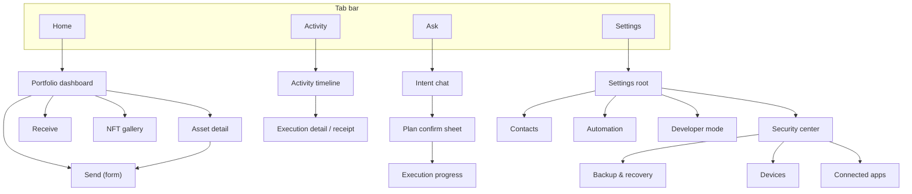
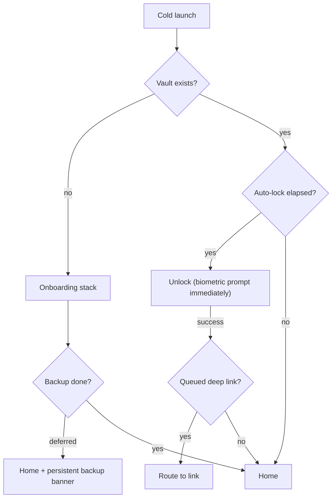

# 03 — Information Architecture & Navigation

## 1. Tab model

Four tabs. The intent surface ("Ask") is a tab AND reachable from the Home command bar — the two entries converge on the same screen.

## 2. Navigation rules

- **Sheets vs pushes:** value-moving confirmations and quick tasks (receive QR, risk details) are sheets; browsing (asset detail, settings) is pushes. A sheet never pushes another full screen — max one stacked sheet (e.g., "Why?" risk sheet over confirm).
- **Execution progress is interruptible:** user can leave mid-execution (it's server-truth); a persistent pill ("1 in progress ▸") docks above the tab bar on all tabs until terminal state.
- **Back never loses money state:** dismissing plan/confirm asks nothing (nothing happened yet — principle: pre-signature everything is free to abandon); leaving mid-signature flow warns once.
- **Onboarding is a separate stack** — no tab bar until a wallet exists and is backed up OR the user explicitly deferred backup.
- **Locked state** replaces the whole tree with Unlock; deep links queue and resolve after unlock.

## 3. Deep links & notification routing

| Link                       | Destination                   | Notes                              |
| -------------------------- | ----------------------------- | ---------------------------------- |
| `iw://unlock`              | Unlock                        | internal                           |
| `iw://asset/{assetId}`     | Asset detail                  |                                    |
| `iw://execution/{id}`      | Execution progress            | from push "Step 2 needs you"       |
| `iw://plan/{id}`           | Plan confirm (if unexpired)   | expired → intent chat with context |
| `iw://receive/{ecosystem}` | Receive with tab preselected  |                                    |
| `iw://scan`                | QR scanner                    | camera permission gate             |
| `iw://backup`              | Backup flow                   | from "backup pending" nudges       |
| wc:/dapp links             | Connected-apps approval sheet | later phase                        |

Push taxonomy → routing: execution updates → execution detail; incoming funds → asset detail (celebrate once); risk alerts → risk sheet; price alerts → asset detail; all respect unlock queueing.

## 4. State-dependent entry

