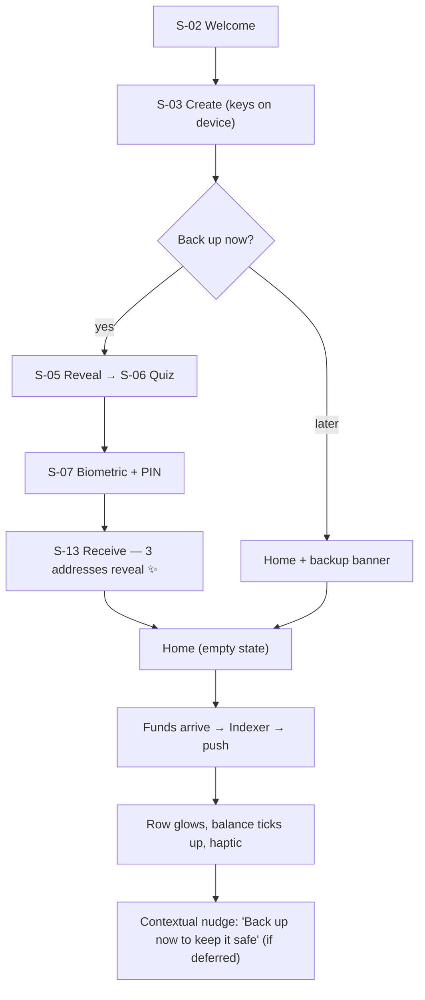
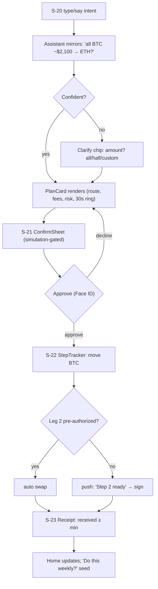
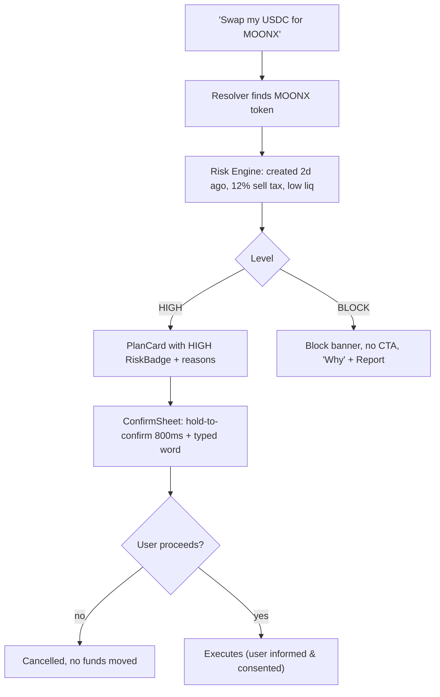
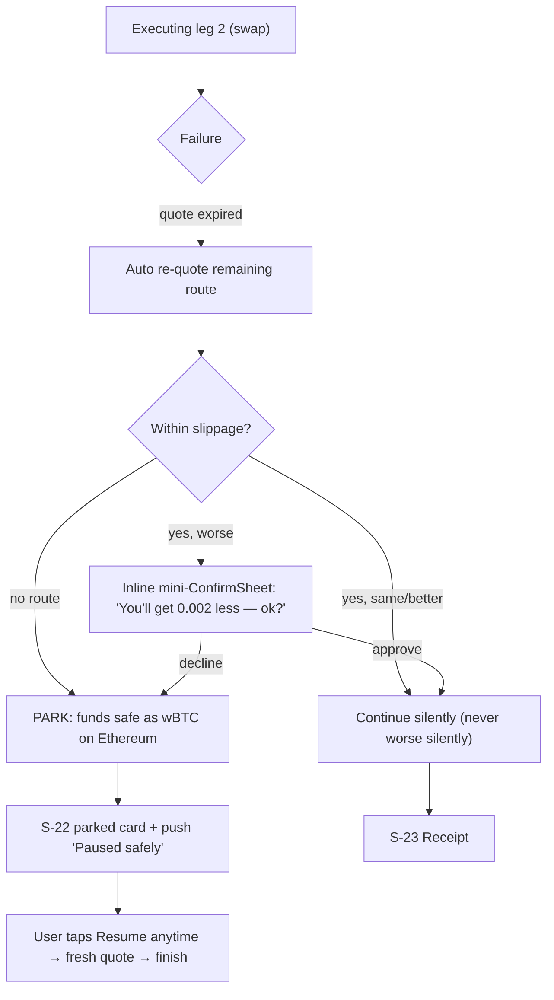
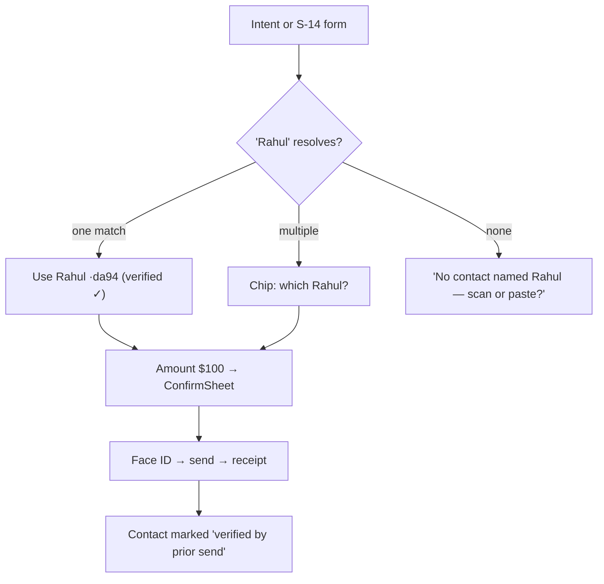
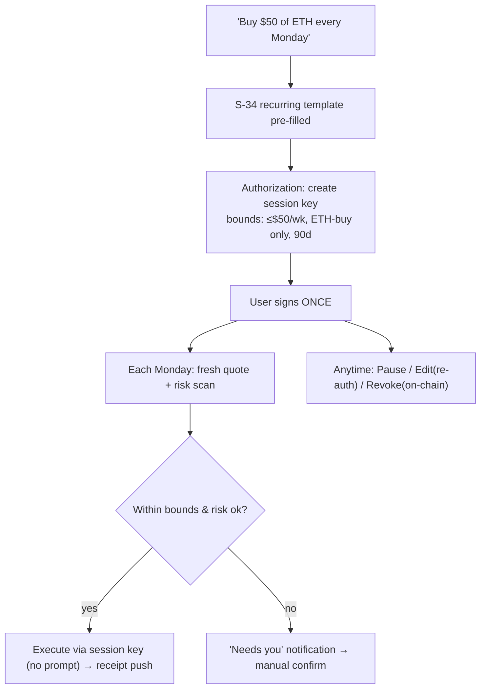
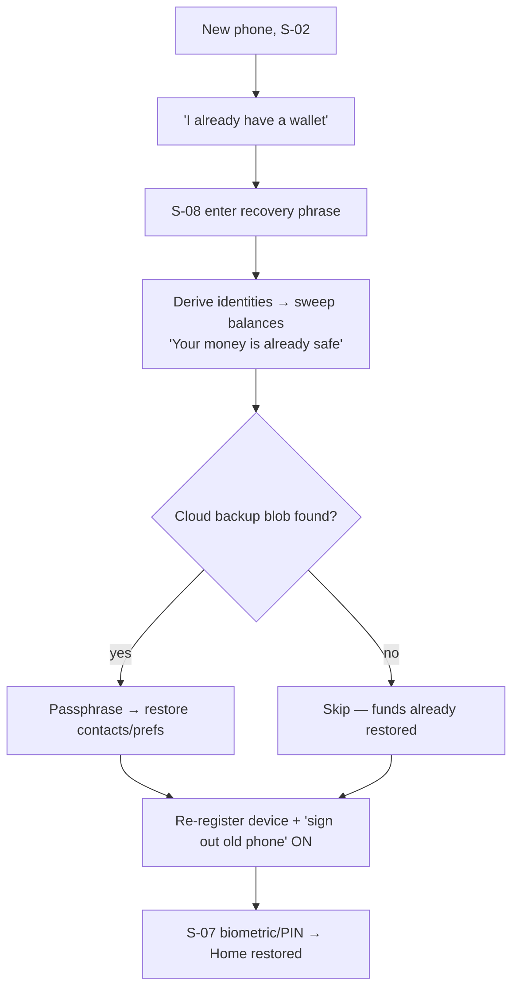

# 09 — User Journeys

End-to-end journeys tying screens together, including the edge cases that separate a real product from a demo. Screen ids reference [04](04-screens-onboarding.md)–[07](07-screens-settings.md).

## J-1 First run → first deposit (the "aha")

Success metric: time-to-first-receive-address < 60 s; the address-reveal is the designed wow moment (only 3, chains invisible).

## J-2 Flagship intent: "Convert my BTC to ETH"

## J-3 Intent with a scam token (risk journey)

Design intent: friction scales with risk; BLOCK is honest and unoverridable on default policy; we never hide a bad token behind a smooth flow.

## J-4 Mid-route failure → park → resume

The promise encoded: funds location is ALWAYS known and shown; parking is calm, not an error; resume is one tap.

## J-5 Send to a saved contact ("Send $100 to Rahul")

## J-6 Recurring buy (honest automation)

## J-7 Lost phone → recovery

## Cross-journey guarantees (tested as journeys, not just screens)

- Any journey can be abandoned before signature with zero consequence and no scary dialog.
- Any money-moving journey shows the same ConfirmSheet anatomy (recognition = safety).
- Backgrounding any execution continues it server-side and reports via push + Live Activity.
- Every journey has a defined offline behavior and a defined LLM-down behavior (forms fallback).
