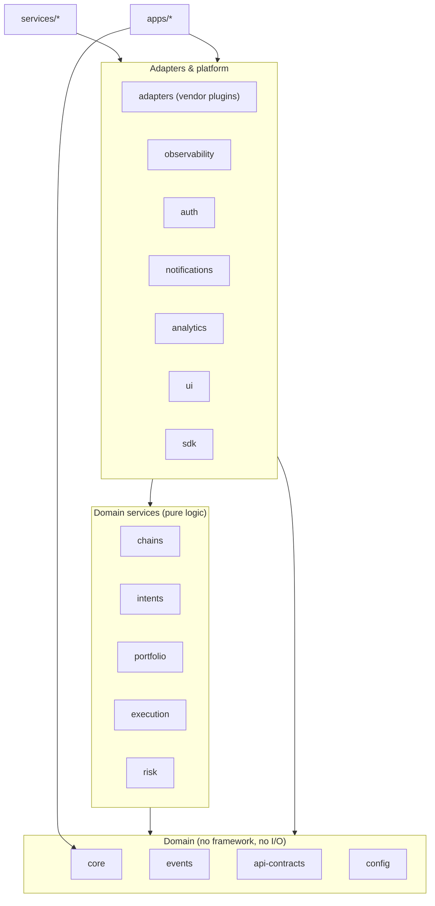

# 02 — Shared Libraries

The `packages/*` are the reusable spine every service and app builds on. This doc defines each package's **contract**, its **dependency direction**, and the **firewall** that keeps the wallet non-custodial.

## 1. Dependency direction (Clean Architecture, enforced)



Rules the arrows encode (checked in review; import-lint added as the graph grows):

- **Nothing** imports `services/*` or `apps/*` — they are leaves.
- Domain packages (`chains`, `intents`, …) never import platform packages (`observability` is the one allowed exception: everyone may log). They especially never import a vendor SDK directly — that lives in `adapters`.
- `core` imports **nothing** of ours and only audited crypto deps. It is the root.
- Circular dependencies are a build failure.

## 2. The non-custodial firewall (the most important rule in the repo)

```
Key material (mnemonic, seed, private keys) exists ONLY inside:
  • packages/core        (the implementation)
  • apps/*               (which run core on-device)

It is FORBIDDEN in:
  • packages/chains, intents, portfolio, execution, risk, adapters, sdk
  • every services/* (backend)
```

Enforcement:

- `packages/core` exposes signing as an operation (`signEvmDigest`, `signSolanaMessage`) and key export only through explicitly `SENSITIVE`-documented members for user-initiated backup. There is no API that hands a raw key to a backend.
- Backends receive **signed payloads only**; a code path that would send a key server-side fails security review automatically and, once import-lint lands, fails the build (no `@intent-wallet/core` import outside `apps/*`).
- New contributor test: "could a full breach of every service move one satoshi?" must answer **no**. If your change makes the answer "maybe", stop and get security review.

## 3. Package contracts (the reusable libraries the prompt asked for)

| Package               | Provides                                                            | Key contract                                                                                                              |
| --------------------- | ------------------------------------------------------------------- | ------------------------------------------------------------------------------------------------------------------------- |
| **core** (✅ shipped) | mnemonic, HD derivation, universal identity, vault, signing         | pure, zero network I/O, official-vector tested; `HDKeyring`, `sealVault/openVault`                                        |
| **chains** (🔄)       | chain registry + `ProviderPool` + balance/fee adapters              | one `BlockchainAdapter` interface per [architecture 02 §2.7](../architecture/02-services.md); the only chain-talking code |
| **auth**              | SIWE challenge/verify, session token helpers                        | framework-agnostic functions; consumed by `services/api` and `sdk`                                                        |
| **intents**           | `IntentSchema` (Zod, versioned), deterministic pre-parser, resolver | parser output is a _proposal_; validation lives here, execution does not                                                  |
| **api-contracts**     | Zod request/response schemas → OpenAPI + typed client               | single source of truth for the HTTP surface ([architecture 07](../architecture/07-api.md))                                |
| **observability**     | `createLogger`, error base classes, OTel tracer setup               | structured logs w/ correlation id; **redaction built in** (secrets never serialize)                                       |
| **config**            | typed env + flag loader                                             | Zod-validated at boot; missing/invalid config = fail fast, never silent default                                           |
| **events**            | event & topic schemas, redis key registry                           | the contract between producers/consumers; additive-only within a major                                                    |
| **analytics**         | event taxonomy + client                                             | pseudonymous by default; schema-reviewed to prevent de-anonymizing payloads                                               |
| **notifications**     | templates (i18n) + delivery client                                  | one delivery brain; webhook signing helpers                                                                               |
| **adapters**          | swap/bridge/price/gas vendor plugins                                | each implements a provider interface (`quote/build/track`); vendors swappable by config                                   |
| **ui**                | design-system components + tokens                                   | implements [docs/design](../design/README.md); no business logic                                                          |
| **sdk**               | public typed client (`parseIntent/plan/approve/watchExecution`)     | never touches keys — signing is always the integrator's callback                                                          |

## 4. Cross-cutting library rules

- **Error handling** (`observability` + per-domain error classes): every package defines a typed error hierarchy with stable string codes and safe messages; callers branch on `code`, users see mapped copy ([design 08 §3](../design/08-standards.md)).
- **Logging**: `createLogger(scope)` only; no `console.*` in shipped code (lint error). Every log line carries `requestId`/`correlationId` in context.
- **Config**: read config exclusively via `@intent-wallet/config`; no raw `process.env` access outside it (so validation and typing are guaranteed in one place).
- **Blockchain adapters**: adding a chain = implement `BlockchainAdapter` + register in the chain registry. Business logic (intents/execution) references chains by `ChainId` and must compile without knowing which chains exist.
- **Intent parsing**: the LLM boundary is `packages/adapters` (AI provider) behind the AI-Gateway contract; `packages/intents` owns the deterministic schema and never calls a vendor directly.
- Every shared package ships: `README.md` (what/why/usage), full type declarations, and tests meeting the coverage bar for its tier ([04](04-quality.md)).
