# 03 — Environments, Secrets, Flags & CI/CD

## 1. Environment strategy

| Env         | Purpose                    | Chains                                                               | Vendors               | Data                         |
| ----------- | -------------------------- | -------------------------------------------------------------------- | --------------------- | ---------------------------- |
| **local**   | dev laptops                | anvil / solana-test-validator / bitcoin regtest (via docker-compose) | mocked (fixtures)     | ephemeral PG/Redis in docker |
| **preview** | per-PR ephemeral namespace | testnets                                                             | mocked/sandbox        | seeded, torn down on merge   |
| **staging** | pre-prod mirror            | **testnets** (Sepolia, Base Sepolia, BTC testnet4, SOL devnet)       | real vendor sandboxes | staging DB, synthetic users  |
| **prod**    | users                      | mainnets                                                             | real vendors          | production                   |

Rules: prod parity is a goal — staging runs the same images and manifests, differing only by config/secrets. No one develops against prod. No prod data flows downward (staging uses synthetic/pseudonymized data only).

## 2. Local development setup

```bash
pnpm install                 # workspace deps
pnpm test                    # all package tests (currently green: core + chains)
pnpm typecheck               # strict typecheck across workspace
# services (as they land): docker compose up  → PG, Redis, anvil, mailhog, etc.
```

Onboarding target: a new engineer runs `pnpm install && pnpm test` and gets green in < 10 minutes on a clean machine. Anything blocking that is a bug in our tooling, filed as such.

## 3. Environment variables

- Namespaced `IW_<AREA>_<NAME>` ([01 §1](01-standards.md)); loaded and **Zod-validated** through `@intent-wallet/config` at boot — an invalid/missing required var crashes startup with a clear message, never a silent default.
- `.env.example` (committed) lists every var with a comment; real `.env*` are git-ignored (already in `.gitignore`).
- Client apps get only **public** config (RPC public URLs, feature-flag defaults) — never a backend secret; the build fails if a secret-shaped var is bundled into a client.

## 4. Secrets management

- **Source of truth:** AWS KMS + Secrets Manager; synced to Kubernetes via External Secrets Operator; never in the repo, env files, or images ([architecture 05 §5](../architecture/05-infrastructure.md)).
- **CI has no long-lived cloud creds** — GitHub OIDC → short-lived roles.
- `gitleaks` runs in CI and as a pre-commit hook; a committed secret triggers the rotation runbook (< 1 hr rotation drill).
- The only "hot" keys (relayer/paymaster gas wallets, Phase 9) are KMS/HSM-backed with capped float and 4-eyes refills.

## 5. Feature flags

- Homegrown flag table (PG) + Redis cache; typed access via `@intent-wallet/config`; named `flag.<area>.<name>` ([01 §1](01-standards.md)).
- **Every user-visible capability ships behind a flag**; incomplete work merges dark (trunk-based, [01 §5](01-standards.md)).
- **Kill switches** are mandatory for: the LLM path, each swap/bridge venue, each chain, and session-key execution — an on-call engineer must be able to disable any of these in seconds without a deploy.
- Flags are for rollout/safety, not permanent config; a flag older than two releases is either promoted (removed, always-on) or deleted (dead) — stale flags are tech debt tracked in [05](05-roadmap-and-team.md).

## 6. CI/CD pipeline

```mermaid
flowchart LR
    PR["PR"] --> A["commit-msg check<br/>(scripts/validate-commit-msg.mjs)"]
    A --> B["lint + format check"]
    B --> C["typecheck (strict)"]
    C --> D["unit + property tests"]
    D --> E["security: semgrep · osv-scanner · gitleaks · float-in-money grep"]
    E --> F["integration (testcontainers: PG/Redis/Kafka; anvil forks)"]
    F --> G["build images: SBOM (syft) + scan (grype) + cosign sign"]
    G --> H["ephemeral preview env"]
    H --> M["merge to main (squash)"]
    M --> S["auto-deploy staging + e2e + golden-intent set"]
    S --> P["release captain promotes"]
    P --> CAN["canary 5% → 50% → 100% (Argo Rollouts, SLO-gated)"]
    CAN --> RB{"SLO burn?"}
    RB -- yes --> ROLL["auto-rollback"]
    RB -- no --> DONE["100%"]
```



The committed [`.github/workflows/ci.yml`](../../.github/workflows/ci.yml) runs the machine-checkable prefix that works TODAY (commit-msg, typecheck, tests); the later stages (security scanners, integration, image signing, canary) are wired as each capability lands, tracked in [05](05-roadmap-and-team.md). We never mark a stage "done" in prose without the gate existing.

## 7. Rollback

- **Services:** Argo Rollouts auto-rollback on SLO burn during canary; manual rollback = re-point to the previous signed image (one command, < 5 min). Images are immutable + signed, so rollback targets are always trustworthy.
- **Database:** migrations are expand→migrate→contract so a service rollback never meets an incompatible schema; destructive `contract` steps ship a release AFTER the code that stopped using the old shape. PITR (5-min granularity) is the last resort, not the plan.
- **Clients:** can't be "rolled back" in users' hands — this is why every feature is flagged; a bad client feature is killed by flag, and a phased store rollout is halted before full exposure.
- **Events:** additive-only schema evolution means a rolled-back consumer still understands in-flight events.
