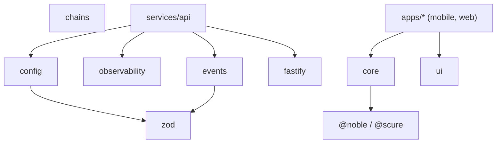

# 06 — Bootstrap (Implementation Foundation)

> **Status:** the engineering foundation is live and validated. This page is the map: what exists, how it fits, how to run it, and what "foundation done" means. Feature work (Wallet features already shipped in `core`; next M2 chain adapters) builds on top.

## 1. What the foundation provides (all tested green)

| Area            | Delivered                                                                                                                                       | Package/dir                        |
| --------------- | ----------------------------------------------------------------------------------------------------------------------------------------------- | ---------------------------------- |
| Config          | Zod-validated, fail-fast env loader; no raw `process.env` elsewhere                                                                             | `packages/config`                  |
| Observability   | structured logger + secret redaction, typed error hierarchy, problem+json                                                                       | `packages/observability`           |
| Event contracts | envelope schema, Kafka topic registry, Redis key registry, payload schemas                                                                      | `packages/events`                  |
| Backend         | Fastify app factory: request-context, error handler→problem+json, health/ready, `/v1` versioning, OpenAPI introspection, fail-closed auth guard | `services/api`                     |
| Design tokens   | platform-agnostic color/space/type/radius/motion tokens + CSS-var emitter                                                                       | `packages/ui`                      |
| Wallet core     | keys, universal identity, vault, signing (Phase 1, shipped earlier)                                                                             | `packages/core`                    |
| Chain layer     | registry + ProviderPool (Phase 2 in progress)                                                                                                   | `packages/chains`                  |
| Standards       | ESLint, Prettier, EditorConfig, Conventional-Commits validator, git hooks, coverage gate                                                        | root, `.githooks`, `scripts`       |
| CI              | GitHub Actions: commit-lint, typecheck, test, secret-scan                                                                                       | `.github/workflows/ci.yml`         |
| Infra baseline  | api Dockerfile (multi-stage, non-root), docker-compose dev (PG+Redis), k8s dev manifests                                                        | `infra/`, `docker-compose.dev.yml` |

## 2. Dependency graph (build/consume direction)



`core`, `config`, `events`, `observability`, `ui` are leaves (depend only on vetted externals). `services/api` composes the platform packages. `apps/*` run `core` on-device and render `ui`. Nothing depends on `services` or `apps` (handbook 02 §1).

## 3. Build order

Topological (pnpm `-r` respects workspace dep order):

1. Leaf packages — `core`, `config`, `events`, `observability`, `ui` (no internal deps)
2. `chains` (leaf today; will consume `core` types)
3. `services/api` (consumes `config`, `events`, `observability`)
4. `apps/*` (consume `core`, `ui`) — Phase 8

For dev, no build step is needed: TypeScript `paths` (typecheck) + Vitest aliases (tests) resolve workspace packages to source. Production images run `pnpm -r build` (emits `dist/`), then run compiled JS.

## 4. Bootstrap commands

```bash
pnpm install                 # installs all workspaces; wires git hooks via `prepare`
pnpm typecheck               # strict typecheck, whole workspace
pnpm lint                    # ESLint
pnpm test                    # all package + service tests (fast, no coverage)
pnpm --filter @intent-wallet/core test:coverage   # coverage gate for the crown jewel (90% floor)
pnpm format:check            # Prettier verification

# Local backend against real datastores:
docker compose -f docker-compose.dev.yml up -d    # Postgres + Redis
pnpm --filter @intent-wallet/api dev              # API with reload
curl localhost:8080/healthz                       # {"status":"ok"}
curl localhost:8080/v1/openapi.json               # introspected API surface
```

## 5. File tree (current, foundation)

```
packages/{core,chains,config,observability,events,ui}/{src,test,package.json,tsconfig*,vitest.config.ts}
services/api/{src/{app,main,openapi}.ts, src/plugins/*, src/routes/**, test, Dockerfile-via-infra}
infra/{docker/api.Dockerfile, k8s/base/*.yaml}
.github/{workflows/ci.yml, CODEOWNERS, pull_request_template.md}
.githooks/{commit-msg, pre-commit}
scripts/validate-commit-msg.mjs
docker-compose.dev.yml · eslint.config.mjs · .prettierrc.json · .editorconfig · .env.example
tsconfig.base.json · pnpm-workspace.yaml · package.json
```

## 6. Bootstrap checklist

- [x] Monorepo, workspace config, package manager, strict TS base
- [x] Shared foundation packages: config, observability, events (+ core, chains earlier)
- [x] Backend foundation: app factory, health, error→problem+json, versioning, OpenAPI, auth guard (fail-closed)
- [x] Design tokens (cross-platform), testable
- [x] Linting, formatting, static analysis, commit validation, git hooks, coverage gate
- [x] CI skeleton (commit-lint, typecheck, test, secret-scan)
- [x] Infra baseline: Dockerfile, compose dev env, k8s dev manifests
- [ ] **Mobile native app shell** (Expo) — see §8; requires the RN toolchain + a simulator to validate, so it is scoped as its own session rather than shipped unvalidated
- [ ] `packages/api-contracts` (Zod→OpenAPI enrichment) — lands with M7 backend platform
- [ ] Coverage gates on remaining packages (pattern established on `core`)

## 7. Definition of Done — bootstrap phase

Met when: `pnpm install && pnpm typecheck && pnpm lint && pnpm test` are green from a clean checkout (**currently: 149 tests green across 6 packages + 1 service**); every shared foundation package has a README + tests at its tier; the API foundation serves health/openapi and fails closed on auth; standards are ENFORCED by machines (not just documented); CI runs the checkable gates; infra baseline exists. ✅ (except the two explicitly-deferred items in §6, which are honestly tracked, not silently skipped).

## 8. Mobile native app shell — the honest plan (next dedicated session)

The platform-agnostic mobile foundation (design tokens) ships now in `packages/ui`. The **native Expo shell** is deliberately NOT scaffolded blind, because it can only be validated with the React Native toolchain + a device/simulator, and shipping an unvalidated app would violate the "production-ready, no placeholder" rule. Its file-by-file plan, ready to execute:

```
apps/mobile/
  app.config.ts                 Expo config (dev-client), scheme iw://
  src/navigation/               React Navigation stacks (onboarding | app tabs | locked) — IA from design 03
  src/state/                    store (Zustand) + query cache (TanStack Query) — read-path caching
  src/di/                       container wiring (config, api client, secure storage, logger)
  src/secure-storage/           SecureStore interface + iOS Keychain/Android Keystore impls
                                (wraps @intent-wallet/core vault; native module boundary)
  src/network/                  typed API client (from packages/api-contracts) + auth interceptor
  src/theme/                    maps @intent-wallet/ui tokens → RN StyleSheet + light/dark
  src/i18n/                     message catalogs (en, hi) + ICU formatting; Hinglish input is server-side (parser)
  src/errors/                   error boundary + toProblem→UI mapping (design 08 §3)
  src/analytics/                pseudonymous event client (packages/analytics) integration points
  App.tsx                       composition root; NO business features yet
```

Validation for that session: `expo start` builds; app boots to the Welcome screen on a simulator; unit tests for theme-mapping and secure-storage abstraction pass; no business logic. Only then is the mobile foundation "done" by our DoD.
