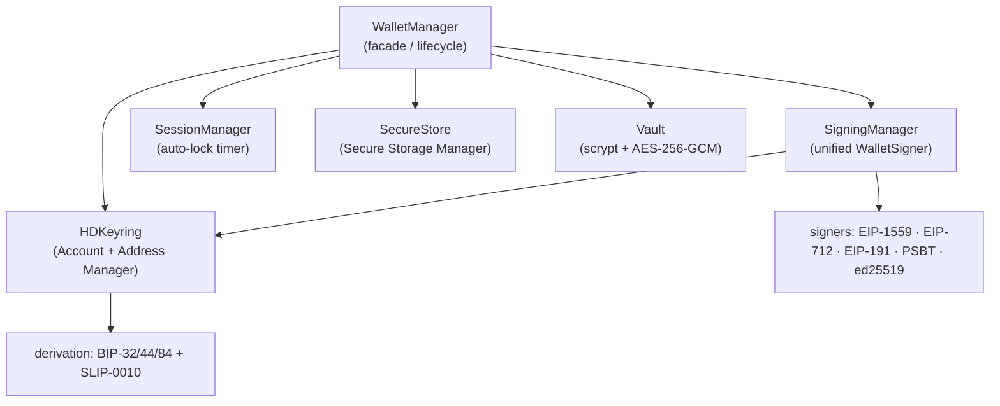
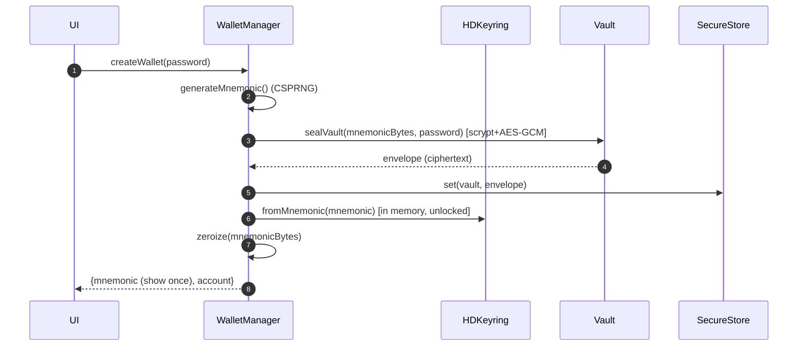
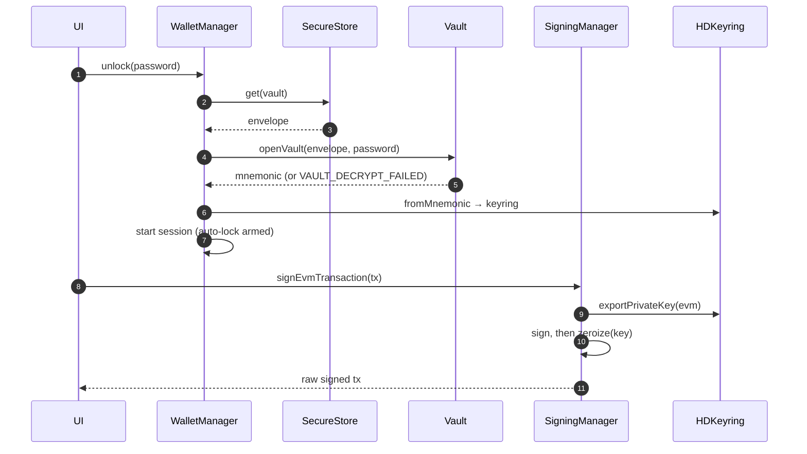
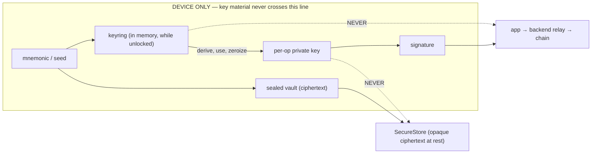

# Wallet Core — Architecture, Data Flow & Threat Model

> **Scope:** `packages/core` — the device-only wallet engine. The most security-critical component in the platform. This document is the security-review reference for it and complements the platform threat model in [architecture 06](../architecture/06-security.md).
> **Status:** implemented and tested (114 tests, official vectors + viem/@scure cross-checks).

## 1. Module architecture

The "managers" the design calls for, mapped to concrete modules. The public entry point is **WalletManager**; everything else is reachable through it.



| Manager (prompt term)  | Implementation                                         | Responsibility                                                             |
| ---------------------- | ------------------------------------------------------ | -------------------------------------------------------------------------- |
| Wallet Manager         | `wallet/wallet-manager.ts`                             | create/import/unlock/lock/changePassword/wipe; the only public entry point |
| Account Manager        | `keyring.ts` (`getAccount`)                            | the Universal Identity triple per account index                            |
| Address Manager        | `accounts/{evm,bitcoin,solana}.ts` + `derivationPaths` | address derivation & encoding per ecosystem                                |
| Signing Manager        | `signing/signer.ts` (`SigningManager`)                 | one `WalletSigner` interface over all chains                               |
| Secure Storage Manager | `wallet/secure-store.ts` (`SecureStore`)               | persistence boundary for the encrypted vault (native impl in apps)         |
| Session Manager        | `wallet/session.ts`                                    | auto-lock idle timer + session state                                       |

## 2. Folder structure

```
packages/core/src/
├── mnemonic.ts · slip10.ts · keyring.ts · vault.ts · bytes.ts · errors.ts
├── accounts/{evm,bitcoin,solana}.ts        address derivation + primitive signing
├── signing/
│   ├── rlp.ts                              minimal RLP (in-repo)
│   ├── evm-transaction.ts                  EIP-1559 tx sign/serialize
│   ├── evm-typed-data.ts                   EIP-712 hash + sign
│   ├── bitcoin-psbt.ts                     PSBT signing (@scure/btc-signer)
│   ├── solana-transaction.ts               serialized-message signing
│   └── signer.ts                           SigningManager / WalletSigner
└── wallet/
    ├── secure-store.ts                     SecureStore interface + in-memory impl
    ├── session.ts                          SessionManager (auto-lock)
    └── wallet-manager.ts                   WalletManager facade
```

## 3. Derivation strategy (how each ecosystem is handled)

One BIP-39 mnemonic → one seed → three identities ([requirements.md §1.2](../../requirements.md)):

| Ecosystem     | Curve     | Path                         | Encoding                                    |
| ------------- | --------- | ---------------------------- | ------------------------------------------- |
| Bitcoin       | secp256k1 | BIP-84 `m/84'/{0,1}'/0'/0/i` | bech32 P2WPKH `bc1q…`                       |
| Universal EVM | secp256k1 | BIP-44 `m/44'/60'/0'/0/i`    | EIP-55 `0x…` — one address, every EVM chain |
| Solana        | ed25519   | SLIP-0010 `m/44'/501'/i'/0'` | base58 pubkey                               |

Non-hardened last segment for BTC/EVM, fully-hardened for SOL — matching Ledger/MetaMask/Phantom so imports/exports interoperate.

## 4. Sequence diagrams

### Create wallet



### Unlock & sign



## 5. Data-flow & trust boundary



The only things that leave the device are **signatures** and **opaque vault ciphertext**. Neither can be reversed into a key.

## 6. Threat model (STRIDE, wallet-core scope)

| #    | Threat                 | Vector                                 | Mitigation (implemented)                                                                                       | Residual                                                                           |
| ---- | ---------------------- | -------------------------------------- | -------------------------------------------------------------------------------------------------------------- | ---------------------------------------------------------------------------------- |
| WC1  | Seed at rest theft     | device backup/file exfil               | vault = scrypt(N=2¹⁵)+AES-256-GCM; ciphertext only; OS keystore wrap in apps                                   | offline brute force of a weak password (mitigated by KDF cost + UX password rules) |
| WC2  | Seed in memory theft   | heap dump, swap                        | keyring destroyed on lock; per-op keys zeroized immediately; auto-lock                                         | JS GC may retain copies (documented; native secure memory Phase 8)                 |
| WC3  | Weak randomness        | predictable mnemonic                   | CSPRNG via @noble; BIP-39 128/256-bit entropy                                                                  | —                                                                                  |
| WC4  | Blind signing          | malicious payload                      | signers produce exact bytes; decoding + simulation happen upstream and the signature covers what's shown       | user ignores the confirm screen                                                    |
| WC5  | Signature malleability | low/high-s                             | EVM low-s normalized (RFC 6979 deterministic)                                                                  | —                                                                                  |
| WC6  | Wrong-chain replay     | reuse a signed EVM tx on another chain | EIP-1559 binds chainId into the signed payload                                                                 | —                                                                                  |
| WC7  | Address corruption     | tampered/typo address                  | EIP-55 checksum enforced; bech32/base58 validation; rejects bad checksums                                      | —                                                                                  |
| WC8  | Vault tampering        | flip ciphertext/params                 | GCM AEAD + all envelope fields bound as AAD → any change fails auth                                            | —                                                                                  |
| WC9  | KDF-param DoS          | hostile envelope demands GBs           | scrypt N/r/p bounds enforced on open                                                                           | —                                                                                  |
| WC10 | Supply chain           | malicious dep                          | minimal @noble/@scure only (ADR-0003); no runtime framework                                                    | 0-day in an audited dep                                                            |
| WC11 | Key exfil via API      | a caller ships a key to a server       | no API returns keys except explicit SENSITIVE export; signers zeroize; import-lint forbids `core` outside apps | —                                                                                  |

## 7. Attack scenarios (walked through)

- **Stolen phone, screen locked:** vault is ciphertext; OS keystore + biometric gate the vault key; wipe-after-N-fails (opt-in) caps brute force. Funds safe unless the password is weak AND the device is unlocked.
- **Malware with process memory access while unlocked:** can read the in-memory keyring — this is game over for any hot wallet and we say so; mitigations shrink the window (auto-lock, per-op zeroization) and Phase 8 moves signing behind native secure hardware.
- **Malicious dApp requests a signature:** core signs exactly the bytes given; the risk engine + decoded confirm sheet upstream are what prevent a harmful signature — core never blind-trusts, but core is not where the human decision happens.
- **Backup phrase phishing:** the reveal flow ([design 04 S-05](../design/04-screens-onboarding.md)) blocks screenshots and never transmits the phrase; core has no network path to leak it.

## 8. Recovery strategies

- **Backup:** the mnemonic is the root. Shown once (quiz-verified), never persisted outside the vault, never sent anywhere.
- **Lost device:** install on a new device → `importWallet(mnemonic, newPassword)` re-derives the identical identity (deterministic derivation) → funds restored. No server involvement required for fund recovery.
- **Forgotten password:** the vault password is unrecoverable by design (we hold no key). Recovery = re-import from the mnemonic and set a new password. Stated plainly in UX.
- **Compromised device:** treat the mnemonic as burned. Recovery is out-of-band: generate a NEW wallet on a clean device and move funds (an intent the app can orchestrate). v2 adds MPC/social recovery and hardware-wallet co-signing to reduce single-device blast radius (roadmap [requirements.md §12](../../requirements.md)).

## 9. Secure coding practices (enforced in this package)

- Private keys are `Uint8Array`, derived per-operation, and zeroized in `finally` blocks; the keyring is destroyed on lock.
- Amounts and quantities are `bigint`; no floats anywhere.
- Error messages never contain key material (WalletError contract); safe to log.
- Every cryptographic path is pinned by official test vectors AND cross-checked against an independent implementation (SLIP-0010 vs `ed25519-hd-key`; EVM tx/EIP-712 vs `viem`; P2WPKH vs `@scure/btc-signer`).
- No network I/O in the package (lint/review-enforced); no dependency outside the @noble/@scure family without security sign-off.

## 10. Implementation order (done) & what's next

1. ✅ Entropy → mnemonic → seed (BIP-39)
2. ✅ HD derivation (BIP-32/44/84, SLIP-0010) → Universal Identity
3. ✅ Vault (scrypt + AES-256-GCM, versioned, AAD-bound)
4. ✅ Primitive signing (EVM digest, ed25519)
5. ✅ Transaction signing (EIP-1559, EIP-712, EIP-191, PSBT, Solana message)
6. ✅ Unified SigningManager
7. ✅ SecureStore interface + SessionManager + WalletManager facade
8. ⏭ Native SecureStore impls (iOS Keychain / Android Keystore) + secure memory — **apps/mobile, Phase 8**
9. ⏭ Hardware-wallet + MPC/social recovery signers behind the same `WalletSigner` interface — **v2**

The `WalletSigner` interface is the extension seam: hardware wallets and MPC become new implementations without touching any consumer.
